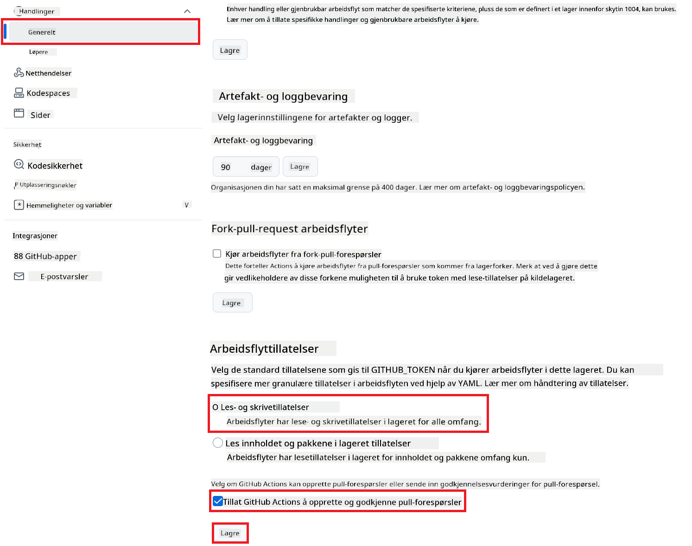

<!--
CO_OP_TRANSLATOR_METADATA:
{
  "original_hash": "a52587a512e667f70d92db853d3c61d5",
  "translation_date": "2025-06-12T19:30:21+00:00",
  "source_file": "getting_started/github-actions-guide/github-actions-guide-public.md",
  "language_code": "no"
}
-->
# Bruke Co-op Translator GitHub Action (Offentlig Oppsett)

**Målgruppe:** Denne veiledningen er ment for brukere i de fleste offentlige eller private repositorier hvor standard GitHub Actions-tillatelser er tilstrekkelige. Den bruker den innebygde `GITHUB_TOKEN`.

Automatiser oversettelsen av dokumentasjonen i repositoriet ditt enkelt ved hjelp av Co-op Translator GitHub Action. Denne veiledningen tar deg gjennom hvordan du setter opp action for automatisk å opprette pull requests med oppdaterte oversettelser når kilde-Markdown-filer eller bilder endres.

> [!IMPORTANT]
>
> **Velge riktig veiledning:**
>
> Denne veiledningen beskriver **enklere oppsett med standard `GITHUB_TOKEN`**. Dette er den anbefalte metoden for de fleste brukere siden det ikke krever håndtering av sensitive GitHub App Private Keys.
>

## Forutsetninger

Før du konfigurerer GitHub Action, må du sørge for at du har nødvendige AI-tjenestelegitimasjoner klare.

**1. Nødvendig: Legitimasjon for AI-språkmodell**  
Du trenger legitimasjon for minst én støttet språkmodell:

- **Azure OpenAI**: Krever Endpoint, API-nøkkel, Modell-/Deploy-navn, API-versjon.  
- **OpenAI**: Krever API-nøkkel, (valgfritt: Org ID, Base URL, Modell-ID).  
- Se [Supported Models and Services](../../../../README.md) for detaljer.

**2. Valgfritt: AI Vision-legitimasjon (for bildeoversettelse)**

- Kreves bare hvis du skal oversette tekst i bilder.  
- **Azure AI Vision**: Krever Endpoint og Subscription Key.  
- Hvis ikke oppgitt, bruker action [Markdown-only mode](../markdown-only-mode.md) som standard.

## Oppsett og konfigurasjon

Følg disse trinnene for å konfigurere Co-op Translator GitHub Action i repositoriet ditt med standard `GITHUB_TOKEN`.

### Steg 1: Forstå autentisering (bruk av `GITHUB_TOKEN`)

Denne workflowen bruker den innebygde `GITHUB_TOKEN` som GitHub Actions tilbyr. Denne token gir automatisk workflowen nødvendige rettigheter til å samhandle med repositoriet basert på innstillingene som settes i **Steg 3**.

### Steg 2: Konfigurer repository secrets

Du trenger bare å legge til dine **AI-tjenestelegitimasjoner** som krypterte secrets i repository-innstillingene.

1.  Gå til mål-GitHub-repositoriet ditt.  
2.  Gå til **Settings** > **Secrets and variables** > **Actions**.  
3.  Under **Repository secrets**, klikk **New repository secret** for hver nødvendig AI-tjenestesecret som listes nedenfor.

     *(Bilde: Viser hvor du legger til secrets)*

**Nødvendige AI-tjenestesecrets (legg til ALLE som gjelder basert på dine forutsetninger):**

| Secret Name                         | Beskrivelse                               | Kilde for verdi                  |
| :---------------------------------- | :---------------------------------------- | :------------------------------- |
| `AZURE_SUBSCRIPTION_KEY`            | Nøkkel for Azure AI Service (Computer Vision)  | Din Azure AI Foundry              |
| `AZURE_AI_SERVICE_ENDPOINT`         | Endpoint for Azure AI Service (Computer Vision) | Din Azure AI Foundry              |
| `AZURE_OPENAI_API_KEY`              | Nøkkel for Azure OpenAI-tjeneste              | Din Azure AI Foundry              |
| `AZURE_OPENAI_ENDPOINT`             | Endpoint for Azure OpenAI-tjeneste         | Din Azure AI Foundry              |
| `AZURE_OPENAI_MODEL_NAME`           | Ditt Azure OpenAI modellnavn              | Din Azure AI Foundry              |
| `AZURE_OPENAI_CHAT_DEPLOYMENT_NAME` | Ditt Azure OpenAI deploy-navn         | Din Azure AI Foundry              |
| `AZURE_OPENAI_API_VERSION`          | API-versjon for Azure OpenAI              | Din Azure AI Foundry              |
| `OPENAI_API_KEY`                    | API-nøkkel for OpenAI                        | Din OpenAI-plattform              |
| `OPENAI_ORG_ID`                     | OpenAI organisasjons-ID (valgfritt)         | Din OpenAI-plattform              |
| `OPENAI_CHAT_MODEL_ID`              | Spesifikk OpenAI modell-ID (valgfritt)       | Din OpenAI-plattform              |
| `OPENAI_BASE_URL`                   | Tilpasset OpenAI API Base URL (valgfritt)     | Din OpenAI-plattform              |

### Steg 3: Konfigurer workflow-tillatelser

GitHub Action trenger tillatelser gitt via `GITHUB_TOKEN` for å kunne hente kode og opprette pull requests.

1.  I repositoriet, gå til **Settings** > **Actions** > **General**.  
2.  Rull ned til seksjonen **Workflow permissions**.  
3.  Velg **Read and write permissions**. Dette gir `GITHUB_TOKEN` nødvendige `contents: write` og `pull-requests: write` tillatelser for denne workflowen.  
4.  Sørg for at boksen for **Allow GitHub Actions to create and approve pull requests** er **avkrysset**.  
5.  Velg **Save**.



### Steg 4: Opprett workflow-filen

Til slutt, lag YAML-filen som definerer den automatiserte workflowen med `GITHUB_TOKEN`.

1.  I rotmappen av repositoriet, opprett `.github/workflows/`-mappen hvis den ikke finnes.  
2.  Inne i `.github/workflows/`, opprett en fil kalt `co-op-translator.yml`.  
3.  Lim inn følgende innhold i `co-op-translator.yml`.

```yaml
name: Co-op Translator

on:
  push:
    branches:
      - main

jobs:
  co-op-translator:
    runs-on: ubuntu-latest

    permissions:
      contents: write
      pull-requests: write

    steps:
      - name: Checkout repository
        uses: actions/checkout@v4
        with:
          fetch-depth: 0

      - name: Set up Python
        uses: actions/setup-python@v4
        with:
          python-version: '3.10'

      - name: Install Co-op Translator
        run: |
          python -m pip install --upgrade pip
          pip install co-op-translator

      - name: Run Co-op Translator
        env:
          PYTHONIOENCODING: utf-8
          # === AI Service Credentials ===
          AZURE_SUBSCRIPTION_KEY: ${{ secrets.AZURE_SUBSCRIPTION_KEY }}
          AZURE_AI_SERVICE_ENDPOINT: ${{ secrets.AZURE_AI_SERVICE_ENDPOINT }}
          AZURE_OPENAI_API_KEY: ${{ secrets.AZURE_OPENAI_API_KEY }}
          AZURE_OPENAI_ENDPOINT: ${{ secrets.AZURE_OPENAI_ENDPOINT }}
          AZURE_OPENAI_MODEL_NAME: ${{ secrets.AZURE_OPENAI_MODEL_NAME }}
          AZURE_OPENAI_CHAT_DEPLOYMENT_NAME: ${{ secrets.AZURE_OPENAI_CHAT_DEPLOYMENT_NAME }}
          AZURE_OPENAI_API_VERSION: ${{ secrets.AZURE_OPENAI_API_VERSION }}
          OPENAI_API_KEY: ${{ secrets.OPENAI_API_KEY }}
          OPENAI_ORG_ID: ${{ secrets.OPENAI_ORG_ID }}
          OPENAI_CHAT_MODEL_ID: ${{ secrets.OPENAI_CHAT_MODEL_ID }}
          OPENAI_BASE_URL: ${{ secrets.OPENAI_BASE_URL }}
        run: |
          # =====================================================================
          # IMPORTANT: Set your target languages here (REQUIRED CONFIGURATION)
          # =====================================================================
          # Example: Translate to Spanish, French, German. Add -y to auto-confirm.
          translate -l "es fr de" -y  # <--- MODIFY THIS LINE with your desired languages

      - name: Create Pull Request with translations
        uses: peter-evans/create-pull-request@v5
        with:
          token: ${{ secrets.GITHUB_TOKEN }}
          commit-message: "🌐 Update translations via Co-op Translator"
          title: "🌐 Update translations via Co-op Translator"
          body: |
            This PR updates translations for recent changes to the main branch.

            ### 📋 Changes included
            - Translated contents are available in the `translations/` directory
            - Translated images are available in the `translated_images/` directory

            ---
            🌐 Automatically generated by the [Co-op Translator](https://github.com/Azure/co-op-translator) GitHub Action.
          branch: update-translations
          base: main
          labels: translation, automated-pr
          delete-branch: true
          add-paths: |
            translations/
            translated_images/
```  
4.  **Tilpass workflowen:**  
  - **[!IMPORTANT] Mål språk:** I `Run Co-op Translator` step, you **MUST review and modify the list of language codes** within the `translate -l "..." -y` command to match your project's requirements. The example list (`ar de es...`) needs to be replaced or adjusted.
  - **Trigger (`on:`):** The current trigger runs on every push to `main`. For large repositories, consider adding a `paths:` filter (see commented example in the YAML) to run the workflow only when relevant files (e.g., source documentation) change, saving runner minutes.
  - **PR Details:** Customize the `commit-message`, `title`, `body`, `branch` name, and `labels` in the `Create Pull Request`-steget om nødvendig.

**Ansvarsfraskrivelse**:  
Dette dokumentet er oversatt ved hjelp av AI-oversettelsestjenesten [Co-op Translator](https://github.com/Azure/co-op-translator). Selv om vi streber etter nøyaktighet, vennligst vær oppmerksom på at automatiske oversettelser kan inneholde feil eller unøyaktigheter. Det originale dokumentet på originalspråket skal anses som den autoritative kilden. For kritisk informasjon anbefales profesjonell menneskelig oversettelse. Vi er ikke ansvarlige for eventuelle misforståelser eller feiltolkninger som oppstår ved bruk av denne oversettelsen.