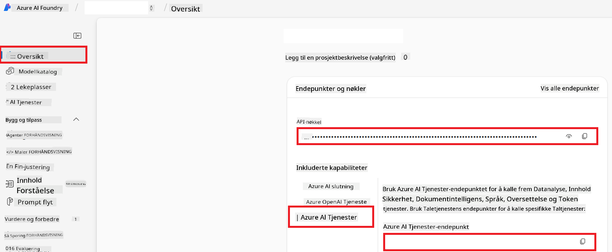

<!--
CO_OP_TRANSLATOR_METADATA:
{
  "original_hash": "b58d7c3cb4210697a073d20eb3064945",
  "translation_date": "2025-06-12T11:54:17+00:00",
  "source_file": "getting_started/set-up-azure-ai.md",
  "language_code": "no"
}
-->
# Sett opp Azure AI for Co-op Translator (Azure OpenAI og Azure AI Vision)

Denne veiledningen tar deg gjennom oppsett av Azure OpenAI for språköversettelse og Azure Computer Vision for analyse av bildeinnhold (som deretter kan brukes til bildebasert oversettelse) innen Azure AI Foundry.

**Forutsetninger:**
- En Azure-konto med aktivt abonnement.
- Tilstrekkelige rettigheter til å opprette ressurser og distribusjoner i ditt Azure-abonnement.

## Opprett et Azure AI-prosjekt

Du begynner med å opprette et Azure AI-prosjekt, som fungerer som et sentralt sted for å administrere AI-ressursene dine.

1. Gå til [https://ai.azure.com](https://ai.azure.com) og logg inn med din Azure-konto.

1. Velg **+Create** for å opprette et nytt prosjekt.

1. Utfør følgende oppgaver:
   - Skriv inn et **Prosjektnavn** (f.eks. `CoopTranslator-Project`).
   - Velg **AI hub** (f.eks. `CoopTranslator-Hub`) (Opprett en ny om nødvendig).

1. Klikk "**Review and Create**" for å sette opp prosjektet. Du vil bli tatt til prosjektets oversiktsside.

## Sett opp Azure OpenAI for språköversettelse

Innenfor prosjektet ditt vil du distribuere en Azure OpenAI-modell som skal fungere som backend for tekstoversettelse.

### Naviger til prosjektet ditt

Hvis du ikke allerede er der, åpne ditt nylig opprettede prosjekt (f.eks. `CoopTranslator-Project`) i Azure AI Foundry.

### Distribuer en OpenAI-modell

1. Fra prosjektets venstremeny, under "My assets", velg "**Models + endpoints**".

1. Velg **+ Deploy model**.

1. Velg **Deploy Base Model**.

1. Du vil få opp en liste over tilgjengelige modeller. Filtrer eller søk etter en passende GPT-modell. Vi anbefaler `gpt-4o`.

1. Velg ønsket modell og klikk **Confirm**.

1. Velg **Deploy**.

### Azure OpenAI-konfigurasjon

Når modellen er distribuert, kan du velge distribusjonen fra siden "**Models + endpoints**" for å finne dens **REST endpoint URL**, **Key**, **Deployment name**, **Model name** og **API version**. Disse vil være nødvendige for å integrere oversettelsesmodellen i applikasjonen din.

> [!NOTE]
> Du kan velge API-versjoner fra siden [API version deprecation](https://learn.microsoft.com/azure/ai-services/openai/api-version-deprecation) basert på dine behov. Vær oppmerksom på at **API version** er forskjellig fra **Model version** som vises på siden **Models + endpoints** i Azure AI Foundry.

## Sett opp Azure Computer Vision for bildeoversettelse

For å aktivere oversettelse av tekst i bilder, må du finne Azure AI Service API-nøkkel og endepunkt.

1. Naviger til ditt Azure AI-prosjekt (f.eks. `CoopTranslator-Project`). Sørg for at du er på prosjektets oversiktsside.

### Azure AI Service-konfigurasjon

Finn API-nøkkelen og endepunktet fra Azure AI Service.

1. Naviger til ditt Azure AI-prosjekt (f.eks. `CoopTranslator-Project`). Sørg for at du er på prosjektets oversiktsside.

1. Finn **API Key** og **Endpoint** under fanen Azure AI Service.

    

Denne tilkoblingen gjør funksjonaliteten til den tilknyttede Azure AI Services-ressursen (inkludert bildeanalyse) tilgjengelig for ditt AI Foundry-prosjekt. Du kan deretter bruke denne tilkoblingen i notatbøker eller applikasjoner for å hente ut tekst fra bilder, som deretter kan sendes til Azure OpenAI-modellen for oversettelse.

## Samle sammen legitimasjonen din

Nå bør du ha samlet følgende:

**For Azure OpenAI (tekstoversettelse):**
- Azure OpenAI Endpoint
- Azure OpenAI API Key
- Azure OpenAI Model Name (f.eks. `gpt-4o`)
- Azure OpenAI Deployment Name (f.eks. `cooptranslator-gpt4o`)
- Azure OpenAI API Version

**For Azure AI Services (tekstuttrekk fra bilder via Vision):**
- Azure AI Service Endpoint
- Azure AI Service API Key

### Eksempel: Konfigurering av miljøvariabler (Forhåndsvisning)

Senere, når du bygger applikasjonen din, vil du sannsynligvis konfigurere den med disse innsamlede legitimasjonene. For eksempel kan du sette dem som miljøvariabler slik:

```bash
# Azure AI Service Credentials (Required for image translation)
AZURE_AI_SERVICE_API_KEY="your_azure_ai_service_api_key" # e.g., 21xasd...
AZURE_AI_SERVICE_ENDPOINT="https://your_azure_ai_service_endpoint.cognitiveservices.azure.com/"

# Azure OpenAI Credentials (Required for text translation)
AZURE_OPENAI_API_KEY="your_azure_openai_api_key" # e.g., 21xasd...
AZURE_OPENAI_ENDPOINT="https://your_azure_openai_endpoint.openai.azure.com/"
AZURE_OPENAI_MODEL_NAME="your_model_name" # e.g., gpt-4o
AZURE_OPENAI_CHAT_DEPLOYMENT_NAME="your_deployment_name" # e.g., cooptranslator-gpt4o
AZURE_OPENAI_API_VERSION="your_api_version" # e.g., 2024-12-01-preview
```

---

### Videre lesning

- [How to Create a project in Azure AI Foundry](https://learn.microsoft.com/azure/ai-foundry/how-to/create-projects?tabs=ai-studio)
- [How to Create Azure AI resources](https://learn.microsoft.com/azure/ai-foundry/how-to/create-azure-ai-resource?tabs=portal)
- [How to Deploy OpenAI models in Azure AI Foundry](https://learn.microsoft.com/en-us/azure/ai-foundry/how-to/deploy-models-openai)

**Ansvarsfraskrivelse**:  
Dette dokumentet er oversatt ved hjelp av AI-oversettelsestjenesten [Co-op Translator](https://github.com/Azure/co-op-translator). Selv om vi streber etter nøyaktighet, vennligst vær oppmerksom på at automatiske oversettelser kan inneholde feil eller unøyaktigheter. Det originale dokumentet på det opprinnelige språket skal betraktes som den autoritative kilden. For kritisk informasjon anbefales profesjonell menneskelig oversettelse. Vi er ikke ansvarlige for eventuelle misforståelser eller feiltolkninger som oppstår ved bruk av denne oversettelsen.