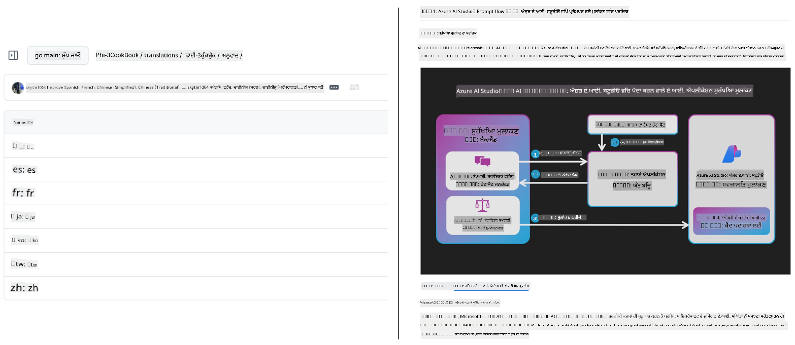
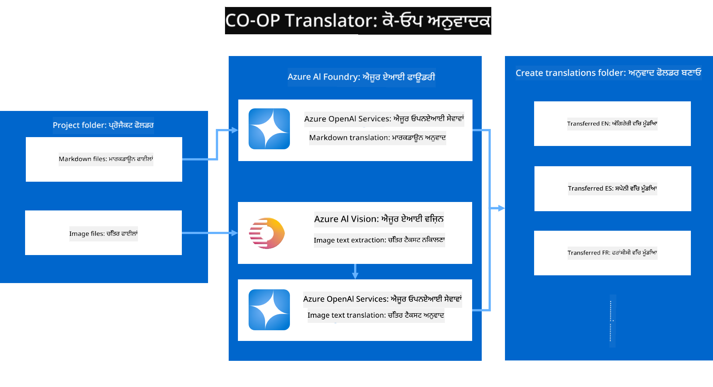
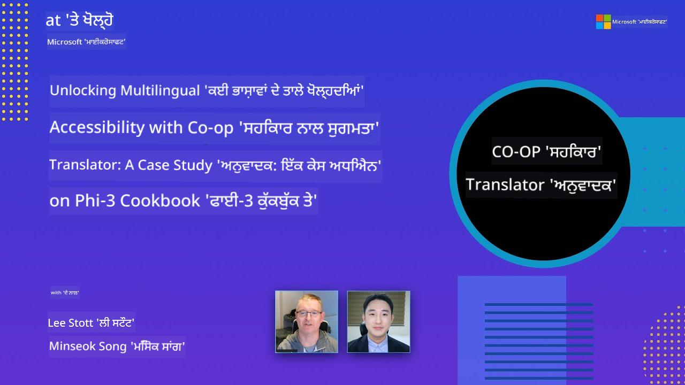

<!--
CO_OP_TRANSLATOR_METADATA:
{
  "original_hash": "044724537b57868117aadae8e7728c7c",
  "translation_date": "2025-06-12T10:16:24+00:00",
  "source_file": "README.md",
  "language_code": "pa"
}
-->


# ਕੋ-ਆਪ ਟ੍ਰਾਂਸਲੇਟਰ: ਸਿੱਖਿਆਕ ਦਸਤਾਵੇਜ਼ਾਂ ਦਾ ਅਨੁਵਾਦ ਆਸਾਨੀ ਨਾਲ ਸਵਚਾਲਿਤ ਕਰੋ

_ਆਪਣੇ ਦਸਤਾਵੇਜ਼ਾਂ ਦਾ ਅਨੁਵਾਦ ਕਈ ਭਾਸ਼ਾਵਾਂ ਵਿੱਚ ਆਸਾਨੀ ਨਾਲ ਸਵਚਾਲਿਤ ਕਰਕੇ ਵਿਸ਼ਵ ਪੱਧਰੀ ਦਰਸ਼ਕ ਤੱਕ ਪਹੁੰਚੋ।_

[](https://pypi.org/project/co-op-translator/)
[](https://github.com/azure/co-op-translator/blob/main/LICENSE)
[](https://pepy.tech/project/co-op-translator)
[](https://pepy.tech/project/co-op-translator)
[](https://github.com/psf/black)

[](https://GitHub.com/azure/co-op-translator/graphs/contributors/)
[](https://GitHub.com/azure/co-op-translator/issues/)
[](https://GitHub.com/azure/co-op-translator/pulls/)
[](http://makeapullrequest.com)

### ਭਾਸ਼ਾ ਸਹਿਯੋਗ ਕੋ-ਆਪ ਟ੍ਰਾਂਸਲੇਟਰ ਦੁਆਰਾ ਸੰਚਾਲਿਤ
[ਫ੍ਰੈਂਚ](../fr/README.md) | [ਸਪੇਨੀ](../es/README.md) | [ਜਰਮਨ](../de/README.md) | [ਰੂਸੀ](../ru/README.md) | [ਅਰਬੀ](../ar/README.md) | [ਫਾਰਸੀ (ਫਾਰਸੀ)](../fa/README.md) | [ਉਰਦੂ](../ur/README.md) | [ਚੀਨੀ (ਸਰਲ)](../zh/README.md) | [ਚੀਨੀ (ਪਾਰੰਪਰਿਕ, ਮਕਾਉ)](../mo/README.md) | [ਚੀਨੀ (ਪਾਰੰਪਰਿਕ, ਹੋਂਗ ਕੋਂਗ)](../hk/README.md) | [ਚੀਨੀ (ਪਾਰੰਪਰਿਕ, ਤਾਈਵਾਨ)](../tw/README.md) | [ਜਾਪਾਨੀ](../ja/README.md) | [ਕੋਰੀਅਨ](../ko/README.md) | [ਹਿੰਦੀ](../hi/README.md) | [ਬੰਗਾਲੀ](../bn/README.md) | [ਮਰਾਠੀ](../mr/README.md) | [ਨੇਪਾਲੀ](../ne/README.md) | [ਪੰਜਾਬੀ (ਗੁਰਮੁਖੀ)](./README.md) | [ਪੁਰਤਗਾਲੀ (ਪੁਰਤਗਾਲ)](../pt/README.md) | [ਪੁਰਤਗਾਲੀ (ਬ੍ਰਾਜ਼ੀਲ)](../br/README.md) | [ਇਟਾਲਵੀ](../it/README.md) | [ਪੋਲਿਸ਼](../pl/README.md) | [ਤੁਰਕੀ](../tr/README.md) | [ਗ੍ਰੀਕ](../el/README.md) | [ਥਾਈ](../th/README.md) | [ਸਵੀਡਿਸ਼](../sv/README.md) | [ਡੈਨਿਸ਼](../da/README.md) | [ਨਾਰਵੇਜੀਅਨ](../no/README.md) | [ਫਿਨਿਸ਼](../fi/README.md) | [ਡਚ](../nl/README.md) | [ਹਿਬਰੂ](../he/README.md) | [ਵੀਅਤਨਾਮੀ](../vi/README.md) | [ਇੰਡੋਨੇਸ਼ੀਆਈ](../id/README.md) | [ਮਲੇਸ਼ੀਆਈ](../ms/README.md) | [ਟੈਗਾਲੋਗ (ਫਿਲੀਪੀਨੋ)](../tl/README.md) | [ਸਵਾਹਿਲੀ](../sw/README.md) | [ਹੰਗੇਰੀ](../hu/README.md) | [ਚੈਕ](../cs/README.md) | [ਸਲੋਵਾਕ](../sk/README.md) | [ਰੋਮਾਨੀਆਈ](../ro/README.md) | [ਬੁਲਗਾਰੀਆਈ](../bg/README.md) | [ਸਰਬੀਆਈ (ਸਿਰਿਲਿਕ)](../sr/README.md) | [ਕਰੋਏਸ਼ੀਆਈ](../hr/README.md) | [ਸਲੋਵੇਨੀਆਈ](../sl/README.md) | [ਯੂਕਰੇਨੀਅਨ](../uk/README.md) | [ਬਰਮੀ (ਮਿਆਨਮਾਰ)](../my/README.md)
> [!NOTE]
> ਇਹ ਇਸ ਰਿਪੋਜ਼ਿਟਰੀ ਦੀ ਮੌਜੂਦਾ ਸਮੱਗਰੀ ਦੀਆਂ ਤਰਜਮਿਆਂ ਹਨ। Co-op Translator ਵੱਲੋਂ ਸਮਰਥਿਤ ਭਾਸ਼ਾਵਾਂ ਦੀ ਪੂਰੀ ਸੂਚੀ ਲਈ, ਕਿਰਪਾ ਕਰਕੇ [Language Support](../..) ਹਿੱਸਾ ਵੇਖੋ।

[](https://GitHub.com/azure/co-op-translator/watchers/)
[](https://GitHub.com/azure/co-op-translator/network/)
[](https://GitHub.com/azure/co-op-translator/stargazers/)

[](https://discord.com/invite/ByRwuEEgH4)

[](https://codespaces.new/azure/co-op-translator)
[](https://vscode.dev/redirect?url=vscode://ms-vscode-remote.remote-containers/cloneInVolume?url=https://github.com/azure/co-op-translator)

## ਝਲਕ: ਆਪਣੀ ਸਿੱਖਿਆ ਸਮੱਗਰੀ ਦੇ ਅਨੁਵਾਦ ਨੂੰ ਆਸਾਨ ਬਣਾਓ

ਭਾਸ਼ਾ ਦੀਆਂ ਰੁਕਾਵਟਾਂ ਦੁਨੀਆ ਭਰ ਦੇ ਸਿੱਖਣ ਵਾਲਿਆਂ ਅਤੇ ਡਿਵੈਲਪਰਾਂ ਲਈ ਕੀਮਤੀ ਸਿੱਖਿਆ ਸਰੋਤਾਂ ਅਤੇ ਤਕਨੀਕੀ ਗਿਆਨ ਤੱਕ ਪਹੁੰਚ ਨੂੰ ਬਹੁਤ ਪ੍ਰਭਾਵਿਤ ਕਰਦੀਆਂ ਹਨ। ਇਹ ਭਾਗੀਦਾਰੀ ਨੂੰ ਸੀਮਿਤ ਕਰਦਾ ਹੈ ਅਤੇ ਵਿਸ਼ਵ ਪੱਧਰੀ ਨਵੀਨਤਾ ਅਤੇ ਸਿੱਖਣ ਦੀ ਰਫ਼ਤਾਰ ਨੂੰ ਹੌਲੀ ਕਰਦਾ ਹੈ।

**Co-op Translator** Microsoft ਦੀ ਆਪਣੀ ਵੱਡੀ ਸਿੱਖਿਆ ਸੀਰੀਜ਼ (ਜਿਵੇਂ ਕਿ "For Beginners" ਗਾਈਡਜ਼) ਲਈ ਅਣਜਰੂਰੀ ਹੱਥੋਂ ਅਨੁਵਾਦ ਪ੍ਰਕਿਰਿਆ ਨੂੰ ਸੁਧਾਰਨ ਦੀ ਲੋੜ ਤੋਂ ਜਨਮ ਲਿਆ। ਇਹ ਇੱਕ ਅਸਾਨ-ਵਰਤੋਂ ਯੋਗ, ਸ਼ਕਤੀਸ਼ਾਲੀ ਟੂਲ ਵਿੱਚ ਤਬਦੀਲ ਹੋ ਗਿਆ ਹੈ ਜੋ ਹਰ ਕਿਸੇ ਲਈ ਇਹ ਰੁਕਾਵਟਾਂ ਖਤਮ ਕਰਨ ਲਈ ਬਣਾਇਆ ਗਿਆ ਹੈ। CLI ਅਤੇ GitHub Actions ਰਾਹੀਂ ਉੱਚ ਗੁਣਵੱਤਾ ਵਾਲੇ ਆਟੋਮੈਟਿਕ ਅਨੁਵਾਦ ਮੁਹੱਈਆ ਕਰਕੇ, Co-op Translator ਵਿਸ਼ਵ ਭਰ ਦੇ ਸਿੱਖਿਆਰਥੀਆਂ, ਅਧਿਆਪਕਾਂ, ਖੋਜਕਾਰਾਂ ਅਤੇ ਡਿਵੈਲਪਰਾਂ ਨੂੰ ਬਿਨਾਂ ਭਾਸ਼ਾ ਦੀਆਂ ਪਾਬੰਦੀਆਂ ਦੇ ਗਿਆਨ ਸਾਂਝਾ ਕਰਨ ਅਤੇ ਪ੍ਰਾਪਤ ਕਰਨ ਦੇ ਯੋਗ ਬਣਾਉਂਦਾ ਹੈ।

ਵੇਖੋ ਕਿ Co-op Translator ਅਨੁਵਾਦ ਕੀਤੀ ਸਿੱਖਿਆ ਸਮੱਗਰੀ ਨੂੰ ਕਿਵੇਂ ਵਿਵਸਥਿਤ ਕਰਦਾ ਹੈ:



Markdown ਫਾਈਲਾਂ ਅਤੇ ਚਿੱਤਰਾਂ ਦੇ ਟੈਕਸਟ ਨੂੰ ਆਪਣੇ ਆਪ ਅਨੁਵਾਦ ਕੀਤਾ ਜਾਂਦਾ ਹੈ ਅਤੇ ਭਾਸ਼ਾ-ਵਿਸ਼ੇਸ਼ ਫੋਲਡਰਾਂ ਵਿੱਚ ਸਜਾਇਆ ਜਾਂਦਾ ਹੈ।

**ਅੱਜ ਹੀ Co-op Translator ਨਾਲ ਆਪਣੀ ਸਿੱਖਿਆ ਸਮੱਗਰੀ ਲਈ ਵਿਸ਼ਵ ਪੱਧਰੀ ਪਹੁੰਚ ਖੋਲ੍ਹੋ!**

## Microsoft ਦੀਆਂ ਸਿੱਖਣ ਵਾਲੀਆਂ ਸਰੋਤਾਂ ਲਈ ਵਿਸ਼ਵ ਪਹੁੰਚ ਦਾ ਸਮਰਥਨ

Co-op Translator ਮੁੱਖ Microsoft ਸਿੱਖਿਆ ਪ੍ਰਯਾਸਾਂ ਲਈ ਭਾਸ਼ਾ ਦੀ ਖਾਈ ਨੂੰ ਪੂਰਾ ਕਰਨ ਵਿੱਚ ਮਦਦ ਕਰਦਾ ਹੈ, ਉਹਨਾਂ ਰਿਪੋਜ਼ਿਟਰੀਜ਼ ਲਈ ਅਨੁਵਾਦ ਪ੍ਰਕਿਰਿਆ ਨੂੰ ਆਟੋਮੈਟ ਕਰਦਾ ਹੈ ਜੋ ਵਿਸ਼ਵ ਪੱਧਰੀ ਡਿਵੈਲਪਰ ਕਮਿਊਨਿਟੀ ਨੂੰ ਸੇਵਾ ਦਿੰਦੇ ਹਨ। Co-op Translator ਵਰਤ ਰਹੇ ਕੁਝ ਉਦਾਹਰਣ ਹਨ:

[](https://github.com/microsoft/Generative-AI-for-beginners)
[](https://github.com/microsoft/ML-For-Beginners)
[](https://github.com/microsoft/AI-For-Beginners)
[](https://github.com/microsoft/ai-agents-for-beginners)
[](https://github.com/microsoft/PhiCookBook)
[](https://github.com/microsoft/Generative-AI-for-beginners-dotnet)

## ਮੁੱਖ ਖੂਬੀਆਂ

- **ਆਟੋਮੈਟਿਕ ਅਨੁਵਾਦ**: ਬਿਨਾਂ ਕਿਸੇ ਮਿਹਨਤ ਦੇ ਟੈਕਸਟ ਨੂੰ ਕਈ ਭਾਸ਼ਾਵਾਂ ਵਿੱਚ ਅਨੁਵਾਦ ਕਰੋ।
- **GitHub Actions ਇੰਟੀਗ੍ਰੇਸ਼ਨ**: ਆਪਣੇ CI/CD ਪਾਈਪਲਾਈਨ ਵਿੱਚ ਅਨੁਵਾਦ ਆਟੋਮੈਟ ਕਰੋ।
- **Markdown ਬਚਾਅ**: ਅਨੁਵਾਦ ਦੌਰਾਨ ਸਹੀ Markdown ਸਿੰਟੈਕਸ ਬਣਾਈ ਰੱਖੋ।
- **ਚਿੱਤਰਾਂ ਦਾ ਟੈਕਸਟ ਅਨੁਵਾਦ**: ਚਿੱਤਰਾਂ ਵਿੱਚ ਮੌਜੂਦ ਟੈਕਸਟ ਨੂੰ ਕੱਢੋ ਅਤੇ ਅਨੁਵਾਦ ਕਰੋ।
- **ਅੱਗੇ ਦੀ LLM ਤਕਨੀਕ**: ਉੱਚ ਗੁਣਵੱਤਾ ਵਾਲੇ ਅਨੁਵਾਦ ਲਈ ਆਧੁਨਿਕ ਭਾਸ਼ਾ ਮਾਡਲ ਵਰਤੋ।
- **ਆਸਾਨ ਇੰਟੀਗ੍ਰੇਸ਼ਨ**: ਆਪਣੇ ਮੌਜੂਦਾ ਪ੍ਰੋਜੈਕਟ ਸੈਟਅਪ ਨਾਲ ਆਸਾਨੀ ਨਾਲ ਜੋੜੋ।
- **ਲੋਕਲਾਈਜ਼ੇਸ਼ਨ ਸਧਾਰਨ ਬਣਾਓ**: ਆਪਣੇ ਪ੍ਰੋਜੈਕਟ ਨੂੰ ਅੰਤਰਰਾਸ਼ਟਰੀ ਬਾਜ਼ਾਰਾਂ ਲਈ ਅਸਾਨੀ ਨਾਲ ਲੋਕਲਾਈਜ਼ ਕਰੋ।

## ਇਹ ਕਿਵੇਂ ਕੰਮ ਕਰਦਾ ਹੈ



Co-op Translator ਤੁਹਾਡੇ ਪ੍ਰੋਜੈਕਟ ਫੋਲਡਰ ਤੋਂ Markdown ਫਾਈਲਾਂ ਅਤੇ ਚਿੱਤਰ ਲੈਂਦਾ ਹੈ ਅਤੇ ਉਨ੍ਹਾਂ ਨੂੰ ਇਸ ਤਰ੍ਹਾਂ ਪ੍ਰੋਸੈਸ ਕਰਦਾ ਹੈ:

1. **ਟੈਕਸਟ ਕੱਢਣਾ**: Markdown ਫਾਈਲਾਂ ਤੋਂ ਟੈਕਸਟ ਕੱਢਦਾ ਹੈ ਅਤੇ ਜੇ ਕਨਫਿਗਰ ਕੀਤਾ ਹੋਵੇ (ਜਿਵੇਂ Azure AI Vision ਨਾਲ), ਤਾਂ ਚਿੱਤਰਾਂ ਵਿੱਚ ਮੌਜੂਦ ਟੈਕਸਟ ਵੀ ਕੱਢਦਾ ਹੈ।
1. **AI ਅਨੁਵਾਦ**: ਕੱਢਿਆ ਹੋਇਆ ਟੈਕਸਟ ਕਨਫਿਗਰਡ LLM (Azure OpenAI, OpenAI ਆਦਿ) ਨੂੰ ਅਨੁਵਾਦ ਲਈ ਭੇਜਦਾ ਹੈ।
1. **ਨਤੀਜੇ ਸੇਵ ਕਰਨਾ**: ਅਨੁਵਾਦ ਕੀਤੀਆਂ Markdown ਫਾਈਲਾਂ ਅਤੇ ਚਿੱਤਰਾਂ (ਅਨੁਵਾਦੀ ਟੈਕਸਟ ਨਾਲ) ਨੂੰ ਭਾਸ਼ਾ-ਵਿਸ਼ੇਸ਼ ਫੋਲਡਰਾਂ ਵਿੱਚ ਸੇਵ ਕਰਦਾ ਹੈ, ਮੂਲ ਫਾਰਮੈਟਿੰਗ ਨੂੰ ਬਰਕਰਾਰ ਰੱਖਦਾ ਹੈ।

## ਸ਼ੁਰੂਆਤ

CLI ਨਾਲ ਤੇਜ਼ੀ ਨਾਲ ਸ਼ੁਰੂ ਕਰੋ ਜਾਂ GitHub Actions ਨਾਲ ਪੂਰੀ ਆਟੋਮੇਸ਼ਨ ਸੈਟਅਪ ਕਰੋ। ਆਪਣੇ ਵਰਕਫਲੋਅ ਲਈ ਸਭ ਤੋਂ ਵਧੀਆ ਤਰੀਕਾ ਚੁਣੋ:

1. **ਕਮਾਂਡ ਲਾਈਨ (CLI)** - ਇਕ ਵਾਰੀ ਲਈ ਅਨੁਵਾਦ ਜਾਂ ਮੈਨੂਅਲ ਕੰਟਰੋਲ ਲਈ
2. **GitHub Actions** - ਹਰ ਪੁਸ਼ 'ਤੇ ਆਟੋਮੈਟਿਕ ਅਨੁਵਾਦ ਲਈ

> [!NOTE]
> ਜਦੋਂ ਕਿ ਇਹ ਟਿਊਟੋਰੀਅਲ Azure ਸਰੋਤਾਂ 'ਤੇ ਧਿਆਨ ਕੇਂਦਰਿਤ ਕਰਦਾ ਹੈ, ਤੁਸੀਂ ਕਿਸੇ ਵੀ ਸਮਰਥਿਤ ਭਾਸ਼ਾ ਮਾਡਲ ਨੂੰ ਵਰਤ ਸਕਦੇ ਹੋ।

### ਭਾਸ਼ਾ ਸਮਰਥਨ

Co-op Translator ਵਿਸ਼ਵ ਪੱਧਰੀ ਦਰਸ਼ਕ ਤੱਕ ਪਹੁੰਚ ਲਈ ਕਈ ਭਾਸ਼ਾਵਾਂ ਦਾ ਸਮਰਥਨ ਕਰਦਾ ਹੈ। ਇਹੋ ਜਿਹੀ ਜਾਣਕਾਰੀ ਤੁਹਾਨੂੰ ਜਾਣਣੀ ਚਾਹੀਦੀ ਹੈ:

#### ਤੇਜ਼ ਰਿਫਰੈਂਸ

| ਭਾਸ਼ਾ | ਕੋਡ | ਭਾਸ਼ਾ | ਕੋਡ | ਭਾਸ਼ਾ | ਕੋਡ |
|----------|------|----------|------|----------|------|
| Arabic | ar | Bengali | bn | Bulgarian | bg |
| Burmese (Myanmar) | my | Chinese (Simplified) | zh | Chinese (Traditional, HK) | hk |
| Chinese (Traditional, Macau) | mo | Chinese (Traditional, TW) | tw | Croatian | hr |
| Czech | cs | Danish | da | Dutch | nl |
| Finnish | fi | French | fr | German | de |
| Greek | el | Hebrew | he | Hindi | hi |
| Hungarian | hu | Indonesian | id | Italian | it |
| Japanese | ja | Korean | ko | Malay | ms |
| Marathi | mr | Nepali | ne | Norwegian | no |
| Persian (Farsi) | fa | Polish | pl | Portuguese (Brazil) | br |
| Portuguese (Portugal) | pt | Punjabi (Gurmukhi) | pa | Romanian | ro |
| Russian | ru | Serbian (Cyrillic) | sr | Slovak | sk |
| Slovenian | sl | Spanish | es | Swahili | sw |
| Swedish | sv | Tagalog (Filipino) | tl | Thai | th |
| Turkish | tr | Ukrainian | uk | Urdu | ur |
| Vietnamese | vi | — | — | — | — |

#### ਭਾਸ਼ਾ ਕੋਡ ਵਰਤੋਂ

Co-op Translator ਵਰਤਦੇ ਸਮੇਂ, ਤੁਹਾਨੂੰ ਭਾਸ਼ਾਵਾਂ ਦੇ ਕੋਡ ਵਰਤਣੇ ਪੈਂਦੇ ਹਨ। ਉਦਾਹਰਣ ਵਜੋਂ:

```bash
# Translate to French, Spanish, and German
translate -l "fr es de"

# Translate to Chinese (Simplified) and Japanese
translate -l "zh ja"
```

> [!NOTE]
> ਭਾਸ਼ਾ ਸਮਰਥਨ ਬਾਰੇ ਵਿਸਥਾਰਪੂਰਕ ਤਕਨੀਕੀ ਜਾਣਕਾਰੀ ਲਈ, ਜਿਸ ਵਿੱਚ:
>
> - ਹਰ ਭਾਸ਼ਾ ਲਈ ਫੌਂਟ ਵਿਸ਼ੇਸ਼ਤਾਵਾਂ
> - ਜਾਣੀਆਂ ਸਮੱਸਿਆਵਾਂ
> - ਨਵੀਆਂ ਭਾਸ਼ਾਵਾਂ ਸ਼ਾਮਲ ਕਰਨ ਦਾ ਤਰੀਕਾ
>
> ਸਾਡੀ [Supported Languages Documentation](./getting_started/supported-languages.md) ਵੇਖੋ।

### ਸਮਰਥਿਤ ਮਾਡਲ ਅਤੇ ਸਰਵਿਸਿਜ਼

| ਕਿਸਮ                  | ਨਾਮ                           |
|-----------------------|--------------------------------|
| Language Model        |   |
| AI Vision       |  |

> [!NOTE]
> ਜੇਕਰ ਕੋਈ AI vision ਸਰਵਿਸ ਉਪਲਬਧ ਨਹੀਂ ਹੈ, ਤਾਂ co-op translator ਆਪਣੇ ਆਪ ਨੂੰ [Markdown-only mode](./getting_started/markdown-only-mode.md) 'ਤੇ ਬਦਲ ਦੇਵੇਗਾ।

### ਸ਼ੁਰੂਆਤੀ ਸੈਟਅਪ

ਸ਼ੁਰੂ ਕਰਨ ਤੋਂ ਪਹਿਲਾਂ, ਤੁਹਾਨੂੰ ਇਹ ਸਰੋਤ ਸੈਟਅਪ ਕਰਨੇ ਪੈਣਗੇ:

1. ਭਾਸ਼ਾ ਮਾਡਲ ਸਰੋਤ (ਜ਼ਰੂਰੀ):
   - Azure OpenAI (ਸਿਫਾਰਸ਼ੀ) - ਉੱਚ ਗੁਣਵੱਤਾ ਵਾਲੇ ਅਨੁਵਾਦ ਅਤੇ ਉਦਯੋਗ ਪੱਧਰੀ ਭਰੋਸੇਯੋਗਤਾ ਦਿੰਦਾ ਹੈ
   - OpenAI - ਜੇ ਤੁਹਾਡੇ ਕੋਲ Azure ਐਕਸੈਸ ਨਹੀਂ ਹੈ ਤਾਂ ਵਿਕਲਪ
   - ਸਮਰਥਿਤ ਮਾਡਲਾਂ ਬਾਰੇ ਵਿਸਥਾਰ ਲਈ, ਵੇਖੋ [Supported Models and Services](../..)

1. AI Vision ਸਰੋਤ (ਵਿਕਲਪਿਕ):
   - Azure AI Vision - ਚਿੱਤਰਾਂ ਵਿੱਚ ਮੌਜੂਦ ਟੈਕਸਟ ਦਾ ਅਨੁਵਾਦ ਕਰਨ ਯੋਗ ਬਣਾਉਂਦਾ ਹੈ
   - ਜੇ ਕਨਫਿਗਰ ਨਾ ਕੀਤਾ ਗਿਆ ਹੋਵੇ, ਤਾਂ translator ਆਪਣੇ ਆਪ [Markdown-only mode](./getting_started/markdown-only-mode.md) ਵਰਤੇਗਾ
   - ਉਹ ਪ੍ਰੋਜੈਕਟ ਜਿੱਥੇ ਚਿੱਤਰਾਂ ਵਿੱਚ ਟੈਕਸਟ ਹੈ, ਉਨ੍ਹਾਂ ਲਈ ਸਿਫਾਰਸ਼ੀ

1. ਸੈਟਅਪ ਕਦਮ:
   - ਸਾਡੇ [Azure AI setup guide](./getting_started/set-up-azure-ai.md) ਦੀ ਪਾਲਣਾ ਕਰੋ
   - ਆਪਣੀਆਂ API ਕੁੰਜੀਆਂ ਅਤੇ ਐਂਡਪੋਇੰਟਸ ਨਾਲ `.env` ਫਾਈਲ ਬਣਾਓ (ਦੇਖੋ [Quick Start](../..))
   - ਯਕੀਨੀ ਬਣਾਓ ਕਿ ਤੁਹਾਡੇ ਕੋਲ ਚੁਣੇ ਹੋਏ ਸਰਵਿਸਿਜ਼ ਲਈ ਜ਼ਰੂਰੀ ਅਧਿਕਾਰ ਅਤੇ ਕੋਟਾ ਹੈ

### ਅਨੁਵਾਦ ਤੋਂ ਪਹਿਲਾਂ ਪ੍ਰੋਜੈਕਟ ਸੈਟਅਪ

ਅਨੁਵਾਦ ਸ਼ੁਰੂ ਕਰਨ ਤੋਂ ਪਹਿਲਾਂ, ਆਪਣੇ ਪ੍ਰੋਜੈਕਟ ਨੂੰ ਤਿਆਰ ਕਰਨ ਲਈ ਇਹ ਕਦਮ ਲਓ:

1. ਆਪਣਾ README ਤਿਆਰ ਕਰੋ:
   - README.md ਵਿੱਚ ਇੱਕ ਅਨੁਵਾਦਾਂ ਦੀ ਸੂਚੀ ਜੋੜੋ ਜੋ ਅਨੁਵਾਦੀ ਵਰਜਨਾਂ ਨਾਲ ਲਿੰਕ ਕਰਦੀ ਹੋਵੇ
   - ਉਦਾਹਰਣ ਫਾਰਮੈਟ:

     ```markdown

     ### 🌐 Multi-Language Support
     
     [French](../fr/README.md) | [Spanish](../es/README.md) | [German](../de/README.md) | [Russian](../ru/README.md) | [Arabic](../ar/README.md) | [Persian (Farsi)](../fa/README.md) | [Urdu](../ur/README.md) | [Chinese (Simplified)](../zh/README.md) | [Chinese (Traditional, Macau)](../mo/README.md) | [Chinese (Traditional, Hong Kong)](../hk/README.md) | [Chinese (Traditional, Taiwan)](../tw/README.md) | [Japanese](../ja/README.md) | [Korean](../ko/README.md) | [Hindi](../hi/README.md) | [Bengali](../bn/README.md) | [Marathi](../mr/README.md) | [Nepali](../ne/README.md) | [Punjabi (Gurmukhi)](./README.md) | [Portuguese (Portugal)](../pt/README.md) | [Portuguese (Brazil)](../br/README.md) | [Italian](../it/README.md) | [Polish](../pl/README.md) | [Turkish](../tr/README.md) | [Greek](../el/README.md) | [Thai](../th/README.md) | [Swedish](../sv/README.md) | [Danish](../da/README.md) | [Norwegian](../no/README.md) | [Finnish](../fi/README.md) | [Dutch](../nl/README.md) | [Hebrew](../he/README.md) | [Vietnamese](../vi/README.md) | [Indonesian](../id/README.md) | [Malay](../ms/README.md) | [Tagalog (Filipino)](../tl/README.md) | [Swahili](../sw/README.md) | [Hungarian](../hu/README.md) | [Czech](../cs/README.md) | [Slovak](../sk/README.md) | [Romanian](../ro/README.md) | [Bulgarian](../bg/README.md) | [Serbian (Cyrillic)](../sr/README.md) | [Croatian](../hr/README.md) | [Slovenian](../sl/README.md) | [Ukrainian](../uk/README.md) | [Burmese (Myanmar)](../my/README.md) 
    
     ```

1. ਮੌਜੂਦਾ ਅਨੁਵਾਦ ਸਾਫ਼ ਕਰੋ (ਜੇ ਲੋੜ ਹੋਵੇ):
   - ਮੌਜੂਦਾ ਅਨੁਵਾਦ ਫੋਲਡਰਾਂ ਨੂੰ ਹਟਾਓ (ਜਿਵੇਂ `translations/`)
   - ਕੋਈ ਵੀ ਪੁਰਾਣੀਆਂ ਅਨੁਵਾਦੀ ਫਾਈਲਾਂ ਮਿਟਾਓ ਤਾਂ ਜੋ ਨਵੀਂ ਪ੍ਰਕਿਰਿਆ ਵਿੱਚ ਟਕਰਾਅ ਨਾ ਹੋਵੇ

### ਤੇਜ਼ ਸ਼ੁਰੂਆਤ: ਕਮਾਂਡ ਲਾਈਨ

ਕਮਾਂਡ ਲਾਈਨ ਨਾਲ ਤੇਜ਼ ਸ਼ੁਰੂ ਕਰਨ ਲਈ:

1. ਵਰਚੁਅਲ ਐਨਵਾਇਰਨਮੈਂਟ ਬਣਾਓ:

    ```bash
    python -m venv .venv
    ```

1. ਵਰਚੁਅਲ ਐਨਵਾਇਰਨਮੈਂਟ ਐਕਟੀਵੇਟ ਕਰੋ:

    - Windows 'ਤੇ:

    ```bash
    .venv\scripts\activate
    ```

    - Linux/macOS 'ਤੇ:

    ```bash
    source .venv/bin/activate
    ```

1. ਪੈਕੇਜ ਇੰਸਟਾਲ ਕਰੋ:

    ```bash
    pip install co-op-translator
    ```

1. ਕ੍ਰੈਡੈਂਸ਼ਲ ਕਨਫਿਗਰ ਕਰੋ:

    - `.env` file in your project's root directory.
    - Copy the contents from the [.env.template](../../.env.template) file into your new `.env` file.
    - Fill in the required API keys and endpoint information in your `.env` file.

1. Run Translation:
    - Navigate to your project's root directory in your terminal.
    - Execute the translate command, specifying target languages with the `-l` ਫਲੈਗ ਬਣਾਓ:

    ```bash
    translate -l "ko ja fr"
    ```

_(“ko ja fr”` with your desired space-separated language codes)_

### Detailed Usage Guides

Choose the approach that best fits your workflow:

#### 1. Using the Command Line (CLI)

- Best for: One-time translations, manual control, or integration into custom scripts.
- Requires: Local installation of Python and the `co-op-translator` package.
- Guide: [Command Line Guide](./getting_started/command-line-guide/command-line-guide.md)

#### 2. Using GitHub Actions (Automation)

- Best for: Automatically translating content whenever changes are pushed to your repository. Keeps translations consistently up-to-date.
- Requires: Setting up a workflow file (`.github/workflows) ਨੂੰ ਆਪਣੇ ਰਿਪੋਜ਼ਿਟਰੀ ਵਿੱਚ ਬਦਲੋ। ਸਥਾਨਕ ਇੰਸਟਾਲੇਸ਼ਨ ਦੀ ਲੋੜ ਨਹੀਂ।_
- ਗਾਈਡਜ਼:
  - [GitHub Actions Guide (Public Repositories & Standard Secrets)](./getting_started/github-actions-guide/github-actions-guide-public.md) - ਜਿਆਦਾਤਰ ਪਬਲਿਕ ਜਾਂ ਨਿੱਜੀ ਰਿਪੋਜ਼ਿਟਰੀਜ਼ ਲਈ ਜਿੱਥੇ ਸਧਾਰਣ ਰਿਪੋਜ਼ਿਟਰੀ ਸੀਕ੍ਰੇਟ ਵਰਤੇ ਜਾਂਦੇ ਹਨ।
  - [GitHub Actions Guide (Microsoft Organization Repos & Org-Level Setups)](./getting_started/github-actions-guide/github-actions-guide-org.md) - ਜੇ ਤੁਸੀਂ Microsoft GitHub ਸੰਸਥਾ ਵਿੱਚ ਕੰਮ ਕਰ ਰਹੇ ਹੋ ਜਾਂ ਸੰਸਥਾ-ਪੱਧਰੀ ਸੀਕ੍ਰੇਟ ਜਾਂ ਰਨਰ ਵਰਤਣਾ ਚਾਹੁੰਦੇ ਹੋ ਤਾਂ ਇਹ ਗਾਈਡ ਵਰਤੋਂ।

### ਸਮੱਸਿਆ ਨਿਵ
[](https://www.youtube.com/watch?v=jX_swfH_KNU)

## ਸਾਡੇ ਸਮਰਥਨ ਕਰੋ ਅਤੇ ਵਿਸ਼ਵ ਪੱਧਰੀ ਸਿੱਖਿਆ ਨੂੰ فروغ ਦਿਓ

ਸਾਡੇ ਨਾਲ ਮਿਲ ਕੇ ਸਿੱਖਿਆ ਸਮੱਗਰੀ ਨੂੰ ਦੁਨੀਆ ਭਰ ਵਿੱਚ ਸਾਂਝਾ ਕਰਨ ਦੇ ਤਰੀਕੇ ਵਿੱਚ ਇਨਕਲਾਬ ਲਿਆਓ! [Co-op Translator](https://github.com/azure/co-op-translator) ਨੂੰ GitHub 'ਤੇ ⭐ ਦਿਓ ਅਤੇ ਸਾਡੇ ਮਿਸ਼ਨ ਨੂੰ ਸਮਰਥਨ ਦਿਓ ਜੋ ਸਿੱਖਣ ਅਤੇ ਤਕਨਾਲੋਜੀ ਵਿੱਚ ਭਾਸ਼ਾਈ ਰੁਕਾਵਟਾਂ ਨੂੰ ਖਤਮ ਕਰਦਾ ਹੈ। ਤੁਹਾਡੀ ਦਿਲਚਸਪੀ ਅਤੇ ਯੋਗਦਾਨ ਵੱਡਾ ਪ੍ਰਭਾਵ ਪਾਉਂਦੇ ਹਨ! ਕੋਡ ਯੋਗਦਾਨ ਅਤੇ ਫੀਚਰ ਸੁਝਾਅ ਹਮੇਸ਼ਾ ਸਵਾਗਤਯੋਗ ਹਨ।

## ਯੋਗਦਾਨ ਦੇਣਾ

ਇਹ ਪ੍ਰੋਜੈਕਟ ਯੋਗਦਾਨ ਅਤੇ ਸੁਝਾਅ ਸਵਾਗਤ ਕਰਦਾ ਹੈ। Azure Co-op Translator ਵਿੱਚ ਯੋਗਦਾਨ ਦੇਣ ਵਿੱਚ ਰੁਚੀ ਰੱਖਦੇ ਹੋ? ਕਿਰਪਾ ਕਰਕੇ ਸਾਡੇ [CONTRIBUTING.md](./CONTRIBUTING.md) ਨੂੰ ਦੇਖੋ ਜਿੱਥੇ ਤੁਹਾਨੂੰ ਪਤਾ ਲੱਗੇਗਾ ਕਿ ਤੁਸੀਂ ਕਿਵੇਂ Co-op Translator ਨੂੰ ਹੋਰ ਪਹੁੰਚਯੋਗ ਬਣਾ ਸਕਦੇ ਹੋ।

## ਯੋਗਦਾਨਕਾਰ

[](https://github.com/Azure/co-op-translator/graphs/contributors)

## ਆਚਰਨ ਕੋਡ

ਇਸ ਪ੍ਰੋਜੈਕਟ ਨੇ [Microsoft Open Source Code of Conduct](https://opensource.microsoft.com/codeofconduct/) ਨੂੰ ਅਪਣਾਇਆ ਹੈ। ਹੋਰ ਜਾਣਕਾਰੀ ਲਈ [Code of Conduct FAQ](https://opensource.microsoft.com/codeofconduct/faq/) ਵੇਖੋ ਜਾਂ ਕਿਸੇ ਵੀ ਵਾਧੂ ਸਵਾਲ ਜਾਂ ਟਿੱਪਣੀਆਂ ਲਈ [opencode@microsoft.com](mailto:opencode@microsoft.com) ਨਾਲ ਸੰਪਰਕ ਕਰੋ।

## ਜ਼ਿੰਮੇਵਾਰ AI

Microsoft ਆਪਣੇ ਗਾਹਕਾਂ ਨੂੰ ਸਾਡੇ AI ਉਤਪਾਦਾਂ ਨੂੰ ਜ਼ਿੰਮੇਵਾਰੀ ਨਾਲ ਵਰਤਣ ਵਿੱਚ ਮਦਦ ਕਰਨ, ਸਾਡੇ ਸਿੱਖਿਆਵਾਂ ਨੂੰ ਸਾਂਝਾ ਕਰਨ ਅਤੇ Transparency Notes ਅਤੇ Impact Assessments ਵਰਗੇ ਟੂਲਾਂ ਰਾਹੀਂ ਭਰੋਸੇਮੰਦ ਸਾਂਝੇਦਾਰੀ ਬਣਾਉਣ ਲਈ ਵਚਨਬੱਧ ਹੈ। ਇਹਨਾਂ ਵਿੱਚੋਂ ਬਹੁਤ ਸਾਰੇ ਸਰੋਤ [https://aka.ms/RAI](https://aka.ms/RAI) 'ਤੇ ਮਿਲ ਸਕਦੇ ਹਨ।  
Microsoft ਦਾ ਜ਼ਿੰਮੇਵਾਰ AI ਲਈ ਦ੍ਰਿਸ਼ਟਿਕੋਣ ਸਾਡੇ AI ਦੇ ਨਿਆਂ, ਭਰੋਸੇਯੋਗਤਾ ਅਤੇ ਸੁਰੱਖਿਆ, ਪ੍ਰਾਈਵੇਸੀ ਅਤੇ ਸੁਰੱਖਿਆ, ਸ਼ਾਮਿਲਤਾ, ਪਾਰਦਰਸ਼ਤਾ ਅਤੇ ਜਵਾਬਦੇਹੀ ਦੇ ਸਿਧਾਂਤਾਂ 'ਤੇ ਆਧਾਰਿਤ ਹੈ।

ਵੱਡੇ ਪੈਮਾਨੇ ਦੇ ਕੁਦਰਤੀ ਭਾਸ਼ਾ, ਚਿੱਤਰ ਅਤੇ ਬੋਲੀ ਮਾਡਲ - ਜਿਵੇਂ ਕਿ ਇਸ ਨਮੂਨੇ ਵਿੱਚ ਵਰਤੇ ਗਏ ਹਨ - ਕਈ ਵਾਰ ਅਨਿਆਂਸਪਦ, ਅਣਭਰੋਸੇਯੋਗ ਜਾਂ ਅਪਮਾਨਜਨਕ ਤਰੀਕੇ ਨਾਲ ਵਰਤ ਸਕਦੇ ਹਨ, ਜਿਸ ਨਾਲ ਨੁਕਸਾਨ ਹੋ ਸਕਦਾ ਹੈ। ਕਿਰਪਾ ਕਰਕੇ [Azure OpenAI service Transparency note](https://learn.microsoft.com/legal/cognitive-services/openai/transparency-note?tabs=text) ਨੂੰ ਵੇਖੋ ਤਾਂ ਜੋ ਜੋਖਮ ਅਤੇ ਸੀਮਾਵਾਂ ਬਾਰੇ ਜਾਣੂ ਹੋ ਸਕੋ।

ਇਨ੍ਹਾਂ ਜੋਖਮਾਂ ਨੂੰ ਘਟਾਉਣ ਲਈ ਸਿਫਾਰਸ਼ ਕੀਤੀ ਗਈ ਤਰੀਕਾ ਇਹ ਹੈ ਕਿ ਆਪਣੇ ਆਰਕੀਟੈਕਚਰ ਵਿੱਚ ਇੱਕ ਸੁਰੱਖਿਆ ਪ੍ਰਣਾਲੀ ਸ਼ਾਮਿਲ ਕਰੋ ਜੋ ਨੁਕਸਾਨਦਾਇਕ ਵਿਹਾਰ ਨੂੰ ਪਹਚਾਣ ਸਕੇ ਅਤੇ ਰੋਕ ਸਕੇ। [Azure AI Content Safety](https://learn.microsoft.com/azure/ai-services/content-safety/overview) ਇੱਕ ਸਵਤੰਤਰ ਸੁਰੱਖਿਆ ਪਰਤ ਪ੍ਰਦਾਨ ਕਰਦਾ ਹੈ, ਜੋ ਐਪਲੀਕੇਸ਼ਨਾਂ ਅਤੇ ਸੇਵਾਵਾਂ ਵਿੱਚ ਨੁਕਸਾਨਦਾਇਕ ਯੂਜ਼ਰ-ਜਨਰੇਟਡ ਅਤੇ AI-ਜਨਰੇਟਡ ਸਮੱਗਰੀ ਦੀ ਪਹਚਾਣ ਕਰ ਸਕਦਾ ਹੈ। Azure AI Content Safety ਵਿੱਚ ਟੈਕਸਟ ਅਤੇ ਚਿੱਤਰ API ਸ਼ਾਮਿਲ ਹਨ ਜੋ ਨੁਕਸਾਨਦਾਇਕ ਸਮੱਗਰੀ ਦੀ ਪਹਚਾਣ ਕਰਦੇ ਹਨ। ਸਾਡੇ ਕੋਲ ਇੱਕ ਇੰਟਰਐਕਟਿਵ Content Safety Studio ਵੀ ਹੈ ਜੋ ਤੁਹਾਨੂੰ ਵੱਖ-ਵੱਖ ਮੋਡੈਲਿਟੀਜ਼ ਵਿੱਚ ਨੁਕਸਾਨਦਾਇਕ ਸਮੱਗਰੀ ਦੀ ਪਹਚਾਣ ਲਈ ਨਮੂਨਾ ਕੋਡ ਵੇਖਣ, ਖੋਜ ਕਰਨ ਅਤੇ ਅਜ਼ਮਾਉਣ ਦੀ ਆਗਿਆ ਦਿੰਦਾ ਹੈ। ਹੇਠਾਂ ਦਿੱਤੀ [quickstart documentation](https://learn.microsoft.com/azure/ai-services/content-safety/quickstart-text?tabs=visual-studio%2Clinux&pivots=programming-language-rest) ਤੁਹਾਨੂੰ ਸੇਵਾ ਨੂੰ ਬੇਨਤੀ ਭੇਜਣ ਦੀ ਪ੍ਰਕਿਰਿਆ ਵਿੱਚ ਮਦਦ ਕਰੇਗੀ।

ਇੱਕ ਹੋਰ ਪਹਲੂ ਜੋ ਧਿਆਨ ਵਿੱਚ ਰੱਖਣਾ ਜਰੂਰੀ ਹੈ ਉਹ ਹੈ ਸਮੂਹਿਕ ਐਪਲੀਕੇਸ਼ਨ ਦੀ ਕਾਰਗੁਜ਼ਾਰੀ। ਬਹੁ-ਮੋਡੈਲ ਅਤੇ ਬਹੁ-ਮਾਡਲ ਐਪਲੀਕੇਸ਼ਨਾਂ ਨਾਲ, ਅਸੀਂ ਕਾਰਗੁਜ਼ਾਰੀ ਨੂੰ ਇਸ ਤਰ੍ਹਾਂ ਸਮਝਦੇ ਹਾਂ ਕਿ ਸਿਸਟਮ ਤੁਹਾਡੇ ਅਤੇ ਤੁਹਾਡੇ ਯੂਜ਼ਰਾਂ ਦੀ ਉਮੀਦਾਂ ਮੁਤਾਬਕ ਕੰਮ ਕਰਦਾ ਹੈ, ਜਿਸ ਵਿੱਚ ਨੁਕਸਾਨਦਾਇਕ ਨਤੀਜੇ ਨਾ ਬਣਾਉਣਾ ਵੀ ਸ਼ਾਮਿਲ ਹੈ। ਆਪਣੇ ਸਮੂਹਿਕ ਐਪਲੀਕੇਸ਼ਨ ਦੀ ਕਾਰਗੁਜ਼ਾਰੀ ਦਾ ਮੁਲਾਂਕਣ ਕਰਨਾ ਮਹੱਤਵਪੂਰਣ ਹੈ [generation quality and risk and safety metrics](https://learn.microsoft.com/azure/ai-studio/concepts/evaluation-metrics-built-in) ਦੀ ਵਰਤੋਂ ਕਰਕੇ।

ਤੁਸੀਂ ਆਪਣੇ ਵਿਕਾਸ ਵਾਤਾਵਰਨ ਵਿੱਚ [prompt flow SDK](https://microsoft.github.io/promptflow/index.html) ਦੀ ਵਰਤੋਂ ਕਰਕੇ ਆਪਣੇ AI ਐਪਲੀਕੇਸ਼ਨ ਦਾ ਮੁਲਾਂਕਣ ਕਰ ਸਕਦੇ ਹੋ। ਚਾਹੇ ਟੈਸਟ ਡੇਟਾਸੇਟ ਹੋਵੇ ਜਾਂ ਟਾਰਗੇਟ, ਤੁਹਾਡੇ ਜਨਰੇਟਿਵ AI ਐਪਲੀਕੇਸ਼ਨ ਦੀਆਂ ਜਨਰੇਸ਼ਨਾਂ ਨੂੰ ਬਿਲਟ-ਇਨ ਜਾਂ ਕਸਟਮ ਮੁਲਾਂਕਣਕਾਰਾਂ ਨਾਲ ਮਾਤਰਾਤਮਕ ਤੌਰ 'ਤੇ ਮਾਪਿਆ ਜਾਂਦਾ ਹੈ। prompt flow sdk ਨਾਲ ਆਪਣੀ ਪ੍ਰਣਾਲੀ ਦਾ ਮੁਲਾਂਕਣ ਸ਼ੁਰੂ ਕਰਨ ਲਈ, ਤੁਸੀਂ [quickstart guide](https://learn.microsoft.com/azure/ai-studio/how-to/develop/flow-evaluate-sdk) ਦੀ ਪਾਲਣਾ ਕਰ ਸਕਦੇ ਹੋ। ਇੱਕ ਵਾਰੀ ਤੁਸੀਂ ਮੁਲਾਂਕਣ ਚਲਾਉਂਦੇ ਹੋ, ਤਾਂ ਤੁਸੀਂ [Azure AI Studio ਵਿੱਚ ਨਤੀਜੇ ਵੇਖ ਸਕਦੇ ਹੋ](https://learn.microsoft.com/azure/ai-studio/how-to/evaluate-flow-results)।

## ਟਰੇਡਮਾਰਕ

ਇਸ ਪ੍ਰੋਜੈਕਟ ਵਿੱਚ ਪ੍ਰੋਜੈਕਟਾਂ, ਉਤਪਾਦਾਂ ਜਾਂ ਸੇਵਾਵਾਂ ਲਈ ਟਰੇਡਮਾਰਕ ਜਾਂ ਲੋਗੋ ਹੋ ਸਕਦੇ ਹਨ। Microsoft ਦੇ ਟਰੇਡਮਾਰਕ ਜਾਂ ਲੋਗੋ ਦੀ ਮਨਜ਼ੂਰਸ਼ੁਦਾ ਵਰਤੋਂ [Microsoft's Trademark & Brand Guidelines](https://www.microsoft.com/en-us/legal/intellectualproperty/trademarks/usage/general) ਦੇ ਅਧੀਨ ਹੈ ਅਤੇ ਇਸ ਦੀ ਪਾਲਣਾ ਕਰਨੀ ਜਰੂਰੀ ਹੈ।  
Microsoft ਦੇ ਟਰੇਡਮਾਰਕ ਜਾਂ ਲੋਗੋ ਦੀ ਇਸ ਪ੍ਰੋਜੈਕਟ ਦੀ ਸੋਧੀ ਹੋਈ ਵਰਜਨ ਵਿੱਚ ਵਰਤੋਂ ਗਲਤਫ਼ਹਮੀ ਪੈਦਾ ਨਹੀਂ ਕਰਨੀ ਚਾਹੀਦੀ ਅਤੇ Microsoft ਦੀ ਸਪਾਂਸਰਸ਼ਿਪ ਦਾ ਭਾਵ ਨਹੀਂ ਦਿੰਦੀ।  
ਤੀਜੀ ਪੱਖ ਦੇ ਟਰੇਡਮਾਰਕ ਜਾਂ ਲੋਗੋ ਦੀ ਵਰਤੋਂ ਉਨ੍ਹਾਂ ਪੱਖਾਂ ਦੀਆਂ ਨੀਤੀਆਂ ਦੇ ਅਧੀਨ ਹੈ।

**ਅਸਵੀਕਾਰੋक्ति**:  
ਇਹ ਦਸਤਾਵੇਜ਼ AI ਅਨੁਵਾਦ ਸੇਵਾ [Co-op Translator](https://github.com/Azure/co-op-translator) ਦੀ ਵਰਤੋਂ ਕਰਕੇ ਅਨੁਵਾਦਿਤ ਕੀਤਾ ਗਿਆ ਹੈ। ਜਦੋਂ ਕਿ ਅਸੀਂ ਸਹੀਤਾ ਲਈ ਕੋਸ਼ਿਸ਼ ਕਰਦੇ ਹਾਂ, ਕਿਰਪਾ ਕਰਕੇ ਧਿਆਨ ਵਿੱਚ ਰੱਖੋ ਕਿ ਆਟੋਮੇਟਿਕ ਅਨੁਵਾਦਾਂ ਵਿੱਚ ਗਲਤੀਆਂ ਜਾਂ ਅਸਮਰਥਤਾਵਾਂ ਹੋ ਸਕਦੀਆਂ ਹਨ। ਮੂਲ ਦਸਤਾਵੇਜ਼ ਆਪਣੇ ਮੂਲ ਭਾਸ਼ਾ ਵਿੱਚ ਹੀ ਅਧਿਕਾਰਤ ਸਰੋਤ ਮੰਨਿਆ ਜਾਣਾ ਚਾਹੀਦਾ ਹੈ। ਮਹੱਤਵਪੂਰਨ ਜਾਣਕਾਰੀ ਲਈ, ਪੇਸ਼ੇਵਰ ਮਨੁੱਖੀ ਅਨੁਵਾਦ ਦੀ ਸਿਫਾਰਿਸ਼ ਕੀਤੀ ਜਾਂਦੀ ਹੈ। ਅਸੀਂ ਇਸ ਅਨੁਵਾਦ ਦੀ ਵਰਤੋਂ ਤੋਂ ਪੈਦਾ ਹੋਣ ਵਾਲੀਆਂ ਕਿਸੇ ਵੀ ਗਲਤਫਹਿਮੀਆਂ ਜਾਂ ਗਲਤ ਅਰਥਾਂ ਲਈ ਜ਼ਿੰਮੇਵਾਰ ਨਹੀਂ ਹਾਂ।