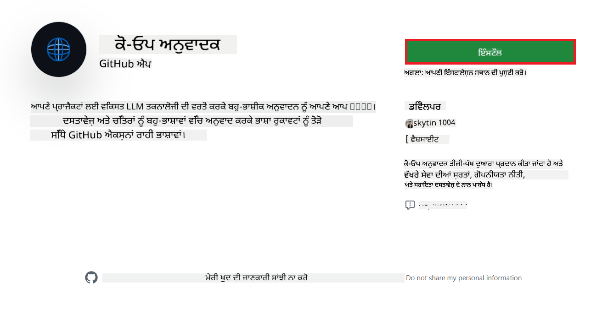
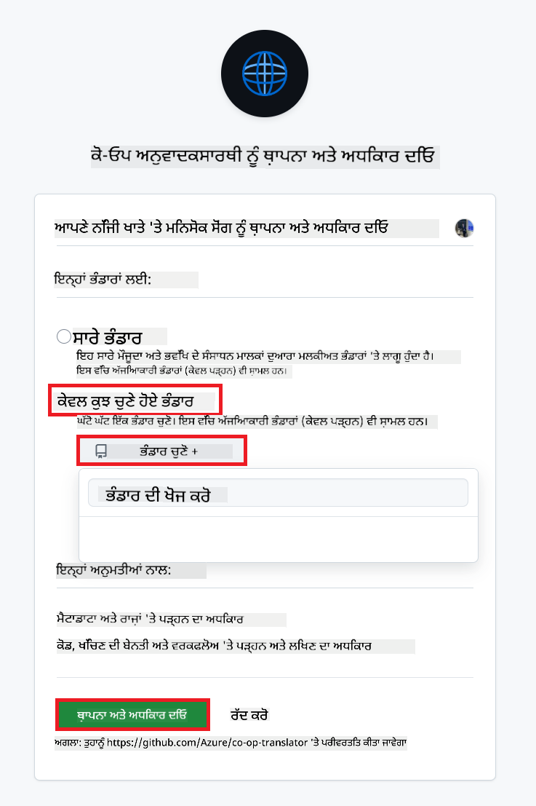
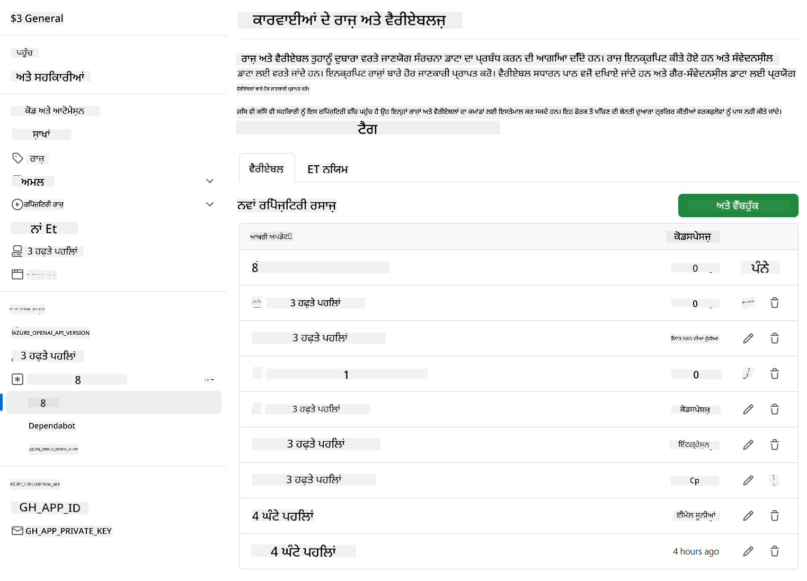

<!--
CO_OP_TRANSLATOR_METADATA:
{
  "original_hash": "c437820027c197f25fb2cbee95bae28c",
  "translation_date": "2025-06-12T19:07:20+00:00",
  "source_file": "getting_started/github-actions-guide/github-actions-guide-org.md",
  "language_code": "pa"
}
-->
# ਕੋ-ਆਪ ਟ੍ਰਾਂਸਲੇਟਰ GitHub ਐਕਸ਼ਨ ਦੀ ਵਰਤੋਂ ਕਰਨਾ (ਸੰਸਥਾ ਗਾਈਡ)

**ਲਕੜੀ ਦਰਸ਼ਕ:** ਇਹ ਗਾਈਡ **Microsoft ਦੇ ਅੰਦਰੂਨੀ ਉਪਭੋਗਤਾਵਾਂ** ਜਾਂ **ਉਹ ਟੀਮਾਂ ਜਿਨ੍ਹਾਂ ਕੋਲ ਪ੍ਰੀ-ਬਿਲਟ ਕੋ-ਆਪ ਟ੍ਰਾਂਸਲੇਟਰ GitHub ਐਪ ਲਈ ਲੋੜੀਂਦੇ ਪ੍ਰਮਾਣ ਪੱਤਰ ਹਨ ਜਾਂ ਜੋ ਆਪਣਾ ਕਸਟਮ GitHub ਐਪ ਬਣਾਉ ਸਕਦੀਆਂ ਹਨ** ਲਈ ਬਣਾਈ ਗਈ ਹੈ।

ਆਪਣੇ ਰਿਪੋਜ਼ਟਰੀ ਦੀ ਦਸਤਾਵੇਜ਼ੀਕਰਨ ਦਾ ਅਨੁਵਾਦ ਆਸਾਨੀ ਨਾਲ ਕੋ-ਆਪ ਟ੍ਰਾਂਸਲੇਟਰ GitHub ਐਕਸ਼ਨ ਦੀ ਵਰਤੋਂ ਕਰਕੇ ਆਟੋਮੇਟ ਕਰੋ। ਇਹ ਗਾਈਡ ਤੁਹਾਨੂੰ ਇਹ ਦਿਖਾਉਂਦੀ ਹੈ ਕਿ ਕਿਵੇਂ ਐਕਸ਼ਨ ਨੂੰ ਸੈੱਟਅੱਪ ਕਰਨਾ ਹੈ ਤਾਂ ਜੋ ਜਦੋਂ ਵੀ ਤੁਹਾਡੇ ਸਰੋਤ Markdown ਫਾਈਲਾਂ ਜਾਂ ਤਸਵੀਰਾਂ ਵਿੱਚ ਬਦਲਾਅ ਹੋਵੇ, ਤਾਂ ਇਹ ਆਪਣੇ ਆਪ ਅਪਡੇਟ ਕੀਤੇ ਅਨੁਵਾਦਾਂ ਨਾਲ ਪુલ ਰਿਕਵੇਸਟ ਬਣਾਏ।

> [!IMPORTANT]
>
> **ਸਹੀ ਗਾਈਡ ਚੁਣਨਾ:**
>
> ਇਹ ਗਾਈਡ GitHub ਐਪ ID ਅਤੇ ਪ੍ਰਾਈਵੇਟ ਕੀ ਦੀ ਵਰਤੋਂ ਕਰਕੇ ਸੈੱਟਅੱਪ ਦੀ ਵਿਸਥਾਰ ਨਾਲ ਜਾਣਕਾਰੀ ਦਿੰਦੀ ਹੈ। ਤੁਸੀਂ ਆਮ ਤੌਰ 'ਤੇ ਇਹ "ਸੰਸਥਾ ਗਾਈਡ" ਤਰੀਕਾ ਇਸ ਵਾਰਤੋਂ ਕਰਦੇ ਹੋ ਜੇ: **`GITHUB_TOKEN` ਦੀਆਂ ਅਨੁਮਤੀਆਂ ਸੀਮਿਤ ਹਨ:** ਤੁਹਾਡੀ ਸੰਸਥਾ ਜਾਂ ਰਿਪੋਜ਼ਟਰੀ ਸੈਟਿੰਗਜ਼ ਮੂਲ `GITHUB_TOKEN` ਨੂੰ ਦਿੱਤੀਆਂ ਜਾਣ ਵਾਲੀਆਂ ਡਿਫੌਲਟ ਅਨੁਮਤੀਆਂ ਨੂੰ ਰੋਕਦੀਆਂ ਹਨ। ਖਾਸ ਕਰਕੇ, ਜੇ `GITHUB_TOKEN` ਨੂੰ ਲੋੜੀਂਦੀਆਂ `write` ਅਨੁਮਤੀਆਂ (ਜਿਵੇਂ `contents: write` ਜਾਂ `pull-requests: write`) ਨਹੀਂ ਮਿਲਦੀਆਂ, ਤਾਂ [ਪਬਲਿਕ ਸੈੱਟਅੱਪ ਗਾਈਡ](./github-actions-guide-public.md) ਵਿੱਚ ਵਰਕਫਲੋ ਅਨੁਮਤੀਆਂ ਦੀ ਘਾਟ ਕਾਰਨ ਫੇਲ ਹੋ ਜਾਵੇਗਾ। ਇੱਕ ਸਮਰਪਿਤ GitHub ਐਪ ਦੀ ਵਰਤੋਂ ਕਰਕੇ ਜੋ ਖਾਸ ਤੌਰ 'ਤੇ ਅਨੁਮਤੀਆਂ ਮਿਲੀਆਂ ਹਨ, ਇਹ ਸੀਮਾ ਪਾਰ ਕਰ ਲਈ ਜਾਂਦੀ ਹੈ।
>
> **ਜੇ ਇਹ ਤੁਹਾਡੇ ਉੱਤੇ ਲਾਗੂ ਨਹੀਂ ਹੁੰਦਾ:**
>
> ਜੇ ਤੁਹਾਡੇ ਰਿਪੋਜ਼ਟਰੀ ਵਿੱਚ ਮੂਲ `GITHUB_TOKEN` ਕੋਲ ਕਾਫੀ ਅਨੁਮਤੀਆਂ ਹਨ (ਜਿਵੇਂ ਕਿ ਤੁਸੀਂ ਸੰਸਥਾ ਦੀਆਂ ਰੋਕਾਂ ਨਾਲ ਬੰਦ ਨਹੀਂ ਹੋ), ਤਾਂ ਕਿਰਪਾ ਕਰਕੇ **[GITHUB_TOKEN ਦੀ ਵਰਤੋਂ ਕਰਦਿਆਂ ਪਬਲਿਕ ਸੈੱਟਅੱਪ ਗਾਈਡ](./github-actions-guide-public.md)** ਦੀ ਵਰਤੋਂ ਕਰੋ। ਪਬਲਿਕ ਗਾਈਡ ਨੂੰ ਐਪ ID ਜਾਂ ਪ੍ਰਾਈਵੇਟ ਕੀ ਪ੍ਰਾਪਤ ਕਰਨ ਜਾਂ ਪ੍ਰਬੰਧਨ ਕਰਨ ਦੀ ਲੋੜ ਨਹੀਂ ਹੁੰਦੀ ਅਤੇ ਇਹ ਸਿਰਫ ਮੂਲ `GITHUB_TOKEN` ਅਤੇ ਰਿਪੋਜ਼ਟਰੀ ਅਨੁਮਤੀਆਂ 'ਤੇ ਨਿਰਭਰ ਕਰਦਾ ਹੈ।

## ਲੋੜੀਂਦੀਆਂ ਚੀਜ਼ਾਂ

GitHub ਐਕਸ਼ਨ ਨੂੰ ਸੈੱਟਅੱਪ ਕਰਨ ਤੋਂ ਪਹਿਲਾਂ ਯਕੀਨੀ ਬਣਾਓ ਕਿ ਤੁਹਾਡੇ ਕੋਲ ਲੋੜੀਂਦੇ AI ਸਰਵਿਸ ਪ੍ਰਮਾਣ ਪੱਤਰ ਤਿਆਰ ਹਨ।

**1. ਲੋੜੀਂਦਾ: AI ਭਾਸ਼ਾ ਮਾਡਲ ਪ੍ਰਮਾਣ ਪੱਤਰ**  
ਤੁਹਾਨੂੰ ਘੱਟੋ-ਘੱਟ ਇੱਕ ਸਪੋਰਟ ਕੀਤੇ ਭਾਸ਼ਾ ਮਾਡਲ ਲਈ ਪ੍ਰਮਾਣ ਪੱਤਰ ਦੀ ਲੋੜ ਹੈ:

- **Azure OpenAI**: Endpoint, API Key, ਮਾਡਲ/ਡਿਪਲੋਇਮੈਂਟ ਨਾਮ, API ਵਰਜਨ ਲੋੜੀਂਦੇ ਹਨ।  
- **OpenAI**: API Key ਲੋੜੀਂਦਾ ਹੈ, (ਵਿਕਲਪਿਕ: Org ID, Base URL, ਮਾਡਲ ID)।  
- ਵੇਰਵੇ ਲਈ [Supported Models and Services](../../../../README.md) ਵੇਖੋ।  
- ਸੈੱਟਅੱਪ ਗਾਈਡ: [Set up Azure OpenAI](../set-up-resources/set-up-azure-openai.md)।

**2. ਵਿਕਲਪਿਕ: ਕੰਪਿਊਟਰ ਵਿਜ਼ਨ ਪ੍ਰਮਾਣ ਪੱਤਰ (ਤਸਵੀਰਾਂ ਦੇ ਅਨੁਵਾਦ ਲਈ)**

- ਸਿਰਫ ਜੇ ਤੁਹਾਨੂੰ ਤਸਵੀਰਾਂ ਵਿੱਚ ਲਿਖਤ ਦਾ ਅਨੁਵਾਦ ਕਰਨਾ ਹੋਵੇ।  
- **Azure Computer Vision**: Endpoint ਅਤੇ Subscription Key ਲੋੜੀਂਦੇ ਹਨ।  
- ਜੇ ਨਾ ਦਿੱਤੇ ਜਾਣ, ਤਾਂ ਐਕਸ਼ਨ [Markdown-ਕੇਵਲ ਮੋਡ](../markdown-only-mode.md) ਵਿੱਚ ਚੱਲੇਗਾ।  
- ਸੈੱਟਅੱਪ ਗਾਈਡ: [Set up Azure Computer Vision](../set-up-resources/set-up-azure-computer-vision.md)।

## ਸੈੱਟਅੱਪ ਅਤੇ ਸੰਰਚਨਾ

ਆਪਣੇ ਰਿਪੋਜ਼ਟਰੀ ਵਿੱਚ ਕੋ-ਆਪ ਟ੍ਰਾਂਸਲੇਟਰ GitHub ਐਕਸ਼ਨ ਨੂੰ ਸੈੱਟਅੱਪ ਕਰਨ ਲਈ ਹੇਠਾਂ ਦਿੱਤੇ ਕਦਮਾਂ ਦੀ ਪਾਲਣਾ ਕਰੋ:

### ਕਦਮ 1: GitHub ਐਪ ਪ੍ਰਮਾਣਿਕਤਾ ਇੰਸਟਾਲ ਅਤੇ ਸੰਰਚਿਤ ਕਰੋ

ਵਰਕਫਲੋ GitHub ਐਪ ਪ੍ਰਮਾਣਿਕਤਾ ਦੀ ਵਰਤੋਂ ਕਰਦਾ ਹੈ ਤਾਂ ਜੋ ਤੁਹਾਡੇ ਰਿਪੋਜ਼ਟਰੀ ਨਾਲ ਸੁਰੱਖਿਅਤ ਤਰੀਕੇ ਨਾਲ ਸੰਚਾਰ ਕੀਤਾ ਜਾ ਸਕੇ (ਜਿਵੇਂ ਕਿ ਪુલ ਰਿਕਵੇਸਟ ਬਣਾਉਣਾ) ਤੁਹਾਡੇ ਵੱਲੋਂ। ਇੱਕ ਵਿਕਲਪ ਚੁਣੋ:

#### **ਵਿਕਲਪ A: ਪ੍ਰੀ-ਬਿਲਟ ਕੋ-ਆਪ ਟ੍ਰਾਂਸਲੇਟਰ GitHub ਐਪ ਇੰਸਟਾਲ ਕਰੋ (Microsoft ਅੰਦਰੂਨੀ ਵਰਤੋਂ ਲਈ)**

1. [Co-op Translator GitHub App](https://github.com/apps/co-op-translator) ਪੇਜ 'ਤੇ ਜਾਓ।

2. **Install** ਚੁਣੋ ਅਤੇ ਉਹ ਖਾਤਾ ਜਾਂ ਸੰਸਥਾ ਚੁਣੋ ਜਿੱਥੇ ਤੁਹਾਡਾ ਲਕੜੀ ਰਿਪੋਜ਼ਟਰੀ ਹੈ।

    

3. **Only select repositories** ਚੁਣੋ ਅਤੇ ਆਪਣਾ ਲਕੜੀ ਰਿਪੋਜ਼ਟਰੀ (ਜਿਵੇਂ ਕਿ `PhiCookBook`) ਚੁਣੋ। ਫਿਰ **Install** 'ਤੇ ਕਲਿੱਕ ਕਰੋ। ਤੁਹਾਨੂੰ ਪ੍ਰਮਾਣਿਕਤਾ ਲਈ ਪੁੱਛਿਆ ਜਾ ਸਕਦਾ ਹੈ।

    

4. **ਐਪ ਪ੍ਰਮਾਣ ਪੱਤਰ ਪ੍ਰਾਪਤ ਕਰੋ (ਅੰਦਰੂਨੀ ਪ੍ਰਕਿਰਿਆ ਲੋੜੀਂਦੀ):** ਵਰਕਫਲੋ ਨੂੰ ਐਪ ਵਜੋਂ ਪ੍ਰਮਾਣਿਤ ਕਰਨ ਲਈ ਤੁਹਾਨੂੰ ਕੋ-ਆਪ ਟ੍ਰਾਂਸਲੇਟਰ ਟੀਮ ਵੱਲੋਂ ਦੋ ਚੀਜ਼ਾਂ ਲੋੜੀਂਦੀਆਂ ਹਨ:  
   - **ਐਪ ID:** ਕੋ-ਆਪ ਟ੍ਰਾਂਸਲੇਟਰ ਐਪ ਲਈ ਵਿਲੱਖਣ ਪਛਾਣਕਰਤਾ। ਐਪ ID ਹੈ: `1164076`।  
   - **ਪ੍ਰਾਈਵੇਟ ਕੀ:** ਤੁਹਾਨੂੰ `.pem` ਪ੍ਰਾਈਵੇਟ ਕੀ ਫਾਈਲ ਦਾ **ਪੂਰਾ ਸਮੱਗਰੀ** ਮੈੰਟੇਨਰ ਸੰਪਰਕ ਤੋਂ ਲੈਣਾ ਹੈ। **ਇਸ ਕੀ ਨੂੰ ਪਾਸਵਰਡ ਵਾਂਗ ਸੰਭਾਲੋ ਅਤੇ ਸੁਰੱਖਿਅਤ ਰੱਖੋ।**

5. ਕਦਮ 2 ਵੱਲ ਵਧੋ।

#### **ਵਿਕਲਪ B: ਆਪਣਾ ਕਸਟਮ GitHub ਐਪ ਵਰਤੋਂ**

- ਜੇ ਤੁਸੀਂ ਚਾਹੁੰਦੇ ਹੋ, ਤਾਂ ਆਪਣਾ GitHub ਐਪ ਬਣਾਓ ਅਤੇ ਸੰਰਚਿਤ ਕਰੋ। ਇਹਨਾਂ ਨੂੰ Contents ਅਤੇ Pull requests ਲਈ ਪੜ੍ਹਨ-ਲਿਖਨ ਦੀ ਪਹੁੰਚ ਹੋਣੀ ਚਾਹੀਦੀ ਹੈ। ਤੁਹਾਨੂੰ ਇਸ ਦਾ ਐਪ ID ਅਤੇ ਬਣਾਇਆ ਹੋਇਆ ਪ੍ਰਾਈਵੇਟ ਕੀ ਲੋੜੀਂਦਾ ਹੈ।

### ਕਦਮ 2: ਰਿਪੋਜ਼ਟਰੀ ਸਿਕ੍ਰੇਟਸ ਸੰਰਚਿਤ ਕਰੋ

ਤੁਹਾਨੂੰ GitHub ਐਪ ਪ੍ਰਮਾਣ ਪੱਤਰ ਅਤੇ ਆਪਣੀ AI ਸਰਵਿਸ ਦੇ ਪ੍ਰਮਾਣ ਪੱਤਰ ਰਿਪੋਜ਼ਟਰੀ ਸੈਟਿੰਗਜ਼ ਵਿੱਚ ਇੰਕ੍ਰਿਪਟ ਕੀਤੇ ਸਿਕ੍ਰੇਟਸ ਵਜੋਂ ਜੋੜਣੇ ਹੋਣਗੇ।

1. ਆਪਣੀ ਲਕੜੀ GitHub ਰਿਪੋਜ਼ਟਰੀ (ਜਿਵੇਂ ਕਿ `PhiCookBook`) 'ਤੇ ਜਾਓ।

2. **Settings** > **Secrets and variables** > **Actions** 'ਤੇ ਜਾਓ।

3. **Repository secrets** ਹੇਠਾਂ, ਹਰੇਕ ਹੇਠਾਂ ਦਿੱਤੇ ਸਿਕ੍ਰੇਟ ਲਈ **New repository secret** 'ਤੇ ਕਲਿੱਕ ਕਰੋ।

   

**ਲੋੜੀਂਦੇ ਸਿਕ੍ਰੇਟ (GitHub ਐਪ ਪ੍ਰਮਾਣਿਕਤਾ ਲਈ):**

| ਸਿਕ੍ਰੇਟ ਨਾਮ          | ਵਰਣਨ                                         | ਮੁੱਲ ਦਾ ਸਰੋਤ                              |
| :------------------- | :--------------------------------------------- | :---------------------------------------- |
| `GH_APP_ID`          | GitHub ਐਪ ਦਾ ਐਪ ID (ਕਦਮ 1 ਤੋਂ)                      | GitHub ਐਪ ਸੈਟਿੰਗਜ਼                        |
| `GH_APP_PRIVATE_KEY` | ਡਾਊਨਲੋਡ ਕੀਤੇ ਹੋਏ `.pem` ਫਾਈਲ ਦੀ **ਪੂਰੀ ਸਮੱਗਰੀ** | `.pem` ਫਾਈਲ (ਕਦਮ 1 ਤੋਂ)              |

**AI ਸਰਵਿਸ ਸਿਕ੍ਰੇਟ (ਆਪਣੀ ਲੋੜ ਅਨੁਸਾਰ ਸਾਰੇ ਲਾਭਦੇ ਹੋਏ ਸ਼ਾਮਲ ਕਰੋ):**

| ਸਿਕ੍ਰੇਟ ਨਾਮ                         | ਵਰਣਨ                                      | ਮੁੱਲ ਦਾ ਸਰੋਤ                        |
| :---------------------------------- | :----------------------------------------- | :---------------------------------- |
| `AZURE_SUBSCRIPTION_KEY`            | Azure AI ਸਰਵਿਸ (ਕੰਪਿਊਟਰ ਵਿਜ਼ਨ) ਲਈ ਕੁੰਜੀ      | Azure AI Foundry                   |
| `AZURE_AI_SERVICE_ENDPOINT`         | Azure AI ਸਰਵਿਸ (ਕੰਪਿਊਟਰ ਵਿਜ਼ਨ) ਲਈ Endpoint    | Azure AI Foundry                   |
| `AZURE_OPENAI_API_KEY`              | Azure OpenAI ਸਰਵਿਸ ਲਈ ਕੁੰਜੀ                     | Azure AI Foundry                   |
| `AZURE_OPENAI_ENDPOINT`             | Azure OpenAI ਸਰਵਿਸ ਲਈ Endpoint                   | Azure AI Foundry                   |
| `AZURE_OPENAI_MODEL_NAME`           | ਤੁਹਾਡਾ Azure OpenAI ਮਾਡਲ ਨਾਮ                      | Azure AI Foundry                   |
| `AZURE_OPENAI_CHAT_DEPLOYMENT_NAME` | ਤੁਹਾਡਾ Azure OpenAI ਡਿਪਲੋਇਮੈਂਟ ਨਾਮ                 | Azure AI Foundry                   |
| `AZURE_OPENAI_API_VERSION`          | Azure OpenAI ਲਈ API ਵਰਜਨ                          | Azure AI Foundry                   |
| `OPENAI_API_KEY`                    | OpenAI ਲਈ API ਕੁੰਜੀ                              | OpenAI Platform                   |
| `OPENAI_ORG_ID`                     | OpenAI ਸੰਸਥਾ ID                                  | OpenAI Platform                   |
| `OPENAI_CHAT_MODEL_ID`              | ਖਾਸ OpenAI ਮਾਡਲ ID                               | OpenAI Platform                   |
| `OPENAI_BASE_URL`                   | ਕਸਟਮ OpenAI API ਬੇਸ URL                          | OpenAI Platform                   |



### ਕਦਮ 3: ਵਰਕਫਲੋ ਫਾਈਲ ਬਣਾਓ

ਅਖੀਰਕਾਰ, ਉਹ YAML ਫਾਈਲ ਬਣਾਓ ਜੋ ਆਟੋਮੇਟਿਕ ਵਰਕਫਲੋ ਨੂੰ ਪਰਿਭਾਸ਼ਿਤ ਕਰਦੀ ਹੈ।

1. ਆਪਣੀ ਰਿਪੋਜ਼ਟਰੀ ਦੀ ਰੂਟ ਡਾਇਰੈਕਟਰੀ ਵਿੱਚ, ਜੇ ਮੌਜੂਦ ਨਾ ਹੋਵੇ ਤਾਂ `.github/workflows/` ਡਾਇਰੈਕਟਰੀ ਬਣਾਓ।

2. `.github/workflows/` ਦੇ ਅੰਦਰ, ਇੱਕ ਫਾਈਲ ਬਣਾਓ ਜਿਸਦਾ ਨਾਮ `co-op-translator.yml` ਰੱਖੋ।

3. ਹੇਠਾਂ ਦਿੱਤੀ ਸਮੱਗਰੀ co-op-translator.yml ਵਿੱਚ ਪੇਸਟ ਕਰੋ।

```
name: Co-op Translator

on:
  push:
    branches:
      - main

jobs:
  co-op-translator:
    runs-on: ubuntu-latest

    permissions:
      contents: write
      pull-requests: write

    steps:
      - name: Checkout repository
        uses: actions/checkout@v4
        with:
          fetch-depth: 0

      - name: Set up Python
        uses: actions/setup-python@v4
        with:
          python-version: '3.10'

      - name: Install Co-op Translator
        run: |
          python -m pip install --upgrade pip
          pip install co-op-translator

      - name: Run Co-op Translator
        env:
          PYTHONIOENCODING: utf-8
          # Azure AI Service Credentials
          AZURE_SUBSCRIPTION_KEY: ${{ secrets.AZURE_SUBSCRIPTION_KEY }}
          AZURE_AI_SERVICE_ENDPOINT: ${{ secrets.AZURE_AI_SERVICE_ENDPOINT }}

          # Azure OpenAI Credentials
          AZURE_OPENAI_API_KEY: ${{ secrets.AZURE_OPENAI_API_KEY }}
          AZURE_OPENAI_ENDPOINT: ${{ secrets.AZURE_OPENAI_ENDPOINT }}
          AZURE_OPENAI_MODEL_NAME: ${{ secrets.AZURE_OPENAI_MODEL_NAME }}
          AZURE_OPENAI_CHAT_DEPLOYMENT_NAME: ${{ secrets.AZURE_OPENAI_CHAT_DEPLOYMENT_NAME }}
          AZURE_OPENAI_API_VERSION: ${{ secrets.AZURE_OPENAI_API_VERSION }}

          # OpenAI Credentials
          OPENAI_API_KEY: ${{ secrets.OPENAI_API_KEY }}
          OPENAI_ORG_ID: ${{ secrets.OPENAI_ORG_ID }}
          OPENAI_CHAT_MODEL_ID: ${{ secrets.OPENAI_CHAT_MODEL_ID }}
          OPENAI_BASE_URL: ${{ secrets.OPENAI_BASE_URL }}
        run: |
          # =====================================================================
          # IMPORTANT: Set your target languages here (REQUIRED CONFIGURATION)
          # =====================================================================
          # Example: Translate to Spanish, French, German. Add -y to auto-confirm.
          translate -l "es fr de" -y  # <--- MODIFY THIS LINE with your desired languages

      - name: Authenticate GitHub App
        id: generate_token
        uses: tibdex/github-app-token@v1
        with:
          app_id: ${{ secrets.GH_APP_ID }}
          private_key: ${{ secrets.GH_APP_PRIVATE_KEY }}

      - name: Create Pull Request with translations
        uses: peter-evans/create-pull-request@v5
        with:
          token: ${{ steps.generate_token.outputs.token }}
          commit-message: "🌐 Update translations via Co-op Translator"
          title: "🌐 Update translations via Co-op Translator"
          body: |
            This PR updates translations for recent changes to the main branch.

            ### 📋 Changes included
            - Translated contents are available in the `translations/` directory
            - Translated images are available in the `translated_images/` directory

            ---
            🌐 Automatically generated by the [Co-op Translator](https://github.com/Azure/co-op-translator) GitHub Action.
          branch: update-translations
          base: main
          labels: translation, automated-pr
          delete-branch: true
          add-paths: |
            translations/
            translated_images/

```

4. **ਵਰਕਫਲੋ ਨੂੰ ਕਸਟਮਾਈਜ਼ ਕਰੋ:**  
  - **[!IMPORTANT] ਟਾਰਗੇਟ ਭਾਸ਼ਾਵਾਂ:** `Run Co-op Translator` step, you **MUST review and modify the list of language codes** within the `translate -l "..." -y` command to match your project's requirements. The example list (`ar de es...`) needs to be replaced or adjusted.
  - **Trigger (`on:`):** The current trigger runs on every push to `main`. For large repositories, consider adding a `paths:` filter (see commented example in the YAML) to run the workflow only when relevant files (e.g., source documentation) change, saving runner minutes.
  - **PR Details:** Customize the `commit-message`, `title`, `body`, `branch` name, and `labels` in the `Create Pull Request` step if needed.

## Credential Management and Renewal

- **Security:** Always store sensitive credentials (API keys, private keys) as GitHub Actions secrets. Never expose them in your workflow file or repository code.
- **[!IMPORTANT] Key Renewal (Internal Microsoft Users):** Be aware that Azure OpenAI key used within Microsoft might have a mandatory renewal policy (e.g., every 5 months). Ensure you update the corresponding GitHub secrets (`AZURE_OPENAI_...` ਕੁੰਜੀਆਂ ਵਿੱਚ ਸਮੇਂ ਤੋਂ ਪਹਿਲਾਂ ਟਾਰਗੇਟ ਭਾਸ਼ਾਵਾਂ ਸ਼ਾਮਲ ਕਰੋ ਤਾਂ ਜੋ ਵਰਕਫਲੋ ਫੇਲ ਨਾ ਹੋਵੇ।

## ਵਰਕਫਲੋ ਚਲਾਉਣਾ

ਜਦੋਂ `co-op-translator.yml` ਫਾਈਲ ਤੁਹਾਡੇ ਮੇਨ ਬ੍ਰਾਂਚ (ਜਾਂ `on:` trigger), the workflow will automatically run whenever changes are pushed to that branch (and match the `paths` ਫਿਲਟਰ ਵਿੱਚ ਦਿੱਤੀ ਬ੍ਰਾਂਚ) ਵਿੱਚ ਮਰਜ ਹੋ ਜਾਵੇਗੀ।

ਜੇ ਅਨੁਵਾਦ ਬਣਾਏ ਜਾਂ ਅਪਡੇਟ ਕੀਤੇ ਜਾਂਦੇ ਹਨ, ਤਾਂ ਐਕਸ਼ਨ ਆਪਣੇ ਆਪ ਇੱਕ ਪુલ ਰਿਕਵੇਸਟ ਬਣਾਏਗਾ ਜਿਸ ਵਿੱਚ ਇਹ ਤਬਦੀਲੀਆਂ ਹੋਣਗੀਆਂ, ਜੋ ਤੁਹਾਡੇ ਸਮੀਖਿਆ ਅਤੇ ਮਰਜ ਕਰਨ ਲਈ ਤਿਆਰ ਹੋਵੇਗੀ।

**ਅਸਵੀਕਾਰੋਪਣ**:  
ਇਹ ਦਸਤਾਵੇਜ਼ AI ਅਨੁਵਾਦ ਸੇਵਾ [Co-op Translator](https://github.com/Azure/co-op-translator) ਦੀ ਵਰਤੋਂ ਕਰਕੇ ਅਨੁਵਾਦਿਤ ਕੀਤਾ ਗਿਆ ਹੈ। ਜਦੋਂ ਕਿ ਅਸੀਂ ਸਹੀਅਤ ਲਈ ਕੋਸ਼ਿਸ਼ ਕਰਦੇ ਹਾਂ, ਕਿਰਪਾ ਕਰਕੇ ਧਿਆਨ ਰੱਖੋ ਕਿ ਸਵੈਚਾਲਿਤ ਅਨੁਵਾਦਾਂ ਵਿੱਚ ਗਲਤੀਆਂ ਜਾਂ ਅਸਹੀਤਾਂ ਹੋ ਸਕਦੀਆਂ ਹਨ। ਮੂਲ ਦਸਤਾਵੇਜ਼ ਆਪਣੀ ਮੂਲ ਭਾਸ਼ਾ ਵਿੱਚ ਪ੍ਰਮਾਣਿਕ ਸਰੋਤ ਮੰਨਿਆ ਜਾਣਾ ਚਾਹੀਦਾ ਹੈ। ਮਹੱਤਵਪੂਰਨ ਜਾਣਕਾਰੀ ਲਈ, ਪੇਸ਼ੇਵਰ ਮਨੁੱਖੀ ਅਨੁਵਾਦ ਦੀ ਸਿਫ਼ਾਰਸ਼ ਕੀਤੀ ਜਾਂਦੀ ਹੈ। ਅਸੀਂ ਇਸ ਅਨੁਵਾਦ ਦੇ ਉਪਯੋਗ ਤੋਂ ਉਪਜਣ ਵਾਲੀਆਂ ਕਿਸੇ ਵੀ ਗਲਤਫਹਿਮੀਆਂ ਜਾਂ ਭ੍ਰਮਾਂ ਲਈ ਜ਼ਿੰਮੇਵਾਰ ਨਹੀਂ ਹਾਂ।