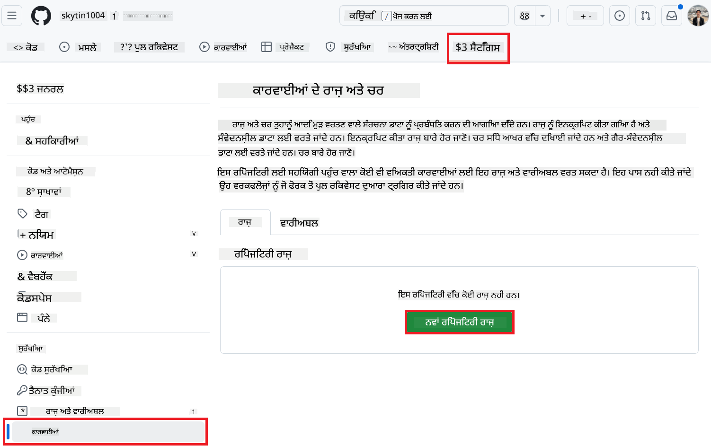
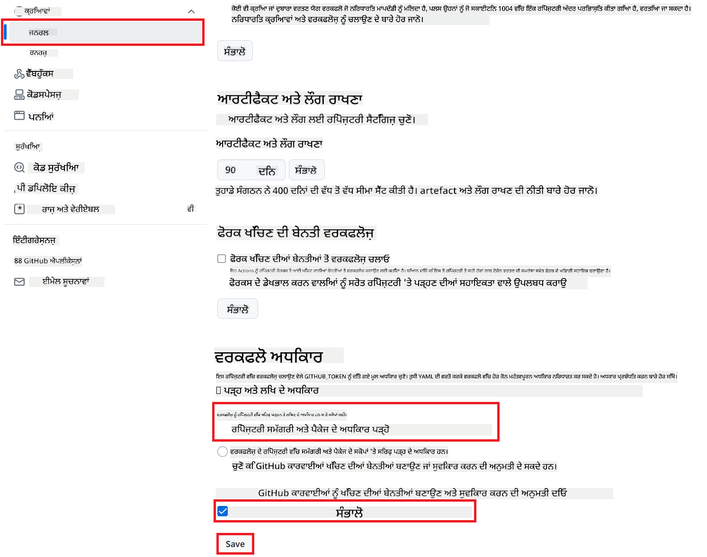

<!--
CO_OP_TRANSLATOR_METADATA:
{
  "original_hash": "a52587a512e667f70d92db853d3c61d5",
  "translation_date": "2025-06-12T19:26:33+00:00",
  "source_file": "getting_started/github-actions-guide/github-actions-guide-public.md",
  "language_code": "pa"
}
-->
# Co-op Translator GitHub Action (ਪਬਲਿਕ ਸੈਟਅਪ) ਦੀ ਵਰਤੋਂ

**ਲਕੜੀ ਦਰਸ਼ਕ:** ਇਹ ਗਾਈਡ ਜ਼ਿਆਦਾਤਰ ਪਬਲਿਕ ਜਾਂ ਪ੍ਰਾਈਵੇਟ ਰਿਪੋਜ਼ਟਰੀਜ਼ ਲਈ ਬਣਾਈ ਗਈ ਹੈ ਜਿੱਥੇ ਸਧਾਰਣ GitHub Actions ਦੀਆਂ ਪਰਮੀਸ਼ਨਾਂ ਕਾਫ਼ੀ ਹੁੰਦੀਆਂ ਹਨ। ਇਹ ਨਿਰਮਿਤ `GITHUB_TOKEN` ਦੀ ਵਰਤੋਂ ਕਰਦਾ ਹੈ।

ਆਪਣੇ ਰਿਪੋਜ਼ਟਰੀ ਦੀ ਡੌਕਯੂਮੈਂਟੇਸ਼ਨ ਦਾ ਅਨੁਵਾਦ ਆਸਾਨੀ ਨਾਲ ਕਰਵਾਉਣ ਲਈ Co-op Translator GitHub Action ਦੀ ਵਰਤੋਂ ਕਰੋ। ਇਹ ਗਾਈਡ ਤੁਹਾਨੂੰ ਦਿਖਾਉਂਦੀ ਹੈ ਕਿ ਕਿਸ ਤਰ੍ਹਾਂ ਇਹ ਐਕਸ਼ਨ ਸੈੱਟਅਪ ਕਰਨਾ ਹੈ ਤਾਂ ਜੋ ਜਦੋਂ ਵੀ ਤੁਹਾਡੇ ਸੋਰਸ Markdown ਫਾਇਲਾਂ ਜਾਂ ਚਿੱਤਰ ਬਦਲਦੇ ਹਨ, ਤਾਂ ਆਪਣੇ ਆਪ ਅਪਡੇਟ ਕੀਤੇ ਅਨੁਵਾਦਾਂ ਨਾਲ ਪુલ ਰਿਕਵੇਸਟ ਬਣਾਈ ਜਾਵੇ।

> [!IMPORTANT]
>
> **ਸਹੀ ਗਾਈਡ ਚੁਣਨਾ:**
>
> ਇਹ ਗਾਈਡ ਸਧਾਰਣ `GITHUB_TOKEN` ਦੀ ਵਰਤੋਂ ਨਾਲ ਸੌਖਾ ਸੈਟਅਪ ਵੇਰਵਾ ਕਰਦੀ ਹੈ। ਇਹ ਜ਼ਿਆਦਾਤਰ ਯੂਜ਼ਰਾਂ ਲਈ ਸੁਝਾਈ ਗਈ ਵਿਧੀ ਹੈ ਕਿਉਂਕਿ ਇਸ ਵਿੱਚ ਸੰਵੇਦਨਸ਼ੀਲ GitHub App Private Keys ਨੂੰ ਸੰਭਾਲਣ ਦੀ ਲੋੜ ਨਹੀਂ ਹੁੰਦੀ।
>

## ਲੋੜੀਂਦੇ ਚੀਜ਼ਾਂ

GitHub Action ਸੈੱਟਅਪ ਕਰਨ ਤੋਂ ਪਹਿਲਾਂ ਯਕੀਨੀ ਬਣਾਓ ਕਿ ਤੁਹਾਡੇ ਕੋਲ ਲੋੜੀਂਦੇ AI ਸੇਵਾ ਕ੍ਰੈਡੈਂਸ਼ਲ ਤਿਆਰ ਹਨ।

**1. ਲੋੜੀਂਦੇ: AI ਭਾਸ਼ਾ ਮਾਡਲ ਕ੍ਰੈਡੈਂਸ਼ਲ**  
ਤੁਹਾਨੂੰ ਘੱਟੋ-ਘੱਟ ਇੱਕ ਸਹਾਇਤ ਭਾਸ਼ਾ ਮਾਡਲ ਲਈ ਕ੍ਰੈਡੈਂਸ਼ਲ ਚਾਹੀਦੇ ਹਨ:

- **Azure OpenAI**: Endpoint, API Key, Model/Deployment Names, API Version ਲੋੜੀਂਦੇ ਹਨ।  
- **OpenAI**: API Key ਲੋੜੀਂਦਾ ਹੈ, (ਵਿਕਲਪਿਕ: Org ID, Base URL, Model ID)।  
- ਵੇਰਵਾ ਲਈ ਦੇਖੋ [Supported Models and Services](../../../../README.md)।

**2. ਵਿਕਲਪਿਕ: AI Vision ਕ੍ਰੈਡੈਂਸ਼ਲ (ਚਿੱਤਰ ਅਨੁਵਾਦ ਲਈ)**

- ਸਿਰਫ਼ ਜੇ ਤੁਹਾਨੂੰ ਚਿੱਤਰਾਂ ਵਿੱਚ ਲਿਖਤ ਦਾ ਅਨੁਵਾਦ ਕਰਨਾ ਹੋਵੇ ਤਾਂ ਲੋੜੀਂਦਾ।  
- **Azure AI Vision**: Endpoint ਅਤੇ Subscription Key ਲੋੜੀਂਦੇ ਹਨ।  
- ਜੇ ਨਾ ਦਿੱਤੇ ਜਾਣ, ਤਾਂ ਐਕਸ਼ਨ [Markdown-only mode](../markdown-only-mode.md) 'ਤੇ ਚੱਲੇਗਾ।

## ਸੈਟਅਪ ਅਤੇ ਸੰਰਚਨਾ

ਆਪਣੇ ਰਿਪੋਜ਼ਟਰੀ ਵਿੱਚ ਸਧਾਰਣ `GITHUB_TOKEN` ਦੀ ਵਰਤੋਂ ਕਰਕੇ Co-op Translator GitHub Action ਸੈੱਟਅਪ ਕਰਨ ਲਈ ਹੇਠਾਂ ਦਿੱਤੇ ਕਦਮਾਂ ਦੀ ਪਾਲਣਾ ਕਰੋ।

### ਕਦਮ 1: ਪ੍ਰਮਾਣੀਕਰਨ ਨੂੰ ਸਮਝੋ (`GITHUB_TOKEN` ਦੀ ਵਰਤੋਂ)

ਇਹ ਵਰਕਫਲੋ GitHub Actions ਵੱਲੋਂ ਦਿੱਤੇ ਗਏ ਨਿਰਮਿਤ `GITHUB_TOKEN` ਨੂੰ ਵਰਤਦਾ ਹੈ। ਇਹ ਟੋਕਨ ਆਪਣੇ ਆਪ ਵਰਕਫਲੋ ਨੂੰ ਤੁਹਾਡੇ ਰਿਪੋਜ਼ਟਰੀ ਨਾਲ ਸੰਚਾਰ ਕਰਨ ਦੀਆਂ ਪਰਮੀਸ਼ਨਾਂ ਦਿੰਦਾ ਹੈ, ਜੋ ਕਿ **ਕਦਮ 3** ਵਿੱਚ ਸੈੱਟ ਕੀਤੀਆਂ ਗਈਆਂ ਸੈਟਿੰਗਾਂ 'ਤੇ ਆਧਾਰਿਤ ਹੁੰਦੀਆਂ ਹਨ।

### ਕਦਮ 2: ਰਿਪੋਜ਼ਟਰੀ ਸੀਕ੍ਰੇਟਸ ਸੈੱਟ ਕਰੋ

ਤੁਹਾਨੂੰ ਸਿਰਫ਼ ਆਪਣੀਆਂ **AI ਸੇਵਾ ਕ੍ਰੈਡੈਂਸ਼ਲਜ਼** ਨੂੰ ਆਪਣੇ ਰਿਪੋਜ਼ਟਰੀ ਸੈਟਿੰਗਜ਼ ਵਿੱਚ ਇੰਕ੍ਰਿਪਟਡ ਸੀਕ੍ਰੇਟਸ ਵਜੋਂ ਸ਼ਾਮਲ ਕਰਨਾ ਹੈ।

1.  ਆਪਣੇ ਲਕੜੀ GitHub ਰਿਪੋਜ਼ਟਰੀ 'ਤੇ ਜਾਓ।  
2.  **Settings** > **Secrets and variables** > **Actions** 'ਤੇ ਜਾਓ।  
3.  ਹਰੇਕ ਲੋੜੀਂਦੇ AI ਸੇਵਾ ਸੀਕ੍ਰੇਟ ਲਈ **New repository secret** 'ਤੇ ਕਲਿੱਕ ਕਰੋ।

     *(ਚਿੱਤਰ ਸੰਦਰਭ: ਕਿੱਥੇ ਸੀਕ੍ਰੇਟਸ ਜੋੜਣੇ ਹਨ)*

**ਲੋੜੀਂਦੇ AI ਸੇਵਾ ਸੀਕ੍ਰੇਟਸ (ਆਪਣੇ ਲੋੜ ਅਨੁਸਾਰ ਸਾਰੇ ਜੋੜੋ):**

| Secret Name                         | ਵੇਰਵਾ                                   | ਮੂਲ ਸ੍ਰੋਤ                         |
| :---------------------------------- | :---------------------------------------- | :------------------------------- |
| `AZURE_SUBSCRIPTION_KEY`            | Azure AI ਸੇਵਾ (ਕੰਪਿਊਟਰ ਵਿਜ਼ਨ) ਲਈ ਕੀ          | ਤੁਹਾਡਾ Azure AI Foundry            |
| `AZURE_AI_SERVICE_ENDPOINT`         | Azure AI ਸੇਵਾ (ਕੰਪਿਊਟਰ ਵਿਜ਼ਨ) ਲਈ Endpoint     | ਤੁਹਾਡਾ Azure AI Foundry            |
| `AZURE_OPENAI_API_KEY`              | Azure OpenAI ਸੇਵਾ ਲਈ ਕੀ                      | ਤੁਹਾਡਾ Azure AI Foundry            |
| `AZURE_OPENAI_ENDPOINT`             | Azure OpenAI ਸੇਵਾ ਲਈ Endpoint                 | ਤੁਹਾਡਾ Azure AI Foundry            |
| `AZURE_OPENAI_MODEL_NAME`           | ਤੁਹਾਡਾ Azure OpenAI ਮਾਡਲ ਨਾਮ                  | ਤੁਹਾਡਾ Azure AI Foundry            |
| `AZURE_OPENAI_CHAT_DEPLOYMENT_NAME` | ਤੁਹਾਡਾ Azure OpenAI ਡਿਪਲੋਇਮੈਂਟ ਨਾਮ              | ਤੁਹਾਡਾ Azure AI Foundry            |
| `AZURE_OPENAI_API_VERSION`          | Azure OpenAI ਲਈ API ਵਰਜ਼ਨ                       | ਤੁਹਾਡਾ Azure AI Foundry            |
| `OPENAI_API_KEY`                    | OpenAI ਲਈ API ਕੀ                             | ਤੁਹਾਡਾ OpenAI Platform             |
| `OPENAI_ORG_ID`                     | OpenAI Organization ID (ਵਿਕਲਪਿਕ)                | ਤੁਹਾਡਾ OpenAI Platform             |
| `OPENAI_CHAT_MODEL_ID`              | ਖਾਸ OpenAI ਮਾਡਲ ID (ਵਿਕਲਪਿਕ)                    | ਤੁਹਾਡਾ OpenAI Platform             |
| `OPENAI_BASE_URL`                   | ਕਸਟਮ OpenAI API ਬੇਸ URL (ਵਿਕਲਪਿਕ)               | ਤੁਹਾਡਾ OpenAI Platform             |

### ਕਦਮ 3: ਵਰਕਫਲੋ ਪਰਮੀਸ਼ਨਾਂ ਨੂੰ ਸੈੱਟ ਕਰੋ

GitHub Action ਨੂੰ ਕੋਡ ਚੈੱਕਆਊਟ ਕਰਨ ਅਤੇ ਪુલ ਰਿਕਵੇਸਟ ਬਣਾਉਣ ਲਈ `GITHUB_TOKEN` ਰਾਹੀਂ ਪਰਮੀਸ਼ਨਾਂ ਦੀ ਲੋੜ ਹੁੰਦੀ ਹੈ।

1.  ਆਪਣੇ ਰਿਪੋਜ਼ਟਰੀ ਵਿੱਚ **Settings** > **Actions** > **General** 'ਤੇ ਜਾਓ।  
2.  **Workflow permissions** ਸੈਕਸ਼ਨ ਤੱਕ ਸਕਰੋਲ ਕਰੋ।  
3.  **Read and write permissions** ਚੁਣੋ। ਇਹ `GITHUB_TOKEN` ਨੂੰ ਇਸ ਵਰਕਫਲੋ ਲਈ ਲੋੜੀਂਦੇ `contents: write` ਅਤੇ `pull-requests: write` ਪਰਮੀਸ਼ਨ ਦਿੰਦਾ ਹੈ।  
4.  ਯਕੀਨੀ ਬਣਾਓ ਕਿ **Allow GitHub Actions to create and approve pull requests** ਵਾਲਾ ਚੈਕਬਾਕਸ ਟਿਕ ਕੀਤਾ ਹੋਇਆ ਹੈ।  
5.  **Save** ਤੇ ਕਲਿੱਕ ਕਰੋ।



### ਕਦਮ 4: ਵਰਕਫਲੋ ਫਾਇਲ ਬਣਾਓ

ਅੰਤ ਵਿੱਚ, YAML ਫਾਇਲ ਬਣਾਓ ਜੋ `GITHUB_TOKEN` ਦੀ ਵਰਤੋਂ ਨਾਲ ਆਟੋਮੇਟਿਕ ਵਰਕਫਲੋ ਨੂੰ ਪਰਿਭਾਸ਼ਿਤ ਕਰਦੀ ਹੈ।

1.  ਆਪਣੇ ਰਿਪੋਜ਼ਟਰੀ ਦੀ ਰੂਟ ਡਾਇਰੈਕਟਰੀ ਵਿੱਚ `.github/workflows/` ਡਾਇਰੈਕਟਰੀ ਬਣਾਓ ਜੇਕਰ ਮੌਜੂਦ ਨਹੀਂ।  
2.  `.github/workflows/` ਵਿੱਚ `co-op-translator.yml` ਨਾਮ ਦੀ ਫਾਇਲ ਬਣਾਓ।  
3.  ਹੇਠਾਂ ਦਿੱਤਾ ਸਮੱਗਰੀ `co-op-translator.yml` ਵਿੱਚ ਪੇਸਟ ਕਰੋ।

```yaml
name: Co-op Translator

on:
  push:
    branches:
      - main

jobs:
  co-op-translator:
    runs-on: ubuntu-latest

    permissions:
      contents: write
      pull-requests: write

    steps:
      - name: Checkout repository
        uses: actions/checkout@v4
        with:
          fetch-depth: 0

      - name: Set up Python
        uses: actions/setup-python@v4
        with:
          python-version: '3.10'

      - name: Install Co-op Translator
        run: |
          python -m pip install --upgrade pip
          pip install co-op-translator

      - name: Run Co-op Translator
        env:
          PYTHONIOENCODING: utf-8
          # === AI Service Credentials ===
          AZURE_SUBSCRIPTION_KEY: ${{ secrets.AZURE_SUBSCRIPTION_KEY }}
          AZURE_AI_SERVICE_ENDPOINT: ${{ secrets.AZURE_AI_SERVICE_ENDPOINT }}
          AZURE_OPENAI_API_KEY: ${{ secrets.AZURE_OPENAI_API_KEY }}
          AZURE_OPENAI_ENDPOINT: ${{ secrets.AZURE_OPENAI_ENDPOINT }}
          AZURE_OPENAI_MODEL_NAME: ${{ secrets.AZURE_OPENAI_MODEL_NAME }}
          AZURE_OPENAI_CHAT_DEPLOYMENT_NAME: ${{ secrets.AZURE_OPENAI_CHAT_DEPLOYMENT_NAME }}
          AZURE_OPENAI_API_VERSION: ${{ secrets.AZURE_OPENAI_API_VERSION }}
          OPENAI_API_KEY: ${{ secrets.OPENAI_API_KEY }}
          OPENAI_ORG_ID: ${{ secrets.OPENAI_ORG_ID }}
          OPENAI_CHAT_MODEL_ID: ${{ secrets.OPENAI_CHAT_MODEL_ID }}
          OPENAI_BASE_URL: ${{ secrets.OPENAI_BASE_URL }}
        run: |
          # =====================================================================
          # IMPORTANT: Set your target languages here (REQUIRED CONFIGURATION)
          # =====================================================================
          # Example: Translate to Spanish, French, German. Add -y to auto-confirm.
          translate -l "es fr de" -y  # <--- MODIFY THIS LINE with your desired languages

      - name: Create Pull Request with translations
        uses: peter-evans/create-pull-request@v5
        with:
          token: ${{ secrets.GITHUB_TOKEN }}
          commit-message: "🌐 Update translations via Co-op Translator"
          title: "🌐 Update translations via Co-op Translator"
          body: |
            This PR updates translations for recent changes to the main branch.

            ### 📋 Changes included
            - Translated contents are available in the `translations/` directory
            - Translated images are available in the `translated_images/` directory

            ---
            🌐 Automatically generated by the [Co-op Translator](https://github.com/Azure/co-op-translator) GitHub Action.
          branch: update-translations
          base: main
          labels: translation, automated-pr
          delete-branch: true
          add-paths: |
            translations/
            translated_images/
```  
4.  **ਵਰਕਫਲੋ ਨੂੰ ਕਸਟਮਾਈਜ਼ ਕਰੋ:**  
  - **[!IMPORTANT] ਟਾਰਗਟ ਭਾਸ਼ਾਵਾਂ:** `Run Co-op Translator` step, you **MUST review and modify the list of language codes** within the `translate -l "..." -y` command to match your project's requirements. The example list (`ar de es...`) needs to be replaced or adjusted.
  - **Trigger (`on:`):** The current trigger runs on every push to `main`. For large repositories, consider adding a `paths:` filter (see commented example in the YAML) to run the workflow only when relevant files (e.g., source documentation) change, saving runner minutes.
  - **PR Details:** Customize the `commit-message`, `title`, `body`, `branch` name, and `labels` in the `Create Pull Request` ਕਦਮ ਵਿੱਚ ਜੇ ਲੋੜ ਹੋਵੇ ਤਾਂ।

**ਅਸਵੀਕਾਰੋक्ति**:  
ਇਸ ਦਸਤਾਵੇਜ਼ ਦਾ ਅਨੁਵਾਦ AI ਅਨੁਵਾਦ ਸੇਵਾ [Co-op Translator](https://github.com/Azure/co-op-translator) ਦੀ ਵਰਤੋਂ ਕਰਕੇ ਕੀਤਾ ਗਿਆ ਹੈ। ਜਦੋਂ ਕਿ ਅਸੀਂ ਸਹੀਤਾ ਲਈ ਕੋਸ਼ਿਸ਼ ਕਰਦੇ ਹਾਂ, ਕਿਰਪਾ ਕਰਕੇ ਧਿਆਨ ਰੱਖੋ ਕਿ ਆਟੋਮੇਟਿਡ ਅਨੁਵਾਦਾਂ ਵਿੱਚ ਗਲਤੀਆਂ ਜਾਂ ਅਸਤੀਰਤਾਵਾਂ ਹੋ ਸਕਦੀਆਂ ਹਨ। ਮੂਲ ਦਸਤਾਵੇਜ਼ ਆਪਣੀ ਮੂਲ ਭਾਸ਼ਾ ਵਿੱਚ ਅਧਿਕਾਰਤ ਸਰੋਤ ਮੰਨਿਆ ਜਾਣਾ ਚਾਹੀਦਾ ਹੈ। ਮਹੱਤਵਪੂਰਨ ਜਾਣਕਾਰੀ ਲਈ, ਪੇਸ਼ੇਵਰ ਮਨੁੱਖੀ ਅਨੁਵਾਦ ਦੀ ਸਿਫਾਰਿਸ਼ ਕੀਤੀ ਜਾਂਦੀ ਹੈ। ਇਸ ਅਨੁਵਾਦ ਦੀ ਵਰਤੋਂ ਨਾਲ ਹੋਣ ਵਾਲੀਆਂ ਕਿਸੇ ਵੀ ਗਲਤਫਹਿਮੀਆਂ ਜਾਂ ਗਲਤ ਵਿਆਖਿਆਵਾਂ ਲਈ ਅਸੀਂ ਜ਼ਿੰਮੇਵਾਰ ਨਹੀਂ ਹਾਂ।