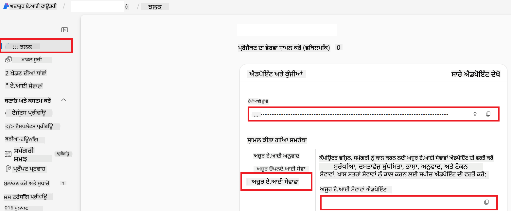

<!--
CO_OP_TRANSLATOR_METADATA:
{
  "original_hash": "b58d7c3cb4210697a073d20eb3064945",
  "translation_date": "2025-06-12T11:50:38+00:00",
  "source_file": "getting_started/set-up-azure-ai.md",
  "language_code": "pa"
}
-->
# Azure AI ਸਹਿਯੋਗੀ ਅਨੁਵਾਦਕ ਲਈ ਸੈਟਅਪ ਕਰੋ (Azure OpenAI & Azure AI Vision)

ਇਹ ਗਾਈਡ ਤੁਹਾਨੂੰ Azure OpenAI ਨੂੰ ਭਾਸ਼ਾ ਅਨੁਵਾਦ ਲਈ ਅਤੇ Azure Computer Vision ਨੂੰ ਚਿੱਤਰ ਸਮੱਗਰੀ ਵਿਸ਼ਲੇਸ਼ਣ ਲਈ (ਜੋ ਫਿਰ ਚਿੱਤਰ-ਆਧਾਰਿਤ ਅਨੁਵਾਦ ਲਈ ਵਰਤੀ ਜਾ ਸਕਦੀ ਹੈ) Azure AI Foundry ਵਿੱਚ ਸੈਟਅਪ ਕਰਨ ਲਈ ਮਦਦ ਕਰਦੀ ਹੈ।

**ਜ਼ਰੂਰੀ ਸ਼ਰਤਾਂ:**
- ਇੱਕ Azure ਖਾਤਾ ਜਿਸ ਵਿੱਚ ਸਰਗਰਮ ਸਬਸਕ੍ਰਿਪਸ਼ਨ ਹੋਵੇ।
- ਤੁਹਾਡੇ Azure ਸਬਸਕ੍ਰਿਪਸ਼ਨ ਵਿੱਚ ਸਰੋਤ ਅਤੇ ਡਿਪਲੋਇਮੈਂਟ ਬਣਾਉਣ ਦੀ ਪਰਮਿਸ਼ਨ।

## ਇੱਕ Azure AI ਪ੍ਰੋਜੈਕਟ ਬਣਾਓ

ਤੁਸੀਂ Azure AI ਪ੍ਰੋਜੈਕਟ ਬਣਾਉਣ ਨਾਲ ਸ਼ੁਰੂ ਕਰੋਗੇ, ਜੋ ਤੁਹਾਡੇ AI ਸਰੋਤਾਂ ਨੂੰ ਪ੍ਰਬੰਧਿਤ ਕਰਨ ਲਈ ਕੇਂਦਰੀ ਥਾਂ ਵਜੋਂ ਕੰਮ ਕਰਦਾ ਹੈ।

1. [https://ai.azure.com](https://ai.azure.com) ਤੇ ਜਾਓ ਅਤੇ ਆਪਣੇ Azure ਖਾਤੇ ਨਾਲ ਸਾਈਨ ਇਨ ਕਰੋ।

1. ਨਵਾਂ ਪ੍ਰੋਜੈਕਟ ਬਣਾਉਣ ਲਈ **+Create** ਚੁਣੋ।

1. ਹੇਠਾਂ ਦਿੱਤੇ ਕੰਮ ਕਰੋ:
   - ਇੱਕ **Project name** ਦਰਜ ਕਰੋ (ਜਿਵੇਂ ਕਿ `CoopTranslator-Project`)।
   - **AI hub** ਚੁਣੋ (ਜਿਵੇਂ ਕਿ `CoopTranslator-Hub`) (ਜੇ ਲੋੜ ਹੋਵੇ ਤਾਂ ਨਵਾਂ ਬਣਾਓ)।

1. ਆਪਣਾ ਪ੍ਰੋਜੈਕਟ ਸੈਟਅਪ ਕਰਨ ਲਈ "**Review and Create**" 'ਤੇ ਕਲਿੱਕ ਕਰੋ। ਤੁਹਾਨੂੰ ਆਪਣੇ ਪ੍ਰੋਜੈਕਟ ਦੇ ਓਵਰਵਿਊ ਪੇਜ ਤੇ ਲੈ ਜਾਇਆ ਜਾਵੇਗਾ।

## ਭਾਸ਼ਾ ਅਨੁਵਾਦ ਲਈ Azure OpenAI ਸੈਟਅਪ ਕਰੋ

ਆਪਣੇ ਪ੍ਰੋਜੈਕਟ ਵਿੱਚ, ਤੁਸੀਂ ਟੈਕਸਟ ਅਨੁਵਾਦ ਲਈ ਬੈਕਐਂਡ ਵਜੋਂ ਕੰਮ ਕਰਨ ਲਈ Azure OpenAI ਮਾਡਲ ਡਿਪਲੋਇ ਕਰੋਗੇ।

### ਆਪਣੇ ਪ੍ਰੋਜੈਕਟ ਤੇ ਜਾਓ

ਜੇ ਪਹਿਲਾਂ ਨਹੀਂ ਕੀਤਾ ਤਾਂ ਆਪਣੇ ਨਵੇਂ ਬਣਾਏ ਪ੍ਰੋਜੈਕਟ (ਜਿਵੇਂ ਕਿ `CoopTranslator-Project`) ਨੂੰ Azure AI Foundry ਵਿੱਚ ਖੋਲ੍ਹੋ।

### OpenAI ਮਾਡਲ ਡਿਪਲੋਇ ਕਰੋ

1. ਆਪਣੇ ਪ੍ਰੋਜੈਕਟ ਦੇ ਖੱਬੇ ਮੇਨੂ ਵਿੱਚ, "My assets" ਹੇਠਾਂ "**Models + endpoints**" ਚੁਣੋ।

1. **+ Deploy model** ਚੁਣੋ।

1. **Deploy Base Model** ਚੁਣੋ।

1. ਤੁਹਾਨੂੰ ਉਪਲਬਧ ਮਾਡਲਾਂ ਦੀ ਸੂਚੀ ਦਿੱਤੀ ਜਾਵੇਗੀ। ਇੱਕ ਮੋਹਤਾਜ GPT ਮਾਡਲ ਖੋਜੋ ਜਾਂ ਫਿਲਟਰ ਕਰੋ। ਅਸੀਂ `gpt-4o` ਦੀ ਸਿਫਾਰਸ਼ ਕਰਦੇ ਹਾਂ।

1. ਆਪਣਾ ਚਾਹੁੰਦਾ ਮਾਡਲ ਚੁਣੋ ਅਤੇ **Confirm** 'ਤੇ ਕਲਿੱਕ ਕਰੋ।

1. **Deploy** ਚੁਣੋ।

### Azure OpenAI ਸੰਰਚਨਾ

ਡਿਪਲੋਇਮੈਂਟ ਤੋਂ ਬਾਅਦ, ਤੁਸੀਂ "**Models + endpoints**" ਪੇਜ ਤੋਂ ਡਿਪਲੋਇਮੈਂਟ ਚੁਣ ਕੇ ਇਸਦਾ **REST endpoint URL**, **Key**, **Deployment name**, **Model name** ਅਤੇ **API version** ਲੱਭ ਸਕਦੇ ਹੋ। ਇਹ ਤੁਹਾਡੇ ਐਪਲੀਕੇਸ਼ਨ ਵਿੱਚ ਅਨੁਵਾਦ ਮਾਡਲ ਨੂੰ ਇੰਟੀਗ੍ਰੇਟ ਕਰਨ ਲਈ ਜ਼ਰੂਰੀ ਹਨ।

> [!NOTE]
> ਤੁਸੀਂ ਆਪਣੀਆਂ ਲੋੜਾਂ ਅਨੁਸਾਰ [API version deprecation](https://learn.microsoft.com/azure/ai-services/openai/api-version-deprecation) ਪੇਜ ਤੋਂ API ਵਰਜ਼ਨ ਚੁਣ ਸਕਦੇ ਹੋ। ਧਿਆਨ ਰੱਖੋ ਕਿ **API version** Azure AI Foundry ਦੇ "**Models + endpoints**" ਪੇਜ 'ਤੇ ਦਿਖਾਏ ਗਏ **Model version** ਤੋਂ ਵੱਖਰਾ ਹੁੰਦਾ ਹੈ।

## ਚਿੱਤਰ ਅਨੁਵਾਦ ਲਈ Azure Computer Vision ਸੈਟਅਪ ਕਰੋ

ਚਿੱਤਰਾਂ ਵਿੱਚ ਮੌਜੂਦ ਟੈਕਸਟ ਦਾ ਅਨੁਵਾਦ ਕਰਨ ਲਈ, ਤੁਹਾਨੂੰ Azure AI Service API Key ਅਤੇ Endpoint ਲੱਭਣੀ ਪਵੇਗੀ।

1. ਆਪਣੇ Azure AI ਪ੍ਰੋਜੈਕਟ (ਜਿਵੇਂ ਕਿ `CoopTranslator-Project`) ਤੇ ਜਾਓ। ਯਕੀਨੀ ਬਣਾਓ ਕਿ ਤੁਸੀਂ ਪ੍ਰੋਜੈਕਟ ਦੇ ਓਵਰਵਿਊ ਪੇਜ 'ਤੇ ਹੋ।

### Azure AI Service ਸੰਰਚਨਾ

Azure AI Service ਤੋਂ API Key ਅਤੇ Endpoint ਲੱਭੋ।

1. ਆਪਣੇ Azure AI ਪ੍ਰੋਜੈਕਟ (ਜਿਵੇਂ ਕਿ `CoopTranslator-Project`) ਤੇ ਜਾਓ। ਯਕੀਨੀ ਬਣਾਓ ਕਿ ਤੁਸੀਂ ਪ੍ਰੋਜੈਕਟ ਦੇ ਓਵਰਵਿਊ ਪੇਜ 'ਤੇ ਹੋ।

1. Azure AI Service ਟੈਬ ਤੋਂ **API Key** ਅਤੇ **Endpoint** ਲੱਭੋ।

    

ਇਹ ਕਨੈਕਸ਼ਨ ਤੁਹਾਡੇ AI Foundry ਪ੍ਰੋਜੈਕਟ ਨੂੰ ਲਿੰਕ ਕੀਤੇ Azure AI Services ਸਰੋਤ ਦੀਆਂ ਸਮਰੱਥਾਵਾਂ (ਜਿਵੇਂ ਕਿ ਚਿੱਤਰ ਵਿਸ਼ਲੇਸ਼ਣ) ਉਪਲਬਧ ਕਰਵਾਉਂਦਾ ਹੈ। ਫਿਰ ਤੁਸੀਂ ਇਸ ਕਨੈਕਸ਼ਨ ਨੂੰ ਆਪਣੇ ਨੋਟਬੁੱਕ ਜਾਂ ਐਪਲੀਕੇਸ਼ਨਾਂ ਵਿੱਚ ਵਰਤ ਕੇ ਚਿੱਤਰਾਂ ਤੋਂ ਟੈਕਸਟ ਕੱਢ ਸਕਦੇ ਹੋ, ਜੋ ਬਾਅਦ ਵਿੱਚ ਅਨੁਵਾਦ ਲਈ Azure OpenAI ਮਾਡਲ ਨੂੰ ਭੇਜਿਆ ਜਾ ਸਕਦਾ ਹੈ।

## ਆਪਣੇ ਪ੍ਰਮਾਣਪੱਤਰ ਇਕੱਠੇ ਕਰਨਾ

ਹੁਣ ਤੱਕ, ਤੁਹਾਡੇ ਕੋਲ ਹੇਠ ਲਿਖੀਆਂ ਚੀਜ਼ਾਂ ਹੋਣੀਆਂ ਚਾਹੀਦੀਆਂ ਹਨ:

**Azure OpenAI ਲਈ (ਟੈਕਸਟ ਅਨੁਵਾਦ):**
- Azure OpenAI Endpoint
- Azure OpenAI API Key
- Azure OpenAI Model Name (ਜਿਵੇਂ ਕਿ `gpt-4o`)
- Azure OpenAI Deployment Name (ਜਿਵੇਂ ਕਿ `cooptranslator-gpt4o`)
- Azure OpenAI API Version

**Azure AI Services ਲਈ (Vision ਰਾਹੀਂ ਚਿੱਤਰ ਟੈਕਸਟ ਕੱਢਣਾ):**
- Azure AI Service Endpoint
- Azure AI Service API Key

### ਉਦਾਹਰਨ: Environment Variable ਸੰਰਚਨਾ (ਪ੍ਰੀਵਿਊ)

ਆਪਣੀ ਐਪਲੀਕੇਸ਼ਨ ਬਣਾਉਂਦੇ ਸਮੇਂ, ਤੁਸੀਂ ਸੰਭਵਤ: ਇਹ ਪ੍ਰਮਾਣਪੱਤਰ Environment Variables ਵਜੋਂ ਸੈਟ ਕਰੋਂਗੇ, ਜਿਵੇਂ:

```bash
# Azure AI Service Credentials (Required for image translation)
AZURE_AI_SERVICE_API_KEY="your_azure_ai_service_api_key" # e.g., 21xasd...
AZURE_AI_SERVICE_ENDPOINT="https://your_azure_ai_service_endpoint.cognitiveservices.azure.com/"

# Azure OpenAI Credentials (Required for text translation)
AZURE_OPENAI_API_KEY="your_azure_openai_api_key" # e.g., 21xasd...
AZURE_OPENAI_ENDPOINT="https://your_azure_openai_endpoint.openai.azure.com/"
AZURE_OPENAI_MODEL_NAME="your_model_name" # e.g., gpt-4o
AZURE_OPENAI_CHAT_DEPLOYMENT_NAME="your_deployment_name" # e.g., cooptranslator-gpt4o
AZURE_OPENAI_API_VERSION="your_api_version" # e.g., 2024-12-01-preview
```

---

### ਹੋਰ ਪੜ੍ਹਾਈ

- [Azure AI Foundry ਵਿੱਚ ਪ੍ਰੋਜੈਕਟ ਕਿਵੇਂ ਬਣਾਇਆ ਜਾਵੇ](https://learn.microsoft.com/azure/ai-foundry/how-to/create-projects?tabs=ai-studio)
- [Azure AI ਸਰੋਤ ਕਿਵੇਂ ਬਣਾਏ ਜਾਣ](https://learn.microsoft.com/azure/ai-foundry/how-to/create-azure-ai-resource?tabs=portal)
- [Azure AI Foundry ਵਿੱਚ OpenAI ਮਾਡਲ ਕਿਵੇਂ ਡਿਪਲੋਇ ਕਰੇ](https://learn.microsoft.com/en-us/azure/ai-foundry/how-to/deploy-models-openai)

**ਡਿਸਕਲੇਮਰ**:  
ਇਹ ਦਸਤਾਵੇਜ਼ AI ਅਨੁਵਾਦ ਸੇਵਾ [Co-op Translator](https://github.com/Azure/co-op-translator) ਦੀ ਵਰਤੋਂ ਨਾਲ ਅਨੁਵਾਦ ਕੀਤਾ ਗਿਆ ਹੈ। ਜਦੋਂ ਕਿ ਅਸੀਂ ਸਹੀਅਤ ਲਈ ਕੋਸ਼ਿਸ਼ ਕਰਦੇ ਹਾਂ, ਕਿਰਪਾ ਕਰਕੇ ਧਿਆਨ ਰੱਖੋ ਕਿ ਆਟੋਮੈਟਿਕ ਅਨੁਵਾਦਾਂ ਵਿੱਚ ਗਲਤੀਆਂ ਜਾਂ ਅਣਸਹੀਤੀਆਂ ਹੋ ਸਕਦੀਆਂ ਹਨ। ਮੂਲ ਦਸਤਾਵੇਜ਼ ਆਪਣੀ ਮੂਲ ਭਾਸ਼ਾ ਵਿੱਚ ਪ੍ਰਮਾਣਿਕ ਸਰੋਤ ਮੰਨਿਆ ਜਾਣਾ ਚਾਹੀਦਾ ਹੈ। ਜਰੂਰੀ ਜਾਣਕਾਰੀ ਲਈ, ਪੇਸ਼ੇਵਰ ਮਨੁੱਖੀ ਅਨੁਵਾਦ ਦੀ ਸਿਫਾਰਸ਼ ਕੀਤੀ ਜਾਂਦੀ ਹੈ। ਅਸੀਂ ਇਸ ਅਨੁਵਾਦ ਦੀ ਵਰਤੋਂ ਤੋਂ ਪੈਦਾ ਹੋਣ ਵਾਲੀਆਂ ਕਿਸੇ ਵੀ ਗਲਤਫਹਮੀਆਂ ਜਾਂ ਗਲਤ ਵਿਆਖਿਆਵਾਂ ਲਈ ਜ਼ਿੰਮੇਵਾਰ ਨਹੀਂ ਹਾਂ।