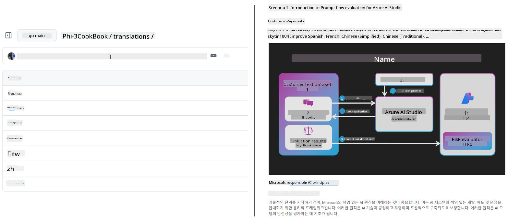
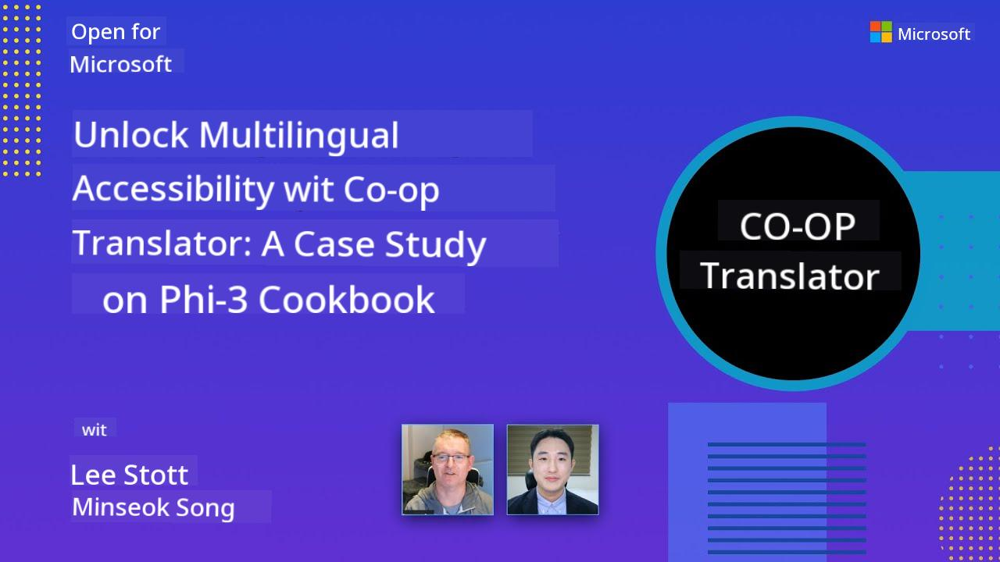

<!--
CO_OP_TRANSLATOR_METADATA:
{
  "original_hash": "1d7514f77c46850bc8a88b732c6ea86b",
  "translation_date": "2025-11-06T17:29:49+00:00",
  "source_file": "README.md",
  "language_code": "pcm"
}
-->
# Co-op Translator

_Easy way wey you fit use automate translation for your educational GitHub content make e dey reach people wey dey different countries._

[](https://pypi.org/project/co-op-translator/)
[](https://github.com/azure/co-op-translator/blob/main/LICENSE)
[](https://pepy.tech/project/co-op-translator)
[](https://pepy.tech/project/co-op-translator)
[](https://github.com/azure/co-op-translator/pkgs/container/co-op-translator)
[](https://github.com/psf/black)

[](https://GitHub.com/azure/co-op-translator/graphs/contributors/)
[](https://GitHub.com/azure/co-op-translator/issues/)
[](https://GitHub.com/azure/co-op-translator/pulls/)
[](http://makeapullrequest.com)

### 🌐 Multi-Language Support

#### Languages wey [Co-op Translator](https://github.com/Azure/Co-op-Translator) dey support

<!-- CO-OP TRANSLATOR LANGUAGES TABLE START -->
[Arabic](../ar/README.md) | [Bengali](../bn/README.md) | [Bulgarian](../bg/README.md) | [Burmese (Myanmar)](../my/README.md) | [Chinese (Simplified)](../zh/README.md) | [Chinese (Traditional, Hong Kong)](../hk/README.md) | [Chinese (Traditional, Macau)](../mo/README.md) | [Chinese (Traditional, Taiwan)](../tw/README.md) | [Croatian](../hr/README.md) | [Czech](../cs/README.md) | [Danish](../da/README.md) | [Dutch](../nl/README.md) | [Estonian](../et/README.md) | [Finnish](../fi/README.md) | [French](../fr/README.md) | [German](../de/README.md) | [Greek](../el/README.md) | [Hebrew](../he/README.md) | [Hindi](../hi/README.md) | [Hungarian](../hu/README.md) | [Indonesian](../id/README.md) | [Italian](../it/README.md) | [Japanese](../ja/README.md) | [Korean](../ko/README.md) | [Lithuanian](../lt/README.md) | [Malay](../ms/README.md) | [Marathi](../mr/README.md) | [Nepali](../ne/README.md) | [Norwegian](../no/README.md) | [Persian (Farsi)](../fa/README.md) | [Polish](../pl/README.md) | [Portuguese (Brazil)](../br/README.md) | [Portuguese (Portugal)](../pt/README.md) | [Punjabi (Gurmukhi)](../pa/README.md) | [Romanian](../ro/README.md) | [Russian](../ru/README.md) | [Serbian (Cyrillic)](../sr/README.md) | [Slovak](../sk/README.md) | [Slovenian](../sl/README.md) | [Spanish](../es/README.md) | [Swahili](../sw/README.md) | [Swedish](../sv/README.md) | [Tagalog (Filipino)](../tl/README.md) | [Tamil](../ta/README.md) | [Thai](../th/README.md) | [Turkish](../tr/README.md) | [Ukrainian](../uk/README.md) | [Urdu](../ur/README.md) | [Vietnamese](../vi/README.md)
<!-- CO-OP TRANSLATOR LANGUAGES TABLE END -->

[](https://GitHub.com/azure/co-op-translator/watchers/)
[](https://GitHub.com/azure/co-op-translator/network/)
[](https://GitHub.com/azure/co-op-translator/stargazers/)

[](https://discord.com/invite/ByRwuEEgH4)
[](https://codespaces.new/azure/co-op-translator)

## Overview

**Co-op Translator** go help you localize your educational GitHub content into plenty languages without wahala.  
Anytime you update your Markdown files, images, or notebooks, translations go dey automatically synchronized, so your content go dey correct and up to date for learners wey dey different parts of the world.

Example of how translated content dey arranged:



## Quick start

```bash
# Create and activate a virtual environment (recommended)
python -m venv .venv
# Windows
.venv\Scripts\activate
# macOS/Linux
source .venv/bin/activate
# Install the package
pip install co-op-translator
# Translate
translate -l "ko ja fr" -md
```
  
Docker:

```bash
# Pull the public image from GHCR
docker pull ghcr.io/azure/co-op-translator:latest
# Run with current folder mounted and .env provided (Bash/Zsh)
docker run --rm -it --env-file .env -v "${PWD}:/work" ghcr.io/azure/co-op-translator:latest -l "ko ja fr" -md
```
  

## Minimal setup

1. Create `.env` file wey use the template: [.env.template](../../.env.template)
2. Configure one LLM provider (Azure OpenAI or OpenAI)
3. (Optional) If you wan translate images (`-img`), configure Azure AI Vision
4. (Recommended) Clear any old translations to avoid wahala (e.g., `translations/`)
5. (Recommended) Add translation section for your README wey use the [README languages template](./getting_started/README_languages_template.md)
6. See: [Set up Azure AI](./getting_started/set-up-azure-ai.md)

## Usage

Translate all supported types:

```bash
translate -l "ko ja"
```
  
Only Markdown:

```bash
translate -l "de" -md
```
  
Markdown + images:

```bash
translate -l "pt" -md -img
```
  
Only notebooks:

```bash
translate -l "zh" -nb
```
  
More flags: [Command reference](./getting_started/command-reference.md)

## Features

- Automated translation for Markdown, notebooks, and images
- E dey keep translations in sync with source changes
- E fit work locally (CLI) or for CI (GitHub Actions)
- E dey use Azure OpenAI or OpenAI; optional Azure AI Vision for images
- E dey preserve Markdown formatting and structure

## Docs

- [Command-line guide](./getting_started/command-line-guide/command-line-guide.md)
- [GitHub Actions guide (Public repositories & standard secrets)](./getting_started/github-actions-guide/github-actions-guide-public.md)
- [GitHub Actions guide (Microsoft organization repositories & org-level setups)](./getting_started/github-actions-guide/github-actions-guide-org.md)
- [README languages template](./getting_started/README_languages_template.md)
- [Supported languages](./getting_started/supported-languages.md)
- [Contributing](./CONTRIBUTING.md)
- [Troubleshooting](./getting_started/troubleshooting.md)

### Microsoft-specific guide
> [!NOTE]  
> For maintainers of the Microsoft “For Beginners” repositories only.

- [Updating the “other courses” list (for MS Beginners repositories only)](./getting_started/update-other-courses.md)

## Support us and foster global learning

Join us make we change how educational content dey shared globally! Give [Co-op Translator](https://github.com/azure/co-op-translator) ⭐ for GitHub and support our mission to break language barriers for learning and technology. Your interest and contributions dey make big difference! We dey welcome code contributions and feature suggestions.

### Check Microsoft educational content for your language

- [AZD for Beginners](https://github.com/microsoft/AZD-for-beginners)
- [Edge AI for Beginners](https://github.com/microsoft/edgeai-for-beginners)
- [Model Context Protocol (MCP) For Beginners](https://github.com/microsoft/mcp-for-beginners)
- [AI Agents for Beginners](https://github.com/microsoft/ai-agents-for-beginners)
- [Generative AI for Beginners using .NET](https://github.com/microsoft/Generative-AI-for-beginners-dotnet)
- [Generative AI for Beginners](https://github.com/microsoft/generative-ai-for-beginners)
- [Generative AI for Beginners using Java](https://github.com/microsoft/generative-ai-for-beginners-java)
- [ML for Beginners](https://aka.ms/ml-beginners)
- [Data Science for Beginners](https://aka.ms/datascience-beginners)
- [AI for Beginners](https://aka.ms/ai-beginners)
- [Cybersecurity for Beginners](https://github.com/microsoft/Security-101)
- [Web Dev for Beginners](https://aka.ms/webdev-beginners)
- [IoT for Beginners](https://aka.ms/iot-beginners)
- [PhiCookBook](https://github.com/microsoft/PhiCookBook)

## Video presentations

👉 Click the image below to watch for YouTube.

- **Open at Microsoft**: Small 18-minute introduction and quick guide on how to use Co-op Translator.

  [](https://www.youtube.com/watch?v=jX_swfH_KNU)

## Contributing

This project dey welcome contributions and suggestions. If you wan contribute to Azure Co-op Translator, abeg check our [CONTRIBUTING.md](./CONTRIBUTING.md) for guidelines on how you fit help make Co-op Translator more accessible.

## Contributors

[](https://github.com/Azure/co-op-translator/graphs/contributors)

## Code of Conduct

This project don adopt the [Microsoft Open Source Code of Conduct](https://opensource.microsoft.com/codeofconduct/).  
For more info, check the [Code of Conduct FAQ](https://opensource.microsoft.com/codeofconduct/faq/) or  
contact [opencode@microsoft.com](mailto:opencode@microsoft.com) if you get any extra questions or comments.

## Responsible AI

Microsoft dey committed to help our customers use our AI products responsibly, share our learnings, and build trust-based partnerships through tools like Transparency Notes and Impact Assessments. Plenty of these resources dey for [https://aka.ms/RAI](https://aka.ms/RAI).  
Microsoft's way of doing responsible AI dey based on our AI principles of fairness, reliability and safety, privacy and security, inclusiveness, transparency, and accountability.

Big natural language, image, and speech models - like the ones wey this sample dey use - fit behave in ways wey no fair, no reliable, or offensive, and e fit cause harm. Abeg check the [Azure OpenAI service Transparency note](https://learn.microsoft.com/legal/cognitive-services/openai/transparency-note?tabs=text) make you sabi the risks and limitations.
Di beta way to take reduce dis kain risk na to add safety system for your architecture wey fit detect and stop harmful behavior. [Azure AI Content Safety](https://learn.microsoft.com/azure/ai-services/content-safety/overview) dey provide one extra layer of protection wey fit detect harmful content wey user or AI generate for apps and services. Azure AI Content Safety get text and image APIs wey go help you find harmful material. Dem still get one interactive Content Safety Studio wey you fit use check, explore, and test sample code to detect harmful content for different formats. Dis [quickstart documentation](https://learn.microsoft.com/azure/ai-services/content-safety/quickstart-text?tabs=visual-studio%2Clinux&pivots=programming-language-rest) go guide you on how to make requests to di service.

Another thing wey you suppose consider na di overall performance of di application. For multi-modal and multi-models applications, performance mean say di system go dey work as you and your users expect, including say e no go dey produce harmful outputs. E dey important to check how your application dey perform overall by using [generation quality and risk and safety metrics](https://learn.microsoft.com/azure/ai-studio/concepts/evaluation-metrics-built-in).

You fit test your AI application for your development environment by using di [prompt flow SDK](https://microsoft.github.io/promptflow/index.html). Whether na test dataset or target, di generative AI application go dey measured quantitatively with built-in evaluators or custom evaluators wey you choose. To start with di prompt flow SDK to test your system, you fit follow dis [quickstart guide](https://learn.microsoft.com/azure/ai-studio/how-to/develop/flow-evaluate-sdk). Once you run di evaluation, you fit [see di results for Azure AI Studio](https://learn.microsoft.com/azure/ai-studio/how-to/evaluate-flow-results).

## Trademarks

Dis project fit get trademarks or logos for projects, products, or services. If you wan use Microsoft trademarks or logos, you gatz follow [Microsoft's Trademark & Brand Guidelines](https://www.microsoft.com/en-us/legal/intellectualproperty/trademarks/usage/general). If you wan use Microsoft trademarks or logos for modified versions of dis project, e no suppose cause confusion or make e look like say Microsoft dey sponsor am. Any use of third-party trademarks or logos gatz follow di policies of di third-party.

## Getting Help

If you jam wahala or you get any question about how to build AI apps, join:

[](https://aka.ms/foundry/discord)

If you get product feedback or you dey see error while you dey build, visit:

[](https://aka.ms/foundry/forum)

---

**Disclaimer**:  
Dis dokyument don translate wit AI translation service [Co-op Translator](https://github.com/Azure/co-op-translator). Even as we dey try make am accurate, abeg sabi say automated translations fit get mistake or no dey correct well. Di original dokyument for di native language na di main source wey you go trust. For important information, e better make professional human translation dey use. We no go fit take blame for any misunderstanding or wrong interpretation wey fit happen because you use dis translation.