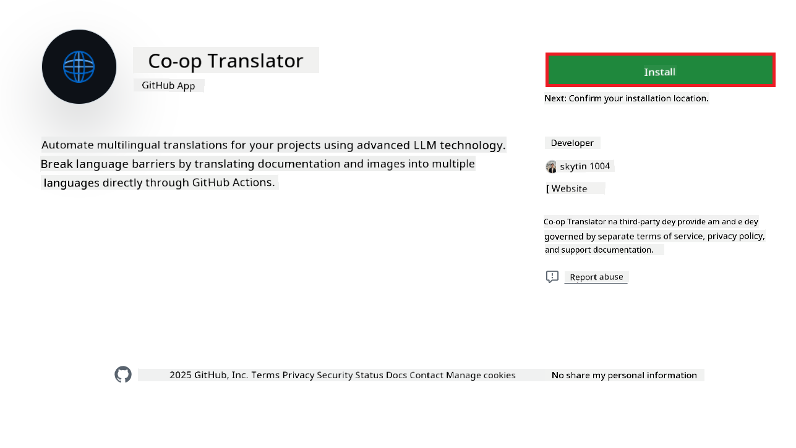
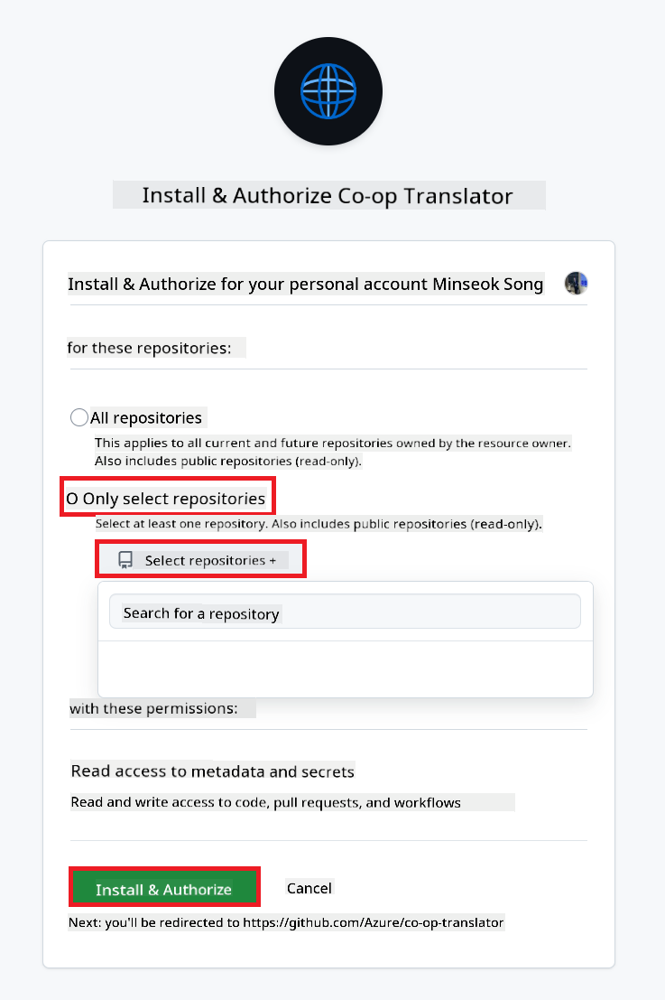
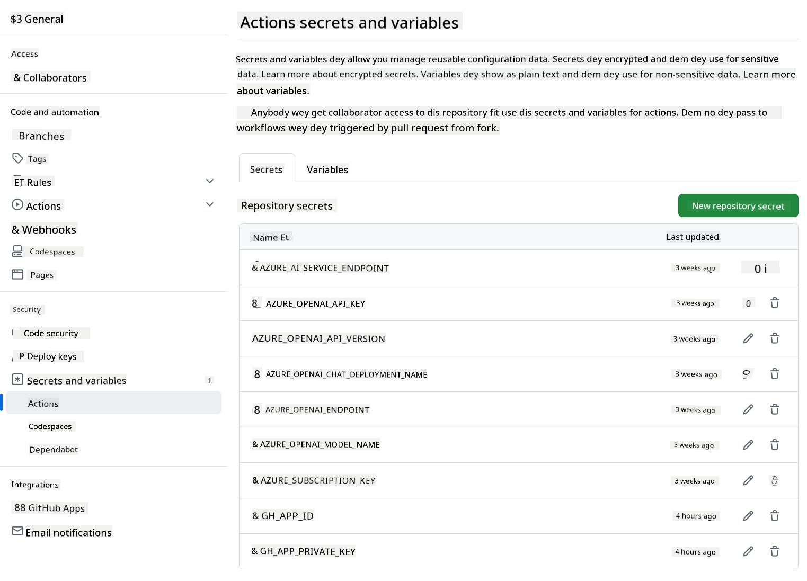

<!--
CO_OP_TRANSLATOR_METADATA:
{
  "original_hash": "9fac847815936ef6e6c8bfde6d191571",
  "translation_date": "2025-11-06T17:32:13+00:00",
  "source_file": "getting_started/github-actions-guide/github-actions-guide-org.md",
  "language_code": "pcm"
}
-->
# How to Use Co-op Translator GitHub Action (Guide for Organization)

**Who fit use dis guide:** Dis guide na for **Microsoft internal users** or **teams wey get access to di credentials wey dem need for di pre-built Co-op Translator GitHub App** or fit create dia own custom GitHub App.

You fit use Co-op Translator GitHub Action to make di translation of your repository documentation easy. Dis guide go show you how you fit set up di action to dey automatically create pull requests wey go get updated translations anytime your source Markdown files or images change.

> [!IMPORTANT]
> 
> **Choose di Correct Guide:**
>
> Dis guide dey explain how to set up di action using **GitHub App ID and Private Key**. You go need dis "Organization Guide" method if: **`GITHUB_TOKEN` Permissions dey Restricted:** If your organization or repository settings no allow di default permissions wey di standard `GITHUB_TOKEN` get. For example, if di `GITHUB_TOKEN` no get di necessary `write` permissions (like `contents: write` or `pull-requests: write`), di workflow wey dey di [Public Setup Guide](./github-actions-guide-public.md) go fail because e no get enough permissions. Using dedicated GitHub App wey get di permissions wey you need go solve dis problem.
>
> **If di above no concern you:**
>
> If di standard `GITHUB_TOKEN` get enough permissions for your repository (like say you no dey blocked by organizational restrictions), abeg use di **[Public Setup Guide using GITHUB_TOKEN](./github-actions-guide-public.md)**. Di public guide no need make you dey manage App IDs or Private Keys, e dey use only di standard `GITHUB_TOKEN` and repository permissions.

## Wetin You Need Before You Start

Before you configure di GitHub Action, make sure say you don get di AI service credentials wey you need.

**1. Wetin You Need: AI Language Model Credentials**
You go need credentials for at least one Language Model wey dem support:

- **Azure OpenAI**: You go need Endpoint, API Key, Model/Deployment Names, API Version.
- **OpenAI**: You go need API Key, (Optional: Org ID, Base URL, Model ID).
- Check [Supported Models and Services](../../../../README.md) for more details.
- Setup Guide: [Set up Azure OpenAI](../set-up-resources/set-up-azure-openai.md).

**2. Optional: Computer Vision Credentials (for Image Translation)**

- You go need am only if you wan translate text wey dey inside images.
- **Azure Computer Vision**: You go need Endpoint and Subscription Key.
- If you no provide am, di action go default to [Markdown-only mode](../markdown-only-mode.md).
- Setup Guide: [Set up Azure Computer Vision](../set-up-resources/set-up-azure-computer-vision.md).

## How to Set Up and Configure

Follow dis steps to configure di Co-op Translator GitHub Action for your repository:

### Step 1: Install and Configure GitHub App Authentication

Di workflow dey use GitHub App authentication to interact with your repository (like create pull requests) on your behalf. Choose one option:

#### **Option A: Install di Pre-built Co-op Translator GitHub App (for Microsoft Internal Use)**

1. Go di [Co-op Translator GitHub App](https://github.com/apps/co-op-translator) page.

1. Select **Install** and choose di account or organization wey your target repository dey.

    

1. Choose **Only select repositories** and select your target repository (like `PhiCookBook`). Click **Install**. Dem fit ask you to authenticate.

    

1. **Get App Credentials (Internal Process Required):** To make di workflow authenticate as di app, you go need two things wey di Co-op Translator team go provide:
  - **App ID:** Di unique identifier for di Co-op Translator app. Di App ID na: `1164076`.
  - **Private Key:** You go need di **full content** of di `.pem` private key file wey you go collect from di maintainer contact. **Keep dis key secure like password.**

1. Move to Step 2.

#### **Option B: Use Your Own Custom GitHub App**

- If you wan create your own GitHub App, make sure say e get Read & write access to Contents and Pull requests. You go need di App ID and di Private Key wey e generate.

### Step 2: Configure Repository Secrets

You go need to add di GitHub App credentials and your AI service credentials as encrypted secrets for your repository settings.

1. Go your target GitHub repository (like `PhiCookBook`).

1. Go **Settings** > **Secrets and variables** > **Actions**.

1. Under **Repository secrets**, click **New repository secret** for each secret wey dem list below.

   

**Required Secrets (for GitHub App Authentication):**

| Secret Name          | Description                                      | Value Source                                     |
| :------------------- | :----------------------------------------------- | :----------------------------------------------- |
| `GH_APP_ID`          | Di App ID of di GitHub App (from Step 1).        | GitHub App Settings                              |
| `GH_APP_PRIVATE_KEY` | Di **full content** of di downloaded `.pem` file. | `.pem` file (from Step 1)                      |

**AI Service Secrets (Add ALL wey apply based on wetin you need):**

| Secret Name                         | Description                               | Value Source                     |
| :---------------------------------- | :---------------------------------------- | :------------------------------- |
| `AZURE_AI_SERVICE_API_KEY`            | Key for Azure AI Service (Computer Vision)  | Azure AI Foundry                    |
| `AZURE_AI_SERVICE_ENDPOINT`         | Endpoint for Azure AI Service (Computer Vision) | Azure AI Foundry                     |
| `AZURE_OPENAI_API_KEY`              | Key for Azure OpenAI service              | Azure AI Foundry                     |
| `AZURE_OPENAI_ENDPOINT`             | Endpoint for Azure OpenAI service         | Azure AI Foundry                     |
| `AZURE_OPENAI_MODEL_NAME`           | Your Azure OpenAI Model Name              | Azure AI Foundry                     |
| `AZURE_OPENAI_CHAT_DEPLOYMENT_NAME` | Your Azure OpenAI Deployment Name         | Azure AI Foundry                     |
| `AZURE_OPENAI_API_VERSION`          | API Version for Azure OpenAI              | Azure AI Foundry                     |
| `OPENAI_API_KEY`                    | API Key for OpenAI                        | OpenAI Platform                  |
| `OPENAI_ORG_ID`                     | OpenAI Organization ID                    | OpenAI Platform                  |
| `OPENAI_CHAT_MODEL_ID`              | Specific OpenAI model ID                  | OpenAI Platform                    |
| `OPENAI_BASE_URL`                   | Custom OpenAI API Base URL                | OpenAI Platform                    |



### Step 3: Create di Workflow File

Finally, create di YAML file wey go define di automated workflow.

1. For di root directory of your repository, create di `.github/workflows/` directory if e no dey.

1. Inside `.github/workflows/`, create file wey dem go call `co-op-translator.yml`.

1. Paste di following content inside co-op-translator.yml.

```
name: Co-op Translator

on:
  push:
    branches:
      - main

jobs:
  co-op-translator:
    runs-on: ubuntu-latest

    permissions:
      contents: write
      pull-requests: write

    steps:
      - name: Checkout repository
        uses: actions/checkout@v4
        with:
          fetch-depth: 0

      - name: Set up Python
        uses: actions/setup-python@v4
        with:
          python-version: '3.10'

      - name: Install Co-op Translator
        run: |
          python -m pip install --upgrade pip
          pip install co-op-translator

      - name: Run Co-op Translator
        env:
          PYTHONIOENCODING: utf-8
          # Azure AI Service Credentials
          AZURE_AI_SERVICE_API_KEY: ${{ secrets.AZURE_AI_SERVICE_API_KEY }}
          AZURE_AI_SERVICE_ENDPOINT: ${{ secrets.AZURE_AI_SERVICE_ENDPOINT }}

          # Azure OpenAI Credentials
          AZURE_OPENAI_API_KEY: ${{ secrets.AZURE_OPENAI_API_KEY }}
          AZURE_OPENAI_ENDPOINT: ${{ secrets.AZURE_OPENAI_ENDPOINT }}
          AZURE_OPENAI_MODEL_NAME: ${{ secrets.AZURE_OPENAI_MODEL_NAME }}
          AZURE_OPENAI_CHAT_DEPLOYMENT_NAME: ${{ secrets.AZURE_OPENAI_CHAT_DEPLOYMENT_NAME }}
          AZURE_OPENAI_API_VERSION: ${{ secrets.AZURE_OPENAI_API_VERSION }}

          # OpenAI Credentials
          OPENAI_API_KEY: ${{ secrets.OPENAI_API_KEY }}
          OPENAI_ORG_ID: ${{ secrets.OPENAI_ORG_ID }}
          OPENAI_CHAT_MODEL_ID: ${{ secrets.OPENAI_CHAT_MODEL_ID }}
          OPENAI_BASE_URL: ${{ secrets.OPENAI_BASE_URL }}
        run: |
          # =====================================================================
          # IMPORTANT: Set your target languages here (REQUIRED CONFIGURATION)
          # =====================================================================
          # Example: Translate to Spanish, French, German. Add -y to auto-confirm.
          translate -l "es fr de" -y  # <--- MODIFY THIS LINE with your desired languages

      - name: Authenticate GitHub App
        id: generate_token
        uses: tibdex/github-app-token@v1
        with:
          app_id: ${{ secrets.GH_APP_ID }}
          private_key: ${{ secrets.GH_APP_PRIVATE_KEY }}

      - name: Create Pull Request with translations
        uses: peter-evans/create-pull-request@v5
        with:
          token: ${{ steps.generate_token.outputs.token }}
          commit-message: "🌐 Update translations via Co-op Translator"
          title: "🌐 Update translations via Co-op Translator"
          body: |
            This PR updates translations for recent changes to the main branch.

            ### 📋 Changes included
            - Translated contents are available in the `translations/` directory
            - Translated images are available in the `translated_images/` directory

            ---
            🌐 Automatically generated by the [Co-op Translator](https://github.com/Azure/co-op-translator) GitHub Action.
          branch: update-translations
          base: main
          labels: translation, automated-pr
          delete-branch: true
          add-paths: |
            translations/
            translated_images/

```

4.  **Customize di Workflow:**
  - **[!IMPORTANT] Target Languages:** For di `Run Co-op Translator` step, you **MUST review and change di list of language codes** inside di `translate -l "..." -y` command to match wetin your project need. Di example list (`ar de es...`) go need make you replace or adjust am.
  - **Trigger (`on:`):** Di current trigger dey run anytime dem push to `main`. For big repositories, you fit add `paths:` filter (check di commented example for di YAML) to make di workflow run only when di files wey matter (like source documentation) change, e go save runner minutes.
  - **PR Details:** Change di `commit-message`, `title`, `body`, `branch` name, and `labels` for di `Create Pull Request` step if you need.

## How to Manage and Renew Credentials

- **Security:** Always keep sensitive credentials (API keys, private keys) as GitHub Actions secrets. No ever expose dem for your workflow file or repository code.
- **[!IMPORTANT] Key Renewal (Internal Microsoft Users):** Know say Azure OpenAI key wey Microsoft dey use fit get mandatory renewal policy (like every 5 months). Make sure say you dey update di GitHub secrets (`AZURE_OPENAI_...` keys) **before dem expire** to avoid workflow failure.

## How di Workflow dey Run

> [!WARNING]  
> **GitHub-hosted Runner Time Limit:**  
> GitHub-hosted runners like `ubuntu-latest` get **maximum execution time limit of 6 hours**.  
> For big documentation repositories, if di translation process pass 6 hours, di workflow go stop automatically.  
> To avoid dis, you fit:  
> - Use **self-hosted runner** (no time limit)  
> - Reduce di number of target languages per run

Once di `co-op-translator.yml` file don enter your main branch (or di branch wey di `on:` trigger specify), di workflow go dey automatically run anytime changes dey pushed to dat branch (and match di `paths` filter, if you configure am).

If translations dey generated or updated, di action go automatically create Pull Request wey go get di changes, ready for you to review and merge.

---

**Disclaimer**:  
Dis dokyument don use AI translation service [Co-op Translator](https://github.com/Azure/co-op-translator) do di translation. Even as we dey try make am accurate, abeg sabi say automated translations fit get mistake or no dey correct well. Di original dokyument wey dey for im native language na di main source wey you go trust. For important information, e better make professional human translation dey use. We no go fit take blame for any misunderstanding or wrong interpretation wey fit happen because you use dis translation.