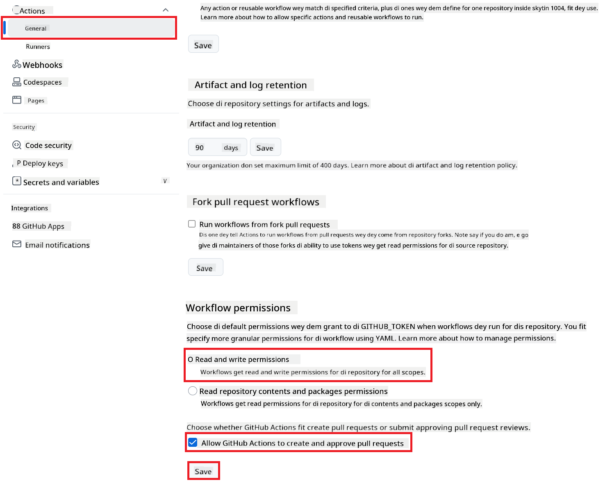

<!--
CO_OP_TRANSLATOR_METADATA:
{
  "original_hash": "527ca4d0a8d3f51087ec3317279e36ee",
  "translation_date": "2025-11-06T17:32:31+00:00",
  "source_file": "getting_started/github-actions-guide/github-actions-guide-public.md",
  "language_code": "pcm"
}
-->
# How to Use Co-op Translator GitHub Action (Public Setup)

**Who fit use am:** Dis guide na for people wey dey use public or private repositories wey GitHub Actions permissions dey okay. E dey use di built-in `GITHUB_TOKEN`.

Make e easy to translate di documentation for your repository automatically wit di Co-op Translator GitHub Action. Dis guide go show you how to set am up so e go dey create pull requests wit updated translations anytime your source Markdown files or images change.

> [!IMPORTANT]
>
> **Choose di Correct Guide:**
>
> Dis guide na di **simple setup wey dey use di standard `GITHUB_TOKEN`**. Na di recommended method for most people because e no need make you dey manage sensitive GitHub App Private Keys.
>

## Wetin You Need Before You Start

Before you go fit configure di GitHub Action, make sure say you don get di AI service credentials wey you need.

**1. Wetin You Must Get: AI Language Model Credentials**
You go need credentials for at least one Language Model wey dem support:

- **Azure OpenAI**: You go need Endpoint, API Key, Model/Deployment Names, API Version.
- **OpenAI**: You go need API Key, (Optional: Org ID, Base URL, Model ID).
- Check [Supported Models and Services](../../../../README.md) for more details.

**2. Optional: AI Vision Credentials (for Image Translation)**

- You go need am only if you wan translate text wey dey inside images.
- **Azure AI Vision**: You go need Endpoint and Subscription Key.
- If you no provide am, di action go default to [Markdown-only mode](../markdown-only-mode.md).

## How to Set Up and Configure Am

Follow dis steps to configure di Co-op Translator GitHub Action for your repository wey dey use di standard `GITHUB_TOKEN`.

### Step 1: Understand Authentication (Using `GITHUB_TOKEN`)

Dis workflow dey use di built-in `GITHUB_TOKEN` wey GitHub Actions dey provide. Dis token dey automatically give di workflow permission to interact wit your repository based on di settings wey you go configure for **Step 3**.

### Step 2: Configure Repository Secrets

You only need to add your **AI service credentials** as encrypted secrets for your repository settings.

1.  Go your GitHub repository wey you wan use.
2.  Go **Settings** > **Secrets and variables** > **Actions**.
3.  Under **Repository secrets**, click **New repository secret** for each AI service secret wey you need.

     *(Image Reference: E dey show where you go add secrets)*

**AI Service Secrets We You Need (Add ALL wey dey apply based on wetin you need):**

| Secret Name                         | Wetin E Be                               | Where You Go Get Am                     |
| :---------------------------------- | :---------------------------------------- | :------------------------------- |
| `AZURE_AI_SERVICE_API_KEY`            | Key for Azure AI Service (Computer Vision)  | Your Azure AI Foundry               |
| `AZURE_AI_SERVICE_ENDPOINT`         | Endpoint for Azure AI Service (Computer Vision) | Your Azure AI Foundry               |
| `AZURE_OPENAI_API_KEY`              | Key for Azure OpenAI service              | Your Azure AI Foundry               |
| `AZURE_OPENAI_ENDPOINT`             | Endpoint for Azure OpenAI service         | Your Azure AI Foundry               |
| `AZURE_OPENAI_MODEL_NAME`           | Your Azure OpenAI Model Name              | Your Azure AI Foundry               |
| `AZURE_OPENAI_CHAT_DEPLOYMENT_NAME` | Your Azure OpenAI Deployment Name         | Your Azure AI Foundry               |
| `AZURE_OPENAI_API_VERSION`          | API Version for Azure OpenAI              | Your Azure AI Foundry               |
| `OPENAI_API_KEY`                    | API Key for OpenAI                        | Your OpenAI Platform              |
| `OPENAI_ORG_ID`                     | OpenAI Organization ID (Optional)         | Your OpenAI Platform              |
| `OPENAI_CHAT_MODEL_ID`              | Specific OpenAI model ID (Optional)       | Your OpenAI Platform              |
| `OPENAI_BASE_URL`                   | Custom OpenAI API Base URL (Optional)     | Your OpenAI Platform              |

### Step 3: Configure Workflow Permissions

Di GitHub Action go need permissions wey di `GITHUB_TOKEN` go give am to check out code and create pull requests.

1.  For your repository, go **Settings** > **Actions** > **General**.
2.  Scroll go di **Workflow permissions** section.
3.  Select **Read and write permissions**. Dis one go give di `GITHUB_TOKEN` di `contents: write` and `pull-requests: write` permissions wey di workflow need.
4.  Make sure say di checkbox for **Allow GitHub Actions to create and approve pull requests** dey **checked**.
5.  Click **Save**.



### Step 4: Create di Workflow File

Finally, create di YAML file wey go define di automated workflow wey dey use `GITHUB_TOKEN`.

1.  For di root directory of your repository, create di `.github/workflows/` directory if e no dey already.
2.  Inside `.github/workflows/`, create one file wey dem go call `co-op-translator.yml`.
3.  Copy di content below put for `co-op-translator.yml`.

```yaml
name: Co-op Translator

on:
  push:
    branches:
      - main

jobs:
  co-op-translator:
    runs-on: ubuntu-latest

    permissions:
      contents: write
      pull-requests: write

    steps:
      - name: Checkout repository
        uses: actions/checkout@v4
        with:
          fetch-depth: 0

      - name: Set up Python
        uses: actions/setup-python@v4
        with:
          python-version: '3.10'

      - name: Install Co-op Translator
        run: |
          python -m pip install --upgrade pip
          pip install co-op-translator

      - name: Run Co-op Translator
        env:
          PYTHONIOENCODING: utf-8
          # === AI Service Credentials ===
          AZURE_AI_SERVICE_API_KEY: ${{ secrets.AZURE_AI_SERVICE_API_KEY }}
          AZURE_AI_SERVICE_ENDPOINT: ${{ secrets.AZURE_AI_SERVICE_ENDPOINT }}
          AZURE_OPENAI_API_KEY: ${{ secrets.AZURE_OPENAI_API_KEY }}
          AZURE_OPENAI_ENDPOINT: ${{ secrets.AZURE_OPENAI_ENDPOINT }}
          AZURE_OPENAI_MODEL_NAME: ${{ secrets.AZURE_OPENAI_MODEL_NAME }}
          AZURE_OPENAI_CHAT_DEPLOYMENT_NAME: ${{ secrets.AZURE_OPENAI_CHAT_DEPLOYMENT_NAME }}
          AZURE_OPENAI_API_VERSION: ${{ secrets.AZURE_OPENAI_API_VERSION }}
          OPENAI_API_KEY: ${{ secrets.OPENAI_API_KEY }}
          OPENAI_ORG_ID: ${{ secrets.OPENAI_ORG_ID }}
          OPENAI_CHAT_MODEL_ID: ${{ secrets.OPENAI_CHAT_MODEL_ID }}
          OPENAI_BASE_URL: ${{ secrets.OPENAI_BASE_URL }}
        run: |
          # =====================================================================
          # IMPORTANT: Set your target languages here (REQUIRED CONFIGURATION)
          # =====================================================================
          # Example: Translate to Spanish, French, German. Add -y to auto-confirm.
          translate -l "es fr de" -y  # <--- MODIFY THIS LINE with your desired languages

      - name: Create Pull Request with translations
        uses: peter-evans/create-pull-request@v5
        with:
          token: ${{ secrets.GITHUB_TOKEN }}
          commit-message: "🌐 Update translations via Co-op Translator"
          title: "🌐 Update translations via Co-op Translator"
          body: |
            This PR updates translations for recent changes to the main branch.

            ### 📋 Changes included
            - Translated contents are available in the `translations/` directory
            - Translated images are available in the `translated_images/` directory

            ---
            🌐 Automatically generated by the [Co-op Translator](https://github.com/Azure/co-op-translator) GitHub Action.
          branch: update-translations
          base: main
          labels: translation, automated-pr
          delete-branch: true
          add-paths: |
            translations/
            translated_images/
```
4.  **Customize di Workflow:**
  - **[!IMPORTANT] Target Languages:** For di `Run Co-op Translator` step, you **MUST check and change di list of language codes** inside di `translate -l "..." -y` command to match wetin your project need. Di example list (`ar de es...`) go need make you change am.
  - **Trigger (`on:`):** Di current trigger dey run anytime dem push something to `main`. For big repositories, you fit add one `paths:` filter (check di commented example for di YAML) to make di workflow run only when di files wey matter (like source documentation) change, e go help save runner minutes.
  - **PR Details:** Change di `commit-message`, `title`, `body`, `branch` name, and `labels` for di `Create Pull Request` step if you need am.

## How to Run di Workflow

> [!WARNING]  
> **GitHub-hosted Runner Time Limit:**  
> GitHub-hosted runners like `ubuntu-latest` get **maximum execution time limit of 6 hours**.  
> For big documentation repositories, if di translation process pass 6 hours, di workflow go stop automatically.  
> To avoid dis one, you fit:  
> - Use **self-hosted runner** (e no get time limit)  
> - Reduce di number of target languages wey you wan run at once

Once di `co-op-translator.yml` file don enter your main branch (or di branch wey you set for di `on:` trigger), di workflow go dey run automatically anytime changes dey push to dat branch (and e match di `paths` filter, if you configure am).

---

**Disclaimer**:  
Dis dokyument don use AI translet service [Co-op Translator](https://github.com/Azure/co-op-translator) do di translet. Even as we dey try make am correct, abeg make you sabi say machine translet fit get mistake or no dey accurate well. Di original dokyument wey dey for im native language na di one wey you go take as di correct source. For important informate, e good make you use professional human translet. We no go fit take blame for any misunderstanding or wrong interpretation wey fit happen because you use dis translet.