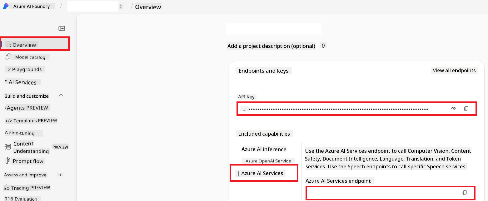

<!--
CO_OP_TRANSLATOR_METADATA:
{
  "original_hash": "b58d7c3cb4210697a073d20eb3064945",
  "translation_date": "2025-11-06T17:30:49+00:00",
  "source_file": "getting_started/set-up-azure-ai.md",
  "language_code": "pcm"
}
-->
# Set Up Azure AI for Co-op Translator (Azure OpneAI & Azure AI Vision)

Dis guide go show you how you fit set up Azure OpenAI for language translation and Azure Computer Vision for image content analysis (wey fit help for image-based translation) inside Azure AI Foundry.

**Prerequisites:**
- You go need Azure account wey get active subscription.
- You go need permission wey go allow you create resources and deployments for your Azure subscription.

## Create Azure AI Project

You go first create Azure AI Project, wey go act like central place to manage your AI resources.

1. Go [https://ai.azure.com](https://ai.azure.com) and sign in with your Azure account.

1. Select **+Create** to create new project.

1. Do dis steps:
   - Put **Project name** (e.g., `CoopTranslator-Project`).
   - Select **AI hub** (e.g., `CoopTranslator-Hub`) (Create new one if e no dey).

1. Click "**Review and Create**" to set up your project. Dem go carry you go your project overview page.

## Set up Azure OpenAI for Language Translation

Inside your project, you go deploy Azure OpenAI model wey go work as backend for text translation.

### Navigate to Your Project

If you no dey there already, open the new project wey you create (e.g., `CoopTranslator-Project`) inside Azure AI Foundry.

### Deploy OpenAI Model

1. From your project left-hand menu, under "My assets", select "**Models + endpoints**".

1. Select **+ Deploy model**.

1. Select **Deploy Base Model**.

1. Dem go show you list of available models. Use filter or search find better GPT model. We recommend `gpt-4o`.

1. Select the model wey you want and click **Confirm**.

1. Select **Deploy**.

### Azure OpenAI configuration

After you don deploy am, you fit select the deployment from "**Models + endpoints**" page to see **REST endpoint URL**, **Key**, **Deployment name**, **Model name** and **API version**. You go need all dis ones to connect the translation model to your application.

> [!NOTE]
> You fit select API versions from [API version deprecation](https://learn.microsoft.com/azure/ai-services/openai/api-version-deprecation) page based on wetin you need. Make sure say you sabi say **API version** dey different from **Model version** wey dey show for **Models + endpoints** page inside Azure AI Foundry.

## Set up Azure Computer Vision for Image Translation

To make am possible to translate text wey dey inside images, you go need find Azure AI Service API Key and Endpoint.

1. Go your Azure AI Project (e.g., `CoopTranslator-Project`). Make sure say you dey for project overview page.

### Azure AI Service configuration

Find the API Key and Endpoint from Azure AI Service.

1. Go your Azure AI Project (e.g., `CoopTranslator-Project`). Make sure say you dey for project overview page.

1. Find **API Key** and **Endpoint** from Azure AI Service tab.

    

Dis connection go make the features of the linked Azure AI Services resource (including image analysis) dey available for your AI Foundry project. You fit use dis connection for your notebooks or applications to extract text from images, wey you fit later send go Azure OpenAI model for translation.

## Consolidating Your Credentials

By now, you suppose don gather dis ones:

**For Azure OpenAI (Text Translation):**
- Azure OpenAI Endpoint
- Azure OpenAI API Key
- Azure OpenAI Model Name (e.g., `gpt-4o`)
- Azure OpenAI Deployment Name (e.g., `cooptranslator-gpt4o`)
- Azure OpenAI API Version

**For Azure AI Services (Image Text Extraction via Vision):**
- Azure AI Service Endpoint
- Azure AI Service API Key

### Example: Environment Variable Configuration (Preview)

Later, when you dey build your application, you go likely configure am using dis credentials wey you gather. For example, you fit set dem as environment variables like dis:

```bash
# Azure AI Service Credentials (Required for image translation)
AZURE_AI_SERVICE_API_KEY="your_azure_ai_service_api_key" # e.g., 21xasd...
AZURE_AI_SERVICE_ENDPOINT="https://your_azure_ai_service_endpoint.cognitiveservices.azure.com/"

# Azure OpenAI Credentials (Required for text translation)
AZURE_OPENAI_API_KEY="your_azure_openai_api_key" # e.g., 21xasd...
AZURE_OPENAI_ENDPOINT="https://your_azure_openai_endpoint.openai.azure.com/"
AZURE_OPENAI_MODEL_NAME="your_model_name" # e.g., gpt-4o
AZURE_OPENAI_CHAT_DEPLOYMENT_NAME="your_deployment_name" # e.g., cooptranslator-gpt4o
AZURE_OPENAI_API_VERSION="your_api_version" # e.g., 2024-12-01-preview
```

---

### Further Reading

- [How to Create a project in Azure AI Foundry](https://learn.microsoft.com/azure/ai-foundry/how-to/create-projects?tabs=ai-studio)
- [How to Create Azure AI resources](https://learn.microsoft.com/azure/ai-foundry/how-to/create-azure-ai-resource?tabs=portal)
- [How to Deploy OpenAI models in Azure AI Foundry](https://learn.microsoft.com/en-us/azure/ai-foundry/how-to/deploy-models-openai)

---

**Disclaimer**:  
Dis dokyument don use AI translet service [Co-op Translator](https://github.com/Azure/co-op-translator) do di translet. Even as we dey try make am correct, abeg make you sabi say AI translet fit get mistake or no dey accurate well. Di original dokyument for im native language na di one wey you go take as di correct source. For important mata, e good make you use professional human translet. We no go fit take blame for any misunderstanding or wrong interpretation wey fit happen because you use dis translet.