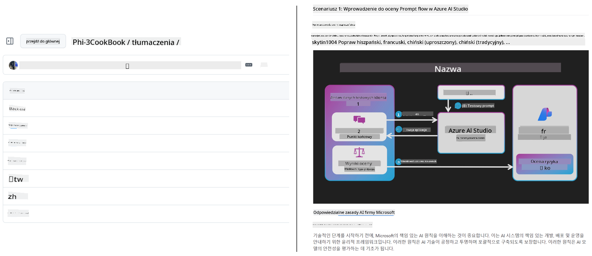
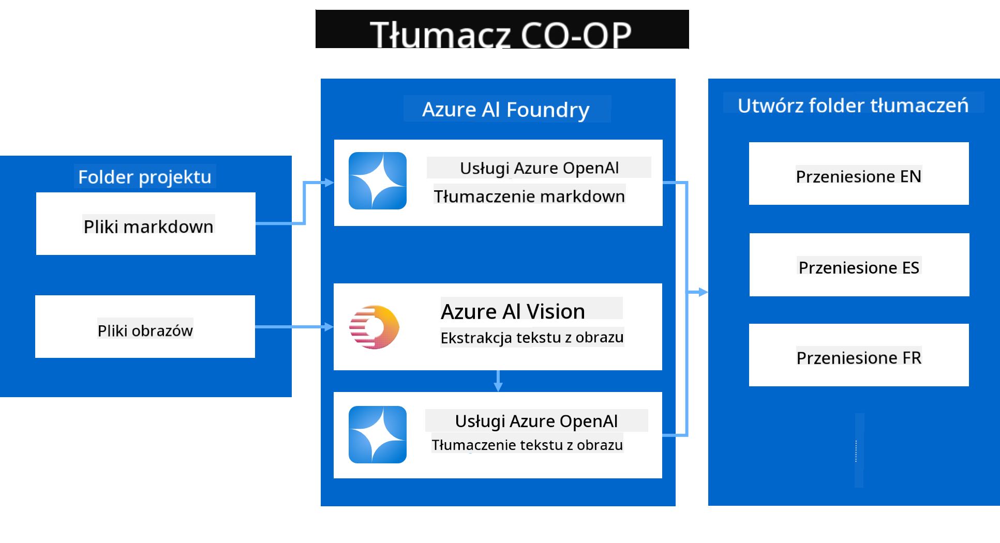
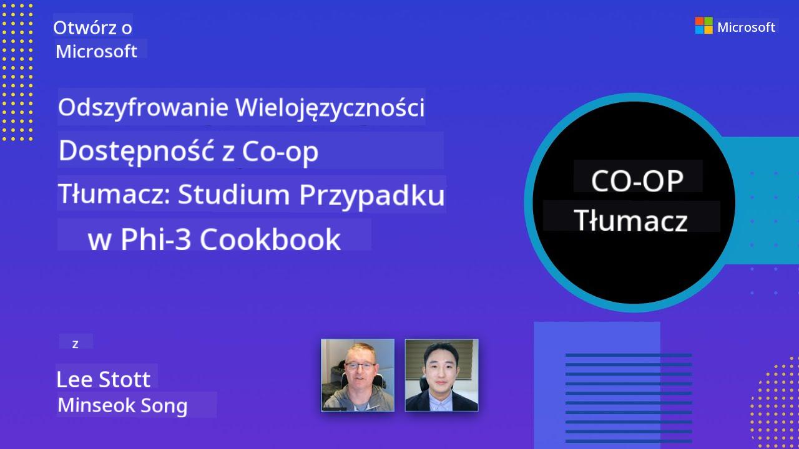

<!--
CO_OP_TRANSLATOR_METADATA:
{
  "original_hash": "044724537b57868117aadae8e7728c7c",
  "translation_date": "2025-06-12T10:21:48+00:00",
  "source_file": "README.md",
  "language_code": "pl"
}
-->


# Co-op Translator: Automatyzuj tłumaczenie dokumentacji edukacyjnej bez wysiłku

_Łatwo automatyzuj tłumaczenie swojej dokumentacji na wiele języków, aby dotrzeć do globalnej publiczności._

[](https://pypi.org/project/co-op-translator/)
[](https://github.com/azure/co-op-translator/blob/main/LICENSE)
[](https://pepy.tech/project/co-op-translator)
[](https://pepy.tech/project/co-op-translator)
[](https://github.com/psf/black)

[](https://GitHub.com/azure/co-op-translator/graphs/contributors/)
[](https://GitHub.com/azure/co-op-translator/issues/)
[](https://GitHub.com/azure/co-op-translator/pulls/)
[](http://makeapullrequest.com)

### Obsługa języków napędzana przez Co-op Translator

> [!NOTE]
> To są aktualne tłumaczenia zawartości tego repozytorium. Pełną listę języków obsługiwanych przez Co-op Translator znajdziesz w sekcji [Language Support](../..).

[](https://GitHub.com/azure/co-op-translator/watchers/)
[](https://GitHub.com/azure/co-op-translator/network/)
[](https://GitHub.com/azure/co-op-translator/stargazers/)

[](https://discord.com/invite/ByRwuEEgH4)

[](https://codespaces.new/azure/co-op-translator)
[](https://vscode.dev/redirect?url=vscode://ms-vscode-remote.remote-containers/cloneInVolume?url=https://github.com/azure/co-op-translator)

## Przegląd: Usprawnij tłumaczenie materiałów edukacyjnych

Bariery językowe znacznie utrudniają dostęp do wartościowych zasobów edukacyjnych i wiedzy technicznej dla uczniów i programistów na całym świecie. Ogranicza to udział oraz spowalnia tempo globalnych innowacji i nauki.

**Co-op Translator** powstał z potrzeby usprawnienia nieefektywnego, ręcznego procesu tłumaczenia dużych serii edukacyjnych Microsoft (takich jak przewodniki „For Beginners”). Ewoluował w łatwe w użyciu, potężne narzędzie, które ma przełamać te bariery dla każdego. Dostarczając wysokiej jakości automatyczne tłumaczenia za pomocą CLI i GitHub Actions, Co-op Translator umożliwia nauczycielom, studentom, badaczom i programistom na całym świecie dzielenie się wiedzą i dostęp do niej bez ograniczeń językowych.

Zobacz, jak Co-op Translator organizuje przetłumaczone materiały edukacyjne:



Pliki Markdown i teksty na obrazach są automatycznie tłumaczone i starannie uporządkowane w folderach dedykowanych dla poszczególnych języków.

**Otwórz globalny dostęp do swoich materiałów edukacyjnych dzięki Co-op Translator już dziś!**

## Wspieranie globalnego dostępu do zasobów edukacyjnych Microsoft

Co-op Translator pomaga zniwelować barierę językową w kluczowych inicjatywach edukacyjnych Microsoft, automatyzując proces tłumaczenia repozytoriów służących globalnej społeczności programistów. Przykłady projektów korzystających obecnie z Co-op Translator to:

[](https://github.com/microsoft/Generative-AI-for-beginners)
[](https://github.com/microsoft/ML-For-Beginners)
[](https://github.com/microsoft/AI-For-Beginners)
[](https://github.com/microsoft/ai-agents-for-beginners)
[](https://github.com/microsoft/PhiCookBook)
[](https://github.com/microsoft/Generative-AI-for-beginners-dotnet)

## Kluczowe funkcje

- **Automatyczne tłumaczenia**: Łatwe tłumaczenie tekstu na wiele języków.
- **Integracja z GitHub Actions**: Automatyzuj tłumaczenia jako część swojego pipeline CI/CD.
- **Zachowanie składni Markdown**: Utrzymuj poprawną składnię Markdown podczas tłumaczenia.
- **Tłumaczenie tekstu na obrazach**: Wyodrębnianie i tłumaczenie tekstu zawartego w obrazach.
- **Zaawansowana technologia LLM**: Wykorzystaj nowoczesne modele językowe dla wysokiej jakości tłumaczeń.
- **Łatwa integracja**: Bezproblemowo integruj z istniejącą konfiguracją projektu.
- **Uproszczenie lokalizacji**: Usprawnij proces lokalizacji swojego projektu na rynki międzynarodowe.

## Jak to działa



Co-op Translator pobiera pliki Markdown i obrazy z folderu projektu i przetwarza je w następujący sposób:

1. **Wyodrębnianie tekstu**: Pobiera tekst z plików Markdown oraz, jeśli jest skonfigurowane (np. z Azure AI Vision), tekst osadzony na obrazach.
1. **Tłumaczenie AI**: Wysyła wyodrębniony tekst do skonfigurowanego modelu LLM (Azure OpenAI, OpenAI itp.) w celu przetłumaczenia.
1. **Zapis wyników**: Zapisuje przetłumaczone pliki Markdown oraz obrazy (z przetłumaczonym tekstem) w folderach dedykowanych dla poszczególnych języków, zachowując oryginalne formatowanie.

## Pierwsze kroki

Szybko rozpocznij pracę z CLI lub skonfiguruj pełną automatyzację z GitHub Actions. Wybierz sposób, który najlepiej odpowiada Twojemu workflow:

1. **Command Line (CLI)** – do jednorazowych tłumaczeń lub ręcznej kontroli
2. **GitHub Actions** – do automatycznych tłumaczeń przy każdym pushu

> [!NOTE]
> Chociaż ten samouczek koncentruje się na zasobach Azure, możesz używać dowolnego obsługiwanego modelu językowego.

### Wsparcie językowe

Co-op Translator obsługuje szeroką gamę języków, aby pomóc Ci dotrzeć do globalnej publiczności. Oto, co musisz wiedzieć:

#### Szybkie odniesienie

| Język | Kod | Język | Kod | Język | Kod |
|----------|------|----------|------|----------|------|
| Arabic | ar | Bengali | bn | Bulgarian | bg |
| Burmese (Myanmar) | my | Chinese (Simplified) | zh | Chinese (Traditional, HK) | hk |
| Chinese (Traditional, Macau) | mo | Chinese (Traditional, TW) | tw | Croatian | hr |
| Czech | cs | Danish | da | Dutch | nl |
| Finnish | fi | French | fr | German | de |
| Greek | el | Hebrew | he | Hindi | hi |
| Hungarian | hu | Indonesian | id | Italian | it |
| Japanese | ja | Korean | ko | Malay | ms |
| Marathi | mr | Nepali | ne | Norwegian | no |
| Persian (Farsi) | fa | Polish | pl | Portuguese (Brazil) | br |
| Portuguese (Portugal) | pt | Punjabi (Gurmukhi) | pa | Romanian | ro |
| Russian | ru | Serbian (Cyrillic) | sr | Slovak | sk |
| Slovenian | sl | Spanish | es | Swahili | sw |
| Swedish | sv | Tagalog (Filipino) | tl | Thai | th |
| Turkish | tr | Ukrainian | uk | Urdu | ur |
| Vietnamese | vi | — | — | — | — |

#### Używanie kodów języków

Podczas korzystania z Co-op Translator musisz podać języki za pomocą ich kodów. Na przykład:

```bash
# Translate to French, Spanish, and German
translate -l "fr es de"

# Translate to Chinese (Simplified) and Japanese
translate -l "zh ja"
```

> [!NOTE]
> Aby uzyskać szczegółowe informacje techniczne dotyczące wsparcia językowego, w tym:
>
> - Specyfikacje czcionek dla każdego języka
> - Znane problemy
> - Jak dodać nowe języki
>
> Zobacz naszą [dokumentację Supported Languages](./getting_started/supported-languages.md).

### Obsługiwane modele i usługi

| Typ                  | Nazwa                           |
|-----------------------|--------------------------------|
| Language Model        |   |
| AI Vision       |  |

> [!NOTE]
> Jeśli usługa AI Vision nie jest dostępna, co-op translator przełączy się na [tryb tylko Markdown](./getting_started/markdown-only-mode.md).

### Pierwsza konfiguracja

Zanim zaczniesz, musisz przygotować następujące zasoby:

1. Zasób modelu językowego (wymagany):
   - Azure OpenAI (zalecany) – zapewnia wysokiej jakości tłumaczenia o niezawodności klasy enterprise
   - OpenAI – alternatywa, jeśli nie masz dostępu do Azure
   - Szczegółowe informacje o obsługiwanych modelach znajdziesz w [Supported Models and Services](../..)

1. Zasób AI Vision (opcjonalny):
   - Azure AI Vision – umożliwia tłumaczenie tekstu na obrazach
   - Jeśli nie jest skonfigurowany, translator automatycznie przełączy się na [tryb tylko Markdown](./getting_started/markdown-only-mode.md)
   - Zalecany w projektach z obrazami zawierającymi tekst wymagający tłumaczenia

1. Kroki konfiguracyjne:
   - Postępuj zgodnie z naszym [przewodnikiem konfiguracji Azure AI](./getting_started/set-up-azure-ai.md)
   - Utwórz plik `.env` z kluczami API i punktami końcowymi (zobacz sekcję [Quick Start](../..))
   - Upewnij się, że masz odpowiednie uprawnienia i limity dla wybranych usług

### Przygotowanie projektu przed tłumaczeniem

Przed rozpoczęciem tłumaczenia wykonaj następujące kroki, aby przygotować projekt:

1. Przygotuj swój README:
   - Dodaj tabelę z tłumaczeniami w README.md, aby linkować do przetłumaczonych wersji
   - Przykładowy format:

     ```markdown

     ### 🌐 Multi-Language Support
     
     [French](../fr/README.md) | [Spanish](../es/README.md) | [German](../de/README.md) | [Russian](../ru/README.md) | [Arabic](../ar/README.md) | [Persian (Farsi)](../fa/README.md) | [Urdu](../ur/README.md) | [Chinese (Simplified)](../zh/README.md) | [Chinese (Traditional, Macau)](../mo/README.md) | [Chinese (Traditional, Hong Kong)](../hk/README.md) | [Chinese (Traditional, Taiwan)](../tw/README.md) | [Japanese](../ja/README.md) | [Korean](../ko/README.md) | [Hindi](../hi/README.md) | [Bengali](../bn/README.md) | [Marathi](../mr/README.md) | [Nepali](../ne/README.md) | [Punjabi (Gurmukhi)](../pa/README.md) | [Portuguese (Portugal)](../pt/README.md) | [Portuguese (Brazil)](../br/README.md) | [Italian](../it/README.md) | [Polish](./README.md) | [Turkish](../tr/README.md) | [Greek](../el/README.md) | [Thai](../th/README.md) | [Swedish](../sv/README.md) | [Danish](../da/README.md) | [Norwegian](../no/README.md) | [Finnish](../fi/README.md) | [Dutch](../nl/README.md) | [Hebrew](../he/README.md) | [Vietnamese](../vi/README.md) | [Indonesian](../id/README.md) | [Malay](../ms/README.md) | [Tagalog (Filipino)](../tl/README.md) | [Swahili](../sw/README.md) | [Hungarian](../hu/README.md) | [Czech](../cs/README.md) | [Slovak](../sk/README.md) | [Romanian](../ro/README.md) | [Bulgarian](../bg/README.md) | [Serbian (Cyrillic)](../sr/README.md) | [Croatian](../hr/README.md) | [Slovenian](../sl/README.md) | [Ukrainian](../uk/README.md) | [Burmese (Myanmar)](../my/README.md) 
    
     ```

1. Wyczyść istniejące tłumaczenia (jeśli potrzeba):
   - Usuń istniejące foldery z tłumaczeniami (np. `translations/`)
   - Usuń stare pliki tłumaczeń, aby zacząć od nowa
   - Zapewni to brak konfliktów z nowym procesem tłumaczenia

### Szybki start: wiersz poleceń

Aby szybko rozpocząć pracę z wierszem poleceń:

1. Utwórz środowisko wirtualne:

    ```bash
    python -m venv .venv
    ```

1. Aktywuj środowisko wirtualne:

    - Na Windows:

    ```bash
    .venv\scripts\activate
    ```

    - Na Linux/macOS:

    ```bash
    source .venv/bin/activate
    ```

1. Zainstaluj pakiet:

    ```bash
    pip install co-op-translator
    ```

1. Skonfiguruj dane uwierzytelniające:

    - Utwórz plik `.env` file in your project's root directory.
    - Copy the contents from the [.env.template](../../.env.template) file into your new `.env` file.
    - Fill in the required API keys and endpoint information in your `.env` file.

1. Run Translation:
    - Navigate to your project's root directory in your terminal.
    - Execute the translate command, specifying target languages with the `-l` flag:

    ```bash
    translate -l "ko ja fr"
    ```

    _(Zastąp `"ko ja fr"` with your desired space-separated language codes)_

### Detailed Usage Guides

Choose the approach that best fits your workflow:

#### 1. Using the Command Line (CLI)

- Best for: One-time translations, manual control, or integration into custom scripts.
- Requires: Local installation of Python and the `co-op-translator` package.
- Guide: [Command Line Guide](./getting_started/command-line-guide/command-line-guide.md)

#### 2. Using GitHub Actions (Automation)

- Best for: Automatically translating content whenever changes are pushed to your repository. Keeps translations consistently up-to-date.
- Requires: Setting up a workflow file (`.github/workflows`) w swoim repozytorium. Nie jest potrzebna lokalna instalacja.
- Przewodniki:
  - [GitHub Actions Guide (Public Repositories & Standard Secrets)](./getting_started/github-actions-guide/github-actions-guide-public.md) – użyj tego dla większości publicznych lub osobistych repozytoriów korzystających ze standardowych sekretów repozytorium.
  - [GitHub Actions Guide (Microsoft Organization Repos & Org-Level Setups)](./getting_started/github-actions-guide/github-actions-guide-org.md) – użyj tego przewodnika, jeśli pracujesz w organizacji Microsoft na GitHub lub potrzebujesz wykorzystać sekretne dane lub runnerów na poziomie organizacji.

### Rozwiązywanie problemów i wskazówki

- [Przewodnik rozwiązywania problemów](./getting_started/troubleshooting.md)

### Dodatkowe zasoby

- [Referencja poleceń](./getting_started/command-reference.md): Szczegółowy przewodnik po dostępnych poleceniach i opcjach.
- [Obsługiwane języki](./getting_started/supported-languages.md): Sprawdź listę obsługiwanych języków i instrukcje dodawania nowych.
- [Tryb tylko Markdown](./getting_started/markdown-only-mode.md): Jak tłumaczyć tylko tekst, bez tłumaczenia obrazów.

## Prezentacje wideo

Dowiedz się więcej o Co-op Translator dzięki naszym prezentacjom _(kliknij obraz poniżej, aby obejrzeć na YouTube)_:

- **Open at Microsoft**: Krótkie, 18-minutowe wprowadzenie i szybki przewodnik po korzystaniu z Co-op Translator.
[](https://www.youtube.com/watch?v=jX_swfH_KNU)

## Wesprzyj nas i wspieraj globalną naukę

Dołącz do nas w rewolucjonizowaniu sposobu, w jaki treści edukacyjne są udostępniane na całym świecie! Wystaw [Co-op Translator](https://github.com/azure/co-op-translator) ⭐ na GitHub i wspieraj naszą misję przełamywania barier językowych w nauce i technologii. Twoje zainteresowanie i wkład mają ogromne znaczenie! Wkłady w kod i propozycje funkcji są zawsze mile widziane.

## Wkład w projekt

Ten projekt zachęca do zgłaszania wkładów i sugestii. Chcesz przyczynić się do rozwoju Azure Co-op Translator? Zapoznaj się z naszym [CONTRIBUTING.md](./CONTRIBUTING.md), aby dowiedzieć się, jak możesz pomóc uczynić Co-op Translator bardziej dostępnym.

## Współtwórcy

[](https://github.com/Azure/co-op-translator/graphs/contributors)

## Kodeks postępowania

Ten projekt przyjął [Microsoft Open Source Code of Conduct](https://opensource.microsoft.com/codeofconduct/).
Więcej informacji znajdziesz w [Code of Conduct FAQ](https://opensource.microsoft.com/codeofconduct/faq/) lub
skontaktuj się pod adresem [opencode@microsoft.com](mailto:opencode@microsoft.com) w razie dodatkowych pytań lub uwag.

## Odpowiedzialna AI

Microsoft zobowiązuje się do pomagania klientom w odpowiedzialnym korzystaniu z naszych produktów AI, dzielenia się zdobytymi doświadczeniami oraz budowania partnerstw opartych na zaufaniu za pomocą narzędzi takich jak Transparency Notes i Impact Assessments. Wiele z tych zasobów znajdziesz pod adresem [https://aka.ms/RAI](https://aka.ms/RAI).
Podejście Microsoft do odpowiedzialnej AI opiera się na naszych zasadach AI: uczciwość, niezawodność i bezpieczeństwo, prywatność i ochrona, inkluzywność, przejrzystość oraz odpowiedzialność.

Modele językowe, obrazowe i mowy na dużą skalę – takie jak te używane w tym przykładzie – mogą potencjalnie zachowywać się w sposób nieuczciwy, zawodny lub obraźliwy, co może powodować szkody. Zapoznaj się z [Azure OpenAI service Transparency note](https://learn.microsoft.com/legal/cognitive-services/openai/transparency-note?tabs=text), aby być świadomym ryzyk i ograniczeń.

Zalecanym sposobem łagodzenia tych ryzyk jest włączenie w architekturę systemu bezpieczeństwa, który potrafi wykrywać i zapobiegać szkodliwym zachowaniom. [Azure AI Content Safety](https://learn.microsoft.com/azure/ai-services/content-safety/overview) zapewnia niezależną warstwę ochrony, zdolną wykrywać szkodliwe treści generowane przez użytkowników i AI w aplikacjach i usługach. Azure AI Content Safety obejmuje API tekstowe i obrazowe pozwalające wykrywać materiały szkodliwe. Mamy także interaktywne Content Safety Studio, które umożliwia przeglądanie, eksplorowanie i testowanie przykładowego kodu do wykrywania szkodliwych treści w różnych modalnościach. Następująca [dokumentacja szybkiego startu](https://learn.microsoft.com/azure/ai-services/content-safety/quickstart-text?tabs=visual-studio%2Clinux&pivots=programming-language-rest) przeprowadzi Cię przez proces wysyłania żądań do usługi.

Kolejnym aspektem do rozważenia jest ogólna wydajność aplikacji. W aplikacjach wielomodalnych i z wieloma modelami, wydajność oznacza, że system działa zgodnie z oczekiwaniami Twoimi i Twoich użytkowników, włączając w to niewytwarzanie szkodliwych wyników. Ważne jest, aby ocenić wydajność całej aplikacji, korzystając z [metryk jakości generowania oraz ryzyka i bezpieczeństwa](https://learn.microsoft.com/azure/ai-studio/concepts/evaluation-metrics-built-in).

Możesz ocenić swoją aplikację AI w środowisku deweloperskim, korzystając z [prompt flow SDK](https://microsoft.github.io/promptflow/index.html). Dysponując zestawem testowym lub celem, generacje Twojej aplikacji generatywnej AI są ilościowo oceniane za pomocą wbudowanych lub własnych evaluatorów. Aby zacząć korzystać z prompt flow sdk do oceny systemu, możesz skorzystać z [przewodnika szybkiego startu](https://learn.microsoft.com/azure/ai-studio/how-to/develop/flow-evaluate-sdk). Po wykonaniu oceny możesz [wizualizować wyniki w Azure AI Studio](https://learn.microsoft.com/azure/ai-studio/how-to/evaluate-flow-results).

## Znaki towarowe

Ten projekt może zawierać znaki towarowe lub logotypy projektów, produktów lub usług. Autoryzowane użycie znaków towarowych lub logotypów Microsoft podlega i musi przestrzegać
[Microsoft's Trademark & Brand Guidelines](https://www.microsoft.com/en-us/legal/intellectualproperty/trademarks/usage/general).
Użycie znaków towarowych lub logotypów Microsoft w zmodyfikowanych wersjach tego projektu nie może powodować zamieszania ani sugerować sponsorstwa Microsoft.
Wszelkie użycie znaków towarowych lub logotypów stron trzecich podlega politykom tych stron trzecich.

**Zastrzeżenie**:  
Niniejszy dokument został przetłumaczony przy użyciu automatycznej usługi tłumaczeniowej AI [Co-op Translator](https://github.com/Azure/co-op-translator). Mimo że dążymy do dokładności, prosimy mieć na uwadze, że tłumaczenia automatyczne mogą zawierać błędy lub nieścisłości. Oryginalny dokument w języku źródłowym powinien być uznawany za źródło autorytatywne. W przypadku informacji o krytycznym znaczeniu zaleca się skorzystanie z profesjonalnego tłumaczenia wykonanego przez człowieka. Nie ponosimy odpowiedzialności za jakiekolwiek nieporozumienia lub błędne interpretacje wynikające z korzystania z tego tłumaczenia.