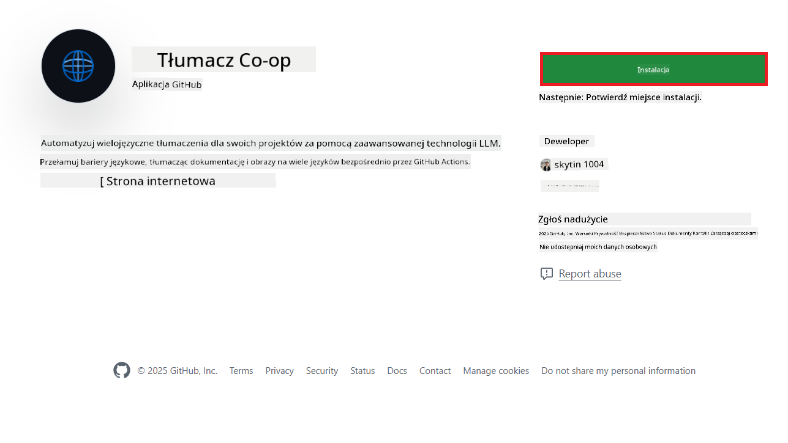
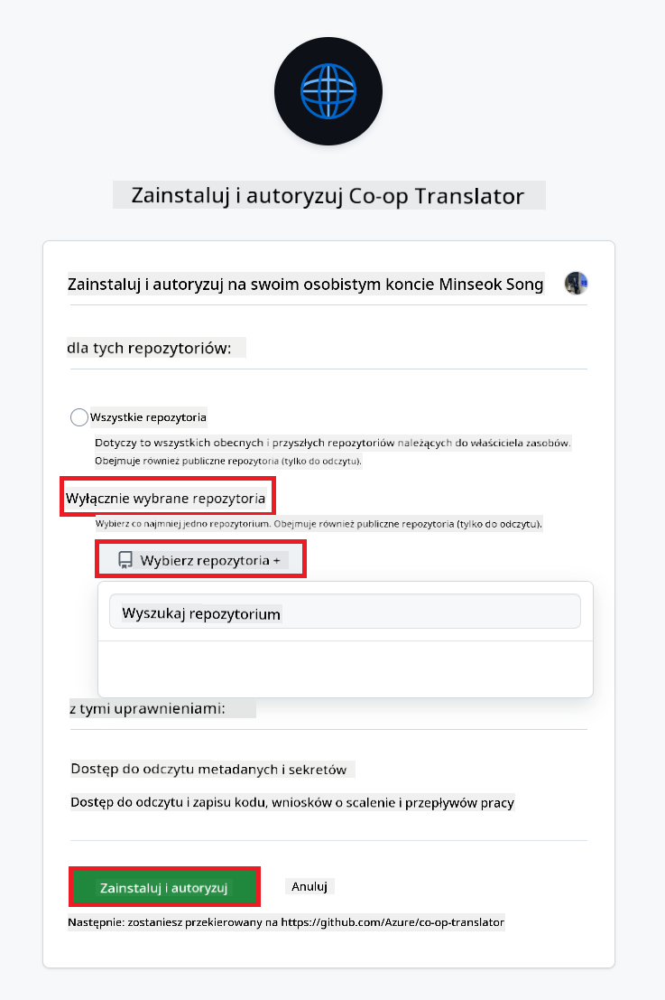
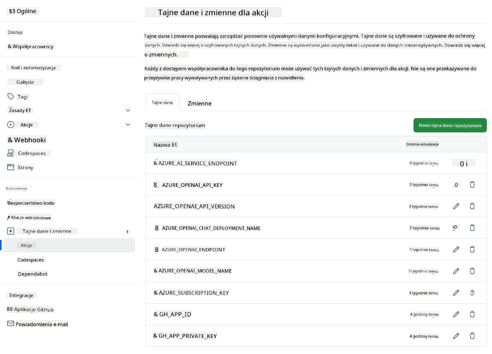

<!--
CO_OP_TRANSLATOR_METADATA:
{
  "original_hash": "c437820027c197f25fb2cbee95bae28c",
  "translation_date": "2025-06-12T19:09:08+00:00",
  "source_file": "getting_started/github-actions-guide/github-actions-guide-org.md",
  "language_code": "pl"
}
-->
# Korzystanie z Co-op Translator GitHub Action (Przewodnik dla organizacji)

**Docelowi odbiorcy:** Ten przewodnik jest przeznaczony dla **wewnętrznych użytkowników Microsoft** lub **zespołów, które mają dostęp do niezbędnych poświadczeń dla wstępnie zbudowanej aplikacji Co-op Translator GitHub App** lub mogą utworzyć własną niestandardową aplikację GitHub.

Automatyzuj tłumaczenie dokumentacji swojego repozytorium bez wysiłku, korzystając z Co-op Translator GitHub Action. Ten przewodnik przeprowadzi Cię przez konfigurację akcji, która automatycznie tworzy pull requesty z aktualizowanymi tłumaczeniami za każdym razem, gdy zmienią się Twoje źródłowe pliki Markdown lub obrazy.

> [!IMPORTANT]
> 
> **Wybór odpowiedniego przewodnika:**
>
> Ten przewodnik opisuje konfigurację z wykorzystaniem **GitHub App ID oraz Klucza prywatnego**. Zazwyczaj potrzebujesz tej metody „Przewodnik dla organizacji”, jeśli: **`GITHUB_TOKEN` Uprawnienia są ograniczone:** Twoja organizacja lub ustawienia repozytorium ograniczają domyślne uprawnienia przyznawane standardowemu `GITHUB_TOKEN`. W szczególności, jeśli `GITHUB_TOKEN` nie ma wymaganych uprawnień `write` (takich jak `contents: write` lub `pull-requests: write`), workflow z [Przewodnika publicznego](./github-actions-guide-public.md) zakończy się niepowodzeniem z powodu braku odpowiednich uprawnień. Użycie dedykowanej aplikacji GitHub z wyraźnie przyznanymi uprawnieniami omija to ograniczenie.
>
> **Jeśli powyższe Cię nie dotyczy:**
>
> Jeśli standardowy `GITHUB_TOKEN` ma wystarczające uprawnienia w Twoim repozytorium (czyli nie jesteś blokowany przez ograniczenia organizacyjne), użyj **[Przewodnika publicznego z użyciem GITHUB_TOKEN](./github-actions-guide-public.md)**. Przewodnik publiczny nie wymaga uzyskiwania ani zarządzania App ID czy Kluczami prywatnymi i opiera się wyłącznie na standardowym `GITHUB_TOKEN` oraz uprawnieniach repozytorium.

## Wymagania wstępne

Przed skonfigurowaniem GitHub Action upewnij się, że masz gotowe niezbędne poświadczenia do usług AI.

**1. Wymagane: Poświadczenia modelu językowego AI**  
Potrzebujesz poświadczeń do co najmniej jednego obsługiwanego Modelu Językowego:

- **Azure OpenAI**: Wymaga Endpoint, klucza API, nazw modelu/deploymentu, wersji API.  
- **OpenAI**: Wymaga klucza API, (opcjonalnie: ID organizacji, Base URL, ID modelu).  
- Zobacz [Supported Models and Services](../../../../README.md) po szczegóły.  
- Przewodnik konfiguracji: [Konfiguracja Azure OpenAI](../set-up-resources/set-up-azure-openai.md).

**2. Opcjonalne: Poświadczenia Computer Vision (do tłumaczenia obrazów)**

- Wymagane tylko, jeśli chcesz tłumaczyć tekst w obrazach.  
- **Azure Computer Vision**: Wymaga Endpoint i klucza subskrypcji.  
- Jeśli nie zostaną podane, akcja domyślnie działa w [trybie tylko Markdown](../markdown-only-mode.md).  
- Przewodnik konfiguracji: [Konfiguracja Azure Computer Vision](../set-up-resources/set-up-azure-computer-vision.md).

## Konfiguracja i ustawienia

Wykonaj poniższe kroki, aby skonfigurować Co-op Translator GitHub Action w swoim repozytorium:

### Krok 1: Instalacja i konfiguracja uwierzytelniania GitHub App

Workflow używa uwierzytelniania GitHub App, aby bezpiecznie działać na Twoim repozytorium (np. tworzyć pull requesty) w Twoim imieniu. Wybierz jedną z opcji:

#### **Opcja A: Zainstaluj wstępnie zbudowaną aplikację Co-op Translator GitHub App (do użytku wewnętrznego Microsoft)**

1. Przejdź do strony [Co-op Translator GitHub App](https://github.com/apps/co-op-translator).

1. Wybierz **Install** i wybierz konto lub organizację, w której znajduje się Twoje docelowe repozytorium.

    

1. Wybierz **Only select repositories** i wybierz swoje docelowe repozytorium (np. `PhiCookBook`). Kliknij **Install**. Możesz zostać poproszony o uwierzytelnienie.

    

1. **Uzyskaj poświadczenia aplikacji (wymagany proces wewnętrzny):** Aby workflow mógł się uwierzytelnić jako aplikacja, potrzebujesz dwóch informacji dostarczonych przez zespół Co-op Translator:  
  - **App ID:** Unikalny identyfikator aplikacji Co-op Translator. App ID to: `1164076`.  
  - **Klucz prywatny:** Musisz uzyskać **całą zawartość** pliku klucza prywatnego `.pem` od osoby kontaktowej odpowiedzialnej za utrzymanie. **Traktuj ten klucz jak hasło i przechowuj go w bezpiecznym miejscu.**

1. Przejdź do Kroku 2.

#### **Opcja B: Użyj własnej niestandardowej aplikacji GitHub**

- Jeśli wolisz, możesz utworzyć i skonfigurować własną aplikację GitHub. Upewnij się, że ma dostęp do odczytu i zapisu do Contents i Pull requests. Będziesz potrzebować jej App ID i wygenerowanego Klucza prywatnego.

### Krok 2: Skonfiguruj sekrety repozytorium

Musisz dodać poświadczenia GitHub App oraz poświadczenia usług AI jako zaszyfrowane sekrety w ustawieniach repozytorium.

1. Przejdź do swojego docelowego repozytorium GitHub (np. `PhiCookBook`).

1. Przejdź do **Settings** > **Secrets and variables** > **Actions**.

1. W sekcji **Repository secrets** kliknij **New repository secret** dla każdego z poniższych sekretów.

   

**Wymagane sekrety (do uwierzytelniania GitHub App):**

| Nazwa sekretu          | Opis                                          | Źródło wartości                                  |
| :--------------------- | :-------------------------------------------- | :----------------------------------------------- |
| `GH_APP_ID`          | App ID aplikacji GitHub (z Kroku 1).           | Ustawienia GitHub App                            |
| `GH_APP_PRIVATE_KEY` | **Cała zawartość** pobranego pliku klucza prywatnego `.pem`. | Plik `.pem` (z Kroku 1)                       |

**Sekrety usług AI (dodaj WSZYSTKIE, które dotyczą Twoich wymagań):**

| Nazwa sekretu                         | Opis                                     | Źródło wartości                   |
| :------------------------------------ | :--------------------------------------- | :------------------------------- |
| `AZURE_SUBSCRIPTION_KEY`            | Klucz do usługi Azure AI (Computer Vision) | Azure AI Foundry                  |
| `AZURE_AI_SERVICE_ENDPOINT`         | Endpoint usługi Azure AI (Computer Vision)  | Azure AI Foundry                  |
| `AZURE_OPENAI_API_KEY`              | Klucz do usługi Azure OpenAI               | Azure AI Foundry                  |
| `AZURE_OPENAI_ENDPOINT`             | Endpoint usługi Azure OpenAI                | Azure AI Foundry                  |
| `AZURE_OPENAI_MODEL_NAME`           | Nazwa Twojego modelu Azure OpenAI           | Azure AI Foundry                  |
| `AZURE_OPENAI_CHAT_DEPLOYMENT_NAME` | Nazwa deploymentu Twojego Azure OpenAI       | Azure AI Foundry                  |
| `AZURE_OPENAI_API_VERSION`          | Wersja API dla Azure OpenAI                  | Azure AI Foundry                  |
| `OPENAI_API_KEY`                    | Klucz API dla OpenAI                        | OpenAI Platform                  |
| `OPENAI_ORG_ID`                     | ID organizacji OpenAI                       | OpenAI Platform                  |
| `OPENAI_CHAT_MODEL_ID`              | Konkretny ID modelu OpenAI                  | OpenAI Platform                  |
| `OPENAI_BASE_URL`                   | Niestandardowy Base URL API OpenAI          | OpenAI Platform                  |



### Krok 3: Utwórz plik workflow

Na koniec utwórz plik YAML definiujący zautomatyzowany workflow.

1. W katalogu głównym repozytorium utwórz katalog `.github/workflows/`, jeśli jeszcze nie istnieje.

1. W katalogu `.github/workflows/` utwórz plik o nazwie `co-op-translator.yml`.

1. Wklej poniższą zawartość do pliku co-op-translator.yml.

```
name: Co-op Translator

on:
  push:
    branches:
      - main

jobs:
  co-op-translator:
    runs-on: ubuntu-latest

    permissions:
      contents: write
      pull-requests: write

    steps:
      - name: Checkout repository
        uses: actions/checkout@v4
        with:
          fetch-depth: 0

      - name: Set up Python
        uses: actions/setup-python@v4
        with:
          python-version: '3.10'

      - name: Install Co-op Translator
        run: |
          python -m pip install --upgrade pip
          pip install co-op-translator

      - name: Run Co-op Translator
        env:
          PYTHONIOENCODING: utf-8
          # Azure AI Service Credentials
          AZURE_SUBSCRIPTION_KEY: ${{ secrets.AZURE_SUBSCRIPTION_KEY }}
          AZURE_AI_SERVICE_ENDPOINT: ${{ secrets.AZURE_AI_SERVICE_ENDPOINT }}

          # Azure OpenAI Credentials
          AZURE_OPENAI_API_KEY: ${{ secrets.AZURE_OPENAI_API_KEY }}
          AZURE_OPENAI_ENDPOINT: ${{ secrets.AZURE_OPENAI_ENDPOINT }}
          AZURE_OPENAI_MODEL_NAME: ${{ secrets.AZURE_OPENAI_MODEL_NAME }}
          AZURE_OPENAI_CHAT_DEPLOYMENT_NAME: ${{ secrets.AZURE_OPENAI_CHAT_DEPLOYMENT_NAME }}
          AZURE_OPENAI_API_VERSION: ${{ secrets.AZURE_OPENAI_API_VERSION }}

          # OpenAI Credentials
          OPENAI_API_KEY: ${{ secrets.OPENAI_API_KEY }}
          OPENAI_ORG_ID: ${{ secrets.OPENAI_ORG_ID }}
          OPENAI_CHAT_MODEL_ID: ${{ secrets.OPENAI_CHAT_MODEL_ID }}
          OPENAI_BASE_URL: ${{ secrets.OPENAI_BASE_URL }}
        run: |
          # =====================================================================
          # IMPORTANT: Set your target languages here (REQUIRED CONFIGURATION)
          # =====================================================================
          # Example: Translate to Spanish, French, German. Add -y to auto-confirm.
          translate -l "es fr de" -y  # <--- MODIFY THIS LINE with your desired languages

      - name: Authenticate GitHub App
        id: generate_token
        uses: tibdex/github-app-token@v1
        with:
          app_id: ${{ secrets.GH_APP_ID }}
          private_key: ${{ secrets.GH_APP_PRIVATE_KEY }}

      - name: Create Pull Request with translations
        uses: peter-evans/create-pull-request@v5
        with:
          token: ${{ steps.generate_token.outputs.token }}
          commit-message: "🌐 Update translations via Co-op Translator"
          title: "🌐 Update translations via Co-op Translator"
          body: |
            This PR updates translations for recent changes to the main branch.

            ### 📋 Changes included
            - Translated contents are available in the `translations/` directory
            - Translated images are available in the `translated_images/` directory

            ---
            🌐 Automatically generated by the [Co-op Translator](https://github.com/Azure/co-op-translator) GitHub Action.
          branch: update-translations
          base: main
          labels: translation, automated-pr
          delete-branch: true
          add-paths: |
            translations/
            translated_images/

```

4.  **Dostosuj workflow:**  
  - **[!IMPORTANT] Języki docelowe:** W `Run Co-op Translator` step, you **MUST review and modify the list of language codes** within the `translate -l "..." -y` command to match your project's requirements. The example list (`ar de es...`) needs to be replaced or adjusted.
  - **Trigger (`on:`):** The current trigger runs on every push to `main`. For large repositories, consider adding a `paths:` filter (see commented example in the YAML) to run the workflow only when relevant files (e.g., source documentation) change, saving runner minutes.
  - **PR Details:** Customize the `commit-message`, `title`, `body`, `branch` name, and `labels` in the `Create Pull Request` step if needed.

## Credential Management and Renewal

- **Security:** Always store sensitive credentials (API keys, private keys) as GitHub Actions secrets. Never expose them in your workflow file or repository code.
- **[!IMPORTANT] Key Renewal (Internal Microsoft Users):** Be aware that Azure OpenAI key used within Microsoft might have a mandatory renewal policy (e.g., every 5 months). Ensure you update the corresponding GitHub secrets (`AZURE_OPENAI_...` kluczach) **przed ich wygaśnięciem**, aby uniknąć błędów workflow.

## Uruchamianie workflow

Po scaleniu pliku `co-op-translator.yml` do głównej gałęzi (lub gałęzi określonej w filtrze `on:` trigger), the workflow will automatically run whenever changes are pushed to that branch (and match the `paths`, jeśli jest skonfigurowany).

Jeśli tłumaczenia zostaną wygenerowane lub zaktualizowane, akcja automatycznie utworzy Pull Request zawierający zmiany, gotowy do Twojej weryfikacji i scalenia.

**Zastrzeżenie**:  
Niniejszy dokument został przetłumaczony przy użyciu usługi tłumaczenia AI [Co-op Translator](https://github.com/Azure/co-op-translator). Chociaż dokładamy starań, aby tłumaczenie było jak najbardziej precyzyjne, prosimy mieć na uwadze, że automatyczne tłumaczenia mogą zawierać błędy lub niedokładności. Oryginalny dokument w jego rodzimym języku należy uważać za źródło wiarygodne i autorytatywne. W przypadku informacji o kluczowym znaczeniu zalecane jest skorzystanie z profesjonalnego tłumaczenia wykonanego przez człowieka. Nie ponosimy odpowiedzialności za jakiekolwiek nieporozumienia lub błędne interpretacje wynikające z użycia tego tłumaczenia.