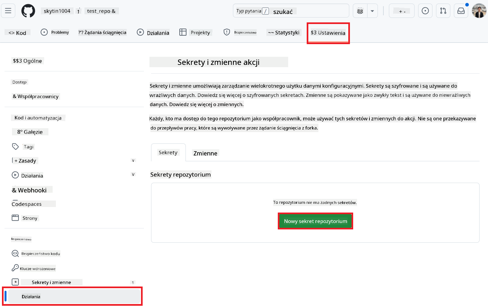
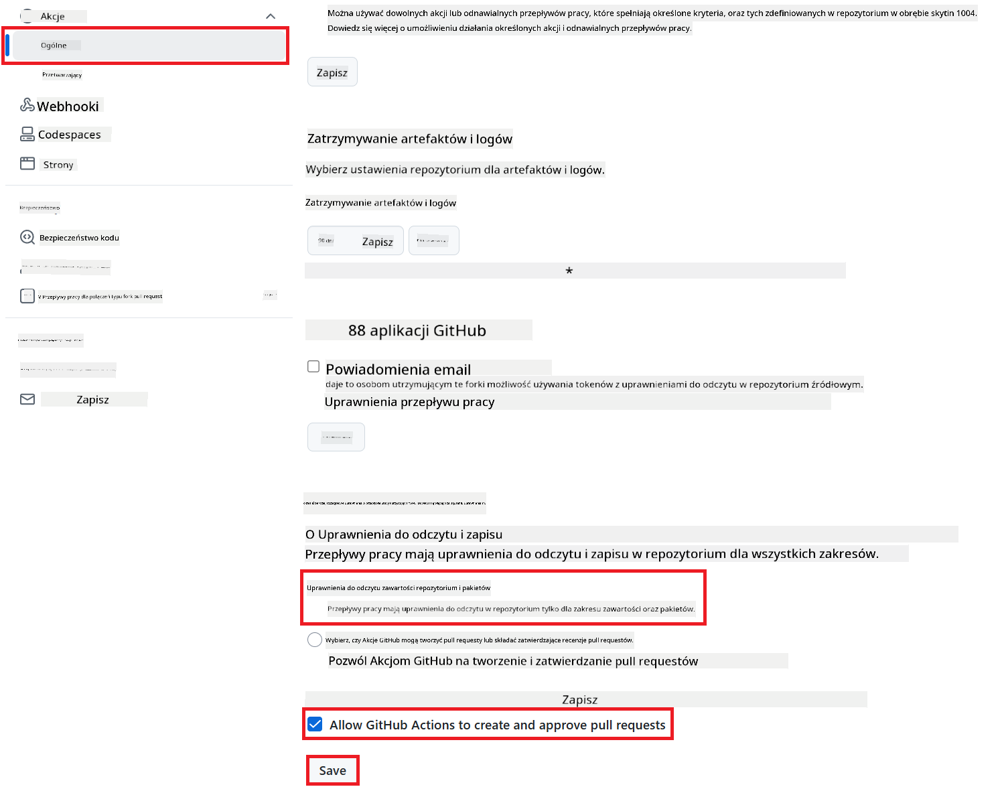

<!--
CO_OP_TRANSLATOR_METADATA:
{
  "original_hash": "a52587a512e667f70d92db853d3c61d5",
  "translation_date": "2025-06-12T19:27:59+00:00",
  "source_file": "getting_started/github-actions-guide/github-actions-guide-public.md",
  "language_code": "pl"
}
-->
# Korzystanie z Co-op Translator GitHub Action (Publiczne ustawienie)

**Grupa docelowa:** Ten przewodnik jest przeznaczony dla użytkowników w większości publicznych lub prywatnych repozytoriów, gdzie wystarczające są standardowe uprawnienia GitHub Actions. Wykorzystuje wbudowany `GITHUB_TOKEN`.

Zautomatyzuj tłumaczenie dokumentacji swojego repozytorium bez wysiłku, korzystając z Co-op Translator GitHub Action. Ten przewodnik przeprowadzi Cię przez konfigurację akcji, która automatycznie tworzy pull requesty z aktualizacjami tłumaczeń za każdym razem, gdy zmienią się Twoje źródłowe pliki Markdown lub obrazy.

> [!IMPORTANT]
>
> **Wybór odpowiedniego przewodnika:**
>
> Ten przewodnik opisuje **prostsze ustawienie z wykorzystaniem standardowego `GITHUB_TOKEN`**. Jest to zalecana metoda dla większości użytkowników, ponieważ nie wymaga zarządzania poufnymi kluczami prywatnymi GitHub App.
>

## Wymagania wstępne

Przed skonfigurowaniem GitHub Action upewnij się, że masz gotowe niezbędne dane uwierzytelniające do usług AI.

**1. Wymagane: Dane uwierzytelniające modelu językowego AI**  
Potrzebujesz danych uwierzytelniających do przynajmniej jednego obsługiwanego modelu językowego:

- **Azure OpenAI**: Wymaga Endpoint, klucza API, nazw modeli/deploymentów oraz wersji API.  
- **OpenAI**: Wymaga klucza API, (opcjonalnie: ID organizacji, Base URL, ID modelu).  
- Szczegóły znajdziesz w [Supported Models and Services](../../../../README.md).

**2. Opcjonalne: Dane uwierzytelniające AI Vision (do tłumaczenia obrazów)**

- Wymagane tylko, jeśli chcesz tłumaczyć tekst na obrazach.  
- **Azure AI Vision**: Wymaga Endpoint i klucza subskrypcji.  
- Jeśli nie podasz tych danych, akcja domyślnie działa w [trybie tylko Markdown](../markdown-only-mode.md).

## Konfiguracja i ustawienia

Postępuj zgodnie z poniższymi krokami, aby skonfigurować Co-op Translator GitHub Action w swoim repozytorium, korzystając ze standardowego `GITHUB_TOKEN`.

### Krok 1: Zrozumienie uwierzytelniania (korzystanie z `GITHUB_TOKEN`)

Ten workflow korzysta z wbudowanego `GITHUB_TOKEN` dostarczonego przez GitHub Actions. Token ten automatycznie przyznaje uprawnienia do interakcji z repozytorium na podstawie ustawień skonfigurowanych w **Kroku 3**.

### Krok 2: Skonfiguruj sekrety repozytorium

Musisz dodać tylko **dane uwierzytelniające usług AI** jako zaszyfrowane sekrety w ustawieniach repozytorium.

1.  Przejdź do docelowego repozytorium na GitHub.  
2.  Wejdź w **Settings** > **Secrets and variables** > **Actions**.  
3.  W sekcji **Repository secrets** kliknij **New repository secret** dla każdego wymaganego sekretu usługi AI wymienionego poniżej.

     *(Referencja obrazu: pokazuje miejsce dodawania sekretów)*

**Wymagane sekrety usług AI (dodaj WSZYSTKIE, które dotyczą Twoich wymagań):**

| Nazwa sekretu                         | Opis                                         | Źródło wartości                   |
| :---------------------------------- | :-------------------------------------------- | :------------------------------- |
| `AZURE_SUBSCRIPTION_KEY`            | Klucz do Azure AI Service (Computer Vision)    | Twoja usługa Azure AI             |
| `AZURE_AI_SERVICE_ENDPOINT`         | Endpoint do Azure AI Service (Computer Vision) | Twoja usługa Azure AI             |
| `AZURE_OPENAI_API_KEY`              | Klucz do usługi Azure OpenAI                    | Twoja usługa Azure AI             |
| `AZURE_OPENAI_ENDPOINT`             | Endpoint do usługi Azure OpenAI                  | Twoja usługa Azure AI             |
| `AZURE_OPENAI_MODEL_NAME`           | Nazwa modelu Azure OpenAI                         | Twoja usługa Azure AI             |
| `AZURE_OPENAI_CHAT_DEPLOYMENT_NAME` | Nazwa deploymentu Azure OpenAI                      | Twoja usługa Azure AI             |
| `AZURE_OPENAI_API_VERSION`          | Wersja API dla Azure OpenAI                        | Twoja usługa Azure AI             |
| `OPENAI_API_KEY`                    | Klucz API dla OpenAI                              | Twoja platforma OpenAI            |
| `OPENAI_ORG_ID`                     | ID organizacji OpenAI (opcjonalnie)               | Twoja platforma OpenAI            |
| `OPENAI_CHAT_MODEL_ID`              | Konkretne ID modelu OpenAI (opcjonalnie)          | Twoja platforma OpenAI            |
| `OPENAI_BASE_URL`                   | Niestandardowy Base URL API OpenAI (opcjonalnie)  | Twoja platforma OpenAI            |

### Krok 3: Skonfiguruj uprawnienia workflow

GitHub Action potrzebuje uprawnień przyznanych przez `GITHUB_TOKEN`, aby pobierać kod i tworzyć pull requesty.

1.  W repozytorium przejdź do **Settings** > **Actions** > **General**.  
2.  Przewiń do sekcji **Workflow permissions**.  
3.  Wybierz **Read and write permissions**. To przyznaje `GITHUB_TOKEN` niezbędne uprawnienia `contents: write` i `pull-requests: write` dla tego workflow.  
4.  Upewnij się, że zaznaczone jest pole **Allow GitHub Actions to create and approve pull requests**.  
5.  Kliknij **Save**.



### Krok 4: Utwórz plik workflow

Na koniec utwórz plik YAML definiujący zautomatyzowany workflow z użyciem `GITHUB_TOKEN`.

1.  W katalogu głównym repozytorium utwórz katalog `.github/workflows/`, jeśli jeszcze nie istnieje.  
2.  W katalogu `.github/workflows/` utwórz plik o nazwie `co-op-translator.yml`.  
3.  Wklej poniższą zawartość do pliku `co-op-translator.yml`.

```yaml
name: Co-op Translator

on:
  push:
    branches:
      - main

jobs:
  co-op-translator:
    runs-on: ubuntu-latest

    permissions:
      contents: write
      pull-requests: write

    steps:
      - name: Checkout repository
        uses: actions/checkout@v4
        with:
          fetch-depth: 0

      - name: Set up Python
        uses: actions/setup-python@v4
        with:
          python-version: '3.10'

      - name: Install Co-op Translator
        run: |
          python -m pip install --upgrade pip
          pip install co-op-translator

      - name: Run Co-op Translator
        env:
          PYTHONIOENCODING: utf-8
          # === AI Service Credentials ===
          AZURE_SUBSCRIPTION_KEY: ${{ secrets.AZURE_SUBSCRIPTION_KEY }}
          AZURE_AI_SERVICE_ENDPOINT: ${{ secrets.AZURE_AI_SERVICE_ENDPOINT }}
          AZURE_OPENAI_API_KEY: ${{ secrets.AZURE_OPENAI_API_KEY }}
          AZURE_OPENAI_ENDPOINT: ${{ secrets.AZURE_OPENAI_ENDPOINT }}
          AZURE_OPENAI_MODEL_NAME: ${{ secrets.AZURE_OPENAI_MODEL_NAME }}
          AZURE_OPENAI_CHAT_DEPLOYMENT_NAME: ${{ secrets.AZURE_OPENAI_CHAT_DEPLOYMENT_NAME }}
          AZURE_OPENAI_API_VERSION: ${{ secrets.AZURE_OPENAI_API_VERSION }}
          OPENAI_API_KEY: ${{ secrets.OPENAI_API_KEY }}
          OPENAI_ORG_ID: ${{ secrets.OPENAI_ORG_ID }}
          OPENAI_CHAT_MODEL_ID: ${{ secrets.OPENAI_CHAT_MODEL_ID }}
          OPENAI_BASE_URL: ${{ secrets.OPENAI_BASE_URL }}
        run: |
          # =====================================================================
          # IMPORTANT: Set your target languages here (REQUIRED CONFIGURATION)
          # =====================================================================
          # Example: Translate to Spanish, French, German. Add -y to auto-confirm.
          translate -l "es fr de" -y  # <--- MODIFY THIS LINE with your desired languages

      - name: Create Pull Request with translations
        uses: peter-evans/create-pull-request@v5
        with:
          token: ${{ secrets.GITHUB_TOKEN }}
          commit-message: "🌐 Update translations via Co-op Translator"
          title: "🌐 Update translations via Co-op Translator"
          body: |
            This PR updates translations for recent changes to the main branch.

            ### 📋 Changes included
            - Translated contents are available in the `translations/` directory
            - Translated images are available in the `translated_images/` directory

            ---
            🌐 Automatically generated by the [Co-op Translator](https://github.com/Azure/co-op-translator) GitHub Action.
          branch: update-translations
          base: main
          labels: translation, automated-pr
          delete-branch: true
          add-paths: |
            translations/
            translated_images/
```  
4.  **Dostosuj workflow:**  
  - **[!IMPORTANT] Języki docelowe:** W kroku `Run Co-op Translator` step, you **MUST review and modify the list of language codes** within the `translate -l "..." -y` command to match your project's requirements. The example list (`ar de es...`) needs to be replaced or adjusted.
  - **Trigger (`on:`):** The current trigger runs on every push to `main`. For large repositories, consider adding a `paths:` filter (see commented example in the YAML) to run the workflow only when relevant files (e.g., source documentation) change, saving runner minutes.
  - **PR Details:** Customize the `commit-message`, `title`, `body`, `branch` name, and `labels` in the `Create Pull Request` zmień listę języków, jeśli to konieczne.

**Zastrzeżenie**:  
Niniejszy dokument został przetłumaczony za pomocą usługi tłumaczeń AI [Co-op Translator](https://github.com/Azure/co-op-translator). Mimo że dokładamy starań, aby tłumaczenie było jak najbardziej precyzyjne, prosimy pamiętać, że automatyczne tłumaczenia mogą zawierać błędy lub nieścisłości. Oryginalny dokument w języku źródłowym powinien być traktowany jako źródło autorytatywne. W przypadku informacji o kluczowym znaczeniu zaleca się skorzystanie z profesjonalnego tłumaczenia wykonanego przez człowieka. Nie ponosimy odpowiedzialności za jakiekolwiek nieporozumienia lub błędne interpretacje wynikające z korzystania z tego tłumaczenia.