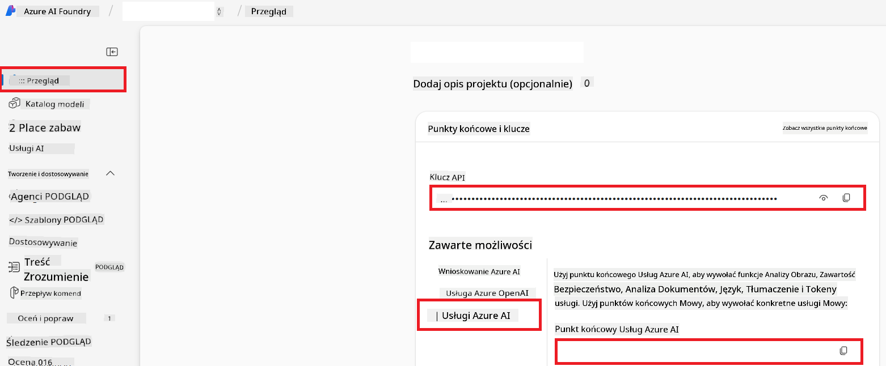

<!--
CO_OP_TRANSLATOR_METADATA:
{
  "original_hash": "b58d7c3cb4210697a073d20eb3064945",
  "translation_date": "2025-06-12T11:52:04+00:00",
  "source_file": "getting_started/set-up-azure-ai.md",
  "language_code": "pl"
}
-->
# Konfiguracja Azure AI dla Co-op Translator (Azure OpenAI i Azure AI Vision)

Ten przewodnik przeprowadzi Cię przez proces konfiguracji Azure OpenAI do tłumaczenia języków oraz Azure Computer Vision do analizy zawartości obrazów (które następnie mogą być używane do tłumaczenia na podstawie obrazów) w ramach Azure AI Foundry.

**Wymagania wstępne:**
- Konto Azure z aktywną subskrypcją.
- Wystarczające uprawnienia do tworzenia zasobów i wdrożeń w subskrypcji Azure.

## Utwórz projekt Azure AI

Zaczniesz od utworzenia projektu Azure AI, który będzie centralnym miejscem do zarządzania zasobami AI.

1. Przejdź do [https://ai.azure.com](https://ai.azure.com) i zaloguj się na swoje konto Azure.

1. Wybierz **+Create**, aby utworzyć nowy projekt.

1. Wykonaj następujące czynności:
   - Wprowadź **Nazwa projektu** (np. `CoopTranslator-Project`).
   - Wybierz **AI hub** (np. `CoopTranslator-Hub`) (w razie potrzeby utwórz nowy).

1. Kliknij "**Review and Create**", aby utworzyć projekt. Zostaniesz przeniesiony na stronę przeglądu projektu.

## Konfiguracja Azure OpenAI do tłumaczenia językowego

W ramach projektu wdrożysz model Azure OpenAI, który będzie służył jako backend do tłumaczenia tekstu.

### Przejdź do swojego projektu

Jeśli jeszcze tego nie zrobiłeś, otwórz swój nowo utworzony projekt (np. `CoopTranslator-Project`) w Azure AI Foundry.

### Wdrożenie modelu OpenAI

1. W menu po lewej stronie projektu, w sekcji "My assets", wybierz "**Models + endpoints**".

1. Wybierz **+ Deploy model**.

1. Wybierz **Deploy Base Model**.

1. Zostanie wyświetlona lista dostępnych modeli. Przefiltruj lub wyszukaj odpowiedni model GPT. Zalecamy `gpt-4o`.

1. Wybierz wybrany model i kliknij **Confirm**.

1. Wybierz **Deploy**.

### Konfiguracja Azure OpenAI

Po wdrożeniu możesz wybrać wdrożenie na stronie "**Models + endpoints**", aby znaleźć jego **REST endpoint URL**, **Key**, **Deployment name**, **Model name** oraz **API version**. Te informacje będą potrzebne do integracji modelu tłumaczeniowego z Twoją aplikacją.

> [!NOTE]
> Możesz wybrać wersje API na stronie [API version deprecation](https://learn.microsoft.com/azure/ai-services/openai/api-version-deprecation) w zależności od swoich potrzeb. Pamiętaj, że **wersja API** różni się od **wersji modelu** wyświetlanej na stronie **Models + endpoints** w Azure AI Foundry.

## Konfiguracja Azure Computer Vision do tłumaczenia obrazów

Aby umożliwić tłumaczenie tekstu znajdującego się na obrazach, musisz znaleźć klucz API i punkt końcowy Azure AI Service.

1. Przejdź do swojego projektu Azure AI (np. `CoopTranslator-Project`). Upewnij się, że jesteś na stronie przeglądu projektu.

### Konfiguracja Azure AI Service

Znajdź klucz API i punkt końcowy w Azure AI Service.

1. Przejdź do swojego projektu Azure AI (np. `CoopTranslator-Project`). Upewnij się, że jesteś na stronie przeglądu projektu.

1. Znajdź **API Key** i **Endpoint** na karcie Azure AI Service.

    

To połączenie udostępnia możliwości powiązanego zasobu Azure AI Services (w tym analizę obrazów) w Twoim projekcie AI Foundry. Następnie możesz użyć tego połączenia w swoich notatnikach lub aplikacjach, aby wyodrębnić tekst z obrazów, który może być następnie przesłany do modelu Azure OpenAI w celu tłumaczenia.

## Konsolidacja Twoich danych uwierzytelniających

Do tej pory powinieneś zebrać następujące dane:

**Dla Azure OpenAI (tłumaczenie tekstu):**
- Azure OpenAI Endpoint
- Azure OpenAI API Key
- Azure OpenAI Model Name (np. `gpt-4o`)
- Azure OpenAI Deployment Name (np. `cooptranslator-gpt4o`)
- Azure OpenAI API Version

**Dla Azure AI Services (wyodrębnianie tekstu z obrazów za pomocą Vision):**
- Azure AI Service Endpoint
- Azure AI Service API Key

### Przykład: konfiguracja zmiennych środowiskowych (wersja podglądowa)

Później, podczas tworzenia aplikacji, prawdopodobnie skonfigurujesz ją, korzystając z tych zebranych danych uwierzytelniających. Na przykład możesz ustawić je jako zmienne środowiskowe w ten sposób:

```bash
# Azure AI Service Credentials (Required for image translation)
AZURE_AI_SERVICE_API_KEY="your_azure_ai_service_api_key" # e.g., 21xasd...
AZURE_AI_SERVICE_ENDPOINT="https://your_azure_ai_service_endpoint.cognitiveservices.azure.com/"

# Azure OpenAI Credentials (Required for text translation)
AZURE_OPENAI_API_KEY="your_azure_openai_api_key" # e.g., 21xasd...
AZURE_OPENAI_ENDPOINT="https://your_azure_openai_endpoint.openai.azure.com/"
AZURE_OPENAI_MODEL_NAME="your_model_name" # e.g., gpt-4o
AZURE_OPENAI_CHAT_DEPLOYMENT_NAME="your_deployment_name" # e.g., cooptranslator-gpt4o
AZURE_OPENAI_API_VERSION="your_api_version" # e.g., 2024-12-01-preview
```

---

### Dalsza lektura

- [Jak utworzyć projekt w Azure AI Foundry](https://learn.microsoft.com/azure/ai-foundry/how-to/create-projects?tabs=ai-studio)
- [Jak utworzyć zasoby Azure AI](https://learn.microsoft.com/azure/ai-foundry/how-to/create-azure-ai-resource?tabs=portal)
- [Jak wdrożyć modele OpenAI w Azure AI Foundry](https://learn.microsoft.com/en-us/azure/ai-foundry/how-to/deploy-models-openai)

**Zastrzeżenie**:  
Niniejszy dokument został przetłumaczony za pomocą usługi tłumaczenia AI [Co-op Translator](https://github.com/Azure/co-op-translator). Mimo że dokładamy starań, aby tłumaczenie było jak najbardziej precyzyjne, prosimy pamiętać, że automatyczne tłumaczenia mogą zawierać błędy lub nieścisłości. Oryginalny dokument w języku źródłowym powinien być uznawany za źródło wiarygodne. W przypadku informacji o krytycznym znaczeniu zalecane jest skorzystanie z profesjonalnego tłumaczenia wykonanego przez człowieka. Nie ponosimy odpowiedzialności za jakiekolwiek nieporozumienia lub błędne interpretacje wynikające z korzystania z tego tłumaczenia.