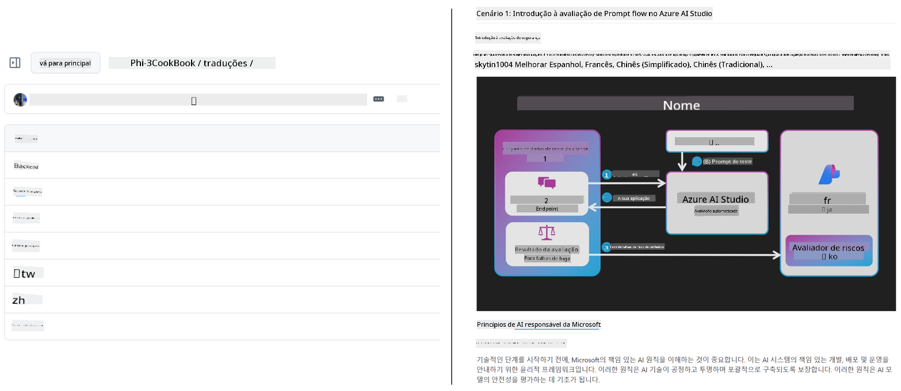
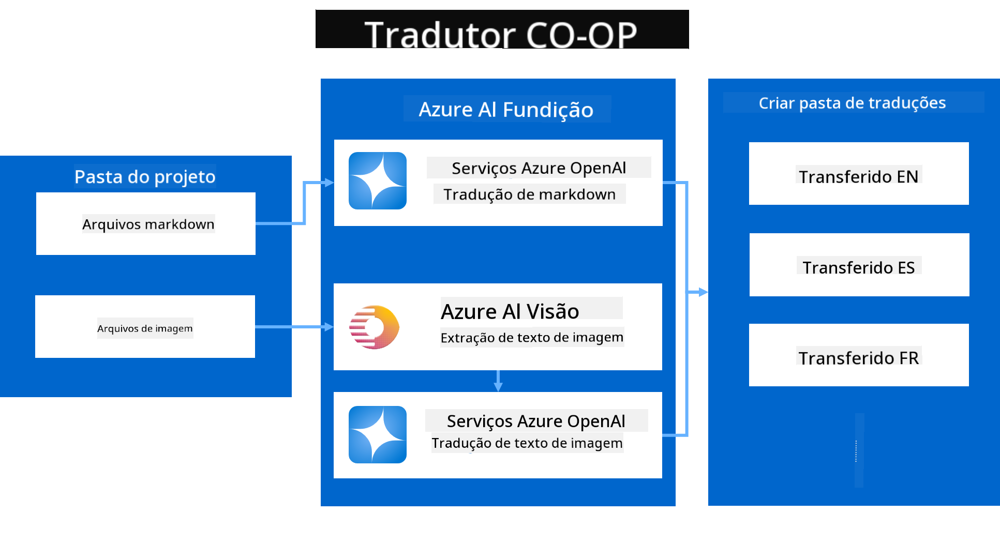

<!--
CO_OP_TRANSLATOR_METADATA:
{
  "original_hash": "044724537b57868117aadae8e7728c7c",
  "translation_date": "2025-06-12T10:18:12+00:00",
  "source_file": "README.md",
  "language_code": "pt"
}
-->


# Co-op Translator: Automatize a Tradução de Documentação Educacional Sem Esforço

_Automatique facilmente a tradução da sua documentação para vários idiomas e alcance um público global._

[](https://pypi.org/project/co-op-translator/)
[](https://github.com/azure/co-op-translator/blob/main/LICENSE)
[](https://pepy.tech/project/co-op-translator)
[](https://pepy.tech/project/co-op-translator)
[](https://github.com/psf/black)

[](https://GitHub.com/azure/co-op-translator/graphs/contributors/)
[](https://GitHub.com/azure/co-op-translator/issues/)
[](https://GitHub.com/azure/co-op-translator/pulls/)
[](http://makeapullrequest.com)

### Suporte a Idiomas Impulsionado pelo Co-op Translator

> [!NOTE]
> Estas são as traduções atuais do conteúdo deste repositório. Para uma lista completa dos idiomas suportados pelo Co-op Translator, consulte a seção [Language Support](../..).

[](https://GitHub.com/azure/co-op-translator/watchers/)
[](https://GitHub.com/azure/co-op-translator/network/)
[](https://GitHub.com/azure/co-op-translator/stargazers/)

[](https://discord.com/invite/ByRwuEEgH4)

[](https://codespaces.new/azure/co-op-translator)
[](https://vscode.dev/redirect?url=vscode://ms-vscode-remote.remote-containers/cloneInVolume?url=https://github.com/azure/co-op-translator)

## Visão Geral: Simplifique a Tradução do Seu Conteúdo Educacional

As barreiras linguísticas dificultam significativamente o acesso a recursos educacionais valiosos e ao conhecimento técnico para aprendizes e desenvolvedores ao redor do mundo. Isso limita a participação e desacelera o ritmo da inovação e do aprendizado global.

**Co-op Translator** surgiu da necessidade de resolver o processo manual ineficiente de tradução para as séries educacionais em larga escala da Microsoft (como os guias "For Beginners"). Ele evoluiu para uma ferramenta poderosa e fácil de usar, projetada para derrubar essas barreiras para todos. Ao fornecer traduções automatizadas de alta qualidade via CLI e GitHub Actions, o Co-op Translator capacita educadores, estudantes, pesquisadores e desenvolvedores globalmente a compartilhar e acessar conhecimento sem limitações linguísticas.

Veja como o Co-op Translator organiza o conteúdo educacional traduzido:



Arquivos Markdown e textos em imagens são traduzidos automaticamente e organizados em pastas específicas para cada idioma.

**Desbloqueie o acesso global ao seu conteúdo educacional com o Co-op Translator hoje mesmo!**

## Apoio ao Acesso Global para os Recursos de Aprendizado da Microsoft

O Co-op Translator ajuda a reduzir a barreira linguística em iniciativas educacionais importantes da Microsoft, automatizando o processo de tradução para repositórios que atendem a uma comunidade global de desenvolvedores. Exemplos que já utilizam o Co-op Translator incluem:

[](https://github.com/microsoft/Generative-AI-for-beginners)
[](https://github.com/microsoft/ML-For-Beginners)
[](https://github.com/microsoft/AI-For-Beginners)
[](https://github.com/microsoft/ai-agents-for-beginners)
[](https://github.com/microsoft/PhiCookBook)
[](https://github.com/microsoft/Generative-AI-for-beginners-dotnet)

## Principais Funcionalidades

- **Traduções Automatizadas**: Traduza textos para múltiplos idiomas com facilidade.
- **Integração com GitHub Actions**: Automatize as traduções como parte do seu pipeline CI/CD.
- **Preservação do Markdown**: Mantenha a sintaxe Markdown correta durante a tradução.
- **Tradução de Texto em Imagens**: Extraia e traduza textos presentes em imagens.
- **Tecnologia Avançada de LLM**: Utilize modelos de linguagem de ponta para traduções de alta qualidade.
- **Integração Fácil**: Integre de forma simples ao seu projeto existente.
- **Simplifique a Localização**: Torne o processo de localização do seu projeto para mercados internacionais mais ágil.

## Como Funciona



O Co-op Translator pega arquivos Markdown e imagens da sua pasta de projeto e os processa da seguinte forma:

1. **Extração de Texto**: Extrai o texto dos arquivos Markdown e, se configurado (por exemplo, com Azure AI Vision), o texto embutido nas imagens.
1. **Tradução por IA**: Envia o texto extraído para o LLM configurado (Azure OpenAI, OpenAI, etc.) para tradução.
1. **Salvamento do Resultado**: Salva os arquivos Markdown traduzidos e as imagens (com o texto traduzido) em pastas específicas para cada idioma, preservando a formatação original.

## Começando

Comece rapidamente com o CLI ou configure a automação completa com GitHub Actions. Escolha a abordagem que melhor se adapta ao seu fluxo de trabalho:

1. **Linha de Comando (CLI)** - Para traduções pontuais ou controle manual
2. **GitHub Actions** - Para traduções automatizadas a cada push

> [!NOTE]
> Embora este tutorial foque em recursos do Azure, você pode usar qualquer modelo de linguagem suportado.

### Suporte a Idiomas

O Co-op Translator suporta uma ampla variedade de idiomas para ajudar você a alcançar um público global. Aqui está o que você precisa saber:

#### Referência Rápida

| Idioma | Código | Idioma | Código | Idioma | Código |
|----------|------|----------|------|----------|------|
| Árabe | ar | Bengali | bn | Búlgaro | bg |
| Birmanês (Myanmar) | my | Chinês (Simplificado) | zh | Chinês (Tradicional, HK) | hk |
| Chinês (Tradicional, Macau) | mo | Chinês (Tradicional, TW) | tw | Croata | hr |
| Tcheco | cs | Dinamarquês | da | Holandês | nl |
| Finlandês | fi | Francês | fr | Alemão | de |
| Grego | el | Hebraico | he | Hindi | hi |
| Húngaro | hu | Indonésio | id | Italiano | it |
| Japonês | ja | Coreano | ko | Malaio | ms |
| Marathi | mr | Nepali | ne | Norueguês | no |
| Persa (Farsi) | fa | Polonês | pl | Português (Brasil) | br |
| Português (Portugal) | pt | Punjabi (Gurmukhi) | pa | Romeno | ro |
| Russo | ru | Sérvio (Cirílico) | sr | Eslovaco | sk |
| Esloveno | sl | Espanhol | es | Suaíli | sw |
| Sueco | sv | Tagalog (Filipino) | tl | Tailandês | th |
| Turco | tr | Ucraniano | uk | Urdu | ur |
| Vietnamita | vi | — | — | — | — |

#### Usando os Códigos de Idioma

Ao usar o Co-op Translator, você precisará especificar os idiomas usando seus códigos. Por exemplo:

```bash
# Translate to French, Spanish, and German
translate -l "fr es de"

# Translate to Chinese (Simplified) and Japanese
translate -l "zh ja"
```

> [!NOTE]
> Para informações técnicas detalhadas sobre suporte a idiomas, incluindo:
>
> - Especificações de fontes para cada idioma
> - Problemas conhecidos
> - Como adicionar novos idiomas
>
> Veja nossa [Documentação de Idiomas Suportados](./getting_started/supported-languages.md).

### Modelos e Serviços Suportados

| Tipo                  | Nome                           |
|-----------------------|--------------------------------|
| Modelo de Linguagem        |   |
| Visão por IA       |  |

> [!NOTE]
> Se um serviço de visão por IA não estiver disponível, o co-op translator alternará para o [modo apenas Markdown](./getting_started/markdown-only-mode.md).

### Configuração Inicial

Antes de começar, você precisará configurar os seguintes recursos:

1. Recurso de Modelo de Linguagem (Obrigatório):
   - Azure OpenAI (Recomendado) - Oferece traduções de alta qualidade com confiabilidade empresarial
   - OpenAI - Opção alternativa caso não tenha acesso ao Azure
   - Para informações detalhadas sobre modelos suportados, veja [Modelos e Serviços Suportados](../..)

1. Recurso de Visão por IA (Opcional):
   - Azure AI Vision - Permite tradução de texto dentro de imagens
   - Se não configurado, o tradutor usará automaticamente o [modo apenas Markdown](./getting_started/markdown-only-mode.md)
   - Recomendado para projetos com imagens que contenham texto a ser traduzido

1. Passos de Configuração:
   - Siga nosso [guia de configuração do Azure AI](./getting_started/set-up-azure-ai.md) para instruções detalhadas
   - Crie um arquivo `.env` com suas chaves de API e endpoints (veja a seção [Quick Start](../..))
   - Certifique-se de ter as permissões e cotas necessárias para os serviços escolhidos

### Preparação do Projeto Antes da Tradução

Antes de iniciar o processo de tradução, siga estes passos para preparar seu projeto:

1. Prepare seu README:
   - Adicione uma tabela de traduções no seu README.md para vincular às versões traduzidas
   - Formato de exemplo:

     ```markdown

     ### 🌐 Multi-Language Support
     
     [French](../fr/README.md) | [Spanish](../es/README.md) | [German](../de/README.md) | [Russian](../ru/README.md) | [Arabic](../ar/README.md) | [Persian (Farsi)](../fa/README.md) | [Urdu](../ur/README.md) | [Chinese (Simplified)](../zh/README.md) | [Chinese (Traditional, Macau)](../mo/README.md) | [Chinese (Traditional, Hong Kong)](../hk/README.md) | [Chinese (Traditional, Taiwan)](../tw/README.md) | [Japanese](../ja/README.md) | [Korean](../ko/README.md) | [Hindi](../hi/README.md) | [Bengali](../bn/README.md) | [Marathi](../mr/README.md) | [Nepali](../ne/README.md) | [Punjabi (Gurmukhi)](../pa/README.md) | [Portuguese (Portugal)](./README.md) | [Portuguese (Brazil)](../br/README.md) | [Italian](../it/README.md) | [Polish](../pl/README.md) | [Turkish](../tr/README.md) | [Greek](../el/README.md) | [Thai](../th/README.md) | [Swedish](../sv/README.md) | [Danish](../da/README.md) | [Norwegian](../no/README.md) | [Finnish](../fi/README.md) | [Dutch](../nl/README.md) | [Hebrew](../he/README.md) | [Vietnamese](../vi/README.md) | [Indonesian](../id/README.md) | [Malay](../ms/README.md) | [Tagalog (Filipino)](../tl/README.md) | [Swahili](../sw/README.md) | [Hungarian](../hu/README.md) | [Czech](../cs/README.md) | [Slovak](../sk/README.md) | [Romanian](../ro/README.md) | [Bulgarian](../bg/README.md) | [Serbian (Cyrillic)](../sr/README.md) | [Croatian](../hr/README.md) | [Slovenian](../sl/README.md) | [Ukrainian](../uk/README.md) | [Burmese (Myanmar)](../my/README.md) 
    
     ```

1. Limpe Traduções Existentes (se necessário):
   - Remova quaisquer pastas de tradução existentes (por exemplo, `translations/`)
   - Apague arquivos de tradução antigos para começar do zero
   - Isso evita conflitos com o novo processo de tradução

### Início Rápido: Linha de Comando

Para começar rapidamente usando a linha de comando:

1. Crie um ambiente virtual:

    ```bash
    python -m venv .venv
    ```

1. Ative o ambiente virtual:

    - No Windows:

    ```bash
    .venv\scripts\activate
    ```

    - No Linux/macOS:

    ```bash
    source .venv/bin/activate
    ```

1. Instale o pacote:

    ```bash
    pip install co-op-translator
    ```

1. Configure as Credenciais:

    - Crie um arquivo `.env` file in your project's root directory.
    - Copy the contents from the [.env.template](../../.env.template) file into your new `.env` file.
    - Fill in the required API keys and endpoint information in your `.env` file.

1. Run Translation:
    - Navigate to your project's root directory in your terminal.
    - Execute the translate command, specifying target languages with the `-l` flag:

    ```bash
    translate -l "ko ja fr"
    ```

    _(Substitua `"ko ja fr"` with your desired space-separated language codes)_

### Detailed Usage Guides

Choose the approach that best fits your workflow:

#### 1. Using the Command Line (CLI)

- Best for: One-time translations, manual control, or integration into custom scripts.
- Requires: Local installation of Python and the `co-op-translator` package.
- Guide: [Command Line Guide](./getting_started/command-line-guide/command-line-guide.md)

#### 2. Using GitHub Actions (Automation)

- Best for: Automatically translating content whenever changes are pushed to your repository. Keeps translations consistently up-to-date.
- Requires: Setting up a workflow file (`.github/workflows`) no seu repositório. Nenhuma instalação local necessária.
- Guias:
  - [Guia de GitHub Actions (Repositórios Públicos & Segredos Padrão)](./getting_started/github-actions-guide/github-actions-guide-public.md) - Use este para a maioria dos repositórios públicos ou pessoais que dependem dos segredos padrão do repositório.
  - [Guia de GitHub Actions (Repositórios da Organização Microsoft & Configurações em Nível de Organização)](./getting_started/github-actions-guide/github-actions-guide-org.md) - Use este guia se você estiver trabalhando dentro da organização Microsoft no GitHub ou precisar usar segredos ou runners em nível organizacional.

### Solução de Problemas e Dicas

- [Guia de Solução de Problemas](./getting_started/troubleshooting.md)

### Recursos Adicionais

- [Referência de Comandos](./getting_started/command-reference.md): Guia detalhado de todos os comandos e opções disponíveis.
- [Idiomas Suportados](./getting_started/supported-languages.md): Confira a lista de idiomas suportados e instruções para adicionar novos.
- [Modo Apenas Markdown](./getting_started/markdown-only-mode.md): Como traduzir apenas o texto, sem tradução de imagens.

## Apresentações em Vídeo

Saiba mais sobre o Co-op Translator através das nossas apresentações _(Clique na imagem abaixo para assistir no YouTube.)_:

- **Open at Microsoft**: Uma breve introdução de 18 minutos e um guia rápido sobre como usar o Co-op Translator.
[](https://www.youtube.com/watch?v=jX_swfH_KNU)

## Apoie-nos e Incentive o Aprendizado Global

Junte-se a nós para revolucionar a forma como o conteúdo educacional é compartilhado globalmente! Dê uma ⭐ no [Co-op Translator](https://github.com/azure/co-op-translator) no GitHub e apoie nossa missão de eliminar barreiras linguísticas no aprendizado e na tecnologia. Seu interesse e contribuições fazem uma grande diferença! Contribuições de código e sugestões de funcionalidades são sempre bem-vindas.

## Contribuindo

Este projeto aceita contribuições e sugestões. Interessado em colaborar com o Azure Co-op Translator? Por favor, consulte nosso [CONTRIBUTING.md](./CONTRIBUTING.md) para orientações sobre como você pode ajudar a tornar o Co-op Translator mais acessível.

## Colaboradores

[](https://github.com/Azure/co-op-translator/graphs/contributors)

## Código de Conduta

Este projeto adotou o [Microsoft Open Source Code of Conduct](https://opensource.microsoft.com/codeofconduct/).
Para mais informações, consulte o [FAQ do Código de Conduta](https://opensource.microsoft.com/codeofconduct/faq/) ou
entre em contato pelo e-mail [opencode@microsoft.com](mailto:opencode@microsoft.com) para quaisquer dúvidas ou comentários adicionais.

## IA Responsável

A Microsoft está comprometida em ajudar nossos clientes a usar nossos produtos de IA de forma responsável, compartilhando nossos aprendizados e construindo parcerias baseadas na confiança por meio de ferramentas como Transparency Notes e Impact Assessments. Muitos desses recursos podem ser encontrados em [https://aka.ms/RAI](https://aka.ms/RAI).  
A abordagem da Microsoft para IA responsável está fundamentada em nossos princípios de IA: justiça, confiabilidade e segurança, privacidade e segurança, inclusão, transparência e responsabilidade.

Modelos de linguagem natural, imagem e fala em larga escala — como os usados neste exemplo — podem apresentar comportamentos que sejam injustos, pouco confiáveis ou ofensivos, causando danos. Consulte a [Transparency note do serviço Azure OpenAI](https://learn.microsoft.com/legal/cognitive-services/openai/transparency-note?tabs=text) para se informar sobre riscos e limitações.

A abordagem recomendada para mitigar esses riscos é incluir um sistema de segurança na sua arquitetura que possa detectar e prevenir comportamentos prejudiciais. O [Azure AI Content Safety](https://learn.microsoft.com/azure/ai-services/content-safety/overview) oferece uma camada independente de proteção, capaz de detectar conteúdo gerado por usuários e por IA que seja prejudicial em aplicações e serviços. O Azure AI Content Safety inclui APIs de texto e imagem que permitem identificar material nocivo. Também dispomos do Content Safety Studio interativo, que permite visualizar, explorar e testar códigos de exemplo para detectar conteúdo prejudicial em diferentes modalidades. A seguinte [documentação de início rápido](https://learn.microsoft.com/azure/ai-services/content-safety/quickstart-text?tabs=visual-studio%2Clinux&pivots=programming-language-rest) orienta você a fazer requisições ao serviço.

Outro aspecto a considerar é o desempenho geral da aplicação. Em aplicações multimodais e com múltiplos modelos, consideramos desempenho como o sistema funcionando conforme você e seus usuários esperam, incluindo não gerar saídas prejudiciais. É importante avaliar o desempenho da sua aplicação como um todo usando [métricas de qualidade de geração, risco e segurança](https://learn.microsoft.com/azure/ai-studio/concepts/evaluation-metrics-built-in).

Você pode avaliar sua aplicação de IA no ambiente de desenvolvimento usando o [prompt flow SDK](https://microsoft.github.io/promptflow/index.html). Com um conjunto de dados de teste ou um objetivo definido, as gerações da sua aplicação de IA generativa são medidas quantitativamente com avaliadores integrados ou avaliadores personalizados de sua escolha. Para começar a usar o prompt flow sdk para avaliar seu sistema, siga o [guia de início rápido](https://learn.microsoft.com/azure/ai-studio/how-to/develop/flow-evaluate-sdk). Após executar uma avaliação, você pode [visualizar os resultados no Azure AI Studio](https://learn.microsoft.com/azure/ai-studio/how-to/evaluate-flow-results).

## Marcas Registradas

Este projeto pode conter marcas registradas ou logotipos de projetos, produtos ou serviços. O uso autorizado das marcas ou logotipos da Microsoft está sujeito e deve seguir as [Diretrizes de Marca e Uso de Marcas Registradas da Microsoft](https://www.microsoft.com/en-us/legal/intellectualproperty/trademarks/usage/general).  
O uso de marcas ou logotipos da Microsoft em versões modificadas deste projeto não deve causar confusão nem implicar patrocínio da Microsoft.  
Qualquer uso de marcas ou logotipos de terceiros está sujeito às políticas desses terceiros.

**Aviso Legal**:  
Este documento foi traduzido utilizando o serviço de tradução automática [Co-op Translator](https://github.com/Azure/co-op-translator). Embora nos esforcemos para garantir a precisão, esteja ciente de que traduções automáticas podem conter erros ou imprecisões. O documento original em seu idioma nativo deve ser considerado a fonte autorizada. Para informações críticas, recomenda-se tradução profissional realizada por humanos. Não nos responsabilizamos por quaisquer mal-entendidos ou interpretações incorretas decorrentes do uso desta tradução.