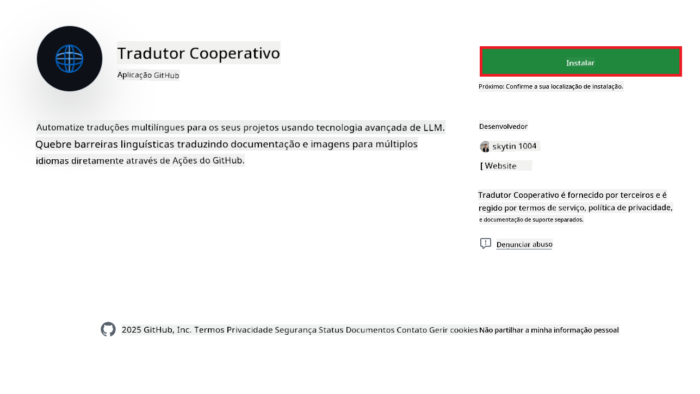
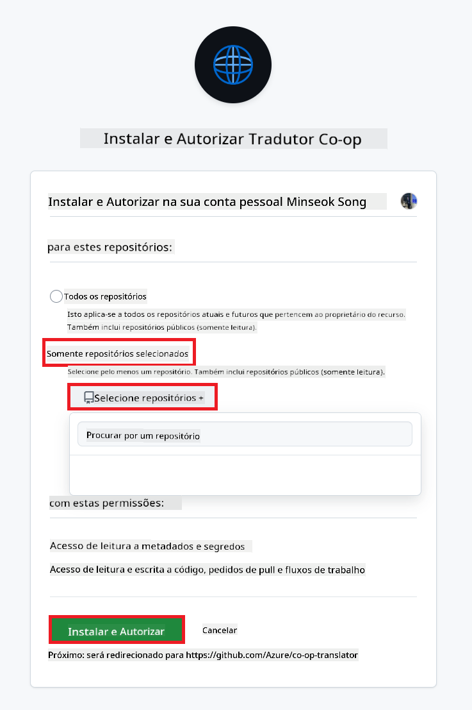
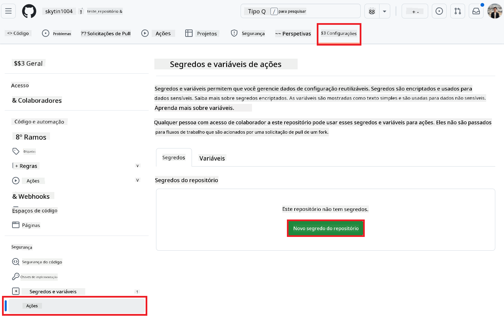
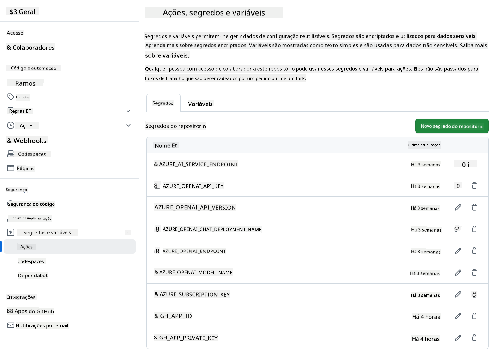

<!--
CO_OP_TRANSLATOR_METADATA:
{
  "original_hash": "c437820027c197f25fb2cbee95bae28c",
  "translation_date": "2025-06-12T19:07:53+00:00",
  "source_file": "getting_started/github-actions-guide/github-actions-guide-org.md",
  "language_code": "pt"
}
-->
# Utilizar a Ação Co-op Translator no GitHub (Guia para Organizações)

**Público-alvo:** Este guia destina-se a **utilizadores internos da Microsoft** ou **equipas que tenham acesso às credenciais necessárias para a App Co-op Translator GitHub pré-construída** ou que possam criar a sua própria App GitHub personalizada.

Automatize a tradução da documentação do seu repositório de forma simples utilizando a Ação Co-op Translator no GitHub. Este guia explica como configurar a ação para criar automaticamente pull requests com traduções atualizadas sempre que os seus ficheiros Markdown fonte ou imagens forem alterados.

> [!IMPORTANT]
> 
> **Escolher o Guia Adequado:**
>
> Este guia detalha a configuração utilizando um **ID da App GitHub e uma Chave Privada**. Normalmente precisa deste método "Guia para Organizações" se: **`GITHUB_TOKEN` Permissões Estão Restritas:** As definições da sua organização ou repositório restringem as permissões padrão atribuídas ao `GITHUB_TOKEN` standard. Especificamente, se o `GITHUB_TOKEN` não tiver as permissões necessárias `write` (como `contents: write` ou `pull-requests: write`), o fluxo de trabalho no [Guia Público de Configuração](./github-actions-guide-public.md) irá falhar devido a permissões insuficientes. Utilizar uma App GitHub dedicada com permissões explicitamente concedidas ultrapassa esta limitação.
>
> **Se o acima não se aplicar a si:**
>
> Se o `GITHUB_TOKEN` standard tiver permissões suficientes no seu repositório (ou seja, não estiver bloqueado por restrições organizacionais), utilize o **[Guia Público de Configuração com GITHUB_TOKEN](./github-actions-guide-public.md)**. O guia público não requer a obtenção ou gestão de IDs de App ou Chaves Privadas e baseia-se apenas no `GITHUB_TOKEN` standard e nas permissões do repositório.

## Pré-requisitos

Antes de configurar a Ação GitHub, certifique-se de que tem as credenciais necessárias para os serviços de IA.

**1. Obrigatório: Credenciais para Modelo de Linguagem IA**  
Precisa de credenciais para pelo menos um Modelo de Linguagem suportado:

- **Azure OpenAI**: Requer Endpoint, Chave API, Nomes do Modelo/Deployment, Versão da API.  
- **OpenAI**: Requer Chave API, (Opcional: ID da Organização, URL Base, ID do Modelo).  
- Veja [Modelos e Serviços Suportados](../../../../README.md) para detalhes.  
- Guia de Configuração: [Configurar Azure OpenAI](../set-up-resources/set-up-azure-openai.md).

**2. Opcional: Credenciais de Computer Vision (para Tradução de Imagens)**

- Necessário apenas se precisar de traduzir texto dentro de imagens.  
- **Azure Computer Vision**: Requer Endpoint e Chave de Subscrição.  
- Se não for fornecido, a ação utiliza o [modo só Markdown](../markdown-only-mode.md) por defeito.  
- Guia de Configuração: [Configurar Azure Computer Vision](../set-up-resources/set-up-azure-computer-vision.md).

## Configuração e Implementação

Siga estes passos para configurar a Ação Co-op Translator GitHub no seu repositório:

### Passo 1: Instalar e Configurar a Autenticação da App GitHub

O fluxo de trabalho utiliza autenticação via App GitHub para interagir de forma segura com o seu repositório (por exemplo, para criar pull requests) em seu nome. Escolha uma das opções:

#### **Opção A: Instalar a App Co-op Translator GitHub Pré-construída (Uso Interno Microsoft)**

1. Aceda à página da [App Co-op Translator GitHub](https://github.com/apps/co-op-translator).

1. Selecione **Instalar** e escolha a conta ou organização onde o seu repositório alvo está localizado.

    

1. Escolha **Selecionar apenas repositórios** e selecione o seu repositório alvo (ex.: `PhiCookBook`). Clique em **Instalar**. Poderá ser solicitado a autenticar.

    

1. **Obter Credenciais da App (Processo Interno Necessário):** Para permitir que o fluxo de trabalho se autentique como a app, precisa de duas informações fornecidas pela equipa Co-op Translator:  
  - **ID da App:** Identificador único da app Co-op Translator. O ID da App é: `1164076`.  
  - **Chave Privada:** Deve obter o **conteúdo completo** do ficheiro de chave privada `.pem` junto do contacto do mantenedor. **Trate esta chave como uma palavra-passe e mantenha-a segura.**

1. Prossiga para o Passo 2.

#### **Opção B: Utilizar a Sua Própria App GitHub Personalizada**

- Se preferir, pode criar e configurar a sua própria App GitHub. Assegure que tem acesso de leitura e escrita a Conteúdos e Pull Requests. Vai precisar do seu ID da App e de uma Chave Privada gerada.

### Passo 2: Configurar Segredos no Repositório

Deve adicionar as credenciais da App GitHub e as credenciais do seu serviço de IA como segredos encriptados nas definições do repositório.

1. Aceda ao repositório GitHub alvo (ex.: `PhiCookBook`).

1. Vá a **Settings** > **Secrets and variables** > **Actions**.

1. Em **Repository secrets**, clique em **New repository secret** para cada segredo listado abaixo.

   

**Segredos Obrigatórios (para Autenticação da App GitHub):**

| Nome do Segredo          | Descrição                                      | Fonte do Valor                                     |
| :----------------------- | :--------------------------------------------- | :------------------------------------------------ |
| `GH_APP_ID`       | O ID da App GitHub (do Passo 1).               | Configurações da App GitHub                        |
| `GH_APP_PRIVATE_KEY`       | O **conteúdo completo** do ficheiro `.pem` descarregado. | Ficheiro `.pem` (do Passo 1)          |

**Segredos do Serviço de IA (Adicione TODOS os que se aplicam conforme os seus Pré-requisitos):**

| Nome do Segredo                         | Descrição                               | Fonte do Valor                     |
| :------------------------------------- | :------------------------------------- | :-------------------------------- |
| `AZURE_SUBSCRIPTION_KEY`                     | Chave para Serviço Azure AI (Computer Vision) | Azure AI Foundry                  |
| `AZURE_AI_SERVICE_ENDPOINT`                     | Endpoint para Serviço Azure AI (Computer Vision) | Azure AI Foundry                  |
| `AZURE_OPENAI_API_KEY`                     | Chave para serviço Azure OpenAI        | Azure AI Foundry                  |
| `AZURE_OPENAI_ENDPOINT`                     | Endpoint para serviço Azure OpenAI     | Azure AI Foundry                  |
| `AZURE_OPENAI_MODEL_NAME`                     | Nome do Modelo Azure OpenAI             | Azure AI Foundry                  |
| `AZURE_OPENAI_CHAT_DEPLOYMENT_NAME`                     | Nome do Deployment Azure OpenAI         | Azure AI Foundry                  |
| `AZURE_OPENAI_API_VERSION`                     | Versão da API para Azure OpenAI          | Azure AI Foundry                  |
| `OPENAI_API_KEY`                     | Chave API para OpenAI                   | Plataforma OpenAI                 |
| `OPENAI_ORG_ID`                     | ID da Organização OpenAI                 | Plataforma OpenAI                 |
| `OPENAI_CHAT_MODEL_ID`                     | ID específico do modelo OpenAI           | Plataforma OpenAI                 |
| `OPENAI_BASE_URL`                     | URL Base API OpenAI personalizada        | Plataforma OpenAI                 |



### Passo 3: Criar o Ficheiro do Workflow

Por fim, crie o ficheiro YAML que define o fluxo de trabalho automatizado.

1. Na raiz do seu repositório, crie a diretoria `.github/workflows/` caso ainda não exista.

1. Dentro de `.github/workflows/`, crie um ficheiro chamado `co-op-translator.yml`.

1. Cole o seguinte conteúdo no co-op-translator.yml.

```
name: Co-op Translator

on:
  push:
    branches:
      - main

jobs:
  co-op-translator:
    runs-on: ubuntu-latest

    permissions:
      contents: write
      pull-requests: write

    steps:
      - name: Checkout repository
        uses: actions/checkout@v4
        with:
          fetch-depth: 0

      - name: Set up Python
        uses: actions/setup-python@v4
        with:
          python-version: '3.10'

      - name: Install Co-op Translator
        run: |
          python -m pip install --upgrade pip
          pip install co-op-translator

      - name: Run Co-op Translator
        env:
          PYTHONIOENCODING: utf-8
          # Azure AI Service Credentials
          AZURE_SUBSCRIPTION_KEY: ${{ secrets.AZURE_SUBSCRIPTION_KEY }}
          AZURE_AI_SERVICE_ENDPOINT: ${{ secrets.AZURE_AI_SERVICE_ENDPOINT }}

          # Azure OpenAI Credentials
          AZURE_OPENAI_API_KEY: ${{ secrets.AZURE_OPENAI_API_KEY }}
          AZURE_OPENAI_ENDPOINT: ${{ secrets.AZURE_OPENAI_ENDPOINT }}
          AZURE_OPENAI_MODEL_NAME: ${{ secrets.AZURE_OPENAI_MODEL_NAME }}
          AZURE_OPENAI_CHAT_DEPLOYMENT_NAME: ${{ secrets.AZURE_OPENAI_CHAT_DEPLOYMENT_NAME }}
          AZURE_OPENAI_API_VERSION: ${{ secrets.AZURE_OPENAI_API_VERSION }}

          # OpenAI Credentials
          OPENAI_API_KEY: ${{ secrets.OPENAI_API_KEY }}
          OPENAI_ORG_ID: ${{ secrets.OPENAI_ORG_ID }}
          OPENAI_CHAT_MODEL_ID: ${{ secrets.OPENAI_CHAT_MODEL_ID }}
          OPENAI_BASE_URL: ${{ secrets.OPENAI_BASE_URL }}
        run: |
          # =====================================================================
          # IMPORTANT: Set your target languages here (REQUIRED CONFIGURATION)
          # =====================================================================
          # Example: Translate to Spanish, French, German. Add -y to auto-confirm.
          translate -l "es fr de" -y  # <--- MODIFY THIS LINE with your desired languages

      - name: Authenticate GitHub App
        id: generate_token
        uses: tibdex/github-app-token@v1
        with:
          app_id: ${{ secrets.GH_APP_ID }}
          private_key: ${{ secrets.GH_APP_PRIVATE_KEY }}

      - name: Create Pull Request with translations
        uses: peter-evans/create-pull-request@v5
        with:
          token: ${{ steps.generate_token.outputs.token }}
          commit-message: "🌐 Update translations via Co-op Translator"
          title: "🌐 Update translations via Co-op Translator"
          body: |
            This PR updates translations for recent changes to the main branch.

            ### 📋 Changes included
            - Translated contents are available in the `translations/` directory
            - Translated images are available in the `translated_images/` directory

            ---
            🌐 Automatically generated by the [Co-op Translator](https://github.com/Azure/co-op-translator) GitHub Action.
          branch: update-translations
          base: main
          labels: translation, automated-pr
          delete-branch: true
          add-paths: |
            translations/
            translated_images/

```

4.  **Personalize o Workflow:**  
  - **[!IMPORTANT] Idiomas Alvo:** No comando `Run Co-op Translator` step, you **MUST review and modify the list of language codes** within the `translate -l "..." -y` command to match your project's requirements. The example list (`ar de es...`) needs to be replaced or adjusted.
  - **Trigger (`on:`):** The current trigger runs on every push to `main`. For large repositories, consider adding a `paths:` filter (see commented example in the YAML) to run the workflow only when relevant files (e.g., source documentation) change, saving runner minutes.
  - **PR Details:** Customize the `commit-message`, `title`, `body`, `branch` name, and `labels` in the `Create Pull Request` step if needed.

## Credential Management and Renewal

- **Security:** Always store sensitive credentials (API keys, private keys) as GitHub Actions secrets. Never expose them in your workflow file or repository code.
- **[!IMPORTANT] Key Renewal (Internal Microsoft Users):** Be aware that Azure OpenAI key used within Microsoft might have a mandatory renewal policy (e.g., every 5 months). Ensure you update the corresponding GitHub secrets (`AZURE_OPENAI_...` defina os idiomas para os quais pretende traduzir.  
  - **Renove as credenciais (como as chaves API) antes que expirem** para evitar falhas no fluxo de trabalho.

## Executar o Workflow

Assim que o ficheiro `co-op-translator.yml` for integrado no seu ramo principal (ou no ramo especificado no filtro `on:` trigger), the workflow will automatically run whenever changes are pushed to that branch (and match the `paths`, se configurado), se forem geradas ou atualizadas traduções, a ação cria automaticamente um Pull Request com as alterações, pronto para a sua revisão e integração.

**Aviso Legal**:  
Este documento foi traduzido utilizando o serviço de tradução por IA [Co-op Translator](https://github.com/Azure/co-op-translator). Embora nos esforcemos para garantir a precisão, por favor tenha em atenção que traduções automáticas podem conter erros ou imprecisões. O documento original na sua língua nativa deve ser considerado a fonte autorizada. Para informações críticas, recomenda-se tradução profissional humana. Não nos responsabilizamos por quaisquer mal-entendidos ou interpretações erradas decorrentes do uso desta tradução.