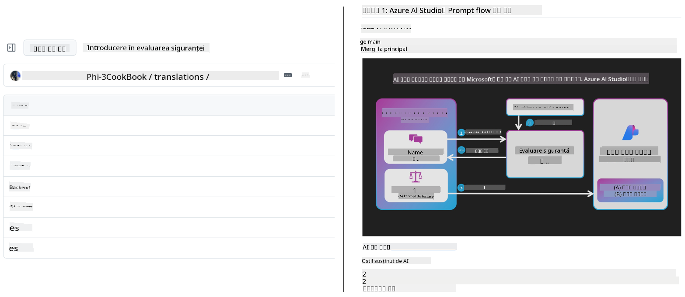
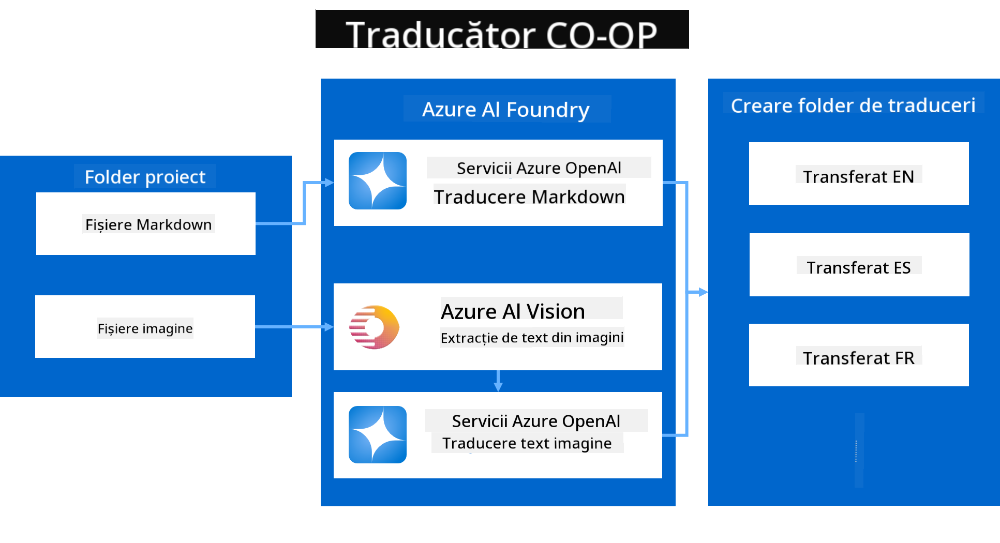
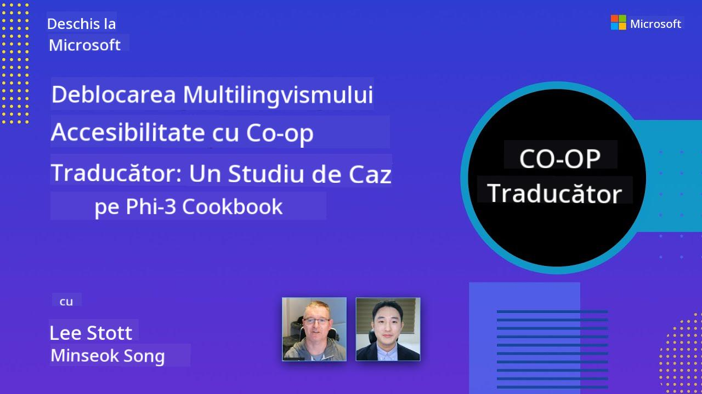

<!--
CO_OP_TRANSLATOR_METADATA:
{
  "original_hash": "044724537b57868117aadae8e7728c7c",
  "translation_date": "2025-06-12T10:50:41+00:00",
  "source_file": "README.md",
  "language_code": "ro"
}
-->


# Co-op Translator: Automatizează traducerea documentației educaționale fără efort

_Automatizează cu ușurință traducerea documentației tale în mai multe limbi pentru a ajunge la un public global._

[](https://pypi.org/project/co-op-translator/)
[](https://github.com/azure/co-op-translator/blob/main/LICENSE)
[](https://pepy.tech/project/co-op-translator)
[](https://pepy.tech/project/co-op-translator)
[](https://github.com/psf/black)

[](https://GitHub.com/azure/co-op-translator/graphs/contributors/)
[](https://GitHub.com/azure/co-op-translator/issues/)
[](https://GitHub.com/azure/co-op-translator/pulls/)
[](http://makeapullrequest.com)

### Suport pentru limbi oferit de Co-op Translator
[Franceză](../fr/README.md) | [Spaniolă](../es/README.md) | [Germană](../de/README.md) | [Rusă](../ru/README.md) | [Arabă](../ar/README.md) | [Persană (Farsi)](../fa/README.md) | [Urdu](../ur/README.md) | [Chineză (Simplificată)](../zh/README.md) | [Chineză (Tradițională, Macau)](../mo/README.md) | [Chineză (Tradițională, Hong Kong)](../hk/README.md) | [Chineză (Tradițională, Taiwan)](../tw/README.md) | [Japoneză](../ja/README.md) | [Coreeană](../ko/README.md) | [Hindi](../hi/README.md) | [Bengaleză](../bn/README.md) | [Marathi](../mr/README.md) | [Nepaleză](../ne/README.md) | [Punjabi (Gurmukhi)](../pa/README.md) | [Portugheză (Portugalia)](../pt/README.md) | [Portugheză (Brazilia)](../br/README.md) | [Italiană](../it/README.md) | [Poloneză](../pl/README.md) | [Turcă](../tr/README.md) | [Greacă](../el/README.md) | [Thailandeză](../th/README.md) | [Suedeză](../sv/README.md) | [Daneză](../da/README.md) | [Norvegiană](../no/README.md) | [Finlandeză](../fi/README.md) | [Olandeză](../nl/README.md) | [Ebraică](../he/README.md) | [Vietnameză](../vi/README.md) | [Indoneziană](../id/README.md) | [Malay](../ms/README.md) | [Tagalog (Filipineză)](../tl/README.md) | [Swahili](../sw/README.md) | [Maghiară](../hu/README.md) | [Cehă](../cs/README.md) | [Slovacă](../sk/README.md) | [Română](./README.md) | [Bulgară](../bg/README.md) | [Sârbă (Chirilică)](../sr/README.md) | [Croată](../hr/README.md) | [Slovenă](../sl/README.md) | [Ucraineană](../uk/README.md) | [Burmese (Myanmar)](../my/README.md)
> [!NOTE]
> Acestea sunt traducerile curente ale conținutului acestui depozit. Pentru o listă completă a limbilor suportate de Co-op Translator, vă rugăm să consultați secțiunea [Language Support](../..).

[](https://GitHub.com/azure/co-op-translator/watchers/)
[](https://GitHub.com/azure/co-op-translator/network/)
[](https://GitHub.com/azure/co-op-translator/stargazers/)

[](https://discord.com/invite/ByRwuEEgH4)

[](https://codespaces.new/azure/co-op-translator)
[](https://vscode.dev/redirect?url=vscode://ms-vscode-remote.remote-containers/cloneInVolume?url=https://github.com/azure/co-op-translator)

## Prezentare generală: Simplifică traducerea conținutului educațional

Barierele lingvistice împiedică semnificativ accesul la resurse educaționale valoroase și la cunoștințe tehnice pentru cursanți și dezvoltatori din întreaga lume. Acest lucru limitează participarea și încetinește ritmul inovației și al învățării la nivel global.

**Co-op Translator** a luat naștere din nevoia de a rezolva procesul ineficient de traducere manuală pentru propriile serii educaționale ample ale Microsoft (precum ghidurile „Pentru Începători”). A evoluat într-un instrument puternic și ușor de folosit, conceput să elimine aceste bariere pentru toată lumea. Oferind traduceri automate de înaltă calitate prin CLI și GitHub Actions, Co-op Translator le permite educatorilor, studenților, cercetătorilor și dezvoltatorilor din întreaga lume să partajeze și să acceseze cunoștințe fără constrângeri lingvistice.

Vezi cum organizează Co-op Translator conținutul educațional tradus:



Fișierele Markdown și textele din imagini sunt traduse automat și organizate ordonat în foldere specifice fiecărei limbi.

**Deschide astăzi accesul global la conținutul tău educațional cu Co-op Translator!**

## Susținerea accesului global la resursele educaționale Microsoft

Co-op Translator ajută la eliminarea barierei lingvistice pentru inițiativele educaționale cheie Microsoft, automatizând procesul de traducere pentru depozitele care deservesc o comunitate globală de dezvoltatori. Exemple de proiecte care folosesc în prezent Co-op Translator includ:

[](https://github.com/microsoft/Generative-AI-for-beginners)
[](https://github.com/microsoft/ML-For-Beginners)
[](https://github.com/microsoft/AI-For-Beginners)
[](https://github.com/microsoft/ai-agents-for-beginners)
[](https://github.com/microsoft/PhiCookBook)
[](https://github.com/microsoft/Generative-AI-for-beginners-dotnet)

## Caracteristici cheie

- **Traduceri automate**: Traduce textul în mai multe limbi fără efort.
- **Integrare GitHub Actions**: Automatizează traducerile ca parte din pipeline-ul tău CI/CD.
- **Păstrarea formatului Markdown**: Menține sintaxa corectă Markdown în timpul traducerii.
- **Traducerea textului din imagini**: Extrage și traduce textul din imagini.
- **Tehnologie avansată LLM**: Folosește modele lingvistice de ultimă generație pentru traduceri de calitate superioară.
- **Integrare ușoară**: Se integrează fără probleme cu configurația ta actuală de proiect.
- **Simplifică localizarea**: Simplifică procesul de localizare a proiectului pentru piețele internaționale.

## Cum funcționează



Co-op Translator preia fișiere Markdown și imagini din folderul proiectului tău și le procesează astfel:

1. **Extracția textului**: Extrage textul din fișierele Markdown și, dacă este configurat (de exemplu, cu Azure AI Vision), și textul încorporat în imagini.
1. **Traducerea AI**: Trimite textul extras către modelul LLM configurat (Azure OpenAI, OpenAI etc.) pentru traducere.
1. **Salvarea rezultatului**: Salvează fișierele Markdown traduse și imaginile (cu text tradus) în foldere specifice limbilor, păstrând formatul original.

## Începe rapid

Începe rapid folosind CLI sau configurează automatizarea completă cu GitHub Actions. Alege metoda care se potrivește cel mai bine fluxului tău de lucru:

1. **Linia de comandă (CLI)** - Pentru traduceri ocazionale sau control manual
2. **GitHub Actions** - Pentru traduceri automate la fiecare push

> [!NOTE]
> Deși acest tutorial se concentrează pe resursele Azure, poți folosi orice model lingvistic suportat.

### Suport pentru limbi

Co-op Translator suportă o gamă largă de limbi pentru a te ajuta să ajungi la un public global. Iată ce trebuie să știi:

#### Referință rapidă

| Limbă | Cod | Limbă | Cod | Limbă | Cod |
|----------|------|----------|------|----------|------|
| Arabică | ar | Bengali | bn | Bulgară | bg |
| Birmaneză (Myanmar) | my | Chineză (Simplificată) | zh | Chineză (Tradițională, HK) | hk |
| Chineză (Tradițională, Macau) | mo | Chineză (Tradițională, TW) | tw | Croată | hr |
| Cehă | cs | Daneză | da | Olandeză | nl |
| Finlandeză | fi | Franceză | fr | Germană | de |
| Greacă | el | Ebraică | he | Hindi | hi |
| Maghiară | hu | Indoneziană | id | Italiană | it |
| Japoneză | ja | Coreeană | ko | Malay | ms |
| Marathi | mr | Nepaleză | ne | Norvegiană | no |
| Persană (Farsi) | fa | Poloneză | pl | Portugheză (Brazilia) | br |
| Portugheză (Portugalia) | pt | Punjabi (Gurmukhi) | pa | Română | ro |
| Rusă | ru | Sârbă (Chirilică) | sr | Slovacă | sk |
| Slovenă | sl | Spaniolă | es | Swahili | sw |
| Suedeză | sv | Tagalog (Filipineză) | tl | Thailandeză | th |
| Turcă | tr | Ucraineană | uk | Urdu | ur |
| Vietnameză | vi | — | — | — | — |

#### Utilizarea codurilor de limbă

Când folosești Co-op Translator, trebuie să specifici limbile folosind codurile lor. De exemplu:

```bash
# Translate to French, Spanish, and German
translate -l "fr es de"

# Translate to Chinese (Simplified) and Japanese
translate -l "zh ja"
```

> [!NOTE]
> Pentru informații tehnice detaliate despre suportul pentru limbi, inclusiv:
>
> - Specificații de font pentru fiecare limbă
> - Probleme cunoscute
> - Cum să adaugi limbi noi
>
> Consultă documentația noastră [Supported Languages Documentation](./getting_started/supported-languages.md).

### Modele și servicii suportate

| Tip                  | Nume                           |
|-----------------------|--------------------------------|
| Model lingvistic        |   |
| AI Vision       |  |

> [!NOTE]
> Dacă un serviciu AI Vision nu este disponibil, co-op translator va trece automat în [modul Markdown-only](./getting_started/markdown-only-mode.md).

### Configurare inițială

Înainte de a începe, va trebui să configurezi următoarele resurse:

1. Resursă Model Lingvistic (Obligatoriu):
   - Azure OpenAI (Recomandat) - Oferă traduceri de înaltă calitate cu fiabilitate la nivel enterprise
   - OpenAI - Opțiune alternativă dacă nu ai acces la Azure
   - Pentru informații detaliate despre modelele suportate, vezi [Supported Models and Services](../..)

1. Resursă AI Vision (Opțional):
   - Azure AI Vision - Permite traducerea textului din imagini
   - Dacă nu este configurat, translatorul va folosi automat [modul Markdown-only](./getting_started/markdown-only-mode.md)
   - Recomandat pentru proiecte cu imagini care conțin text ce trebuie tradus

1. Pași de configurare:
   - Urmează ghidul nostru [Azure AI setup guide](./getting_started/set-up-azure-ai.md) pentru instrucțiuni detaliate
   - Creează un fișier `.env` cu cheile API și endpoint-urile tale (vezi secțiunea [Quick Start](../..))
   - Asigură-te că ai permisiunile și cotele necesare pentru serviciile alese

### Pregătirea proiectului înainte de traducere

Înainte de a începe procesul de traducere, urmează acești pași pentru a-ți pregăti proiectul:

1. Pregătește README-ul:
   - Adaugă un tabel cu traduceri în README.md pentru a lega versiunile traduse
   - Format exemplu:

     ```markdown

     ### 🌐 Multi-Language Support
     
     [French](../fr/README.md) | [Spanish](../es/README.md) | [German](../de/README.md) | [Russian](../ru/README.md) | [Arabic](../ar/README.md) | [Persian (Farsi)](../fa/README.md) | [Urdu](../ur/README.md) | [Chinese (Simplified)](../zh/README.md) | [Chinese (Traditional, Macau)](../mo/README.md) | [Chinese (Traditional, Hong Kong)](../hk/README.md) | [Chinese (Traditional, Taiwan)](../tw/README.md) | [Japanese](../ja/README.md) | [Korean](../ko/README.md) | [Hindi](../hi/README.md) | [Bengali](../bn/README.md) | [Marathi](../mr/README.md) | [Nepali](../ne/README.md) | [Punjabi (Gurmukhi)](../pa/README.md) | [Portuguese (Portugal)](../pt/README.md) | [Portuguese (Brazil)](../br/README.md) | [Italian](../it/README.md) | [Polish](../pl/README.md) | [Turkish](../tr/README.md) | [Greek](../el/README.md) | [Thai](../th/README.md) | [Swedish](../sv/README.md) | [Danish](../da/README.md) | [Norwegian](../no/README.md) | [Finnish](../fi/README.md) | [Dutch](../nl/README.md) | [Hebrew](../he/README.md) | [Vietnamese](../vi/README.md) | [Indonesian](../id/README.md) | [Malay](../ms/README.md) | [Tagalog (Filipino)](../tl/README.md) | [Swahili](../sw/README.md) | [Hungarian](../hu/README.md) | [Czech](../cs/README.md) | [Slovak](../sk/README.md) | [Romanian](./README.md) | [Bulgarian](../bg/README.md) | [Serbian (Cyrillic)](../sr/README.md) | [Croatian](../hr/README.md) | [Slovenian](../sl/README.md) | [Ukrainian](../uk/README.md) | [Burmese (Myanmar)](../my/README.md) 
    
     ```

1. Curățarea traducerilor existente (dacă este necesar):
   - Șterge orice foldere de traduceri existente (ex: `translations/`)
   - Elimină fișierele vechi de traducere pentru a începe de la zero
   - Acest lucru previne conflictele cu noul proces de traducere

### Pornire rapidă: Linia de comandă

Pentru un start rapid folosind linia de comandă:

1. Creează un mediu virtual:

    ```bash
    python -m venv .venv
    ```

1. Activează mediul virtual:

    - Pe Windows:

    ```bash
    .venv\scripts\activate
    ```

    - Pe Linux/macOS:

    ```bash
    source .venv/bin/activate
    ```

1. Instalează pachetul:

    ```bash
    pip install co-op-translator
    ```

1. Configurează acreditările:

    - Creează un fișier `.env` file in your project's root directory.
    - Copy the contents from the [.env.template](../../.env.template) file into your new `.env` file.
    - Fill in the required API keys and endpoint information in your `.env` file.

1. Run Translation:
    - Navigate to your project's root directory in your terminal.
    - Execute the translate command, specifying target languages with the `-l` flag:

    ```bash
    translate -l "ko ja fr"
    ```

    _(Înlocuiește `"ko ja fr"` with your desired space-separated language codes)_

### Detailed Usage Guides

Choose the approach that best fits your workflow:

#### 1. Using the Command Line (CLI)

- Best for: One-time translations, manual control, or integration into custom scripts.
- Requires: Local installation of Python and the `co-op-translator` package.
- Guide: [Command Line Guide](./getting_started/command-line-guide/command-line-guide.md)

#### 2. Using GitHub Actions (Automation)

- Best for: Automatically translating content whenever changes are pushed to your repository. Keeps translations consistently up-to-date.
- Requires: Setting up a workflow file (`.github/workflows`) în depozitul tău. Nu este necesară instalarea locală.
- Ghiduri:
  - [GitHub Actions Guide (Public Repositories & Standard Secrets)](./getting_started/github-actions-guide/github-actions-guide-public.md) - Folosește acest ghid pentru majoritatea depozitelor publice sau personale care se bazează pe secrete standard ale depozitului.
  - [GitHub Actions Guide (Microsoft Organization Repos & Org-Level Setups)](./getting_started/github-actions-guide/github-actions-guide-org.md) - Folosește acest ghid dacă lucrezi în organizația GitHub Microsoft sau ai nevoie să folosești secrete sau runneri la nivel de organizație.

### Depanare și sfaturi

- [Ghid de depanare](./getting_started/troubleshooting.md)

### Resurse suplimentare

- [Referință comandă](./getting_started/command-reference.md): Ghid detaliat pentru toate comenzile și opțiunile disponibile.
- [Limbi suportate](./getting_started/supported-languages.md): Verifică lista limbilor suportate și instrucțiuni pentru adăugarea altora noi.
- [Modul Markdown-only](./getting_started/markdown-only-mode.md): Cum să traduci doar textul, fără traducerea imaginilor.

## Prezentări video

Află mai multe despre Co-op Translator prin prezentările noastre _(Click pe imaginea de mai jos pentru a viziona pe YouTube.)_:

- **Open at Microsoft**: O introducere scurtă de 18 minute și un ghid rapid despre cum să folosești Co-op Translator.
[](https://www.youtube.com/watch?v=jX_swfH_KNU)

## Susține-ne și promovează învățarea globală

Alătură-te nouă în revoluționarea modului în care conținutul educațional este distribuit la nivel global! Oferă [Co-op Translator](https://github.com/azure/co-op-translator) un ⭐ pe GitHub și susține misiunea noastră de a elimina barierele lingvistice în învățare și tehnologie. Interesul și contribuțiile tale au un impact semnificativ! Contribuțiile de cod și sugestiile de funcționalități sunt întotdeauna binevenite.

## Contribuții

Acest proiect primește cu plăcere contribuții și sugestii. Ești interesat să contribui la Azure Co-op Translator? Te rugăm să consulți [CONTRIBUTING.md](./CONTRIBUTING.md) pentru ghiduri despre cum poți ajuta la creșterea accesibilității Co-op Translator.

## Contribuitori

[](https://github.com/Azure/co-op-translator/graphs/contributors)

## Cod de conduită

Acest proiect a adoptat [Microsoft Open Source Code of Conduct](https://opensource.microsoft.com/codeofconduct/).
Pentru mai multe informații, vezi [Code of Conduct FAQ](https://opensource.microsoft.com/codeofconduct/faq/) sau contactează [opencode@microsoft.com](mailto:opencode@microsoft.com) pentru întrebări sau comentarii suplimentare.

## Inteligență Artificială Responsabilă

Microsoft se angajează să ajute clienții să utilizeze produsele noastre AI în mod responsabil, împărtășind experiențele noastre și construind parteneriate bazate pe încredere prin instrumente precum Transparency Notes și Impact Assessments. Multe dintre aceste resurse pot fi găsite la [https://aka.ms/RAI](https://aka.ms/RAI).  
Abordarea Microsoft pentru AI responsabilă se bazează pe principiile noastre de corectitudine, fiabilitate și siguranță, confidențialitate și securitate, incluziune, transparență și responsabilitate.

Modelele de limbaj natural, imagine și voce la scară largă – precum cele folosite în acest exemplu – pot avea comportamente care sunt nedrepte, nesigure sau ofensatoare, cauzând astfel prejudicii. Te rugăm să consulți [Azure OpenAI service Transparency note](https://learn.microsoft.com/legal/cognitive-services/openai/transparency-note?tabs=text) pentru a fi informat despre riscuri și limitări.

Abordarea recomandată pentru a reduce aceste riscuri este să incluzi în arhitectura ta un sistem de siguranță care să poată detecta și preveni comportamentele dăunătoare. [Azure AI Content Safety](https://learn.microsoft.com/azure/ai-services/content-safety/overview) oferă un strat independent de protecție, capabil să detecteze conținut dăunător generat de utilizatori sau de AI în aplicații și servicii. Azure AI Content Safety include API-uri pentru text și imagine care permit detectarea materialelor dăunătoare. De asemenea, avem un Content Safety Studio interactiv care îți permite să vizualizezi, să explorezi și să testezi coduri exemplu pentru detectarea conținutului dăunător în diverse modalități. Următoarea [documentație quickstart](https://learn.microsoft.com/azure/ai-services/content-safety/quickstart-text?tabs=visual-studio%2Clinux&pivots=programming-language-rest) te ghidează pas cu pas în realizarea cererilor către serviciu.

Un alt aspect de luat în considerare este performanța generală a aplicației. În cazul aplicațiilor multimodale și cu mai multe modele, performanța înseamnă că sistemul funcționează așa cum te aștepți tu și utilizatorii tăi, inclusiv să nu genereze rezultate dăunătoare. Este important să evaluezi performanța aplicației tale folosind [metrici de calitate a generării și de risc și siguranță](https://learn.microsoft.com/azure/ai-studio/concepts/evaluation-metrics-built-in).

Poți evalua aplicația ta AI în mediul de dezvoltare folosind [prompt flow SDK](https://microsoft.github.io/promptflow/index.html). Fie că ai un set de date de test sau un obiectiv, generațiile aplicației tale AI generative sunt măsurate cantitativ cu evaluatori încorporați sau evaluatori personalizați la alegere. Pentru a începe să folosești prompt flow SDK pentru a evalua sistemul tău, poți urma [ghidul quickstart](https://learn.microsoft.com/azure/ai-studio/how-to/develop/flow-evaluate-sdk). După ce rulezi o evaluare, poți [vizualiza rezultatele în Azure AI Studio](https://learn.microsoft.com/azure/ai-studio/how-to/evaluate-flow-results).

## Mărci comerciale

Acest proiect poate conține mărci comerciale sau logo-uri pentru proiecte, produse sau servicii. Utilizarea autorizată a mărcilor comerciale sau logo-urilor Microsoft este supusă și trebuie să respecte [Microsoft's Trademark & Brand Guidelines](https://www.microsoft.com/en-us/legal/intellectualproperty/trademarks/usage/general).  
Utilizarea mărcilor comerciale sau logo-urilor Microsoft în versiuni modificate ale acestui proiect nu trebuie să creeze confuzie sau să sugereze sponsorizarea de către Microsoft.  
Orice utilizare a mărcilor comerciale sau logo-urilor unor terțe părți este supusă politicilor acelor terțe părți.

**Declinare a responsabilității**:  
Acest document a fost tradus folosind serviciul de traducere AI [Co-op Translator](https://github.com/Azure/co-op-translator). Deși ne străduim pentru acuratețe, vă rugăm să țineți cont că traducerile automate pot conține erori sau inexactități. Documentul original, în limba sa nativă, trebuie considerat sursa autoritară. Pentru informații critice, se recomandă traducerea profesională realizată de un specialist uman. Nu ne asumăm răspunderea pentru eventualele neînțelegeri sau interpretări greșite rezultate din utilizarea acestei traduceri.