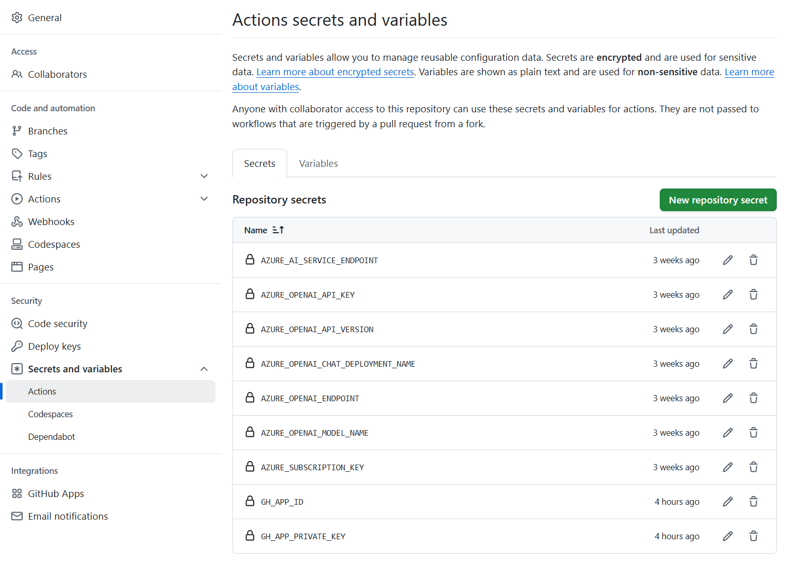

<!--
CO_OP_TRANSLATOR_METADATA:
{
  "original_hash": "9fac847815936ef6e6c8bfde6d191571",
  "translation_date": "2025-10-15T03:58:39+00:00",
  "source_file": "getting_started/github-actions-guide/github-actions-guide-org.md",
  "language_code": "ro"
}
-->
# Utilizarea acțiunii GitHub Co-op Translator (Ghid pentru organizații)

**Public țintă:** Acest ghid este destinat **utilizatorilor interni Microsoft** sau **echipelor care au acces la acreditările necesare pentru aplicația GitHub Co-op Translator preconfigurată** sau pot crea propria lor aplicație GitHub personalizată.

Automatizează traducerea documentației din repository-ul tău cu ușurință folosind acțiunea GitHub Co-op Translator. Acest ghid te ghidează pas cu pas pentru a configura acțiunea astfel încât să creeze automat pull request-uri cu traduceri actualizate ori de câte ori fișierele tale sursă Markdown sau imaginile se modifică.

> [!IMPORTANT]
> 
> **Alegerea ghidului potrivit:**
>
> Acest ghid detaliază configurarea folosind un **GitHub App ID și o cheie privată**. De obicei, ai nevoie de această metodă "Ghid pentru organizații" dacă: **`GITHUB_TOKEN` are permisiuni restricționate:** Setările organizației sau ale repository-ului tău restricționează permisiunile implicite acordate de `GITHUB_TOKEN`. Mai exact, dacă `GITHUB_TOKEN` nu are permisiunile necesare de `write` (cum ar fi `contents: write` sau `pull-requests: write`), workflow-ul din [Ghidul Public de Configurare](./github-actions-guide-public.md) va eșua din cauza permisiunilor insuficiente. Utilizarea unei aplicații GitHub dedicate cu permisiuni acordate explicit ocolește această limitare.
>
> **Dacă cele de mai sus nu se aplică:**
>
> Dacă `GITHUB_TOKEN` standard are permisiuni suficiente în repository-ul tău (adică nu ești blocat de restricții organizaționale), folosește **[Ghidul Public de Configurare folosind GITHUB_TOKEN](./github-actions-guide-public.md)**. Ghidul public nu necesită obținerea sau gestionarea App ID-urilor sau a cheilor private și se bazează doar pe `GITHUB_TOKEN` standard și permisiunile repository-ului.

## Cerințe preliminare

Înainte de a configura acțiunea GitHub, asigură-te că ai pregătite acreditările necesare pentru serviciul AI.

**1. Obligatoriu: Acreditări pentru modelul AI de limbaj**
Ai nevoie de acreditări pentru cel puțin un model de limbaj suportat:

- **Azure OpenAI**: Necesită Endpoint, API Key, Nume Model/Deployment, Versiune API.
- **OpenAI**: Necesită API Key, (Opțional: Org ID, Base URL, Model ID).
- Vezi [Modele și servicii suportate](../../../../README.md) pentru detalii.
- Ghid de configurare: [Configurare Azure OpenAI](../set-up-resources/set-up-azure-openai.md).

**2. Opțional: Acreditări Computer Vision (pentru traducerea imaginilor)**

- Necesare doar dacă vrei să traduci text din imagini.
- **Azure Computer Vision**: Necesită Endpoint și Subscription Key.
- Dacă nu sunt furnizate, acțiunea va funcționa în [mod doar Markdown](../markdown-only-mode.md).
- Ghid de configurare: [Configurare Azure Computer Vision](../set-up-resources/set-up-azure-computer-vision.md).

## Configurare și setare

Urmează acești pași pentru a configura acțiunea GitHub Co-op Translator în repository-ul tău:

### Pasul 1: Instalează și configurează autentificarea cu GitHub App

Workflow-ul folosește autentificarea cu GitHub App pentru a interacționa în siguranță cu repository-ul tău (ex: pentru a crea pull request-uri) în numele tău. Alege una dintre opțiuni:

#### **Opțiunea A: Instalează aplicația GitHub Co-op Translator preconfigurată (pentru uz intern Microsoft)**

1. Accesează pagina [Co-op Translator GitHub App](https://github.com/apps/co-op-translator).

1. Selectează **Install** și alege contul sau organizația unde se află repository-ul țintă.

    

1. Alege **Only select repositories** și selectează repository-ul țintă (ex: `PhiCookBook`). Apasă **Install**. Este posibil să ți se ceară autentificarea.

    

1. **Obține acreditările aplicației (proces intern necesar):** Pentru ca workflow-ul să se poată autentifica ca aplicație, ai nevoie de două informații furnizate de echipa Co-op Translator:
  - **App ID:** Identificatorul unic al aplicației Co-op Translator. App ID-ul este: `1164076`.
  - **Cheie privată:** Trebuie să obții **conținutul complet** al fișierului privat `.pem` de la persoana de contact responsabilă. **Tratează această cheie ca pe o parolă și păstreaz-o în siguranță.**

1. Continuă cu Pasul 2.

#### **Opțiunea B: Folosește propria ta aplicație GitHub personalizată**

- Dacă preferi, poți crea și configura propria ta aplicație GitHub. Asigură-te că are acces Read & write la Contents și Pull requests. Vei avea nevoie de App ID-ul și cheia privată generată.

### Pasul 2: Configurează secretele repository-ului

Trebuie să adaugi acreditările aplicației GitHub și acreditările serviciului AI ca secrete criptate în setările repository-ului tău.

1. Accesează repository-ul tău GitHub țintă (ex: `PhiCookBook`).

1. Mergi la **Settings** > **Secrets and variables** > **Actions**.

1. Sub **Repository secrets**, apasă **New repository secret** pentru fiecare secret din lista de mai jos.

   

**Secrete necesare (pentru autentificarea cu GitHub App):**

| Nume secret          | Descriere                                      | Sursa valorii                                     |
| :------------------- | :--------------------------------------------- | :------------------------------------------------ |
| `GH_APP_ID`          | App ID-ul aplicației GitHub (de la Pasul 1).   | Setările aplicației GitHub                        |
| `GH_APP_PRIVATE_KEY` | **Conținutul complet** al fișierului `.pem` descărcat. | Fișierul `.pem` (de la Pasul 1)                |

**Secrete pentru serviciile AI (Adaugă TOATE care se aplică în funcție de cerințele tale):**

| Nume secret                         | Descriere                               | Sursa valorii                     |
| :---------------------------------- | :-------------------------------------- | :--------------------------------- |
| `AZURE_AI_SERVICE_API_KEY`            | Cheie pentru Azure AI Service (Computer Vision)  | Azure AI Foundry                  |
| `AZURE_AI_SERVICE_ENDPOINT`         | Endpoint pentru Azure AI Service (Computer Vision) | Azure AI Foundry                 |
| `AZURE_OPENAI_API_KEY`              | Cheie pentru serviciul Azure OpenAI     | Azure AI Foundry                  |
| `AZURE_OPENAI_ENDPOINT`             | Endpoint pentru serviciul Azure OpenAI  | Azure AI Foundry                  |
| `AZURE_OPENAI_MODEL_NAME`           | Numele modelului Azure OpenAI           | Azure AI Foundry                  |
| `AZURE_OPENAI_CHAT_DEPLOYMENT_NAME` | Numele deployment-ului Azure OpenAI     | Azure AI Foundry                  |
| `AZURE_OPENAI_API_VERSION`          | Versiunea API pentru Azure OpenAI       | Azure AI Foundry                  |
| `OPENAI_API_KEY`                    | Cheie API pentru OpenAI                 | OpenAI Platform                   |
| `OPENAI_ORG_ID`                     | ID-ul organizației OpenAI               | OpenAI Platform                   |
| `OPENAI_CHAT_MODEL_ID`              | ID-ul modelului OpenAI specific         | OpenAI Platform                   |
| `OPENAI_BASE_URL`                   | URL de bază personalizat pentru OpenAI  | OpenAI Platform                   |



### Pasul 3: Creează fișierul workflow

În final, creează fișierul YAML care definește workflow-ul automatizat.

1. În directorul rădăcină al repository-ului tău, creează directorul `.github/workflows/` dacă nu există deja.

1. În interiorul `.github/workflows/`, creează un fișier numit `co-op-translator.yml`.

1. Lipește următorul conținut în co-op-translator.yml.

```
name: Co-op Translator

on:
  push:
    branches:
      - main

jobs:
  co-op-translator:
    runs-on: ubuntu-latest

    permissions:
      contents: write
      pull-requests: write

    steps:
      - name: Checkout repository
        uses: actions/checkout@v4
        with:
          fetch-depth: 0

      - name: Set up Python
        uses: actions/setup-python@v4
        with:
          python-version: '3.10'

      - name: Install Co-op Translator
        run: |
          python -m pip install --upgrade pip
          pip install co-op-translator

      - name: Run Co-op Translator
        env:
          PYTHONIOENCODING: utf-8
          # Azure AI Service Credentials
          AZURE_AI_SERVICE_API_KEY: ${{ secrets.AZURE_AI_SERVICE_API_KEY }}
          AZURE_AI_SERVICE_ENDPOINT: ${{ secrets.AZURE_AI_SERVICE_ENDPOINT }}

          # Azure OpenAI Credentials
          AZURE_OPENAI_API_KEY: ${{ secrets.AZURE_OPENAI_API_KEY }}
          AZURE_OPENAI_ENDPOINT: ${{ secrets.AZURE_OPENAI_ENDPOINT }}
          AZURE_OPENAI_MODEL_NAME: ${{ secrets.AZURE_OPENAI_MODEL_NAME }}
          AZURE_OPENAI_CHAT_DEPLOYMENT_NAME: ${{ secrets.AZURE_OPENAI_CHAT_DEPLOYMENT_NAME }}
          AZURE_OPENAI_API_VERSION: ${{ secrets.AZURE_OPENAI_API_VERSION }}

          # OpenAI Credentials
          OPENAI_API_KEY: ${{ secrets.OPENAI_API_KEY }}
          OPENAI_ORG_ID: ${{ secrets.OPENAI_ORG_ID }}
          OPENAI_CHAT_MODEL_ID: ${{ secrets.OPENAI_CHAT_MODEL_ID }}
          OPENAI_BASE_URL: ${{ secrets.OPENAI_BASE_URL }}
        run: |
          # =====================================================================
          # IMPORTANT: Set your target languages here (REQUIRED CONFIGURATION)
          # =====================================================================
          # Example: Translate to Spanish, French, German. Add -y to auto-confirm.
          translate -l "es fr de" -y  # <--- MODIFY THIS LINE with your desired languages

      - name: Authenticate GitHub App
        id: generate_token
        uses: tibdex/github-app-token@v1
        with:
          app_id: ${{ secrets.GH_APP_ID }}
          private_key: ${{ secrets.GH_APP_PRIVATE_KEY }}

      - name: Create Pull Request with translations
        uses: peter-evans/create-pull-request@v5
        with:
          token: ${{ steps.generate_token.outputs.token }}
          commit-message: "🌐 Update translations via Co-op Translator"
          title: "🌐 Update translations via Co-op Translator"
          body: |
            This PR updates translations for recent changes to the main branch.

            ### 📋 Changes included
            - Translated contents are available in the `translations/` directory
            - Translated images are available in the `translated_images/` directory

            ---
            🌐 Automatically generated by the [Co-op Translator](https://github.com/Azure/co-op-translator) GitHub Action.
          branch: update-translations
          base: main
          labels: translation, automated-pr
          delete-branch: true
          add-paths: |
            translations/
            translated_images/

```

4.  **Personalizează workflow-ul:**
  - **[!IMPORTANT] Limbile țintă:** În pasul `Run Co-op Translator`, **TREBUIE să verifici și să modifici lista codurilor de limbă** din comanda `translate -l "..." -y` pentru a corespunde cerințelor proiectului tău. Lista exemplu (`ar de es...`) trebuie înlocuită sau ajustată.
  - **Trigger (`on:`):** Trigger-ul actual rulează la fiecare push pe `main`. Pentru repository-uri mari, ia în considerare adăugarea unui filtru `paths:` (vezi exemplul comentat din YAML) pentru a rula workflow-ul doar când se modifică fișiere relevante (ex: documentația sursă), economisind minutele runner-ului.
  - **Detalii PR:** Personalizează `commit-message`, `title`, `body`, numele `branch`-ului și `labels` din pasul `Create Pull Request` dacă este necesar.

## Gestionarea și reînnoirea acreditărilor

- **Securitate:** Stochează întotdeauna acreditările sensibile (chei API, chei private) ca secrete GitHub Actions. Nu le expune niciodată în fișierul workflow sau în codul repository-ului.
- **[!IMPORTANT] Reînnoirea cheilor (utilizatori interni Microsoft):** Fii conștient că cheia Azure OpenAI folosită intern la Microsoft poate avea o politică obligatorie de reînnoire (ex: la fiecare 5 luni). Asigură-te că actualizezi secretele GitHub corespunzătoare (`AZURE_OPENAI_...`) **înainte să expire** pentru a preveni eșuarea workflow-ului.

## Rularea workflow-ului

> [!WARNING]  
> **Limită de timp pentru runner-ul găzduit de GitHub:**  
> Runner-ele găzduite de GitHub, cum ar fi `ubuntu-latest`, au o **limită maximă de execuție de 6 ore**.  
> Pentru repository-uri mari de documentație, dacă procesul de traducere depășește 6 ore, workflow-ul va fi terminat automat.  
> Pentru a preveni acest lucru, ia în considerare:  
> - Utilizarea unui **runner self-hosted** (fără limită de timp)  
> - Reducerea numărului de limbi țintă per execuție

După ce fișierul `co-op-translator.yml` este integrat în ramura principală (sau ramura specificată în trigger-ul `on:`), workflow-ul va rula automat ori de câte ori se fac modificări pe acea ramură (și se respectă filtrul `paths`, dacă este configurat).

Dacă se generează sau se actualizează traduceri, acțiunea va crea automat un Pull Request cu modificările, gata pentru revizuirea și integrarea ta.

---

**Declarație de responsabilitate**:
Acest document a fost tradus folosind serviciul de traducere AI [Co-op Translator](https://github.com/Azure/co-op-translator). Deși ne străduim să asigurăm acuratețea, vă rugăm să rețineți că traducerile automate pot conține erori sau inexactități. Documentul original, în limba sa nativă, trebuie considerat sursa autoritară. Pentru informații critice, se recomandă traducerea profesională realizată de oameni. Nu ne asumăm răspunderea pentru orice neînțelegeri sau interpretări greșite care pot apărea din utilizarea acestei traduceri.