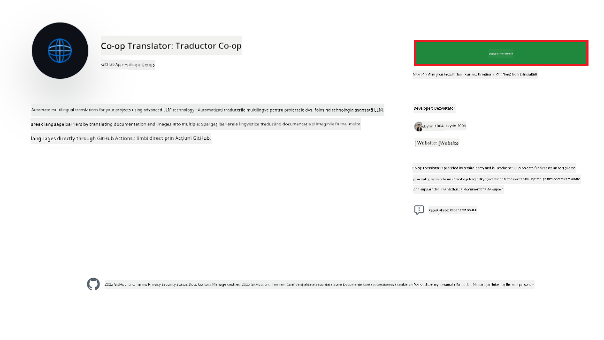
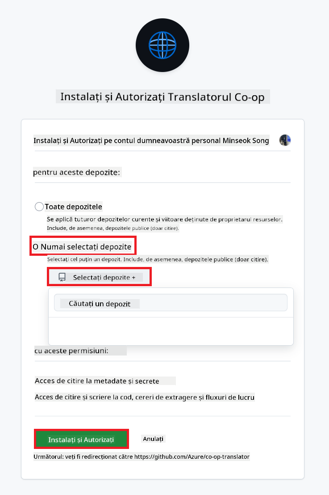
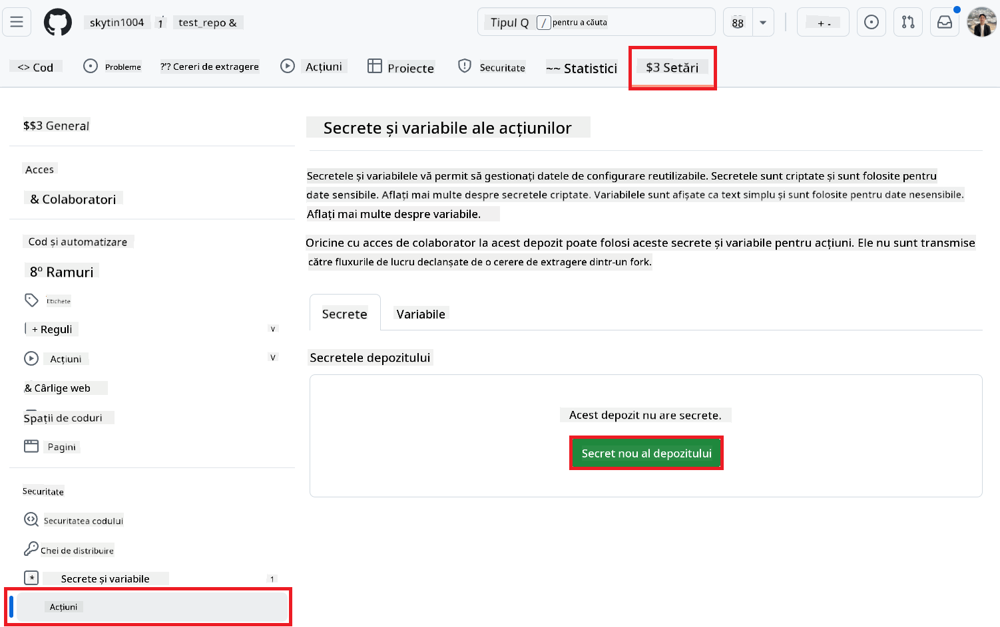
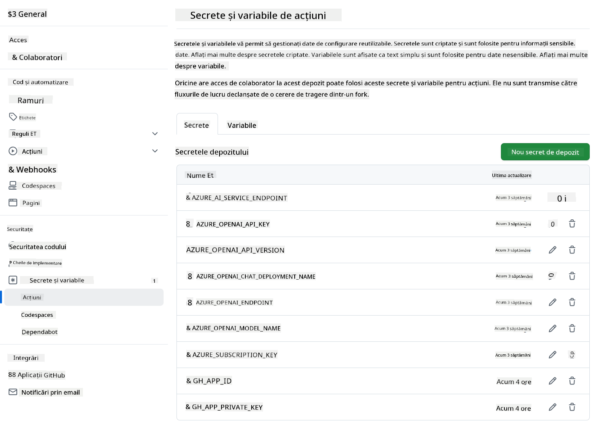

<!--
CO_OP_TRANSLATOR_METADATA:
{
  "original_hash": "c437820027c197f25fb2cbee95bae28c",
  "translation_date": "2025-06-12T19:17:14+00:00",
  "source_file": "getting_started/github-actions-guide/github-actions-guide-org.md",
  "language_code": "ro"
}
-->
# Utilizarea acțiunii GitHub Co-op Translator (Ghid pentru organizații)

**Public țintă:** Acest ghid este destinat **utilizatorilor interni Microsoft** sau **echipelor care au acces la acreditările necesare pentru aplicația GitHub Co-op Translator preconfigurată** sau pot crea propria aplicație GitHub personalizată.

Automatizează traducerea documentației din depozitul tău fără efort folosind acțiunea GitHub Co-op Translator. Acest ghid te conduce pas cu pas în configurarea acțiunii pentru a crea automat cereri de pull cu traduceri actualizate ori de câte ori se modifică fișierele Markdown sursă sau imaginile.

> [!IMPORTANT]
> 
> **Alegerea ghidului potrivit:**
>
> Acest ghid descrie configurarea folosind **un App ID GitHub și o cheie privată**. În mod obișnuit, ai nevoie de această metodă „Ghid pentru organizații” dacă: **`GITHUB_TOKEN` Permisiunile sunt restricționate:** Setările organizației sau ale depozitului restricționează permisiunile implicite acordate contului standard `GITHUB_TOKEN`. Mai exact, dacă `GITHUB_TOKEN` nu are permisiunile necesare `write` (cum ar fi `contents: write` sau `pull-requests: write`), fluxul de lucru din [Ghidul public de configurare](./github-actions-guide-public.md) va eșua din cauza permisiunilor insuficiente. Utilizarea unei aplicații GitHub dedicate cu permisiuni acordate explicit evită această limitare.
>
> **Dacă cele de mai sus nu se aplică:**
>
> Dacă contul standard `GITHUB_TOKEN` are permisiunile necesare în depozitul tău (adică nu ești blocat de restricții organizaționale), folosește **[Ghidul public de configurare folosind GITHUB_TOKEN](./github-actions-guide-public.md)**. Ghidul public nu necesită obținerea sau gestionarea App ID-urilor sau cheilor private și se bazează doar pe contul standard `GITHUB_TOKEN` și permisiunile depozitului.

## Cerințe preliminare

Înainte de a configura acțiunea GitHub, asigură-te că ai pregătite acreditările necesare pentru serviciile AI.

**1. Obligatoriu: Acreditări pentru modelul de limbaj AI**  
Ai nevoie de acreditări pentru cel puțin un model de limbaj acceptat:

- **Azure OpenAI**: Necesită Endpoint, Cheie API, Numele modelului/deployment-ului, versiunea API.
- **OpenAI**: Necesită Cheie API, (Opțional: ID organizație, URL de bază, ID model).
- Consultă [Modele și servicii acceptate](../../../../README.md) pentru detalii.
- Ghid de configurare: [Configurare Azure OpenAI](../set-up-resources/set-up-azure-openai.md).

**2. Opțional: Acreditări Computer Vision (pentru traducerea imaginilor)**

- Necesare doar dacă dorești să traduci textul din imagini.
- **Azure Computer Vision**: Necesită Endpoint și Cheie de abonament.
- Dacă nu sunt furnizate, acțiunea folosește implicit [modul doar Markdown](../markdown-only-mode.md).
- Ghid de configurare: [Configurare Azure Computer Vision](../set-up-resources/set-up-azure-computer-vision.md).

## Configurare și instalare

Urmează acești pași pentru a configura acțiunea GitHub Co-op Translator în depozitul tău:

### Pasul 1: Instalează și configurează autentificarea cu GitHub App

Fluxul de lucru folosește autentificarea prin GitHub App pentru a interacționa în siguranță cu depozitul tău (ex: creare cereri de pull) în numele tău. Alege o opțiune:

#### **Opțiunea A: Instalează aplicația GitHub Co-op Translator preconfigurată (pentru uz intern Microsoft)**

1. Accesează pagina [Co-op Translator GitHub App](https://github.com/apps/co-op-translator).

1. Selectează **Install** și alege contul sau organizația unde se află depozitul țintă.

    

1. Alege **Only select repositories** și selectează depozitul țintă (ex: `PhiCookBook`). Apasă **Install**. Este posibil să ți se ceară autentificare.

    

1. **Obține acreditările aplicației (proces intern necesar):** Pentru ca fluxul să se autentifice ca aplicație, ai nevoie de două informații oferite de echipa Co-op Translator:
  - **App ID:** Identificatorul unic al aplicației Co-op Translator. App ID este: `1164076`.
  - **Cheie privată:** Trebuie să obții **conținutul complet** al fișierului de cheie privată `.pem` de la persoana de contact responsabilă. **Tratează această cheie ca o parolă și păstreaz-o în siguranță.**

1. Continuă cu Pasul 2.

#### **Opțiunea B: Folosește propria aplicație GitHub personalizată**

- Dacă dorești, poți crea și configura propria aplicație GitHub. Asigură-te că are acces de citire și scriere la Contents și Pull requests. Vei avea nevoie de App ID și o cheie privată generată.

### Pasul 2: Configurează secretele depozitului

Trebuie să adaugi acreditările aplicației GitHub și cele ale serviciilor AI ca secrete criptate în setările depozitului tău.

1. Accesează depozitul GitHub țintă (ex: `PhiCookBook`).

1. Mergi la **Settings** > **Secrets and variables** > **Actions**.

1. La **Repository secrets**, apasă **New repository secret** pentru fiecare secret din lista de mai jos.

   

**Secrete obligatorii (pentru autentificarea GitHub App):**

| Nume secret          | Descriere                                      | Sursa valorii                                  |
| :------------------- | :--------------------------------------------- | :--------------------------------------------- |
| `GH_APP_ID`          | App ID al aplicației GitHub (din Pasul 1).       | Setările aplicației GitHub                      |
| `GH_APP_PRIVATE_KEY` | **Conținutul complet** al fișierului `.pem` descărcat. | Fișierul `.pem` (din Pasul 1)           |

**Secrete pentru serviciile AI (Adaugă TOATE cele care se aplică conform cerințelor tale):**

| Nume secret                         | Descriere                               | Sursa valorii                     |
| :---------------------------------- | :-------------------------------------- | :------------------------------- |
| `AZURE_SUBSCRIPTION_KEY`            | Cheie pentru serviciul Azure AI (Computer Vision)  | Azure AI Foundry                    |
| `AZURE_AI_SERVICE_ENDPOINT`         | Endpoint pentru serviciul Azure AI (Computer Vision) | Azure AI Foundry                     |
| `AZURE_OPENAI_API_KEY`              | Cheie pentru serviciul Azure OpenAI              | Azure AI Foundry                     |
| `AZURE_OPENAI_ENDPOINT`             | Endpoint pentru serviciul Azure OpenAI         | Azure AI Foundry                     |
| `AZURE_OPENAI_MODEL_NAME`           | Numele modelului Azure OpenAI              | Azure AI Foundry                     |
| `AZURE_OPENAI_CHAT_DEPLOYMENT_NAME` | Numele deployment-ului Azure OpenAI         | Azure AI Foundry                     |
| `AZURE_OPENAI_API_VERSION`          | Versiunea API pentru Azure OpenAI              | Azure AI Foundry                     |
| `OPENAI_API_KEY`                    | Cheie API pentru OpenAI                        | OpenAI Platform                  |
| `OPENAI_ORG_ID`                     | ID organizație OpenAI                    | OpenAI Platform                  |
| `OPENAI_CHAT_MODEL_ID`              | ID model OpenAI specific                  | OpenAI Platform                    |
| `OPENAI_BASE_URL`                   | URL personalizat pentru API-ul OpenAI                | OpenAI Platform                    |



### Pasul 3: Creează fișierul de workflow

În final, creează fișierul YAML care definește fluxul de lucru automatizat.

1. În directorul rădăcină al depozitului, creează directorul `.github/workflows/` dacă nu există.

1. În interiorul `.github/workflows/`, creează un fișier numit `co-op-translator.yml`.

1. Lipește următorul conținut în co-op-translator.yml.

```
name: Co-op Translator

on:
  push:
    branches:
      - main

jobs:
  co-op-translator:
    runs-on: ubuntu-latest

    permissions:
      contents: write
      pull-requests: write

    steps:
      - name: Checkout repository
        uses: actions/checkout@v4
        with:
          fetch-depth: 0

      - name: Set up Python
        uses: actions/setup-python@v4
        with:
          python-version: '3.10'

      - name: Install Co-op Translator
        run: |
          python -m pip install --upgrade pip
          pip install co-op-translator

      - name: Run Co-op Translator
        env:
          PYTHONIOENCODING: utf-8
          # Azure AI Service Credentials
          AZURE_SUBSCRIPTION_KEY: ${{ secrets.AZURE_SUBSCRIPTION_KEY }}
          AZURE_AI_SERVICE_ENDPOINT: ${{ secrets.AZURE_AI_SERVICE_ENDPOINT }}

          # Azure OpenAI Credentials
          AZURE_OPENAI_API_KEY: ${{ secrets.AZURE_OPENAI_API_KEY }}
          AZURE_OPENAI_ENDPOINT: ${{ secrets.AZURE_OPENAI_ENDPOINT }}
          AZURE_OPENAI_MODEL_NAME: ${{ secrets.AZURE_OPENAI_MODEL_NAME }}
          AZURE_OPENAI_CHAT_DEPLOYMENT_NAME: ${{ secrets.AZURE_OPENAI_CHAT_DEPLOYMENT_NAME }}
          AZURE_OPENAI_API_VERSION: ${{ secrets.AZURE_OPENAI_API_VERSION }}

          # OpenAI Credentials
          OPENAI_API_KEY: ${{ secrets.OPENAI_API_KEY }}
          OPENAI_ORG_ID: ${{ secrets.OPENAI_ORG_ID }}
          OPENAI_CHAT_MODEL_ID: ${{ secrets.OPENAI_CHAT_MODEL_ID }}
          OPENAI_BASE_URL: ${{ secrets.OPENAI_BASE_URL }}
        run: |
          # =====================================================================
          # IMPORTANT: Set your target languages here (REQUIRED CONFIGURATION)
          # =====================================================================
          # Example: Translate to Spanish, French, German. Add -y to auto-confirm.
          translate -l "es fr de" -y  # <--- MODIFY THIS LINE with your desired languages

      - name: Authenticate GitHub App
        id: generate_token
        uses: tibdex/github-app-token@v1
        with:
          app_id: ${{ secrets.GH_APP_ID }}
          private_key: ${{ secrets.GH_APP_PRIVATE_KEY }}

      - name: Create Pull Request with translations
        uses: peter-evans/create-pull-request@v5
        with:
          token: ${{ steps.generate_token.outputs.token }}
          commit-message: "🌐 Update translations via Co-op Translator"
          title: "🌐 Update translations via Co-op Translator"
          body: |
            This PR updates translations for recent changes to the main branch.

            ### 📋 Changes included
            - Translated contents are available in the `translations/` directory
            - Translated images are available in the `translated_images/` directory

            ---
            🌐 Automatically generated by the [Co-op Translator](https://github.com/Azure/co-op-translator) GitHub Action.
          branch: update-translations
          base: main
          labels: translation, automated-pr
          delete-branch: true
          add-paths: |
            translations/
            translated_images/

```

4.  **Personalizează fluxul de lucru:**
  - **[!IMPORTANT] Limbi țintă:** În comanda `Run Co-op Translator` step, you **MUST review and modify the list of language codes** within the `translate -l "..." -y` command to match your project's requirements. The example list (`ar de es...`) needs to be replaced or adjusted.
  - **Trigger (`on:`):** The current trigger runs on every push to `main`. For large repositories, consider adding a `paths:` filter (see commented example in the YAML) to run the workflow only when relevant files (e.g., source documentation) change, saving runner minutes.
  - **PR Details:** Customize the `commit-message`, `title`, `body`, `branch` name, and `labels` in the `Create Pull Request` step if needed.

## Credential Management and Renewal

- **Security:** Always store sensitive credentials (API keys, private keys) as GitHub Actions secrets. Never expose them in your workflow file or repository code.
- **[!IMPORTANT] Key Renewal (Internal Microsoft Users):** Be aware that Azure OpenAI key used within Microsoft might have a mandatory renewal policy (e.g., every 5 months). Ensure you update the corresponding GitHub secrets (`AZURE_OPENAI_...` configurează limbile în care vrei să traduci **înainte ca cheile să expire** pentru a evita eșecuri ale fluxului.

## Rularea fluxului de lucru

Odată ce fișierul `co-op-translator.yml` este integrat în ramura principală (sau în ramura specificată în filtrul `on:` trigger), the workflow will automatically run whenever changes are pushed to that branch (and match the `paths`, dacă este configurat),

dacă se generează sau actualizează traduceri, acțiunea va crea automat o cerere de pull cu modificările, gata pentru revizuirea și integrarea ta.

**Declinare de responsabilitate**:  
Acest document a fost tradus folosind serviciul de traducere AI [Co-op Translator](https://github.com/Azure/co-op-translator). Deși ne străduim pentru acuratețe, vă rugăm să rețineți că traducerile automate pot conține erori sau inexactități. Documentul original în limba sa nativă trebuie considerat sursa autoritară. Pentru informații critice, se recomandă traducerea profesională realizată de un specialist uman. Nu ne asumăm responsabilitatea pentru eventualele neînțelegeri sau interpretări greșite rezultate din utilizarea acestei traduceri.