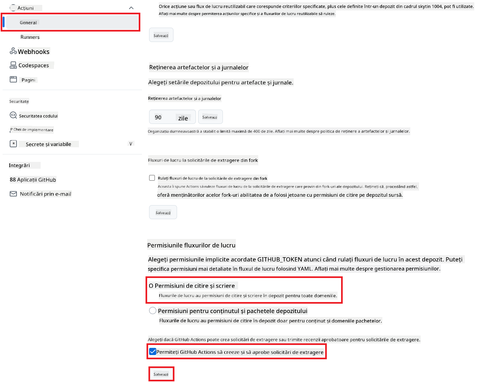

<!--
CO_OP_TRANSLATOR_METADATA:
{
  "original_hash": "a52587a512e667f70d92db853d3c61d5",
  "translation_date": "2025-06-12T19:34:38+00:00",
  "source_file": "getting_started/github-actions-guide/github-actions-guide-public.md",
  "language_code": "ro"
}
-->
# Utilizarea Acțiunii Co-op Translator GitHub (Configurare Publică)

**Public țintă:** Acest ghid este destinat utilizatorilor din majoritatea depozitelor publice sau private unde permisiunile standard GitHub Actions sunt suficiente. Utilizează `GITHUB_TOKEN` încorporat.

Automatizează traducerea documentației depozitului tău fără efort, folosind Acțiunea Co-op Translator GitHub. Acest ghid te conduce pas cu pas în configurarea acțiunii pentru a crea automat pull request-uri cu traduceri actualizate ori de câte ori fișierele tale sursă Markdown sau imaginile se modifică.

> [!IMPORTANT]
>
> **Alegerea ghidului potrivit:**
>
> Acest ghid detaliază **configurarea mai simplă folosind `GITHUB_TOKEN` standard**. Aceasta este metoda recomandată pentru majoritatea utilizatorilor deoarece nu necesită gestionarea cheilor private sensibile ale aplicației GitHub.
>

## Cerințe preliminare

Înainte de a configura Acțiunea GitHub, asigură-te că ai pregătite acreditările necesare pentru serviciul AI.

**1. Obligatoriu: Acreditări pentru Modelul de Limbaj AI**  
Ai nevoie de acreditări pentru cel puțin un Model de Limbaj suportat:

- **Azure OpenAI**: Necesită Endpoint, Cheie API, Nume Model/Deployment, Versiune API.  
- **OpenAI**: Necesită Cheie API, (Opțional: ID organizație, URL de bază, ID model).  
- Vezi [Modele și Servicii suportate](../../../../README.md) pentru detalii.

**2. Opțional: Acreditări AI Vision (pentru traducerea imaginilor)**

- Necesare doar dacă dorești să traduci text din imagini.  
- **Azure AI Vision**: Necesită Endpoint și Cheie de abonament.  
- Dacă nu sunt furnizate, acțiunea va folosi [modul doar Markdown](../markdown-only-mode.md).

## Configurare și setare

Urmează acești pași pentru a configura Acțiunea Co-op Translator GitHub în depozitul tău folosind `GITHUB_TOKEN` standard.

### Pasul 1: Înțelege autentificarea (folosind `GITHUB_TOKEN`)

Acest flux de lucru folosește `GITHUB_TOKEN` încorporat oferit de GitHub Actions. Acest token acordă automat permisiuni fluxului de lucru pentru a interacționa cu depozitul tău, în funcție de setările configurate în **Pasul 3**.

### Pasul 2: Configurează secretele depozitului

Trebuie doar să adaugi **acreditările serviciilor AI** ca secrete criptate în setările depozitului tău.

1. Accesează depozitul GitHub țintă.  
2. Mergi la **Settings** > **Secrets and variables** > **Actions**.  
3. Sub **Repository secrets**, apasă pe **New repository secret** pentru fiecare secret necesar al serviciului AI listat mai jos.

 *(Referință imagine: Arată unde se adaugă secretele)*

**Secrete obligatorii pentru serviciile AI (Adaugă TOATE cele aplicabile conform Cerințelor preliminare):**

| Nume Secret                       | Descriere                               | Sursa valorii                   |
| :-------------------------------- | :---------------------------------------- | :------------------------------- |
| `AZURE_SUBSCRIPTION_KEY`            | Cheie pentru serviciul Azure AI (Computer Vision)  | Azure AI Foundry                 |
| `AZURE_AI_SERVICE_ENDPOINT`         | Endpoint pentru serviciul Azure AI (Computer Vision) | Azure AI Foundry                 |
| `AZURE_OPENAI_API_KEY`              | Cheie pentru serviciul Azure OpenAI              | Azure AI Foundry                 |
| `AZURE_OPENAI_ENDPOINT`             | Endpoint pentru serviciul Azure OpenAI         | Azure AI Foundry                 |
| `AZURE_OPENAI_MODEL_NAME`           | Numele modelului Azure OpenAI              | Azure AI Foundry                 |
| `AZURE_OPENAI_CHAT_DEPLOYMENT_NAME` | Numele deployment-ului Azure OpenAI         | Azure AI Foundry                 |
| `AZURE_OPENAI_API_VERSION`          | Versiunea API pentru Azure OpenAI              | Azure AI Foundry                 |
| `OPENAI_API_KEY`                    | Cheie API pentru OpenAI                        | Platforma OpenAI                |
| `OPENAI_ORG_ID`                     | ID organizație OpenAI (Opțional)         | Platforma OpenAI                |
| `OPENAI_CHAT_MODEL_ID`              | ID model OpenAI specific (Opțional)       | Platforma OpenAI                |
| `OPENAI_BASE_URL`                   | URL API de bază OpenAI personalizat (Opțional)     | Platforma OpenAI                |

### Pasul 3: Configurează permisiunile fluxului de lucru

Acțiunea GitHub are nevoie de permisiuni acordate prin `GITHUB_TOKEN` pentru a face checkout la cod și a crea pull request-uri.

1. În depozitul tău, accesează **Settings** > **Actions** > **General**.  
2. Derulează până la secțiunea **Workflow permissions**.  
3. Selectează **Read and write permissions**. Aceasta oferă `GITHUB_TOKEN` permisiunile necesare `contents: write` și `pull-requests: write` pentru acest flux de lucru.  
4. Asigură-te că bifa pentru **Allow GitHub Actions to create and approve pull requests** este **activată**.  
5. Apasă pe **Save**.



### Pasul 4: Creează fișierul de workflow

În final, creează fișierul YAML care definește fluxul de lucru automatizat folosind `GITHUB_TOKEN`.

1. În directorul rădăcină al depozitului, creează directorul `.github/workflows/` dacă nu există.  
2. În interiorul `.github/workflows/`, creează un fișier numit `co-op-translator.yml`.  
3. LiPează conținutul următor în `co-op-translator.yml`.

```yaml
name: Co-op Translator

on:
  push:
    branches:
      - main

jobs:
  co-op-translator:
    runs-on: ubuntu-latest

    permissions:
      contents: write
      pull-requests: write

    steps:
      - name: Checkout repository
        uses: actions/checkout@v4
        with:
          fetch-depth: 0

      - name: Set up Python
        uses: actions/setup-python@v4
        with:
          python-version: '3.10'

      - name: Install Co-op Translator
        run: |
          python -m pip install --upgrade pip
          pip install co-op-translator

      - name: Run Co-op Translator
        env:
          PYTHONIOENCODING: utf-8
          # === AI Service Credentials ===
          AZURE_SUBSCRIPTION_KEY: ${{ secrets.AZURE_SUBSCRIPTION_KEY }}
          AZURE_AI_SERVICE_ENDPOINT: ${{ secrets.AZURE_AI_SERVICE_ENDPOINT }}
          AZURE_OPENAI_API_KEY: ${{ secrets.AZURE_OPENAI_API_KEY }}
          AZURE_OPENAI_ENDPOINT: ${{ secrets.AZURE_OPENAI_ENDPOINT }}
          AZURE_OPENAI_MODEL_NAME: ${{ secrets.AZURE_OPENAI_MODEL_NAME }}
          AZURE_OPENAI_CHAT_DEPLOYMENT_NAME: ${{ secrets.AZURE_OPENAI_CHAT_DEPLOYMENT_NAME }}
          AZURE_OPENAI_API_VERSION: ${{ secrets.AZURE_OPENAI_API_VERSION }}
          OPENAI_API_KEY: ${{ secrets.OPENAI_API_KEY }}
          OPENAI_ORG_ID: ${{ secrets.OPENAI_ORG_ID }}
          OPENAI_CHAT_MODEL_ID: ${{ secrets.OPENAI_CHAT_MODEL_ID }}
          OPENAI_BASE_URL: ${{ secrets.OPENAI_BASE_URL }}
        run: |
          # =====================================================================
          # IMPORTANT: Set your target languages here (REQUIRED CONFIGURATION)
          # =====================================================================
          # Example: Translate to Spanish, French, German. Add -y to auto-confirm.
          translate -l "es fr de" -y  # <--- MODIFY THIS LINE with your desired languages

      - name: Create Pull Request with translations
        uses: peter-evans/create-pull-request@v5
        with:
          token: ${{ secrets.GITHUB_TOKEN }}
          commit-message: "🌐 Update translations via Co-op Translator"
          title: "🌐 Update translations via Co-op Translator"
          body: |
            This PR updates translations for recent changes to the main branch.

            ### 📋 Changes included
            - Translated contents are available in the `translations/` directory
            - Translated images are available in the `translated_images/` directory

            ---
            🌐 Automatically generated by the [Co-op Translator](https://github.com/Azure/co-op-translator) GitHub Action.
          branch: update-translations
          base: main
          labels: translation, automated-pr
          delete-branch: true
          add-paths: |
            translations/
            translated_images/
```  
4. **Personalizează fluxul de lucru:**  
  - **[!IMPORTANT] Limbi țintă:** În pasul `Run Co-op Translator` step, you **MUST review and modify the list of language codes** within the `translate -l "..." -y` command to match your project's requirements. The example list (`ar de es...`) needs to be replaced or adjusted.
  - **Trigger (`on:`):** The current trigger runs on every push to `main`. For large repositories, consider adding a `paths:` filter (see commented example in the YAML) to run the workflow only when relevant files (e.g., source documentation) change, saving runner minutes.
  - **PR Details:** Customize the `commit-message`, `title`, `body`, `branch` name, and `labels` in the `Create Pull Request` modifică dacă este necesar.

**Declinare de responsabilitate**:  
Acest document a fost tradus folosind serviciul de traducere AI [Co-op Translator](https://github.com/Azure/co-op-translator). Deși ne străduim pentru acuratețe, vă rugăm să rețineți că traducerile automate pot conține erori sau inexactități. Documentul original în limba sa nativă trebuie considerat sursa autorizată. Pentru informații critice, se recomandă traducerea profesională realizată de un specialist uman. Nu ne asumăm responsabilitatea pentru eventualele neînțelegeri sau interpretări greșite rezultate din utilizarea acestei traduceri.