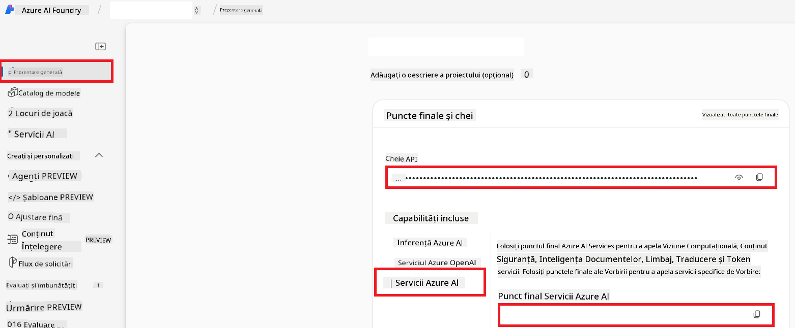

<!--
CO_OP_TRANSLATOR_METADATA:
{
  "original_hash": "b58d7c3cb4210697a073d20eb3064945",
  "translation_date": "2025-06-12T11:58:22+00:00",
  "source_file": "getting_started/set-up-azure-ai.md",
  "language_code": "ro"
}
-->
# Configurarea Azure AI pentru Co-op Translator (Azure OpenAI & Azure AI Vision)

Acest ghid te ajută să configurezi Azure OpenAI pentru traducerea limbajului și Azure Computer Vision pentru analiza conținutului imaginilor (care poate fi folosită apoi pentru traducerea bazată pe imagini) în cadrul Azure AI Foundry.

**Precondiții:**
- Un cont Azure cu un abonament activ.
- Permisiuni suficiente pentru a crea resurse și implementări în abonamentul tău Azure.

## Creează un Proiect Azure AI

Începi prin a crea un Proiect Azure AI, care servește ca un punct central pentru gestionarea resurselor tale AI.

1. Accesează [https://ai.azure.com](https://ai.azure.com) și autentifică-te cu contul tău Azure.

1. Selectează **+Create** pentru a crea un proiect nou.

1. Efectuează următoarele:
   - Introdu un **Nume proiect** (de ex., `CoopTranslator-Project`).
   - Selectează **AI hub** (de ex., `CoopTranslator-Hub`) (creează unul nou dacă este necesar).

1. Apasă "**Review and Create**" pentru a configura proiectul. Vei fi redirecționat către pagina de prezentare a proiectului.

## Configurează Azure OpenAI pentru traducerea limbajului

În cadrul proiectului tău, vei implementa un model Azure OpenAI care va servi ca backend pentru traducerea textului.

### Navighează la Proiectul Tău

Dacă nu ești deja acolo, deschide proiectul creat (de ex., `CoopTranslator-Project`) în Azure AI Foundry.

### Implementează un model OpenAI

1. Din meniul din stânga al proiectului, sub "My assets", selectează "**Models + endpoints**".

1. Selectează **+ Deploy model**.

1. Selectează **Deploy Base Model**.

1. Vei vedea o listă cu modelele disponibile. Filtrează sau caută un model GPT potrivit. Recomandăm `gpt-4o`.

1. Selectează modelul dorit și apasă **Confirm**.

1. Apasă **Deploy**.

### Configurarea Azure OpenAI

După implementare, poți selecta implementarea din pagina "**Models + endpoints**" pentru a găsi **REST endpoint URL**, **Key**, **Deployment name**, **Model name** și **API version**. Acestea vor fi necesare pentru a integra modelul de traducere în aplicația ta.

> [!NOTE]
> Poți selecta versiunile API din pagina [API version deprecation](https://learn.microsoft.com/azure/ai-services/openai/api-version-deprecation) în funcție de nevoile tale. Reține că **versiunea API** este diferită de **versiunea modelului** afișată pe pagina **Models + endpoints** în Azure AI Foundry.

## Configurează Azure Computer Vision pentru traducerea imaginilor

Pentru a permite traducerea textului din imagini, trebuie să găsești cheia API și endpoint-ul serviciului Azure AI.

1. Navighează la Proiectul tău Azure AI (de ex., `CoopTranslator-Project`). Asigură-te că ești pe pagina de prezentare a proiectului.

### Configurarea serviciului Azure AI

Găsește cheia API și endpoint-ul din serviciul Azure AI.

1. Navighează la Proiectul tău Azure AI (de ex., `CoopTranslator-Project`). Asigură-te că ești pe pagina de prezentare a proiectului.

1. Găsește **API Key** și **Endpoint** în fila Azure AI Service.

    

Această conexiune face capabilitățile resursei Azure AI Services asociate (inclusiv analiza imaginilor) disponibile pentru proiectul tău AI Foundry. Poți folosi această conexiune în notebook-uri sau aplicații pentru a extrage text din imagini, care poate fi apoi trimis către modelul Azure OpenAI pentru traducere.

## Consolidarea acreditărilor tale

Până acum, ar trebui să ai următoarele informații:

**Pentru Azure OpenAI (Traducere text):**
- Azure OpenAI Endpoint
- Azure OpenAI API Key
- Numele modelului Azure OpenAI (de ex., `gpt-4o`)
- Numele implementării Azure OpenAI (de ex., `cooptranslator-gpt4o`)
- Versiunea API Azure OpenAI

**Pentru Azure AI Services (Extracția textului din imagini prin Vision):**
- Endpoint Azure AI Service
- Cheia API Azure AI Service

### Exemplu: Configurarea variabilelor de mediu (Previzualizare)

Ulterior, când vei construi aplicația, probabil vei configura aceste acreditări ca variabile de mediu astfel:

```bash
# Azure AI Service Credentials (Required for image translation)
AZURE_AI_SERVICE_API_KEY="your_azure_ai_service_api_key" # e.g., 21xasd...
AZURE_AI_SERVICE_ENDPOINT="https://your_azure_ai_service_endpoint.cognitiveservices.azure.com/"

# Azure OpenAI Credentials (Required for text translation)
AZURE_OPENAI_API_KEY="your_azure_openai_api_key" # e.g., 21xasd...
AZURE_OPENAI_ENDPOINT="https://your_azure_openai_endpoint.openai.azure.com/"
AZURE_OPENAI_MODEL_NAME="your_model_name" # e.g., gpt-4o
AZURE_OPENAI_CHAT_DEPLOYMENT_NAME="your_deployment_name" # e.g., cooptranslator-gpt4o
AZURE_OPENAI_API_VERSION="your_api_version" # e.g., 2024-12-01-preview
```

---

### Lecturi suplimentare

- [Cum să creezi un proiect în Azure AI Foundry](https://learn.microsoft.com/azure/ai-foundry/how-to/create-projects?tabs=ai-studio)
- [Cum să creezi resurse Azure AI](https://learn.microsoft.com/azure/ai-foundry/how-to/create-azure-ai-resource?tabs=portal)
- [Cum să implementezi modele OpenAI în Azure AI Foundry](https://learn.microsoft.com/en-us/azure/ai-foundry/how-to/deploy-models-openai)

**Declinare a responsabilității**:  
Acest document a fost tradus folosind serviciul de traducere AI [Co-op Translator](https://github.com/Azure/co-op-translator). Deși ne străduim pentru acuratețe, vă rugăm să rețineți că traducerile automate pot conține erori sau inexactități. Documentul original în limba sa nativă trebuie considerat sursa autorizată. Pentru informații critice, se recomandă traducerea profesională realizată de un traducător uman. Nu ne asumăm responsabilitatea pentru eventualele neînțelegeri sau interpretări greșite rezultate din utilizarea acestei traduceri.