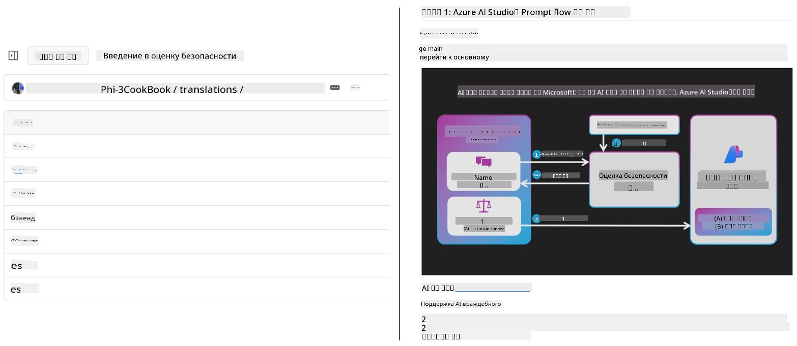
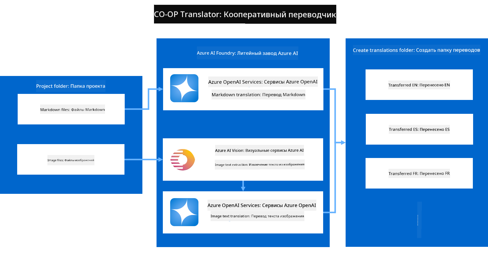
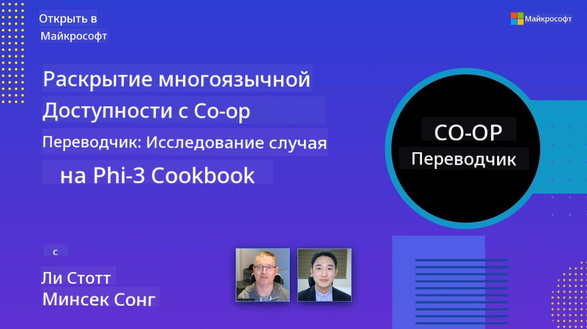

<!--
CO_OP_TRANSLATOR_METADATA:
{
  "original_hash": "044724537b57868117aadae8e7728c7c",
  "translation_date": "2025-06-12T09:52:26+00:00",
  "source_file": "README.md",
  "language_code": "ru"
}
-->


# Co-op Translator: Автоматизируйте перевод образовательной документации без усилий

_Легко автоматизируйте перевод вашей документации на несколько языков, чтобы охватить глобальную аудиторию._

[](https://pypi.org/project/co-op-translator/)
[](https://github.com/azure/co-op-translator/blob/main/LICENSE)
[](https://pepy.tech/project/co-op-translator)
[](https://pepy.tech/project/co-op-translator)
[](https://github.com/psf/black)

[](https://GitHub.com/azure/co-op-translator/graphs/contributors/)
[](https://GitHub.com/azure/co-op-translator/issues/)
[](https://GitHub.com/azure/co-op-translator/pulls/)
[](http://makeapullrequest.com)

### Поддержка языков на базе Co-op Translator
[Французский](../fr/README.md) | [Испанский](../es/README.md) | [Немецкий](../de/README.md) | [Русский](./README.md) | [Арабский](../ar/README.md) | [Персидский (фарси)](../fa/README.md) | [Урду](../ur/README.md) | [Китайский (упрощенный)](../zh/README.md) | [Китайский (традиционный, Макао)](../mo/README.md) | [Китайский (традиционный, Гонконг)](../hk/README.md) | [Китайский (традиционный, Тайвань)](../tw/README.md) | [Японский](../ja/README.md) | [Корейский](../ko/README.md) | [Хинди](../hi/README.md) | [Бенгальский](../bn/README.md) | [Маратхи](../mr/README.md) | [Непальский](../ne/README.md) | [Пенджабский (гурмукхи)](../pa/README.md) | [Португальский (Португалия)](../pt/README.md) | [Португальский (Бразилия)](../br/README.md) | [Итальянский](../it/README.md) | [Польский](../pl/README.md) | [Турецкий](../tr/README.md) | [Греческий](../el/README.md) | [Тайский](../th/README.md) | [Шведский](../sv/README.md) | [Датский](../da/README.md) | [Норвежский](../no/README.md) | [Финский](../fi/README.md) | [Нидерландский](../nl/README.md) | [Иврит](../he/README.md) | [Вьетнамский](../vi/README.md) | [Индонезийский](../id/README.md) | [Малайский](../ms/README.md) | [Тагалог (филиппинский)](../tl/README.md) | [Свахили](../sw/README.md) | [Венгерский](../hu/README.md) | [Чешский](../cs/README.md) | [Словацкий](../sk/README.md) | [Румынский](../ro/README.md) | [Болгарский](../bg/README.md) | [Сербский (кириллица)](../sr/README.md) | [Хорватский](../hr/README.md) | [Словенский](../sl/README.md) | [Украинский](../uk/README.md) | [Бирманский (Мьянма)](../my/README.md)
> [!NOTE]
> Это текущие переводы содержимого этого репозитория. Для полного списка языков, поддерживаемых Co-op Translator, см. раздел [Language Support](../..).

[](https://GitHub.com/azure/co-op-translator/watchers/)
[](https://GitHub.com/azure/co-op-translator/network/)
[](https://GitHub.com/azure/co-op-translator/stargazers/)

[](https://discord.com/invite/ByRwuEEgH4)

[](https://codespaces.new/azure/co-op-translator)
[](https://vscode.dev/redirect?url=vscode://ms-vscode-remote.remote-containers/cloneInVolume?url=https://github.com/azure/co-op-translator)

## Обзор: Оптимизируйте перевод вашего образовательного контента

Языковые барьеры значительно ограничивают доступ к ценным образовательным материалам и техническим знаниям для учащихся и разработчиков по всему миру. Это снижает вовлечённость и замедляет темпы глобальных инноваций и обучения.

**Co-op Translator** возник из необходимости решить проблему неэффективного ручного перевода масштабных образовательных серий Microsoft (например, руководств «Для начинающих»). Сейчас это удобный и мощный инструмент, созданный, чтобы разрушить эти барьеры для всех. Предоставляя качественный автоматический перевод через CLI и GitHub Actions, Co-op Translator помогает преподавателям, студентам, исследователям и разработчикам со всего мира свободно делиться знаниями и получать к ним доступ без языковых ограничений.

Посмотрите, как Co-op Translator организует переведённый образовательный контент:



Файлы Markdown и текст на изображениях автоматически переводятся и аккуратно сортируются по папкам для каждого языка.

**Откройте глобальный доступ к вашему образовательному контенту с Co-op Translator уже сегодня!**

## Поддержка глобального доступа к образовательным ресурсам Microsoft

Co-op Translator помогает преодолеть языковой барьер для ключевых образовательных инициатив Microsoft, автоматизируя процесс перевода репозиториев, которые обслуживают глобальное сообщество разработчиков. В числе проектов, использующих Co-op Translator:

[](https://github.com/microsoft/Generative-AI-for-beginners)
[](https://github.com/microsoft/ML-For-Beginners)
[](https://github.com/microsoft/AI-For-Beginners)
[](https://github.com/microsoft/ai-agents-for-beginners)
[](https://github.com/microsoft/PhiCookBook)
[](https://github.com/microsoft/Generative-AI-for-beginners-dotnet)

## Основные возможности

- **Автоматический перевод**: Легко переводите текст на несколько языков.
- **Интеграция с GitHub Actions**: Автоматизируйте перевод в рамках вашего CI/CD процесса.
- **Сохранение Markdown**: Сохраняйте корректный синтаксис Markdown при переводе.
- **Перевод текста на изображениях**: Извлекайте и переводите текст, встроенный в изображения.
- **Современные технологии LLM**: Используйте передовые языковые модели для качественного перевода.
- **Простая интеграция**: Легко внедряйте в существующие проекты.
- **Упрощение локализации**: Оптимизируйте процесс локализации вашего проекта для международных рынков.

## Как это работает



Co-op Translator обрабатывает Markdown-файлы и изображения из вашей папки проекта следующим образом:

1. **Извлечение текста**: Извлекает текст из Markdown-файлов и, если настроено (например, с Azure AI Vision), из текста на изображениях.
1. **AI-перевод**: Отправляет извлечённый текст в выбранную LLM (Azure OpenAI, OpenAI и др.) для перевода.
1. **Сохранение результатов**: Сохраняет переведённые Markdown-файлы и изображения (с переведённым текстом) в папках, соответствующих языкам, сохраняя исходное форматирование.

## Начало работы

Быстро начните работу с помощью CLI или настройте полную автоматизацию с GitHub Actions. Выберите подход, который лучше всего подходит для вашего рабочего процесса:

1. **Командная строка (CLI)** — для одноразовых переводов или ручного управления
2. **GitHub Actions** — для автоматического перевода при каждом пуше

> [!NOTE]
> В этом руководстве основное внимание уделяется ресурсам Azure, но вы можете использовать любую поддерживаемую языковую модель.

### Поддержка языков

Co-op Translator поддерживает широкий спектр языков, чтобы помочь вам охватить глобальную аудиторию. Вот что нужно знать:

#### Быстрая справка

| Язык                | Код | Язык                 | Код | Язык                   | Код |
|---------------------|-----|----------------------|-----|------------------------|-----|
| Arabic              | ar  | Bengali              | bn  | Bulgarian              | bg  |
| Burmese (Myanmar)   | my  | Chinese (Simplified)  | zh  | Chinese (Traditional, HK) | hk  |
| Chinese (Traditional, Macau) | mo  | Chinese (Traditional, TW) | tw  | Croatian               | hr  |
| Czech               | cs  | Danish               | da  | Dutch                  | nl  |
| Finnish             | fi  | French               | fr  | German                 | de  |
| Greek               | el  | Hebrew               | he  | Hindi                  | hi  |
| Hungarian           | hu  | Indonesian           | id  | Italian                | it  |
| Japanese            | ja  | Korean               | ko  | Malay                  | ms  |
| Marathi             | mr  | Nepali               | ne  | Norwegian              | no  |
| Persian (Farsi)     | fa  | Polish               | pl  | Portuguese (Brazil)    | br  |
| Portuguese (Portugal) | pt  | Punjabi (Gurmukhi)  | pa  | Romanian               | ro  |
| Russian             | ru  | Serbian (Cyrillic)   | sr  | Slovak                 | sk  |
| Slovenian           | sl  | Spanish              | es  | Swahili                | sw  |
| Swedish             | sv  | Tagalog (Filipino)   | tl  | Thai                   | th  |
| Turkish             | tr  | Ukrainian            | uk  | Urdu                   | ur  |
| Vietnamese          | vi  | —                    | —   | —                      | —   |

#### Использование языковых кодов

При работе с Co-op Translator нужно указывать языки через их коды. Например:

```bash
# Translate to French, Spanish, and German
translate -l "fr es de"

# Translate to Chinese (Simplified) and Japanese
translate -l "zh ja"
```

> [!NOTE]
> Для подробной технической информации о поддержке языков, включая:
>
> - Шрифты для каждого языка
> - Известные проблемы
> - Как добавить новые языки
>
> смотрите [Документацию по поддерживаемым языкам](./getting_started/supported-languages.md).

### Поддерживаемые модели и сервисы

| Тип                   | Название                         |
|-----------------------|---------------------------------|
| Языковая модель       |   |
| AI Vision             |  |

> [!NOTE]
> Если сервис AI Vision недоступен, Co-op Translator переключится в [режим только Markdown](./getting_started/markdown-only-mode.md).

### Первоначальная настройка

Перед началом работы необходимо подготовить следующие ресурсы:

1. Ресурс языковой модели (обязательно):
   - Azure OpenAI (рекомендуется) — обеспечивает качественный перевод с корпоративной надёжностью
   - OpenAI — альтернатива, если нет доступа к Azure
   - Для подробной информации о поддерживаемых моделях смотрите [Supported Models and Services](../..)

1. Ресурс AI Vision (опционально):
   - Azure AI Vision — позволяет переводить текст на изображениях
   - Если не настроен, переводчик автоматически перейдёт в [режим только Markdown](./getting_started/markdown-only-mode.md)
   - Рекомендуется для проектов с изображениями, содержащими текст для перевода

1. Шаги настройки:
   - Следуйте нашему [руководству по настройке Azure AI](./getting_started/set-up-azure-ai.md) для подробных инструкций
   - Создайте файл `.env` с вашими API-ключами и конечными точками (см. раздел [Quick Start](../..))
   - Убедитесь, что у вас есть необходимые разрешения и квоты для выбранных сервисов

### Подготовка проекта перед переводом

Перед началом перевода выполните следующие шаги для подготовки проекта:

1. Подготовьте README:
   - Добавьте таблицу с переводами в README.md для ссылок на переведённые версии
   - Пример формата:

     ```markdown

     ### 🌐 Multi-Language Support
     
     [French](../fr/README.md) | [Spanish](../es/README.md) | [German](../de/README.md) | [Russian](./README.md) | [Arabic](../ar/README.md) | [Persian (Farsi)](../fa/README.md) | [Urdu](../ur/README.md) | [Chinese (Simplified)](../zh/README.md) | [Chinese (Traditional, Macau)](../mo/README.md) | [Chinese (Traditional, Hong Kong)](../hk/README.md) | [Chinese (Traditional, Taiwan)](../tw/README.md) | [Japanese](../ja/README.md) | [Korean](../ko/README.md) | [Hindi](../hi/README.md) | [Bengali](../bn/README.md) | [Marathi](../mr/README.md) | [Nepali](../ne/README.md) | [Punjabi (Gurmukhi)](../pa/README.md) | [Portuguese (Portugal)](../pt/README.md) | [Portuguese (Brazil)](../br/README.md) | [Italian](../it/README.md) | [Polish](../pl/README.md) | [Turkish](../tr/README.md) | [Greek](../el/README.md) | [Thai](../th/README.md) | [Swedish](../sv/README.md) | [Danish](../da/README.md) | [Norwegian](../no/README.md) | [Finnish](../fi/README.md) | [Dutch](../nl/README.md) | [Hebrew](../he/README.md) | [Vietnamese](../vi/README.md) | [Indonesian](../id/README.md) | [Malay](../ms/README.md) | [Tagalog (Filipino)](../tl/README.md) | [Swahili](../sw/README.md) | [Hungarian](../hu/README.md) | [Czech](../cs/README.md) | [Slovak](../sk/README.md) | [Romanian](../ro/README.md) | [Bulgarian](../bg/README.md) | [Serbian (Cyrillic)](../sr/README.md) | [Croatian](../hr/README.md) | [Slovenian](../sl/README.md) | [Ukrainian](../uk/README.md) | [Burmese (Myanmar)](../my/README.md) 
    
     ```

1. Очистите существующие переводы (если необходимо):
   - Удалите все существующие папки с переводами (например, `translations/`)
   - Удалите старые файлы переводов, чтобы начать с чистого листа
   - Это предотвратит конфликты с новым процессом перевода

### Быстрый старт: командная строка

Для быстрого старта с помощью командной строки:

1. Создайте виртуальное окружение:

    ```bash
    python -m venv .venv
    ```

1. Активируйте виртуальное окружение:

    - В Windows:

    ```bash
    .venv\scripts\activate
    ```

    - В Linux/macOS:

    ```bash
    source .venv/bin/activate
    ```

1. Установите пакет:

    ```bash
    pip install co-op-translator
    ```

1. Настройте учетные данные:

    - Создайте файл `.env` file in your project's root directory.
    - Copy the contents from the [.env.template](../../.env.template) file into your new `.env` file.
    - Fill in the required API keys and endpoint information in your `.env` file.

1. Run Translation:
    - Navigate to your project's root directory in your terminal.
    - Execute the translate command, specifying target languages with the `-l` флаг:

    ```bash
    translate -l "ko ja fr"
    ```

_(Замените `"ko ja fr"` with your desired space-separated language codes)_

### Detailed Usage Guides

Choose the approach that best fits your workflow:

#### 1. Using the Command Line (CLI)

- Best for: One-time translations, manual control, or integration into custom scripts.
- Requires: Local installation of Python and the `co-op-translator` package.
- Guide: [Command Line Guide](./getting_started/command-line-guide/command-line-guide.md)

#### 2. Using GitHub Actions (Automation)

- Best for: Automatically translating content whenever changes are pushed to your repository. Keeps translations consistently up-to-date.
- Requires: Setting up a workflow file (`.github/workflows`) в вашем репозитории. Локальная установка не требуется.
- Руководства:
  - [GitHub Actions Guide (публичные репозитории и стандартные секреты)](./getting_started/github-actions-guide/github-actions-guide-public.md) — используйте для большинства публичных или личных репозиториев с использованием стандартных секретов репозитория.
  - [GitHub Actions Guide (репозитории организации Microsoft и настройки на уровне организации)](./getting_started/github-actions-guide/github-actions-guide-org.md) — используйте, если работаете в организации Microsoft на GitHub или необходимо использовать секреты/раннеры уровня организации.

### Устранение неполадок и советы

- [Руководство по устранению неполадок](./getting_started/troubleshooting.md)

### Дополнительные ресурсы

- [Справочник команд](./getting_started/command-reference.md): Подробное руководство по всем доступным командам и опциям.
- [Поддерживаемые языки](./getting_started/supported-languages.md): Список поддерживаемых языков и инструкции по добавлению новых.
- [Режим только Markdown](./getting_started/markdown-only-mode.md): Как переводить только текст без обработки изображений.

## Видеопрезентации

Узнайте больше о Co-op Translator через наши презентации _(нажмите на изображение ниже, чтобы посмотреть на YouTube)_:

- **Open at Microsoft**: Краткое 18-минутное введение и быстрое руководство по использованию Co-op Translator.
[](https://www.youtube.com/watch?v=jX_swfH_KNU)

## Поддержите нас и способствуйте глобальному обучению

Присоединяйтесь к нам в революции обмена образовательным контентом по всему миру! Поставьте ⭐ проекту [Co-op Translator](https://github.com/azure/co-op-translator) на GitHub и поддержите нашу миссию по устранению языковых барьеров в обучении и технологиях. Ваш интерес и вклад имеют большое значение! Мы всегда рады вашим предложениям и коду.

## Участие в проекте

Этот проект приветствует ваши идеи и вклад. Хотите помочь развитию Azure Co-op Translator? Ознакомьтесь с нашими рекомендациями в [CONTRIBUTING.md](./CONTRIBUTING.md), чтобы узнать, как сделать Co-op Translator более доступным.

## Участники проекта

[](https://github.com/Azure/co-op-translator/graphs/contributors)

## Кодекс поведения

В этом проекте принят [Microsoft Open Source Code of Conduct](https://opensource.microsoft.com/codeofconduct/).
Для получения дополнительной информации смотрите [Часто задаваемые вопросы о Кодексе поведения](https://opensource.microsoft.com/codeofconduct/faq/) или
свяжитесь с нами по адресу [opencode@microsoft.com](mailto:opencode@microsoft.com) для любых вопросов или комментариев.

## Ответственный ИИ

Microsoft стремится помочь своим клиентам использовать наши ИИ-продукты ответственно, делиться опытом и строить доверительные партнерства с помощью таких инструментов, как Transparency Notes и Impact Assessments. Многие из этих ресурсов доступны по адресу [https://aka.ms/RAI](https://aka.ms/RAI).
Подход Microsoft к ответственному ИИ основан на принципах справедливости, надежности и безопасности, конфиденциальности и защиты, инклюзивности, прозрачности и подотчетности.

Крупномасштабные модели обработки естественного языка, изображений и речи — как те, что используются в этом примере — могут иногда вести себя несправедливо, ненадежно или оскорбительно, что может причинять вред. Пожалуйста, ознакомьтесь с [Transparency note для Azure OpenAI service](https://learn.microsoft.com/legal/cognitive-services/openai/transparency-note?tabs=text), чтобы узнать о рисках и ограничениях.

Рекомендуемый способ снижения этих рисков — включить в архитектуру систему безопасности, способную выявлять и предотвращать вредоносное поведение. [Azure AI Content Safety](https://learn.microsoft.com/azure/ai-services/content-safety/overview) предоставляет независимый уровень защиты, позволяющий обнаруживать вредоносный контент, созданный пользователями и ИИ, в приложениях и сервисах. Azure AI Content Safety включает API для текста и изображений, которые помогают выявлять вредоносные материалы. Также у нас есть интерактивная Content Safety Studio, позволяющая просматривать, исследовать и тестировать пример кода для обнаружения вредоносного контента в разных форматах. Следующая [документация для быстрого старта](https://learn.microsoft.com/azure/ai-services/content-safety/quickstart-text?tabs=visual-studio%2Clinux&pivots=programming-language-rest) поможет вам сделать запросы к сервису.

Еще один важный аспект — общая производительность приложения. В мультимодальных и мультимодельных приложениях под производительностью понимается соответствие работы системы вашим и вашим пользователям ожиданиям, включая отсутствие генерации вредоносного контента. Важно оценивать производительность всего приложения с помощью [метрик качества генерации, риска и безопасности](https://learn.microsoft.com/azure/ai-studio/concepts/evaluation-metrics-built-in).

Вы можете оценивать свое ИИ-приложение в среде разработки с помощью [prompt flow SDK](https://microsoft.github.io/promptflow/index.html). Имея тестовый набор данных или цель, генерации вашего генеративного ИИ оцениваются количественно с помощью встроенных или настраиваемых оценщиков. Чтобы начать работу с prompt flow sdk для оценки вашей системы, воспользуйтесь [руководством по быстрому старту](https://learn.microsoft.com/azure/ai-studio/how-to/develop/flow-evaluate-sdk). После выполнения оценки вы можете [визуализировать результаты в Azure AI Studio](https://learn.microsoft.com/azure/ai-studio/how-to/evaluate-flow-results).

## Торговые марки

В этом проекте могут использоваться торговые марки или логотипы проектов, продуктов или сервисов. Авторизованное использование торговых марок или логотипов Microsoft регулируется и должно соответствовать [Microsoft's Trademark & Brand Guidelines](https://www.microsoft.com/en-us/legal/intellectualproperty/trademarks/usage/general).
Использование торговых марок или логотипов Microsoft в изменённых версиях проекта не должно вводить в заблуждение или создавать впечатление спонсорства со стороны Microsoft.
Использование торговых марок или логотипов третьих сторон регулируется политиками этих третьих сторон.

**Отказ от ответственности**:  
Этот документ был переведен с помощью сервиса автоматического перевода [Co-op Translator](https://github.com/Azure/co-op-translator). Несмотря на наши усилия обеспечить точность, пожалуйста, имейте в виду, что автоматические переводы могут содержать ошибки или неточности. Оригинальный документ на его исходном языке следует считать авторитетным источником. Для критически важной информации рекомендуется профессиональный перевод человеком. Мы не несем ответственности за любые недоразумения или неправильные толкования, возникшие в результате использования этого перевода.