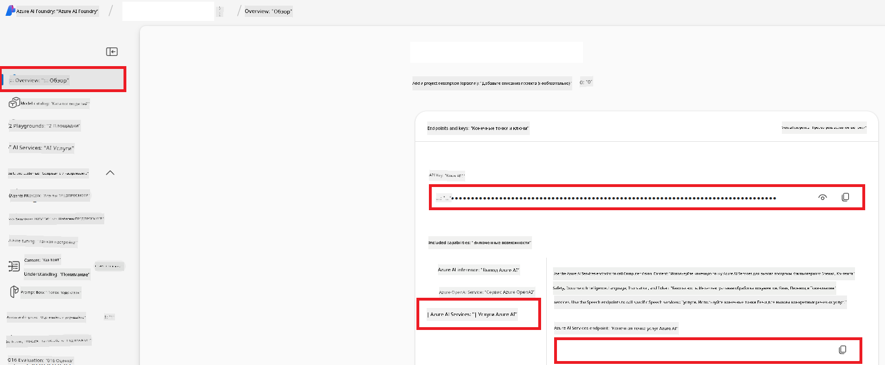

<!--
CO_OP_TRANSLATOR_METADATA:
{
  "original_hash": "b58d7c3cb4210697a073d20eb3064945",
  "translation_date": "2025-06-12T11:45:50+00:00",
  "source_file": "getting_started/set-up-azure-ai.md",
  "language_code": "ru"
}
-->
# Настройка Azure AI для Co-op Translator (Azure OpenAI и Azure AI Vision)

Это руководство поможет вам настроить Azure OpenAI для перевода текста и Azure Computer Vision для анализа содержимого изображений (который затем можно использовать для перевода на основе изображений) в рамках Azure AI Foundry.

**Требования:**
- Аккаунт Azure с активной подпиской.
- Достаточные права для создания ресурсов и развертываний в вашей подписке Azure.

## Создание проекта Azure AI

Начните с создания проекта Azure AI — центрального места для управления вашими AI-ресурсами.

1. Перейдите на [https://ai.azure.com](https://ai.azure.com) и войдите в систему под своим аккаунтом Azure.

1. Нажмите **+Create** для создания нового проекта.

1. Выполните следующие действия:
   - Введите **название проекта** (например, `CoopTranslator-Project`).
   - Выберите **AI hub** (например, `CoopTranslator-Hub`) (создайте новый, если нужно).

1. Нажмите "**Review and Create**", чтобы создать проект. Вы попадёте на страницу обзора вашего проекта.

## Настройка Azure OpenAI для перевода текста

В рамках проекта вы развернёте модель Azure OpenAI, которая будет использоваться для перевода текста.

### Переход к вашему проекту

Если вы ещё не в нём, откройте недавно созданный проект (например, `CoopTranslator-Project`) в Azure AI Foundry.

### Развёртывание модели OpenAI

1. В левом меню проекта, в разделе "My assets", выберите "**Models + endpoints**".

1. Нажмите **+ Deploy model**.

1. Выберите **Deploy Base Model**.

1. Перед вами появится список доступных моделей. Отфильтруйте или найдите подходящую модель GPT. Рекомендуем `gpt-4o`.

1. Выберите нужную модель и нажмите **Confirm**.

1. Нажмите **Deploy**.

### Конфигурация Azure OpenAI

После развёртывания выберите развертывание на странице "**Models + endpoints**", чтобы узнать **REST endpoint URL**, **Key**, **Deployment name**, **Model name** и **API version**. Эти данные понадобятся для интеграции модели перевода в ваше приложение.

> [!NOTE]
> Вы можете выбрать версию API на странице [API version deprecation](https://learn.microsoft.com/azure/ai-services/openai/api-version-deprecation) в зависимости от ваших требований. Обратите внимание, что **API version** отличается от **Model version**, отображаемой на странице **Models + endpoints** в Azure AI Foundry.

## Настройка Azure Computer Vision для перевода изображений

Чтобы переводить текст на изображениях, вам нужно получить API Key и Endpoint службы Azure AI.

1. Перейдите в ваш проект Azure AI (например, `CoopTranslator-Project`). Убедитесь, что вы находитесь на странице обзора проекта.

### Конфигурация Azure AI Service

Найдите API Key и Endpoint в разделе Azure AI Service.

1. Перейдите в ваш проект Azure AI (например, `CoopTranslator-Project`). Убедитесь, что вы находитесь на странице обзора проекта.

1. Найдите **API Key** и **Endpoint** на вкладке Azure AI Service.

    

Это подключение открывает возможности связанного ресурса Azure AI Services (включая анализ изображений) для вашего проекта AI Foundry. Вы сможете использовать это подключение в ноутбуках или приложениях для извлечения текста из изображений, который затем можно отправить в модель Azure OpenAI для перевода.

## Сводка ваших учётных данных

К настоящему моменту у вас должны быть собраны следующие данные:

**Для Azure OpenAI (перевод текста):**
- Endpoint Azure OpenAI
- API Key Azure OpenAI
- Имя модели Azure OpenAI (например, `gpt-4o`)
- Имя развертывания Azure OpenAI (например, `cooptranslator-gpt4o`)
- Версия API Azure OpenAI

**Для Azure AI Services (извлечение текста из изображений через Vision):**
- Endpoint Azure AI Service
- API Key Azure AI Service

### Пример: настройка переменных окружения (предварительный просмотр)

Позже, при создании приложения, вы, вероятно, будете настраивать его, используя собранные учётные данные. Например, можно задать их как переменные окружения следующим образом:

```bash
# Azure AI Service Credentials (Required for image translation)
AZURE_AI_SERVICE_API_KEY="your_azure_ai_service_api_key" # e.g., 21xasd...
AZURE_AI_SERVICE_ENDPOINT="https://your_azure_ai_service_endpoint.cognitiveservices.azure.com/"

# Azure OpenAI Credentials (Required for text translation)
AZURE_OPENAI_API_KEY="your_azure_openai_api_key" # e.g., 21xasd...
AZURE_OPENAI_ENDPOINT="https://your_azure_openai_endpoint.openai.azure.com/"
AZURE_OPENAI_MODEL_NAME="your_model_name" # e.g., gpt-4o
AZURE_OPENAI_CHAT_DEPLOYMENT_NAME="your_deployment_name" # e.g., cooptranslator-gpt4o
AZURE_OPENAI_API_VERSION="your_api_version" # e.g., 2024-12-01-preview
```

---

### Дополнительные материалы

- [Как создать проект в Azure AI Foundry](https://learn.microsoft.com/azure/ai-foundry/how-to/create-projects?tabs=ai-studio)
- [Как создать ресурсы Azure AI](https://learn.microsoft.com/azure/ai-foundry/how-to/create-azure-ai-resource?tabs=portal)
- [Как развернуть модели OpenAI в Azure AI Foundry](https://learn.microsoft.com/en-us/azure/ai-foundry/how-to/deploy-models-openai)

**Отказ от ответственности**:  
Этот документ был переведен с помощью сервиса автоматического перевода [Co-op Translator](https://github.com/Azure/co-op-translator). Несмотря на наши усилия обеспечить точность, пожалуйста, имейте в виду, что автоматический перевод может содержать ошибки или неточности. Оригинальный документ на его родном языке следует считать авторитетным источником. Для получения критически важной информации рекомендуется обращаться к профессиональному переводу, выполненному человеком. Мы не несем ответственности за любые недоразумения или неправильные толкования, возникшие в результате использования данного перевода.