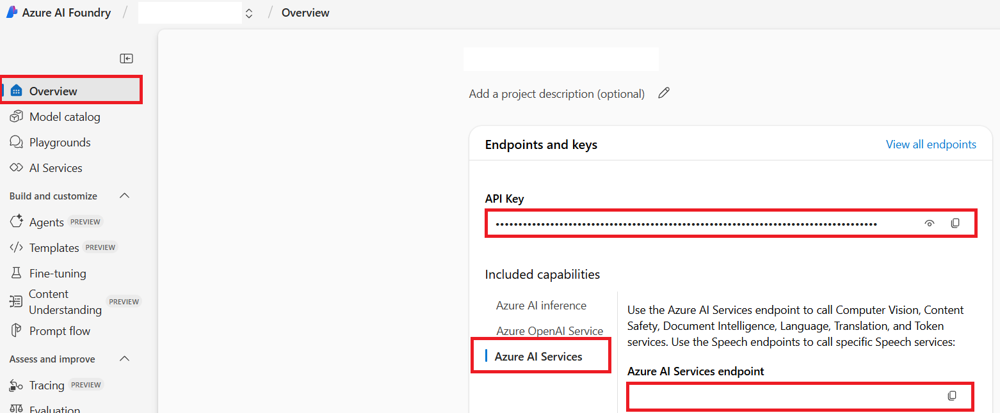

<!--
CO_OP_TRANSLATOR_METADATA:
{
  "original_hash": "220341925e9a67a0e467d1ba94d3cf7d",
  "translation_date": "2025-05-07T14:19:43+00:00",
  "source_file": "getting_started/set-up-azure-ai.md",
  "language_code": "ru"
}
-->
# Настройка Azure AI для Co-op Translator (Azure OpenAI и Azure AI Vision)

Это руководство проведет вас через процесс настройки Azure OpenAI для перевода текста и Azure Computer Vision для анализа содержимого изображений (который затем можно использовать для перевода на основе изображений) в рамках Azure AI Foundry.

**Требования:**
- Аккаунт Azure с активной подпиской.
- Достаточные права для создания ресурсов и развертываний в вашей подписке Azure.

## Создание проекта Azure AI

Начните с создания проекта Azure AI, который будет центральным местом для управления вашими AI-ресурсами.

1. Перейдите на [https://ai.azure.com](https://ai.azure.com) и войдите в систему с помощью вашего аккаунта Azure.

1. Выберите **+Create**, чтобы создать новый проект.

1. Выполните следующие действия:
   - Введите **Имя проекта** (например, `CoopTranslator-Project`).
   - Выберите **AI hub** (например, `CoopTranslator-Hub`) (создайте новый, если необходимо).

1. Нажмите "**Review and Create**", чтобы создать проект. Вы перейдете на страницу обзора вашего проекта.

## Настройка Azure OpenAI для перевода текста

В рамках вашего проекта разверните модель Azure OpenAI, которая будет служить бэкендом для перевода текста.

### Переход к вашему проекту

Если вы еще не находитесь в нем, откройте созданный проект (например, `CoopTranslator-Project`) в Azure AI Foundry.

### Развертывание модели OpenAI

1. В левом меню вашего проекта, в разделе "My assets", выберите "**Models + endpoints**".

1. Нажмите **+ Deploy model**.

1. Выберите **Deploy Base Model**.

1. Перед вами появится список доступных моделей. Отфильтруйте или найдите подходящую модель GPT. Рекомендуем `gpt-4o`.

1. Выберите нужную модель и нажмите **Confirm**.

1. Нажмите **Deploy**.

### Конфигурация Azure OpenAI

После развертывания вы можете выбрать развертывание на странице "**Models + endpoints**", чтобы найти его **REST endpoint URL**, **Key**, **Deployment name**, **Model name** и **API version**. Эти данные понадобятся для интеграции модели перевода в ваше приложение.

## Настройка Azure Computer Vision для перевода текста на изображениях

Чтобы включить перевод текста на изображениях, необходимо получить API Key и Endpoint сервиса Azure AI.

1. Перейдите в ваш проект Azure AI (например, `CoopTranslator-Project`). Убедитесь, что вы находитесь на странице обзора проекта.

### Конфигурация Azure AI Service

Найдите API Key и Endpoint в разделе Azure AI Service.

1. Перейдите в ваш проект Azure AI (например, `CoopTranslator-Project`). Убедитесь, что вы находитесь на странице обзора проекта.

1. Найдите **API Key** и **Endpoint** на вкладке Azure AI Service.

    

Это соединение делает возможности связанного ресурса Azure AI Services (включая анализ изображений) доступными вашему проекту в AI Foundry. Вы сможете использовать это соединение в своих ноутбуках или приложениях для извлечения текста из изображений, который затем можно отправить в модель Azure OpenAI для перевода.

## Объединение ваших учетных данных

На данный момент у вас должны быть следующие данные:

**Для Azure OpenAI (перевод текста):**
- Azure OpenAI Endpoint
- Azure OpenAI API Key
- Имя модели Azure OpenAI (например, `gpt-4o`)
- Имя развертывания Azure OpenAI (например, `cooptranslator-gpt4o`)
- Версия API Azure OpenAI

**Для Azure AI Services (извлечение текста из изображений через Vision):**
- Endpoint Azure AI Service
- API Key Azure AI Service

### Пример: настройка переменных окружения (предварительный просмотр)

Позже, при создании приложения, вы, вероятно, настроите его с использованием этих учетных данных. Например, можно задать их как переменные окружения следующим образом:

```bash
# Azure AI Service Credentials (Required for image translation)
AZURE_AI_SERVICE_API_KEY="your_azure_ai_service_api_key" # e.g., 21xasd...
AZURE_AI_SERVICE_ENDPOINT="https://your_azure_ai_service_endpoint.cognitiveservices.azure.com/"

# Azure OpenAI Credentials (Required for text translation)
AZURE_OPENAI_API_KEY="your_azure_openai_api_key" # e.g., 21xasd...
AZURE_OPENAI_ENDPOINT="https://your_azure_openai_endpoint.openai.azure.com/"
AZURE_OPENAI_MODEL_NAME="your_model_name" # e.g., gpt-4o
AZURE_OPENAI_CHAT_DEPLOYMENT_NAME="your_deployment_name" # e.g., cooptranslator-gpt4o
AZURE_OPENAI_API_VERSION="your_api_version" # e.g., 2024-02-01
```

---

### Дополнительные материалы

- [Как создать проект в Azure AI Foundry](https://learn.microsoft.com/azure/ai-foundry/how-to/create-projects?tabs=ai-studio)
- [Как создать ресурсы Azure AI](https://learn.microsoft.com/azure/ai-foundry/how-to/create-azure-ai-resource?tabs=portal)
- [Как развернуть модели OpenAI в Azure AI Foundry](https://learn.microsoft.com/en-us/azure/ai-foundry/how-to/deploy-models-openai)

**Отказ от ответственности**:  
Этот документ был переведен с помощью сервиса автоматического перевода [Co-op Translator](https://github.com/Azure/co-op-translator). Несмотря на наши усилия по обеспечению точности, просим учитывать, что автоматические переводы могут содержать ошибки или неточности. Оригинальный документ на его исходном языке следует считать авторитетным источником. Для получения критически важной информации рекомендуется использовать профессиональный перевод, выполненный человеком. Мы не несем ответственности за любые недоразумения или неправильные толкования, возникшие в результате использования данного перевода.