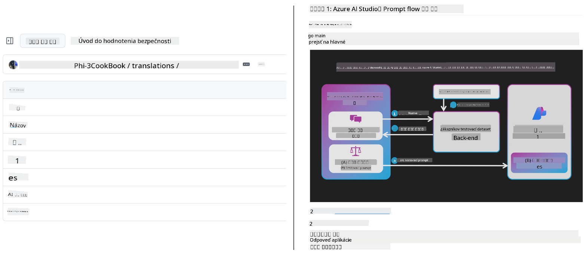
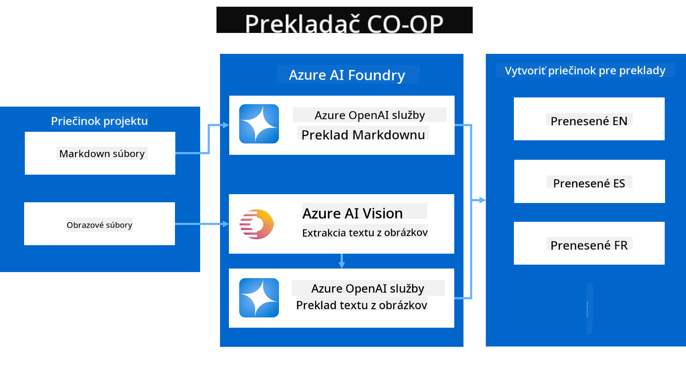
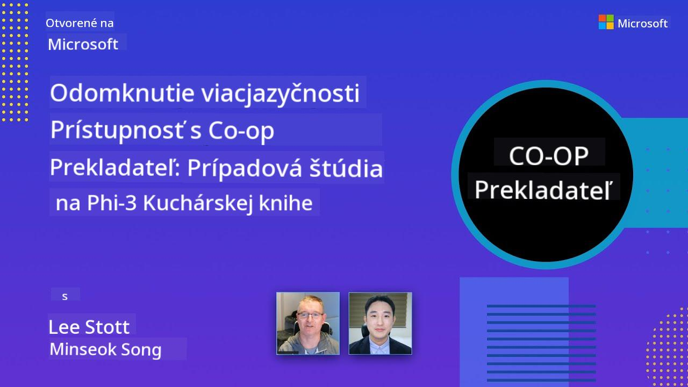

<!--
CO_OP_TRANSLATOR_METADATA:
{
  "original_hash": "044724537b57868117aadae8e7728c7c",
  "translation_date": "2025-06-12T10:49:19+00:00",
  "source_file": "README.md",
  "language_code": "sk"
}
-->


# Co-op Translator: Automatizujte preklad vzdelávacej dokumentácie bez námahy

_Ľahko automatizujte preklad vašej dokumentácie do viacerých jazykov a oslovte tak globálne publikum._

[](https://pypi.org/project/co-op-translator/)
[](https://github.com/azure/co-op-translator/blob/main/LICENSE)
[](https://pepy.tech/project/co-op-translator)
[](https://pepy.tech/project/co-op-translator)
[](https://github.com/psf/black)

[](https://GitHub.com/azure/co-op-translator/graphs/contributors/)
[](https://GitHub.com/azure/co-op-translator/issues/)
[](https://GitHub.com/azure/co-op-translator/pulls/)
[](http://makeapullrequest.com)

### Podpora jazykov poháňaná Co-op Translatorom
[Francúzština](../fr/README.md) | [Španielčina](../es/README.md) | [Nemčina](../de/README.md) | [Ruština](../ru/README.md) | [Arabčina](../ar/README.md) | [Perzština (Farsi)](../fa/README.md) | [Urdu](../ur/README.md) | [Čínština (zjednodušená)](../zh/README.md) | [Čínština (tradičná, Macau)](../mo/README.md) | [Čínština (tradičná, Hongkong)](../hk/README.md) | [Čínština (tradičná, Taiwan)](../tw/README.md) | [Japončina](../ja/README.md) | [Kórejčina](../ko/README.md) | [Hindčina](../hi/README.md) | [Bengálčina](../bn/README.md) | [Maráthčina](../mr/README.md) | [Nepálčina](../ne/README.md) | [Pandžábčina (Gurmukhi)](../pa/README.md) | [Portugalčina (Portugalsko)](../pt/README.md) | [Portugalčina (Brazília)](../br/README.md) | [Taliančina](../it/README.md) | [Poľština](../pl/README.md) | [Turečtina](../tr/README.md) | [Gréčtina](../el/README.md) | [Thajčina](../th/README.md) | [Švédčina](../sv/README.md) | [Dánčina](../da/README.md) | [Nórčina](../no/README.md) | [Fínčina](../fi/README.md) | [Holandčina](../nl/README.md) | [Hebrejčina](../he/README.md) | [Vietnamčina](../vi/README.md) | [Indonézština](../id/README.md) | [Malajčina](../ms/README.md) | [Tagalog (Filipínčina)](../tl/README.md) | [Svahilčina](../sw/README.md) | [Maďarčina](../hu/README.md) | [Čeština](../cs/README.md) | [Slovenčina](./README.md) | [Rumunčina](../ro/README.md) | [Bulharčina](../bg/README.md) | [Srbčina (cyrilika)](../sr/README.md) | [Chorvátčina](../hr/README.md) | [Slovinčina](../sl/README.md) | [Ukrajinčina](../uk/README.md) | [Barmčina (Myanmar)](../my/README.md)
> [!NOTE]
> Toto sú aktuálne preklady obsahu tohto repozitára. Kompletný zoznam jazykov podporovaných Co-op Translator nájdete v sekcii [Language Support](../..).

[](https://GitHub.com/azure/co-op-translator/watchers/)
[](https://GitHub.com/azure/co-op-translator/network/)
[](https://GitHub.com/azure/co-op-translator/stargazers/)

[](https://discord.com/invite/ByRwuEEgH4)

[](https://codespaces.new/azure/co-op-translator)
[](https://vscode.dev/redirect?url=vscode://ms-vscode-remote.remote-containers/cloneInVolume?url=https://github.com/azure/co-op-translator)

## Prehľad: Zjednodušte preklad svojho vzdelávacieho obsahu

Jazykové bariéry výrazne obmedzujú prístup k hodnotným vzdelávacím zdrojom a technickým poznatkom pre študentov a vývojárov po celom svete. To obmedzuje účasť a spomaľuje tempo globálnych inovácií a učenia sa.

**Co-op Translator** vznikol ako odpoveď na neefektívny manuálny preklad veľkých vzdelávacích sérií Microsoftu (napríklad príručky „For Beginners“). Vyvinul sa do ľahko použiteľného a výkonného nástroja, ktorý prelomí tieto bariéry pre každého. Poskytovaním kvalitných automatických prekladov cez CLI a GitHub Actions umožňuje Co-op Translator pedagógom, študentom, výskumníkom a vývojárom po celom svete zdieľať a získavať vedomosti bez jazykových obmedzení.

Pozrite sa, ako Co-op Translator organizuje preložený vzdelávací obsah:



Markdown súbory a texty na obrázkoch sa automaticky prekladajú a prehľadne ukladajú do jazykovo špecifických priečinkov.

**Odomknite globálny prístup k vášmu vzdelávaciemu obsahu s Co-op Translator už dnes!**

## Podpora globálneho prístupu ku vzdelávacím zdrojom Microsoftu

Co-op Translator pomáha preklenúť jazykovú priepasť pre kľúčové vzdelávacie iniciatívy Microsoftu tým, že automatizuje prekladový proces pre repozitáre slúžiace globálnej komunite vývojárov. Príklady projektov, ktoré aktuálne využívajú Co-op Translator:

[](https://github.com/microsoft/Generative-AI-for-beginners)
[](https://github.com/microsoft/ML-For-Beginners)
[](https://github.com/microsoft/AI-For-Beginners)
[](https://github.com/microsoft/ai-agents-for-beginners)
[](https://github.com/microsoft/PhiCookBook)
[](https://github.com/microsoft/Generative-AI-for-beginners-dotnet)

## Kľúčové vlastnosti

- **Automatizované preklady**: Jednoducho prekladajte text do viacerých jazykov.
- **Integrácia s GitHub Actions**: Automatizujte preklady ako súčasť vášho CI/CD procesu.
- **Zachovanie Markdown syntaxe**: Počas prekladu sa správne zachováva Markdown formátovanie.
- **Preklad textu na obrázkoch**: Extrahujte a prekladajte text obsiahnutý v obrázkoch.
- **Pokročilá LLM technológia**: Využite najmodernejšie jazykové modely pre kvalitné preklady.
- **Jednoduchá integrácia**: Bezproblémovo sa zapojí do vášho existujúceho projektu.
- **Zjednodušenie lokalizácie**: Uľahčite proces lokalizácie vášho projektu pre medzinárodné trhy.

## Ako to funguje



Co-op Translator spracováva Markdown súbory a obrázky z vášho projektového priečinka nasledovne:

1. **Extrahovanie textu**: Vyťahuje text z Markdown súborov a, ak je nakonfigurované (napr. s Azure AI Vision), aj text vložený v obrázkoch.
1. **AI preklad**: Posiela extrahovaný text do zvoleného LLM (Azure OpenAI, OpenAI a pod.) na preklad.
1. **Ukladanie výsledkov**: Ukladá preložené Markdown súbory a obrázky (s preloženým textom) do jazykovo špecifických priečinkov, pričom zachováva pôvodné formátovanie.

## Začíname

Rýchlo začnite pomocou CLI alebo nastavte plnú automatizáciu s GitHub Actions. Vyberte si spôsob, ktorý najlepšie vyhovuje vášmu workflow:

1. **Príkazový riadok (CLI)** – pre jednorazové preklady alebo manuálnu kontrolu
2. **GitHub Actions** – pre automatizované preklady pri každom pushi

> [!NOTE]
> Aj keď sa tento tutoriál zameriava na Azure zdroje, môžete použiť akýkoľvek podporovaný jazykový model.

### Podpora jazykov

Co-op Translator podporuje širokú škálu jazykov, aby ste mohli osloviť globálne publikum. Tu sú základné informácie:

#### Rýchla referencia

| Jazyk | Kód | Jazyk | Kód | Jazyk | Kód |
|----------|------|----------|------|----------|------|
| Arabčina | ar | Bengalčina | bn | Bulharčina | bg |
| Barmský (Myanmar) | my | Čínština (zjednodušená) | zh | Čínština (tradičná, HK) | hk |
| Čínština (tradičná, Macau) | mo | Čínština (tradičná, TW) | tw | Chorvátčina | hr |
| Čeština | cs | Dánčina | da | Holandčina | nl |
| Fínčina | fi | Francúzština | fr | Nemčina | de |
| Gréčtina | el | Hebrejčina | he | Hindčina | hi |
| Maďarčina | hu | Indonézština | id | Taliančina | it |
| Japončina | ja | Kórejčina | ko | Malajčina | ms |
| Maráthčina | mr | Nepálčina | ne | Norčina | no |
| Perzština (Farsi) | fa | Poľština | pl | Portugalčina (Brazília) | br |
| Portugalčina (Portugalsko) | pt | Pandžábčina (Gurmukhi) | pa | Rumunčina | ro |
| Ruština | ru | Srbčina (cyrilika) | sr | Slovenčina | sk |
| Slovinčina | sl | Španielčina | es | Svahilčina | sw |
| Švédčina | sv | Tagalog (Filipínčina) | tl | Thajčina | th |
| Turečtina | tr | Ukrajinčina | uk | Urdu | ur |
| Vietnamčina | vi | — | — | — | — |

#### Použitie jazykových kódov

Pri používaní Co-op Translator je potrebné špecifikovať jazyky pomocou ich kódov. Napríklad:

```bash
# Translate to French, Spanish, and German
translate -l "fr es de"

# Translate to Chinese (Simplified) and Japanese
translate -l "zh ja"
```

> [!NOTE]
> Pre podrobné technické informácie o podpore jazykov, vrátane:
>
> - Špecifikácií fontov pre jednotlivé jazyky
> - Známych problémov
> - Ako pridať nové jazyky
>
> Pozrite si našu dokumentáciu [Supported Languages Documentation](./getting_started/supported-languages.md).

### Podporované modely a služby

| Typ                   | Názov                          |
|-----------------------|--------------------------------|
| Jazykový model        |   |
| AI Vision             |  |

> [!NOTE]
> Ak služba AI vision nie je dostupná, co-op translator automaticky prejde do [Markdown-only režimu](./getting_started/markdown-only-mode.md).

### Počiatočné nastavenie

Pred začiatkom si pripravte tieto zdroje:

1. Jazykový model (povinné):
   - Azure OpenAI (odporúčané) – poskytuje kvalitné preklady s podnikovou spoľahlivosťou
   - OpenAI – alternatíva, ak nemáte prístup k Azure
   - Podrobnosti o podporovaných modeloch nájdete v sekcii [Supported Models and Services](../..)

1. AI Vision (voliteľné):
   - Azure AI Vision – umožňuje preklad textu na obrázkoch
   - Ak nie je nakonfigurované, prekladač automaticky použije [Markdown-only režim](./getting_started/markdown-only-mode.md)
   - Odporúčané pre projekty s obrázkami obsahujúcimi text na preklad

1. Konfiguračné kroky:
   - Postupujte podľa návodu [Azure AI setup guide](./getting_started/set-up-azure-ai.md)
   - Vytvorte `.env` súbor s API kľúčmi a endpointmi (pozri sekciu [Quick Start](../..))
   - Uistite sa, že máte potrebné oprávnenia a kvóty pre zvolené služby

### Príprava projektu pred prekladom

Pred začatím prekladu vykonajte tieto kroky:

1. Pripravte README:
   - Pridajte do README.md tabuľku s prekladmi, ktorá bude odkazovať na preložené verzie
   - Príklad formátu:

     ```markdown

     ### 🌐 Multi-Language Support
     
     [French](../fr/README.md) | [Spanish](../es/README.md) | [German](../de/README.md) | [Russian](../ru/README.md) | [Arabic](../ar/README.md) | [Persian (Farsi)](../fa/README.md) | [Urdu](../ur/README.md) | [Chinese (Simplified)](../zh/README.md) | [Chinese (Traditional, Macau)](../mo/README.md) | [Chinese (Traditional, Hong Kong)](../hk/README.md) | [Chinese (Traditional, Taiwan)](../tw/README.md) | [Japanese](../ja/README.md) | [Korean](../ko/README.md) | [Hindi](../hi/README.md) | [Bengali](../bn/README.md) | [Marathi](../mr/README.md) | [Nepali](../ne/README.md) | [Punjabi (Gurmukhi)](../pa/README.md) | [Portuguese (Portugal)](../pt/README.md) | [Portuguese (Brazil)](../br/README.md) | [Italian](../it/README.md) | [Polish](../pl/README.md) | [Turkish](../tr/README.md) | [Greek](../el/README.md) | [Thai](../th/README.md) | [Swedish](../sv/README.md) | [Danish](../da/README.md) | [Norwegian](../no/README.md) | [Finnish](../fi/README.md) | [Dutch](../nl/README.md) | [Hebrew](../he/README.md) | [Vietnamese](../vi/README.md) | [Indonesian](../id/README.md) | [Malay](../ms/README.md) | [Tagalog (Filipino)](../tl/README.md) | [Swahili](../sw/README.md) | [Hungarian](../hu/README.md) | [Czech](../cs/README.md) | [Slovak](./README.md) | [Romanian](../ro/README.md) | [Bulgarian](../bg/README.md) | [Serbian (Cyrillic)](../sr/README.md) | [Croatian](../hr/README.md) | [Slovenian](../sl/README.md) | [Ukrainian](../uk/README.md) | [Burmese (Myanmar)](../my/README.md) 
    
     ```

1. Vyčistite existujúce preklady (ak je potrebné):
   - Odstráňte existujúce priečinky s prekladmi (napr. `translations/`)
   - Vymažte staré prekladové súbory, aby ste začali na čistom
   - Tým zabránite konfliktom s novým prekladovým procesom

### Rýchly štart: Príkazový riadok

Pre rýchly štart s príkazovým riadkom:

1. Vytvorte virtuálne prostredie:

    ```bash
    python -m venv .venv
    ```

1. Aktivujte virtuálne prostredie:

    - Na Windows:

    ```bash
    .venv\scripts\activate
    ```

    - Na Linux/macOS:

    ```bash
    source .venv/bin/activate
    ```

1. Nainštalujte balík:

    ```bash
    pip install co-op-translator
    ```

1. Nakonfigurujte poverenia:

    - Vytvorte `.env` file in your project's root directory.
    - Copy the contents from the [.env.template](../../.env.template) file into your new `.env` file.
    - Fill in the required API keys and endpoint information in your `.env` file.

1. Run Translation:
    - Navigate to your project's root directory in your terminal.
    - Execute the translate command, specifying target languages with the `-l` flag:

    ```bash
    translate -l "ko ja fr"
    ```

_(Nahraďte `"ko ja fr"` with your desired space-separated language codes)_

### Detailed Usage Guides

Choose the approach that best fits your workflow:

#### 1. Using the Command Line (CLI)

- Best for: One-time translations, manual control, or integration into custom scripts.
- Requires: Local installation of Python and the `co-op-translator` package.
- Guide: [Command Line Guide](./getting_started/command-line-guide/command-line-guide.md)

#### 2. Using GitHub Actions (Automation)

- Best for: Automatically translating content whenever changes are pushed to your repository. Keeps translations consistently up-to-date.
- Requires: Setting up a workflow file (`.github/workflows`) vo vašom repozitári. Lokálna inštalácia nie je potrebná.
- Návody:
  - [GitHub Actions Guide (verejné repozitáre & štandardné tajomstvá)](./getting_started/github-actions-guide/github-actions-guide-public.md) – použite pre väčšinu verejných alebo osobných repozitárov, ktoré využívajú štandardné repozitárne tajomstvá.
  - [GitHub Actions Guide (Microsoft organizácia & nastavenia na úrovni organizácie)](./getting_started/github-actions-guide/github-actions-guide-org.md) – použite, ak pracujete v rámci Microsoft GitHub organizácie alebo potrebujete využívať tajomstvá či bežcov na úrovni organizácie.

### Riešenie problémov a tipy

- [Troubleshooting Guide](./getting_started/troubleshooting.md)

### Ďalšie zdroje

- [Command Reference](./getting_started/command-reference.md): Podrobný prehľad všetkých dostupných príkazov a možností.
- [Supported Languages](./getting_started/supported-languages.md): Zoznam podporovaných jazykov a návod na pridávanie nových.
- [Markdown-Only Mode](./getting_started/markdown-only-mode.md): Ako prekladať iba text bez prekladu obrázkov.

## Video prezentácie

Zoznámte sa s Co-op Translator prostredníctvom našich prezentácií _(kliknite na obrázok nižšie pre prehranie na YouTube)_:

- **Open at Microsoft**: Krátke 18-minútové predstavenie a rýchly návod na používanie Co-op Translator.
[](https://www.youtube.com/watch?v=jX_swfH_KNU)

## Podporte nás a podporujte globálne vzdelávanie

Pridajte sa k nám v revolúcii zdieľania vzdelávacieho obsahu po celom svete! Dajte [Co-op Translator](https://github.com/azure/co-op-translator) ⭐ na GitHube a podporte našu misiu prekonávať jazykové bariéry vo vzdelávaní a technológiách. Váš záujem a príspevky majú veľký význam! Kódové príspevky a návrhy na funkcie sú vždy vítané.

## Príspevky

Tento projekt vítá príspevky a návrhy. Máte záujem prispieť do Azure Co-op Translator? Pozrite si prosím náš [CONTRIBUTING.md](./CONTRIBUTING.md) pre pokyny, ako môžete pomôcť sprístupniť Co-op Translator širšiemu publiku.

## Prispievatelia

[](https://github.com/Azure/co-op-translator/graphs/contributors)

## Kódex správania

Tento projekt prijal [Microsoft Open Source Code of Conduct](https://opensource.microsoft.com/codeofconduct/).
Pre viac informácií si pozrite [Code of Conduct FAQ](https://opensource.microsoft.com/codeofconduct/faq/) alebo
kontaktujte [opencode@microsoft.com](mailto:opencode@microsoft.com) s ďalšími otázkami alebo pripomienkami.

## Zodpovedná AI

Microsoft sa zaväzuje pomáhať svojim zákazníkom používať naše AI produkty zodpovedne, zdieľať naše poznatky a budovať dôveru prostredníctvom nástrojov ako Transparency Notes a Impact Assessments. Mnohé z týchto zdrojov nájdete na [https://aka.ms/RAI](https://aka.ms/RAI).
Prístup Microsoftu k zodpovednej AI je založený na našich princípoch AI: spravodlivosť, spoľahlivosť a bezpečnosť, súkromie a bezpečnosť, inkluzívnosť, transparentnosť a zodpovednosť.

Veľké modely pre spracovanie prirodzeného jazyka, obrazu a reči – ako tie použité v tomto príklade – môžu potenciálne vykazovať nespravodlivé, nespoľahlivé alebo urážlivé správanie, čo môže spôsobiť škody. Pre informácie o rizikách a obmedzeniach si prosím prečítajte [Azure OpenAI service Transparency note](https://learn.microsoft.com/legal/cognitive-services/openai/transparency-note?tabs=text).

Odporúčaný prístup na zmiernenie týchto rizík je zahrnúť do vašej architektúry bezpečnostný systém, ktorý dokáže detekovať a zabrániť škodlivému správaniu. [Azure AI Content Safety](https://learn.microsoft.com/azure/ai-services/content-safety/overview) poskytuje nezávislú vrstvu ochrany, schopnú detegovať škodlivý obsah vytvorený používateľmi aj AI v aplikáciách a službách. Azure AI Content Safety zahŕňa textové a obrazové API, ktoré umožňujú detegovať škodlivý materiál. Máme tiež interaktívne Content Safety Studio, kde si môžete prezrieť, preskúmať a vyskúšať ukážkový kód na detekciu škodlivého obsahu v rôznych formátoch. Nasledujúca [rýchla dokumentácia](https://learn.microsoft.com/azure/ai-services/content-safety/quickstart-text?tabs=visual-studio%2Clinux&pivots=programming-language-rest) vás prevedie tým, ako robiť požiadavky na službu.

Ďalším aspektom, ktorý treba zvážiť, je celkový výkon aplikácie. Pri multimodálnych a multimodelových aplikáciách považujeme výkon za to, že systém funguje tak, ako očakávate vy a vaši používatelia, vrátane toho, že nevytvára škodlivé výstupy. Je dôležité vyhodnotiť výkon vašej aplikácie pomocou [metrik kvality generovania a rizika a bezpečnosti](https://learn.microsoft.com/azure/ai-studio/concepts/evaluation-metrics-built-in).

Svoju AI aplikáciu môžete vyhodnotiť vo vývojovom prostredí pomocou [prompt flow SDK](https://microsoft.github.io/promptflow/index.html). Na základe testovacej dátovej sady alebo cieľa sú generácie vašej generatívnej AI aplikácie kvantitatívne merané pomocou vstavaných alebo vlastných hodnotiacich nástrojov podľa vášho výberu. Ak chcete začať s prompt flow sdk na vyhodnotenie vášho systému, môžete sledovať [rýchly návod](https://learn.microsoft.com/azure/ai-studio/how-to/develop/flow-evaluate-sdk). Po spustení hodnotiaceho behu môžete [zobraziť výsledky v Azure AI Studio](https://learn.microsoft.com/azure/ai-studio/how-to/evaluate-flow-results).

## Ochranné známky

Tento projekt môže obsahovať ochranné známky alebo logá projektov, produktov alebo služieb. Autorizované použitie ochranných známok alebo log Microsoftu podlieha a musí dodržiavať
[Microsoft's Trademark & Brand Guidelines](https://www.microsoft.com/en-us/legal/intellectualproperty/trademarks/usage/general).
Použitie ochranných známok alebo log Microsoftu v upravených verziách tohto projektu nesmie spôsobovať zmätok ani naznačovať sponzorstvo Microsoftom.
Použitie ochranných známok alebo log tretích strán podlieha pravidlám týchto tretích strán.

**Vyhlásenie o zodpovednosti**:  
Tento dokument bol preložený pomocou AI prekladateľskej služby [Co-op Translator](https://github.com/Azure/co-op-translator). Hoci sa snažíme o presnosť, vezmite prosím na vedomie, že automatizované preklady môžu obsahovať chyby alebo nepresnosti. Originálny dokument v jeho pôvodnom jazyku by mal byť považovaný za autoritatívny zdroj. Pre dôležité informácie sa odporúča profesionálny ľudský preklad. Nie sme zodpovední za akékoľvek nedorozumenia alebo nesprávne výklady vyplývajúce z použitia tohto prekladu.