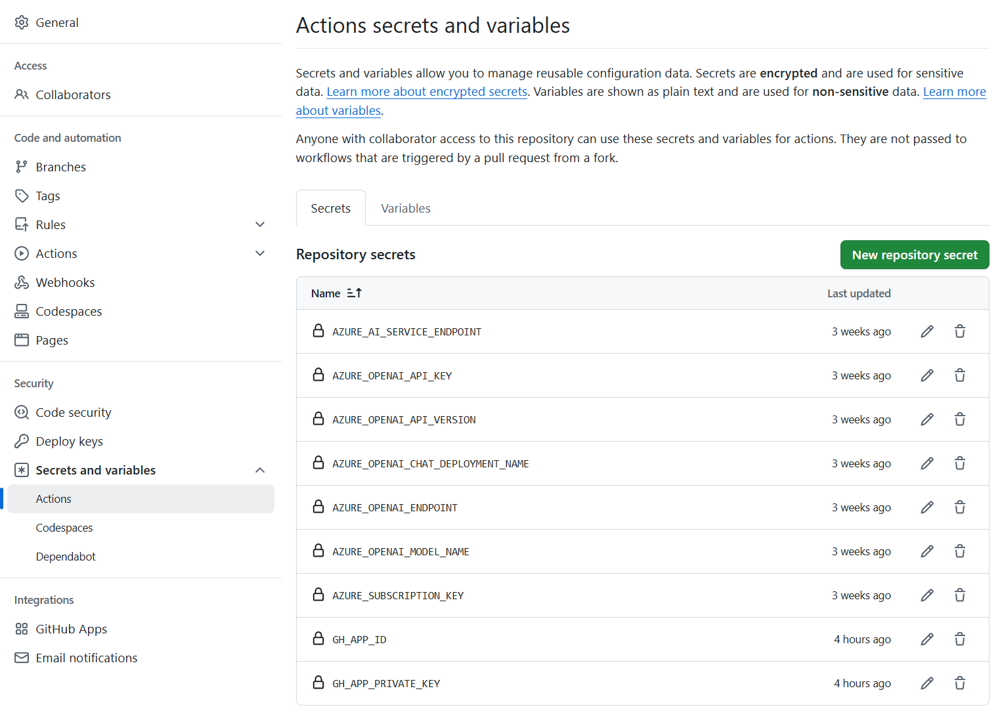

<!--
CO_OP_TRANSLATOR_METADATA:
{
  "original_hash": "9fac847815936ef6e6c8bfde6d191571",
  "translation_date": "2025-10-15T03:55:59+00:00",
  "source_file": "getting_started/github-actions-guide/github-actions-guide-org.md",
  "language_code": "sk"
}
-->
# Používanie Co-op Translator GitHub Action (Organizačný sprievodca)

**Cieľová skupina:** Tento sprievodca je určený pre **interných používateľov Microsoftu** alebo **tímy, ktoré majú prístup k potrebným povereniam pre predpripravenú Co-op Translator GitHub App** alebo si môžu vytvoriť vlastnú vlastnú GitHub App.

Automatizujte preklad dokumentácie vášho repozitára jednoducho pomocou Co-op Translator GitHub Action. Tento sprievodca vás prevedie nastavením akcie tak, aby automaticky vytvárala pull requesty s aktualizovanými prekladmi vždy, keď sa zmenia vaše zdrojové Markdown súbory alebo obrázky.

> [!IMPORTANT]
> 
> **Výber správneho sprievodcu:**
>
> Tento sprievodca popisuje nastavenie pomocou **GitHub App ID a Private Key**. Tento "Organizačný sprievodca" potrebujete najmä vtedy, ak: **`GITHUB_TOKEN` má obmedzené oprávnenia:** Nastavenia vašej organizácie alebo repozitára obmedzujú predvolené oprávnenia, ktoré štandardný `GITHUB_TOKEN` poskytuje. Konkrétne, ak `GITHUB_TOKEN` nemá povolené potrebné `write` oprávnenia (napr. `contents: write` alebo `pull-requests: write`), workflow v [Verejnom sprievodcovi](./github-actions-guide-public.md) zlyhá kvôli nedostatočným oprávneniam. Použitie dedikovanej GitHub App s explicitne udelenými oprávneniami obchádza toto obmedzenie.
>
> **Ak sa vás vyššie uvedené netýka:**
>
> Ak má štandardný `GITHUB_TOKEN` dostatočné oprávnenia vo vašom repozitári (t.j. nie ste blokovaní organizačnými obmedzeniami), použite **[Verejný sprievodca s GITHUB_TOKEN](./github-actions-guide-public.md)**. Verejný sprievodca nevyžaduje získavanie ani správu App ID alebo Private Key a spolieha sa len na štandardný `GITHUB_TOKEN` a oprávnenia repozitára.

## Predpoklady

Pred konfiguráciou GitHub Action si pripravte potrebné poverenia AI služby.

**1. Povinné: Poverenia AI jazykového modelu**
Potrebujete poverenia aspoň pre jeden podporovaný jazykový model:

- **Azure OpenAI**: Vyžaduje Endpoint, API Key, názvy modelov/deploymentov, verziu API.
- **OpenAI**: Vyžaduje API Key, (voliteľne: Org ID, Base URL, Model ID).
- Podrobnosti nájdete v [Podporované modely a služby](../../../../README.md).
- Sprievodca nastavením: [Nastavenie Azure OpenAI](../set-up-resources/set-up-azure-openai.md).

**2. Voliteľné: Poverenia Computer Vision (pre preklad textu v obrázkoch)**

- Potrebné len ak potrebujete prekladať text v obrázkoch.
- **Azure Computer Vision**: Vyžaduje Endpoint a Subscription Key.
- Ak nie sú zadané, akcia sa prepne do [režimu len pre Markdown](../markdown-only-mode.md).
- Sprievodca nastavením: [Nastavenie Azure Computer Vision](../set-up-resources/set-up-azure-computer-vision.md).

## Nastavenie a konfigurácia

Postupujte podľa týchto krokov na nastavenie Co-op Translator GitHub Action vo vašom repozitári:

### Krok 1: Inštalácia a konfigurácia GitHub App autentifikácie

Workflow používa autentifikáciu GitHub App na bezpečnú interakciu s vaším repozitárom (napr. vytváranie pull requestov) vo vašom mene. Vyberte jednu možnosť:

#### **Možnosť A: Inštalácia predpripravenej Co-op Translator GitHub App (pre interné použitie Microsoftu)**

1. Prejdite na stránku [Co-op Translator GitHub App](https://github.com/apps/co-op-translator).

1. Vyberte **Install** a zvoľte účet alebo organizáciu, kde sa nachádza váš cieľový repozitár.

    

1. Zvoľte **Only select repositories** a vyberte váš cieľový repozitár (napr. `PhiCookBook`). Kliknite na **Install**. Môže byť vyžadované overenie.

    

1. **Získajte poverenia aplikácie (vyžaduje interný proces):** Aby workflow mohol autentifikovať ako aplikácia, potrebujete dve informácie od tímu Co-op Translator:
  - **App ID:** Unikátny identifikátor Co-op Translator aplikácie. App ID je: `1164076`.
  - **Private Key:** Musíte získať **celý obsah** súboru `.pem` private key od kontaktného správcu. **Zaobchádzajte s týmto kľúčom ako s heslom a uchovávajte ho v bezpečí.**

1. Pokračujte na krok 2.

#### **Možnosť B: Použitie vlastnej GitHub App**

- Ak chcete, môžete si vytvoriť a nastaviť vlastnú GitHub App. Uistite sa, že má Read & write prístup k Contents a Pull requests. Budete potrebovať jej App ID a vygenerovaný Private Key.

### Krok 2: Nastavenie tajných údajov repozitára

Musíte pridať poverenia GitHub App a AI služby ako šifrované tajné údaje v nastaveniach repozitára.

1. Prejdite do cieľového GitHub repozitára (napr. `PhiCookBook`).

1. Choďte do **Settings** > **Secrets and variables** > **Actions**.

1. V sekcii **Repository secrets** kliknite na **New repository secret** pre každý tajný údaj uvedený nižšie.

   

**Povinné tajné údaje (pre GitHub App autentifikáciu):**

| Názov tajného údaja | Popis | Zdroj hodnoty |
| :------------------- | :----------------------------------------------- | :----------------------------------------------- |
| `GH_APP_ID` | App ID GitHub App (z kroku 1). | Nastavenia GitHub App |
| `GH_APP_PRIVATE_KEY` | **Celý obsah** stiahnutého `.pem` súboru. | `.pem` súbor (z kroku 1) |

**Tajné údaje AI služby (pridajte VŠETKY, ktoré sa vás týkajú podľa predpokladov):**

| Názov tajného údaja | Popis | Zdroj hodnoty |
| :---------------------------------- | :---------------------------------------- | :------------------------------- |
| `AZURE_AI_SERVICE_API_KEY` | Kľúč pre Azure AI Service (Computer Vision) | Azure AI Foundry |
| `AZURE_AI_SERVICE_ENDPOINT` | Endpoint pre Azure AI Service (Computer Vision) | Azure AI Foundry |
| `AZURE_OPENAI_API_KEY` | Kľúč pre Azure OpenAI službu | Azure AI Foundry |
| `AZURE_OPENAI_ENDPOINT` | Endpoint pre Azure OpenAI službu | Azure AI Foundry |
| `AZURE_OPENAI_MODEL_NAME` | Názov vášho Azure OpenAI modelu | Azure AI Foundry |
| `AZURE_OPENAI_CHAT_DEPLOYMENT_NAME` | Názov vášho Azure OpenAI deploymentu | Azure AI Foundry |
| `AZURE_OPENAI_API_VERSION` | Verzia API pre Azure OpenAI | Azure AI Foundry |
| `OPENAI_API_KEY` | API kľúč pre OpenAI | OpenAI Platform |
| `OPENAI_ORG_ID` | OpenAI Organization ID | OpenAI Platform |
| `OPENAI_CHAT_MODEL_ID` | Konkrétne OpenAI model ID | OpenAI Platform |
| `OPENAI_BASE_URL` | Vlastné OpenAI API Base URL | OpenAI Platform |



### Krok 3: Vytvorenie workflow súboru

Nakoniec vytvorte YAML súbor, ktorý definuje automatizovaný workflow.

1. V koreňovom adresári vášho repozitára vytvorte adresár `.github/workflows/`, ak ešte neexistuje.

1. V `.github/workflows/` vytvorte súbor s názvom `co-op-translator.yml`.

1. Vložte nasledujúci obsah do súboru co-op-translator.yml.

```
name: Co-op Translator

on:
  push:
    branches:
      - main

jobs:
  co-op-translator:
    runs-on: ubuntu-latest

    permissions:
      contents: write
      pull-requests: write

    steps:
      - name: Checkout repository
        uses: actions/checkout@v4
        with:
          fetch-depth: 0

      - name: Set up Python
        uses: actions/setup-python@v4
        with:
          python-version: '3.10'

      - name: Install Co-op Translator
        run: |
          python -m pip install --upgrade pip
          pip install co-op-translator

      - name: Run Co-op Translator
        env:
          PYTHONIOENCODING: utf-8
          # Azure AI Service Credentials
          AZURE_AI_SERVICE_API_KEY: ${{ secrets.AZURE_AI_SERVICE_API_KEY }}
          AZURE_AI_SERVICE_ENDPOINT: ${{ secrets.AZURE_AI_SERVICE_ENDPOINT }}

          # Azure OpenAI Credentials
          AZURE_OPENAI_API_KEY: ${{ secrets.AZURE_OPENAI_API_KEY }}
          AZURE_OPENAI_ENDPOINT: ${{ secrets.AZURE_OPENAI_ENDPOINT }}
          AZURE_OPENAI_MODEL_NAME: ${{ secrets.AZURE_OPENAI_MODEL_NAME }}
          AZURE_OPENAI_CHAT_DEPLOYMENT_NAME: ${{ secrets.AZURE_OPENAI_CHAT_DEPLOYMENT_NAME }}
          AZURE_OPENAI_API_VERSION: ${{ secrets.AZURE_OPENAI_API_VERSION }}

          # OpenAI Credentials
          OPENAI_API_KEY: ${{ secrets.OPENAI_API_KEY }}
          OPENAI_ORG_ID: ${{ secrets.OPENAI_ORG_ID }}
          OPENAI_CHAT_MODEL_ID: ${{ secrets.OPENAI_CHAT_MODEL_ID }}
          OPENAI_BASE_URL: ${{ secrets.OPENAI_BASE_URL }}
        run: |
          # =====================================================================
          # IMPORTANT: Set your target languages here (REQUIRED CONFIGURATION)
          # =====================================================================
          # Example: Translate to Spanish, French, German. Add -y to auto-confirm.
          translate -l "es fr de" -y  # <--- MODIFY THIS LINE with your desired languages

      - name: Authenticate GitHub App
        id: generate_token
        uses: tibdex/github-app-token@v1
        with:
          app_id: ${{ secrets.GH_APP_ID }}
          private_key: ${{ secrets.GH_APP_PRIVATE_KEY }}

      - name: Create Pull Request with translations
        uses: peter-evans/create-pull-request@v5
        with:
          token: ${{ steps.generate_token.outputs.token }}
          commit-message: "🌐 Update translations via Co-op Translator"
          title: "🌐 Update translations via Co-op Translator"
          body: |
            This PR updates translations for recent changes to the main branch.

            ### 📋 Changes included
            - Translated contents are available in the `translations/` directory
            - Translated images are available in the `translated_images/` directory

            ---
            🌐 Automatically generated by the [Co-op Translator](https://github.com/Azure/co-op-translator) GitHub Action.
          branch: update-translations
          base: main
          labels: translation, automated-pr
          delete-branch: true
          add-paths: |
            translations/
            translated_images/

```

4.  **Prispôsobenie workflow:**
  - **[!IMPORTANT] Cieľové jazyky:** V kroku `Run Co-op Translator` **MUSÍTE skontrolovať a upraviť zoznam jazykových kódov** v príkaze `translate -l "..." -y` podľa potrieb vášho projektu. Ukážkový zoznam (`ar de es...`) je potrebné nahradiť alebo upraviť.
  - **Trigger (`on:`):** Aktuálny trigger spúšťa workflow pri každom pushi na `main`. Pri veľkých repozitároch zvážte pridanie filtra `paths:` (pozrite komentovaný príklad v YAML), aby sa workflow spúšťal len pri zmene relevantných súborov (napr. zdrojová dokumentácia), čím ušetríte minúty runnera.
  - **Detaily PR:** Prispôsobte `commit-message`, `title`, `body`, názov `branch` a `labels` v kroku `Create Pull Request` podľa potreby.

## Správa a obnova poverení

- **Bezpečnosť:** Vždy ukladajte citlivé poverenia (API kľúče, private key) ako GitHub Actions secrets. Nikdy ich nezverejňujte v workflow súbore ani v kóde repozitára.
- **[!IMPORTANT] Obnova kľúčov (interní používatelia Microsoftu):** Uvedomte si, že Azure OpenAI kľúč používaný v rámci Microsoftu môže mať povinnú politiku obnovy (napr. každých 5 mesiacov). Uistite sa, že aktualizujete príslušné GitHub secrets (`AZURE_OPENAI_...` kľúče) **pred ich vypršaním**, aby ste predišli zlyhaniu workflow.

## Spúšťanie workflow

> [!WARNING]  
> **Časový limit GitHub-hosted runnera:**  
> GitHub-hosted runneri ako `ubuntu-latest` majú **maximálny čas spustenia 6 hodín**.  
> Pri veľkých dokumentačných repozitároch, ak prekladový proces presiahne 6 hodín, workflow bude automaticky ukončený.  
> Aby ste tomu predišli, zvážte:  
> - Použitie **self-hosted runnera** (bez časového limitu)  
> - Zníženie počtu cieľových jazykov na jeden beh

Keď je súbor `co-op-translator.yml` zlúčený do vašej hlavnej vetvy (alebo vetvy určenej v `on:` triggeri), workflow sa automaticky spustí vždy, keď sa do tejto vetvy pushnú zmeny (a zodpovedajú filtru `paths`, ak je nastavený).

Ak sa vygenerujú alebo aktualizujú preklady, akcia automaticky vytvorí Pull Request s týmito zmenami, pripravený na vašu kontrolu a zlúčenie.

---

**Vyhlásenie o vylúčení zodpovednosti**:
Tento dokument bol preložený pomocou AI prekladovej služby [Co-op Translator](https://github.com/Azure/co-op-translator). Hoci sa snažíme o presnosť, upozorňujeme, že automatizované preklady môžu obsahovať chyby alebo nepresnosti. Za autoritatívny zdroj by sa mal považovať pôvodný dokument v jeho pôvodnom jazyku. Pre kritické informácie odporúčame profesionálny ľudský preklad. Nenesieme zodpovednosť za akékoľvek nedorozumenia alebo nesprávne interpretácie vzniknuté použitím tohto prekladu.