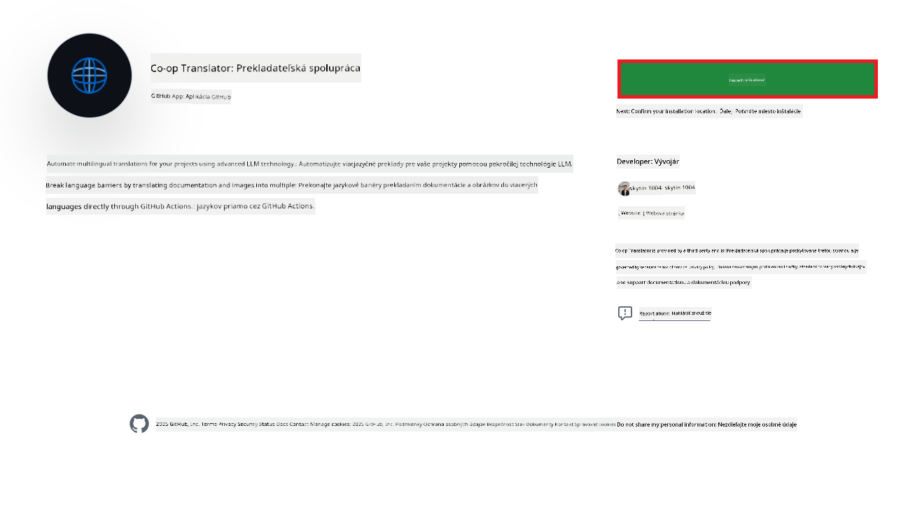
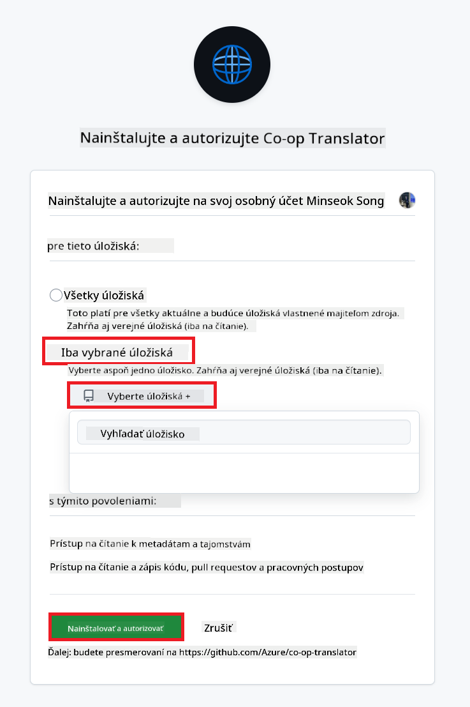
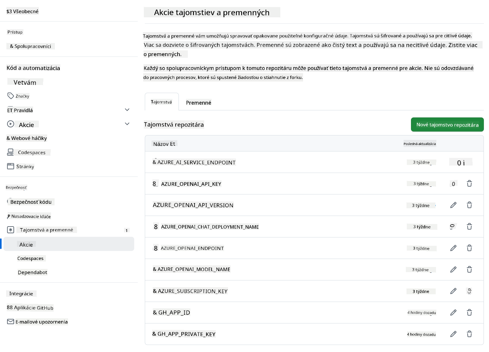

<!--
CO_OP_TRANSLATOR_METADATA:
{
  "original_hash": "c437820027c197f25fb2cbee95bae28c",
  "translation_date": "2025-06-12T19:16:48+00:00",
  "source_file": "getting_started/github-actions-guide/github-actions-guide-org.md",
  "language_code": "sk"
}
-->
# Používanie Co-op Translator GitHub Action (Sprievodca pre organizácie)

**Cieľová skupina:** Tento sprievodca je určený pre **interných používateľov Microsoftu** alebo **tímy, ktoré majú prístup k potrebným povereniam pre predpripravenú aplikáciu Co-op Translator GitHub App** alebo si môžu vytvoriť vlastnú vlastnú GitHub App.

Automatizujte preklad dokumentácie vášho repozitára jednoducho pomocou Co-op Translator GitHub Action. Tento sprievodca vás prevedie nastavením akcie tak, aby automaticky vytvárala pull requesty s aktualizovanými prekladmi vždy, keď sa zmenia zdrojové Markdown súbory alebo obrázky.

> [!IMPORTANT]
> 
> **Výber správneho sprievodcu:**
>
> Tento sprievodca popisuje nastavenie pomocou **GitHub App ID a súkromného kľúča**. Túto metódu „Sprievodca pre organizácie“ obvykle potrebujete, ak: **`GITHUB_TOKEN` oprávnenia sú obmedzené:** Nastavenia vašej organizácie alebo repozitára obmedzujú predvolené oprávnenia štandardného `GITHUB_TOKEN`. Konkrétne, ak štandardný `GITHUB_TOKEN` nemá povolené potrebné `write` oprávnenia (napríklad `contents: write` alebo `pull-requests: write`), workflow podľa [Verejného sprievodcu nastavením](./github-actions-guide-public.md) zlyhá kvôli nedostatočným oprávneniam. Použitie samostatnej GitHub App s explicitne udelenými oprávneniami obíde toto obmedzenie.
>
> **Ak sa vás to netýka:**
>
> Ak má štandardný `GITHUB_TOKEN` dostatočné oprávnenia vo vašom repozitári (t. j. nie ste blokovaní organizačnými obmedzeniami), použite prosím **[Verejný sprievodca nastavením pomocou GITHUB_TOKEN](./github-actions-guide-public.md)**. Verejný sprievodca nevyžaduje získavanie alebo správu App ID či súkromných kľúčov a spolieha sa výhradne na štandardný `GITHUB_TOKEN` a oprávnenia repozitára.

## Predpoklady

Pred konfiguráciou GitHub Action sa uistite, že máte pripravené potrebné poverenia pre AI služby.

**1. Povinné: Poverenia pre AI jazykový model**  
Potrebujete poverenia pre aspoň jeden podporovaný jazykový model:

- **Azure OpenAI**: Vyžaduje Endpoint, API kľúč, názvy modelu/deploymentu, verziu API.  
- **OpenAI**: Vyžaduje API kľúč, (voliteľne: Org ID, Base URL, Model ID).  
- Viac informácií nájdete v [Podporovaných modeloch a službách](../../../../README.md).  
- Sprievodca nastavením: [Nastavenie Azure OpenAI](../set-up-resources/set-up-azure-openai.md).

**2. Voliteľné: Poverenia pre Computer Vision (na preklad obrázkov)**

- Potrebné iba ak chcete prekladať text v obrázkoch.  
- **Azure Computer Vision**: Vyžaduje Endpoint a Subscription Key.  
- Ak nie sú poskytnuté, akcia prejde do režimu [len Markdown](../markdown-only-mode.md).  
- Sprievodca nastavením: [Nastavenie Azure Computer Vision](../set-up-resources/set-up-azure-computer-vision.md).

## Nastavenie a konfigurácia

Postupujte podľa týchto krokov, aby ste nastavili Co-op Translator GitHub Action vo vašom repozitári:

### Krok 1: Inštalácia a konfigurácia autentifikácie GitHub App

Workflow používa autentifikáciu GitHub App, aby bezpečne komunikoval s vaším repozitárom (napr. na vytváranie pull requestov) vo vašom mene. Vyberte jednu možnosť:

#### **Možnosť A: Inštalácia predpripravenej Co-op Translator GitHub App (pre interné použitie Microsoftu)**

1. Prejdite na stránku [Co-op Translator GitHub App](https://github.com/apps/co-op-translator).

1. Vyberte **Install** a zvoľte účet alebo organizáciu, kde sa nachádza váš cieľový repozitár.

    

1. Zvoľte **Only select repositories** a vyberte cieľový repozitár (napr. `PhiCookBook`). Kliknite na **Install**. Môže byť potrebné sa autentifikovať.

    

1. **Získanie poverení aplikácie (vyžaduje interný proces):** Aby mohol workflow autentifikovať ako aplikácia, potrebujete dve informácie poskytnuté tímom Co-op Translator:  
  - **App ID:** Jedinečný identifikátor aplikácie Co-op Translator. App ID je: `1164076`.  
  - **Súkromný kľúč:** Musíte získať **celý obsah** súboru súkromného kľúča `.pem` od kontaktného správcu. **Zaobchádzajte s týmto kľúčom ako s heslom a uchovávajte ho v bezpečí.**

1. Pokračujte na Krok 2.

#### **Možnosť B: Použitie vlastnej vlastnej GitHub App**

- Ak chcete, môžete si vytvoriť a nakonfigurovať vlastnú GitHub App. Uistite sa, že má prístup na čítanie a zápis do Contents a Pull requests. Budete potrebovať jej App ID a vygenerovaný súkromný kľúč.

### Krok 2: Konfigurácia tajomstiev repozitára

Musíte pridať poverenia GitHub App a vaše AI služby ako zašifrované tajomstvá v nastaveniach repozitára.

1. Prejdite do cieľového GitHub repozitára (napr. `PhiCookBook`).

1. Choďte do **Settings** > **Secrets and variables** > **Actions**.

1. V sekcii **Repository secrets** kliknite na **New repository secret** pre každý z nižšie uvedených tajomstiev.

   

**Povinné tajomstvá (pre autentifikáciu GitHub App):**

| Názov tajomstva       | Popis                                         | Zdroj hodnoty                                   |
| :-------------------- | :--------------------------------------------- | :---------------------------------------------- |
| `GH_APP_ID`            | App ID GitHub App (z Kroku 1).                  | Nastavenia GitHub App                           |
| `GH_APP_PRIVATE_KEY` | **Celý obsah** stiahnutého súboru `.pem`. | Súbor `.pem` (z Kroku 1)                    |

**Tajomstvá AI služieb (pridajte VŠETKY, ktoré sa vzťahujú podľa vašich predpokladov):**

| Názov tajomstva                     | Popis                                       | Zdroj hodnoty                   |
| :---------------------------------- | :-------------------------------------------- | :------------------------------- |
| `AZURE_SUBSCRIPTION_KEY`              | Kľúč pre Azure AI službu (Computer Vision)    | Azure AI Foundry                |
| `AZURE_AI_SERVICE_ENDPOINT`           | Endpoint pre Azure AI službu (Computer Vision) | Azure AI Foundry                |
| `AZURE_OPENAI_API_KEY`                | Kľúč pre Azure OpenAI službu                    | Azure AI Foundry                |
| `AZURE_OPENAI_ENDPOINT`               | Endpoint pre Azure OpenAI službu                 | Azure AI Foundry                |
| `AZURE_OPENAI_MODEL_NAME`             | Názov vášho Azure OpenAI modelu                 | Azure AI Foundry                |
| `AZURE_OPENAI_CHAT_DEPLOYMENT_NAME`     | Názov vášho Azure OpenAI deploymentu             | Azure AI Foundry                |
| `AZURE_OPENAI_API_VERSION`            | Verzia API pre Azure OpenAI                      | Azure AI Foundry                |
| `OPENAI_API_KEY`                  | API kľúč pre OpenAI                             | OpenAI Platform                |
| `OPENAI_ORG_ID`                   | OpenAI Organization ID                          | OpenAI Platform                |
| `OPENAI_CHAT_MODEL_ID`              | Špecifický model OpenAI                          | OpenAI Platform                |
| `OPENAI_BASE_URL`                 | Vlastná OpenAI API Base URL                      | OpenAI Platform                |



### Krok 3: Vytvorenie workflow súboru

Nakoniec vytvorte YAML súbor, ktorý definuje automatizovaný workflow.

1. V koreňovom adresári repozitára vytvorte priečinok `.github/workflows/`, ak ešte neexistuje.

1. V priečinku `.github/workflows/` vytvorte súbor s názvom `co-op-translator.yml`.

1. Vložte nasledujúci obsah do co-op-translator.yml.

```
name: Co-op Translator

on:
  push:
    branches:
      - main

jobs:
  co-op-translator:
    runs-on: ubuntu-latest

    permissions:
      contents: write
      pull-requests: write

    steps:
      - name: Checkout repository
        uses: actions/checkout@v4
        with:
          fetch-depth: 0

      - name: Set up Python
        uses: actions/setup-python@v4
        with:
          python-version: '3.10'

      - name: Install Co-op Translator
        run: |
          python -m pip install --upgrade pip
          pip install co-op-translator

      - name: Run Co-op Translator
        env:
          PYTHONIOENCODING: utf-8
          # Azure AI Service Credentials
          AZURE_SUBSCRIPTION_KEY: ${{ secrets.AZURE_SUBSCRIPTION_KEY }}
          AZURE_AI_SERVICE_ENDPOINT: ${{ secrets.AZURE_AI_SERVICE_ENDPOINT }}

          # Azure OpenAI Credentials
          AZURE_OPENAI_API_KEY: ${{ secrets.AZURE_OPENAI_API_KEY }}
          AZURE_OPENAI_ENDPOINT: ${{ secrets.AZURE_OPENAI_ENDPOINT }}
          AZURE_OPENAI_MODEL_NAME: ${{ secrets.AZURE_OPENAI_MODEL_NAME }}
          AZURE_OPENAI_CHAT_DEPLOYMENT_NAME: ${{ secrets.AZURE_OPENAI_CHAT_DEPLOYMENT_NAME }}
          AZURE_OPENAI_API_VERSION: ${{ secrets.AZURE_OPENAI_API_VERSION }}

          # OpenAI Credentials
          OPENAI_API_KEY: ${{ secrets.OPENAI_API_KEY }}
          OPENAI_ORG_ID: ${{ secrets.OPENAI_ORG_ID }}
          OPENAI_CHAT_MODEL_ID: ${{ secrets.OPENAI_CHAT_MODEL_ID }}
          OPENAI_BASE_URL: ${{ secrets.OPENAI_BASE_URL }}
        run: |
          # =====================================================================
          # IMPORTANT: Set your target languages here (REQUIRED CONFIGURATION)
          # =====================================================================
          # Example: Translate to Spanish, French, German. Add -y to auto-confirm.
          translate -l "es fr de" -y  # <--- MODIFY THIS LINE with your desired languages

      - name: Authenticate GitHub App
        id: generate_token
        uses: tibdex/github-app-token@v1
        with:
          app_id: ${{ secrets.GH_APP_ID }}
          private_key: ${{ secrets.GH_APP_PRIVATE_KEY }}

      - name: Create Pull Request with translations
        uses: peter-evans/create-pull-request@v5
        with:
          token: ${{ steps.generate_token.outputs.token }}
          commit-message: "🌐 Update translations via Co-op Translator"
          title: "🌐 Update translations via Co-op Translator"
          body: |
            This PR updates translations for recent changes to the main branch.

            ### 📋 Changes included
            - Translated contents are available in the `translations/` directory
            - Translated images are available in the `translated_images/` directory

            ---
            🌐 Automatically generated by the [Co-op Translator](https://github.com/Azure/co-op-translator) GitHub Action.
          branch: update-translations
          base: main
          labels: translation, automated-pr
          delete-branch: true
          add-paths: |
            translations/
            translated_images/

```

4.  **Prispôsobenie workflow:**  
  - **[!IMPORTANT] Cieľové jazyky:** V príkaze `Run Co-op Translator` step, you **MUST review and modify the list of language codes** within the `translate -l "..." -y` command to match your project's requirements. The example list (`ar de es...`) needs to be replaced or adjusted.
  - **Trigger (`on:`):** The current trigger runs on every push to `main`. For large repositories, consider adding a `paths:` filter (see commented example in the YAML) to run the workflow only when relevant files (e.g., source documentation) change, saving runner minutes.
  - **PR Details:** Customize the `commit-message`, `title`, `body`, `branch` name, and `labels` in the `Create Pull Request` step if needed.

## Credential Management and Renewal

- **Security:** Always store sensitive credentials (API keys, private keys) as GitHub Actions secrets. Never expose them in your workflow file or repository code.
- **[!IMPORTANT] Key Renewal (Internal Microsoft Users):** Be aware that Azure OpenAI key used within Microsoft might have a mandatory renewal policy (e.g., every 5 months). Ensure you update the corresponding GitHub secrets (`AZURE_OPENAI_...` zadajte požadované jazyky **pred tým, než vypršia platnosti kľúčov**, aby ste predišli zlyhaniu workflow.

## Spustenie workflow

Keď je súbor `co-op-translator.yml` zlúčený do vašej hlavnej vetvy (alebo vetvy špecifikovanej vo filtri `on:` trigger), the workflow will automatically run whenever changes are pushed to that branch (and match the `paths`, ak je nakonfigurovaný).

Ak sú preklady vytvorené alebo aktualizované, akcia automaticky vytvorí Pull Request s týmito zmenami, pripravený na vašu kontrolu a zlúčenie.

**Vyhlásenie o zodpovednosti**:  
Tento dokument bol preložený pomocou AI prekladateľskej služby [Co-op Translator](https://github.com/Azure/co-op-translator). Hoci sa snažíme o presnosť, prosím berte na vedomie, že automatizované preklady môžu obsahovať chyby alebo nepresnosti. Pôvodný dokument v jeho natívnom jazyku by mal byť považovaný za autoritatívny zdroj. Pre kritické informácie sa odporúča profesionálny ľudský preklad. Nie sme zodpovední za akékoľvek nedorozumenia alebo nesprávne interpretácie vyplývajúce z použitia tohto prekladu.