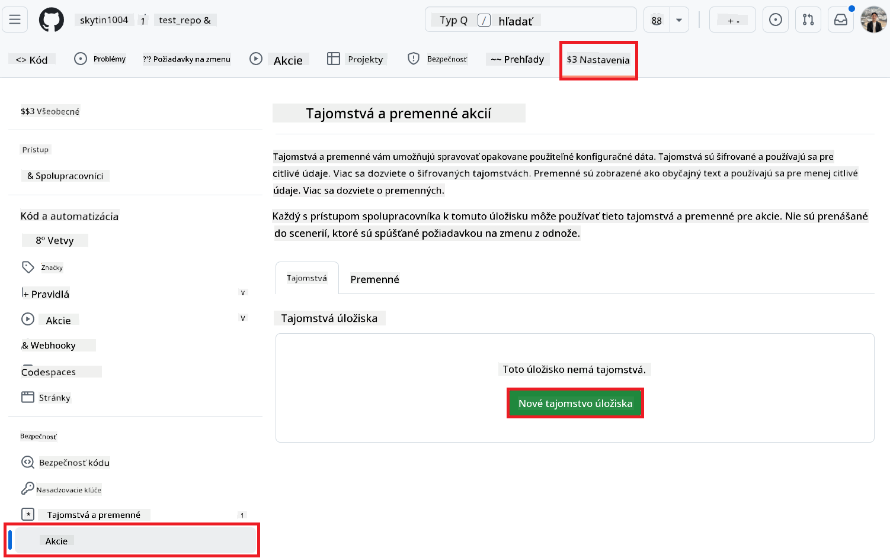
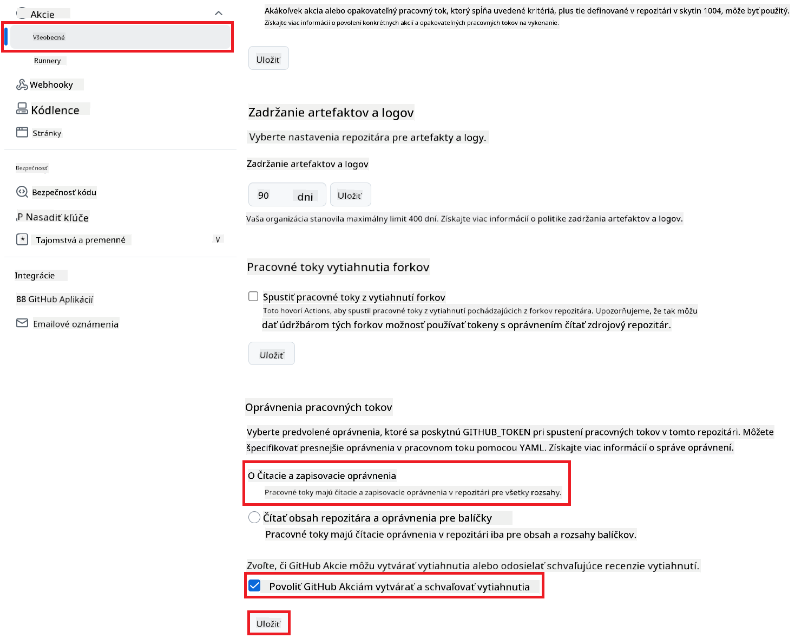

<!--
CO_OP_TRANSLATOR_METADATA:
{
  "original_hash": "a52587a512e667f70d92db853d3c61d5",
  "translation_date": "2025-06-12T19:34:13+00:00",
  "source_file": "getting_started/github-actions-guide/github-actions-guide-public.md",
  "language_code": "sk"
}
-->
# Použitie Co-op Translator GitHub Action (Verejné nastavenie)

**Cieľová skupina:** Tento návod je určený pre používateľov vo väčšine verejných alebo súkromných repozitárov, kde sú štandardné povolenia GitHub Actions dostatočné. Využíva zabudovaný `GITHUB_TOKEN`.

Automatizujte preklad dokumentácie vášho repozitára bez námahy pomocou Co-op Translator GitHub Action. Tento návod vás prevedie nastavením akcie, ktorá automaticky vytvára pull requesty s aktualizovanými prekladmi vždy, keď sa zmenia zdrojové Markdown súbory alebo obrázky.

> [!IMPORTANT]
>
> **Výber správneho návodu:**
>
> Tento návod popisuje **jednoduchšie nastavenie pomocou štandardného `GITHUB_TOKEN`**. Je to odporúčaná metóda pre väčšinu používateľov, pretože nevyžaduje správu citlivých súkromných kľúčov GitHub App.
>

## Predpoklady

Pred konfiguráciou GitHub Action sa uistite, že máte pripravené potrebné prihlasovacie údaje k AI službám.

**1. Povinné: Prihlasovacie údaje k AI jazykovému modelu**  
Potrebujete prihlasovacie údaje aspoň k jednému podporovanému jazykovému modelu:

- **Azure OpenAI**: Vyžaduje Endpoint, API kľúč, názvy modelov/deploymentov, verziu API.  
- **OpenAI**: Vyžaduje API kľúč, (voliteľne: Org ID, Base URL, Model ID).  
- Podrobnosti nájdete v [Supported Models and Services](../../../../README.md).

**2. Voliteľné: Prihlasovacie údaje k AI Vision (pre preklad obrázkov)**

- Potrebné iba ak potrebujete prekladať text v obrázkoch.  
- **Azure AI Vision**: Vyžaduje Endpoint a Subscription Key.  
- Ak nie sú poskytnuté, akcia prejde do [Markdown-only režimu](../markdown-only-mode.md).

## Nastavenie a konfigurácia

Postupujte podľa týchto krokov na nastavenie Co-op Translator GitHub Action vo vašom repozitári s použitím štandardného `GITHUB_TOKEN`.

### Krok 1: Pochopenie autentifikácie (použitie `GITHUB_TOKEN`)

Tento workflow využíva zabudovaný `GITHUB_TOKEN` poskytovaný GitHub Actions. Tento token automaticky udeľuje workflow povolenia na interakciu s vaším repozitárom na základe nastavení uvedených v **Kroku 3**.

### Krok 2: Nastavenie tajomstiev repozitára

Stačí pridať **prihlasovacie údaje AI služieb** ako zašifrované tajomstvá v nastaveniach vášho repozitára.

1.  Prejdite do cieľového GitHub repozitára.  
2.  Choďte do **Settings** > **Secrets and variables** > **Actions**.  
3.  Pod **Repository secrets** kliknite na **New repository secret** pre každý požadovaný AI servisný kľúč uvedený nižšie.

     *(Obrázok: Ukazuje, kde sa pridávajú tajomstvá)*

**Povinné tajomstvá AI služieb (Pridajte VŠETKY, ktoré sa vás týkajú podľa predpokladov):**

| Názov tajomstva                   | Popis                                         | Zdroj hodnoty                   |
| :-------------------------------- | :--------------------------------------------- | :------------------------------ |
| `AZURE_SUBSCRIPTION_KEY`            | Kľúč pre Azure AI službu (Computer Vision)       | Vaša Azure AI Foundry            |
| `AZURE_AI_SERVICE_ENDPOINT`         | Endpoint pre Azure AI službu (Computer Vision)     | Vaša Azure AI Foundry            |
| `AZURE_OPENAI_API_KEY`              | Kľúč pre Azure OpenAI službu                       | Vaša Azure AI Foundry            |
| `AZURE_OPENAI_ENDPOINT`             | Endpoint pre Azure OpenAI službu                    | Vaša Azure AI Foundry            |
| `AZURE_OPENAI_MODEL_NAME`           | Názov vášho Azure OpenAI modelu                      | Vaša Azure AI Foundry            |
| `AZURE_OPENAI_CHAT_DEPLOYMENT_NAME` | Názov vášho Azure OpenAI deploymentu                  | Vaša Azure AI Foundry            |
| `AZURE_OPENAI_API_VERSION`          | Verzia API pre Azure OpenAI                           | Vaša Azure AI Foundry            |
| `OPENAI_API_KEY`                    | API kľúč pre OpenAI                                  | Vaša OpenAI Platform             |
| `OPENAI_ORG_ID`                     | OpenAI Organization ID (voliteľné)                   | Vaša OpenAI Platform             |
| `OPENAI_CHAT_MODEL_ID`              | Špecifický OpenAI model ID (voliteľné)                | Vaša OpenAI Platform             |
| `OPENAI_BASE_URL`                   | Vlastná OpenAI API Base URL (voliteľné)               | Vaša OpenAI Platform             |

### Krok 3: Nastavenie povolení workflow

GitHub Action potrebuje povolenia udelené cez `GITHUB_TOKEN` na checkout kódu a vytváranie pull requestov.

1.  Vo vašom repozitári choďte do **Settings** > **Actions** > **General**.  
2.  Posuňte sa na sekciu **Workflow permissions**.  
3.  Vyberte **Read and write permissions**. Týmto udeľujete `GITHUB_TOKEN` potrebné `contents: write` a `pull-requests: write` povolenia pre tento workflow.  
4.  Uistite sa, že je zaškrtnutá možnosť **Allow GitHub Actions to create and approve pull requests**.  
5.  Kliknite na **Save**.



### Krok 4: Vytvorenie workflow súboru

Nakoniec vytvorte YAML súbor, ktorý definuje automatizovaný workflow s použitím `GITHUB_TOKEN`.

1.  V koreňovom adresári vášho repozitára vytvorte priečinok `.github/workflows/`, ak ešte neexistuje.  
2.  Vo vnútri `.github/workflows/` vytvorte súbor s názvom `co-op-translator.yml`.  
3.  Skopírujte do `co-op-translator.yml` nasledujúci obsah.

```yaml
name: Co-op Translator

on:
  push:
    branches:
      - main

jobs:
  co-op-translator:
    runs-on: ubuntu-latest

    permissions:
      contents: write
      pull-requests: write

    steps:
      - name: Checkout repository
        uses: actions/checkout@v4
        with:
          fetch-depth: 0

      - name: Set up Python
        uses: actions/setup-python@v4
        with:
          python-version: '3.10'

      - name: Install Co-op Translator
        run: |
          python -m pip install --upgrade pip
          pip install co-op-translator

      - name: Run Co-op Translator
        env:
          PYTHONIOENCODING: utf-8
          # === AI Service Credentials ===
          AZURE_SUBSCRIPTION_KEY: ${{ secrets.AZURE_SUBSCRIPTION_KEY }}
          AZURE_AI_SERVICE_ENDPOINT: ${{ secrets.AZURE_AI_SERVICE_ENDPOINT }}
          AZURE_OPENAI_API_KEY: ${{ secrets.AZURE_OPENAI_API_KEY }}
          AZURE_OPENAI_ENDPOINT: ${{ secrets.AZURE_OPENAI_ENDPOINT }}
          AZURE_OPENAI_MODEL_NAME: ${{ secrets.AZURE_OPENAI_MODEL_NAME }}
          AZURE_OPENAI_CHAT_DEPLOYMENT_NAME: ${{ secrets.AZURE_OPENAI_CHAT_DEPLOYMENT_NAME }}
          AZURE_OPENAI_API_VERSION: ${{ secrets.AZURE_OPENAI_API_VERSION }}
          OPENAI_API_KEY: ${{ secrets.OPENAI_API_KEY }}
          OPENAI_ORG_ID: ${{ secrets.OPENAI_ORG_ID }}
          OPENAI_CHAT_MODEL_ID: ${{ secrets.OPENAI_CHAT_MODEL_ID }}
          OPENAI_BASE_URL: ${{ secrets.OPENAI_BASE_URL }}
        run: |
          # =====================================================================
          # IMPORTANT: Set your target languages here (REQUIRED CONFIGURATION)
          # =====================================================================
          # Example: Translate to Spanish, French, German. Add -y to auto-confirm.
          translate -l "es fr de" -y  # <--- MODIFY THIS LINE with your desired languages

      - name: Create Pull Request with translations
        uses: peter-evans/create-pull-request@v5
        with:
          token: ${{ secrets.GITHUB_TOKEN }}
          commit-message: "🌐 Update translations via Co-op Translator"
          title: "🌐 Update translations via Co-op Translator"
          body: |
            This PR updates translations for recent changes to the main branch.

            ### 📋 Changes included
            - Translated contents are available in the `translations/` directory
            - Translated images are available in the `translated_images/` directory

            ---
            🌐 Automatically generated by the [Co-op Translator](https://github.com/Azure/co-op-translator) GitHub Action.
          branch: update-translations
          base: main
          labels: translation, automated-pr
          delete-branch: true
          add-paths: |
            translations/
            translated_images/
```  
4.  **Prispôsobenie workflow:**  
  - **[!IMPORTANT] Cieľové jazyky:** V kroku `Run Co-op Translator` step, you **MUST review and modify the list of language codes** within the `translate -l "..." -y` command to match your project's requirements. The example list (`ar de es...`) needs to be replaced or adjusted.
  - **Trigger (`on:`):** The current trigger runs on every push to `main`. For large repositories, consider adding a `paths:` filter (see commented example in the YAML) to run the workflow only when relevant files (e.g., source documentation) change, saving runner minutes.
  - **PR Details:** Customize the `commit-message`, `title`, `body`, `branch` name, and `labels` in the `Create Pull Request` upravte podľa potreby.

**Vyhlásenie o zodpovednosti**:  
Tento dokument bol preložený pomocou AI prekladateľskej služby [Co-op Translator](https://github.com/Azure/co-op-translator). Hoci sa snažíme o presnosť, prosím, majte na pamäti, že automatické preklady môžu obsahovať chyby alebo nepresnosti. Originálny dokument v jeho pôvodnom jazyku by mal byť považovaný za autoritatívny zdroj. Pre dôležité informácie sa odporúča profesionálny ľudský preklad. Nie sme zodpovední za akékoľvek nedorozumenia alebo nesprávne výklady vyplývajúce z použitia tohto prekladu.