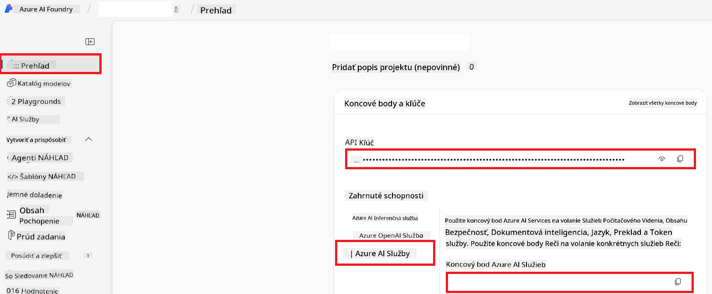

<!--
CO_OP_TRANSLATOR_METADATA:
{
  "original_hash": "b58d7c3cb4210697a073d20eb3064945",
  "translation_date": "2025-06-12T11:58:05+00:00",
  "source_file": "getting_started/set-up-azure-ai.md",
  "language_code": "sk"
}
-->
# Nastavenie Azure AI pre Co-op Translator (Azure OpenAI & Azure AI Vision)

Tento návod vás prevedie nastavením Azure OpenAI pre preklad jazykov a Azure Computer Vision pre analýzu obsahu obrázkov (ktoré potom môžete využiť na preklad založený na obrázkoch) v rámci Azure AI Foundry.

**Predpoklady:**
- Azure účet s aktívnym predplatným.
- Dostatočné oprávnenia na vytváranie zdrojov a nasadení vo vašom Azure predplatnom.

## Vytvorenie Azure AI projektu

Začnete vytvorením Azure AI projektu, ktorý slúži ako centrálne miesto na správu vašich AI zdrojov.

1. Prejdite na [https://ai.azure.com](https://ai.azure.com) a prihláste sa pomocou svojho Azure účtu.

1. Vyberte **+Create** pre vytvorenie nového projektu.

1. Vykonajte nasledujúce kroky:
   - Zadajte **Názov projektu** (napr. `CoopTranslator-Project`).
   - Vyberte **AI hub** (napr. `CoopTranslator-Hub`) (v prípade potreby vytvorte nový).

1. Kliknite na "**Review and Create**" pre nastavenie projektu. Budete presmerovaní na prehľadovú stránku projektu.

## Nastavenie Azure OpenAI pre preklad jazykov

V rámci vášho projektu nasadíte model Azure OpenAI, ktorý bude slúžiť ako backend pre preklad textu.

### Prejdite do svojho projektu

Ak ešte nie ste v projekte, otvorte svoj novo vytvorený projekt (napr. `CoopTranslator-Project`) v Azure AI Foundry.

### Nasadenie OpenAI modelu

1. V ľavom menu projektu, v sekcii "My assets", vyberte "**Models + endpoints**".

1. Vyberte **+ Deploy model**.

1. Zvoľte **Deploy Base Model**.

1. Zobrazí sa zoznam dostupných modelov. Filtrovať alebo vyhľadať vhodný GPT model. Odporúčame `gpt-4o`.

1. Vyberte požadovaný model a kliknite na **Confirm**.

1. Kliknite na **Deploy**.

### Konfigurácia Azure OpenAI

Po nasadení môžete na stránke "**Models + endpoints**" vybrať nasadenie a nájsť jeho **REST endpoint URL**, **Key**, **Deployment name**, **Model name** a **API version**. Tieto údaje budete potrebovať na integráciu prekladového modelu do vašej aplikácie.

> [!NOTE]
> API verzie si môžete vybrať na stránke [API version deprecation](https://learn.microsoft.com/azure/ai-services/openai/api-version-deprecation) podľa vašich požiadaviek. Majte na pamäti, že **API version** sa líši od **Model version**, ktorá je zobrazená na stránke **Models + endpoints** v Azure AI Foundry.

## Nastavenie Azure Computer Vision pre preklad obrázkov

Pre možnosť prekladu textu v obrázkoch potrebujete získať API Key a Endpoint služby Azure AI.

1. Prejdite do svojho Azure AI projektu (napr. `CoopTranslator-Project`). Uistite sa, že ste na prehľadovej stránke projektu.

### Konfigurácia Azure AI služby

Nájdite API Key a Endpoint v záložke Azure AI Service.

1. Prejdite do svojho Azure AI projektu (napr. `CoopTranslator-Project`). Uistite sa, že ste na prehľadovej stránke projektu.

1. Nájdite **API Key** a **Endpoint** v záložke Azure AI Service.

    

Toto prepojenie umožňuje využívať schopnosti prepojeného zdroja Azure AI Services (vrátane analýzy obrázkov) vo vašom projekte AI Foundry. Túto konekciu potom môžete využiť vo svojich notebookoch alebo aplikáciách na extrakciu textu z obrázkov, ktorý následne odošlete do Azure OpenAI modelu na preklad.

## Zhrnutie vašich prihlasovacích údajov

Teraz by ste mali mať pripravené nasledujúce údaje:

**Pre Azure OpenAI (Preklad textu):**
- Azure OpenAI Endpoint
- Azure OpenAI API Key
- Azure OpenAI Model Name (napr. `gpt-4o`)
- Azure OpenAI Deployment Name (napr. `cooptranslator-gpt4o`)
- Azure OpenAI API Version

**Pre Azure AI Services (Extrakcia textu z obrázkov cez Vision):**
- Azure AI Service Endpoint
- Azure AI Service API Key

### Príklad: Konfigurácia prostredia (Preview)

Neskôr, pri tvorbe aplikácie, pravdepodobne tieto údaje nastavíte ako premenné prostredia takto:

```bash
# Azure AI Service Credentials (Required for image translation)
AZURE_AI_SERVICE_API_KEY="your_azure_ai_service_api_key" # e.g., 21xasd...
AZURE_AI_SERVICE_ENDPOINT="https://your_azure_ai_service_endpoint.cognitiveservices.azure.com/"

# Azure OpenAI Credentials (Required for text translation)
AZURE_OPENAI_API_KEY="your_azure_openai_api_key" # e.g., 21xasd...
AZURE_OPENAI_ENDPOINT="https://your_azure_openai_endpoint.openai.azure.com/"
AZURE_OPENAI_MODEL_NAME="your_model_name" # e.g., gpt-4o
AZURE_OPENAI_CHAT_DEPLOYMENT_NAME="your_deployment_name" # e.g., cooptranslator-gpt4o
AZURE_OPENAI_API_VERSION="your_api_version" # e.g., 2024-12-01-preview
```

---

### Ďalšie zdroje

- [Ako vytvoriť projekt v Azure AI Foundry](https://learn.microsoft.com/azure/ai-foundry/how-to/create-projects?tabs=ai-studio)
- [Ako vytvoriť Azure AI zdroje](https://learn.microsoft.com/azure/ai-foundry/how-to/create-azure-ai-resource?tabs=portal)
- [Ako nasadiť OpenAI modely v Azure AI Foundry](https://learn.microsoft.com/en-us/azure/ai-foundry/how-to/deploy-models-openai)

**Zrieknutie sa zodpovednosti**:  
Tento dokument bol preložený pomocou AI prekladateľskej služby [Co-op Translator](https://github.com/Azure/co-op-translator). Aj keď sa snažíme o presnosť, prosím, berte na vedomie, že automatické preklady môžu obsahovať chyby alebo nepresnosti. Pôvodný dokument v jeho rodnom jazyku by mal byť považovaný za autoritatívny zdroj. Pre kritické informácie sa odporúča profesionálny ľudský preklad. Nie sme zodpovední za akékoľvek nedorozumenia alebo nesprávne interpretácie vyplývajúce z použitia tohto prekladu.