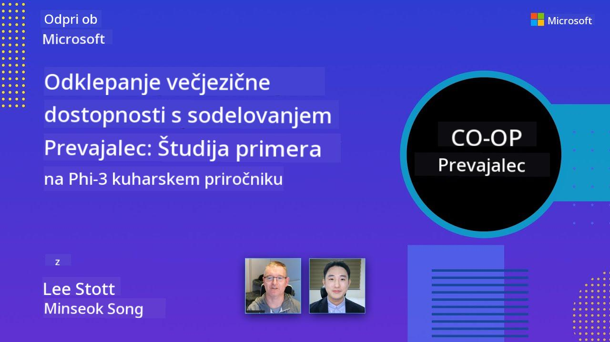

<!--
CO_OP_TRANSLATOR_METADATA:
{
  "original_hash": "044724537b57868117aadae8e7728c7c",
  "translation_date": "2025-06-12T10:58:01+00:00",
  "source_file": "README.md",
  "language_code": "sl"
}
-->


# Co-op Translator: Z lahkoto avtomatizirajte prevajanje izobraževalne dokumentacije

_Preprosto avtomatizirajte prevajanje vaše dokumentacije v več jezikov, da dosežete globalno občinstvo._

[](https://pypi.org/project/co-op-translator/)
[](https://github.com/azure/co-op-translator/blob/main/LICENSE)
[](https://pepy.tech/project/co-op-translator)
[](https://pepy.tech/project/co-op-translator)
[](https://github.com/psf/black)

[](https://GitHub.com/azure/co-op-translator/graphs/contributors/)
[](https://GitHub.com/azure/co-op-translator/issues/)
[](https://GitHub.com/azure/co-op-translator/pulls/)
[](http://makeapullrequest.com)

### Podpora jezikom, ki jo omogoča Co-op Translator

> [!NOTE]
> Ti so trenutni prevodi vsebine tega repozitorija. Za celoten seznam jezikov, ki jih podpira Co-op Translator, si oglejte razdelek [Language Support](../..).

[](https://GitHub.com/azure/co-op-translator/watchers/)
[](https://GitHub.com/azure/co-op-translator/network/)
[](https://GitHub.com/azure/co-op-translator/stargazers/)

[](https://discord.com/invite/ByRwuEEgH4)

[](https://codespaces.new/azure/co-op-translator)
[](https://vscode.dev/redirect?url=vscode://ms-vscode-remote.remote-containers/cloneInVolume?url=https://github.com/azure/co-op-translator)

## Pregled: Poenostavite prevajanje vaših izobraževalnih vsebin

Jezikovne ovire močno omejujejo dostop do dragocenih izobraževalnih virov in tehničnega znanja za učence in razvijalce po vsem svetu. To omejuje sodelovanje in upočasnjuje globalno inovacijo ter učenje.

**Co-op Translator** je nastal iz potrebe po učinkovitejšem postopku prevajanja za Microsoftove obsežne izobraževalne serije (kot so vodiči "For Beginners"). Razvil se je v enostavno in zmogljivo orodje, ki razbija te ovire za vse. Z zagotavljanjem kakovostnih avtomatiziranih prevodov prek CLI in GitHub Actions Co-op Translator omogoča izobraževalcem, študentom, raziskovalcem in razvijalcem po svetu, da delijo in dostopajo do znanja brez jezikovnih omejitev.

Oglejte si, kako Co-op Translator organizira prevedene izobraževalne vsebine:


Markdown datoteke in besedilo na slikah se samodejno prevajajo in lepo razvrstijo v mape po jezikih.

**Odprite globalni dostop do svojih izobraževalnih vsebin z Co-op Translator že danes!**

## Podpora globalnemu dostopu do Microsoftovih učnih virov

Co-op Translator pomaga premostiti jezikovne ovire za ključne Microsoftove izobraževalne pobude in avtomatizira prevajanje repozitorijev, ki služijo globalni skupnosti razvijalcev. Primeri, ki trenutno uporabljajo Co-op Translator:

[](https://github.com/microsoft/Generative-AI-for-beginners)
[](https://github.com/microsoft/ML-For-Beginners)
[](https://github.com/microsoft/AI-For-Beginners)
[](https://github.com/microsoft/ai-agents-for-beginners)
[](https://github.com/microsoft/PhiCookBook)
[](https://github.com/microsoft/Generative-AI-for-beginners-dotnet)

## Ključne funkcije

- **Avtomatski prevodi**: Prevajajte besedilo v več jezikov brez truda.
- **Integracija z GitHub Actions**: Avtomatizirajte prevajanje kot del CI/CD procesa.
- **Ohranjanje Markdown sintakse**: Prevodi ohranijo pravilno Markdown oblikovanje.
- **Prevajanje besedila na slikah**: Izvleče in prevede besedilo znotraj slik.
- **Napredna LLM tehnologija**: Uporaba najsodobnejših jezikovnih modelov za kakovostne prevode.
- **Enostavna integracija**: Brezhibno se poveže z vašo obstoječo nastavitvijo projekta.
- **Poenostavite lokalizacijo**: Poenostavite proces prilagajanja projekta za mednarodne trge.

## Kako deluje


Co-op Translator vzame Markdown datoteke in slike iz vaše projektne mape ter jih obdela tako:

1. **Izvleček besedila**: Izvleče besedilo iz Markdown datotek in, če je konfigurirano (npr. z Azure AI Vision), tudi besedilo znotraj slik.
1. **AI prevajanje**: Pošlje izvlečeno besedilo konfiguriranemu LLM-ju (Azure OpenAI, OpenAI itd.) v prevod.
1. **Shranjevanje rezultatov**: Shrani prevedene Markdown datoteke in slike (s prevedenim besedilom) v mape po jezikih, pri čemer ohrani izvirno oblikovanje.

## Začnite

Hitro začnite z uporabo CLI ali nastavite popolno avtomatizacijo z GitHub Actions. Izberite način, ki vam najbolj ustreza:

1. **Ukazna vrstica (CLI)** – za enkratne prevode ali ročni nadzor
2. **GitHub Actions** – za avtomatske prevode ob vsakem pushu

> [!NOTE]
> Čeprav se ta vodič osredotoča na Azure vire, lahko uporabite kateri koli podprt jezikovni model.

### Podpora jezikov

Co-op Translator podpira širok nabor jezikov, da dosežete globalno občinstvo. Tukaj je nekaj osnovnih informacij:

#### Hiter pregled

| Jezik | Koda | Jezik | Koda | Jezik | Koda |
|-------|------|-------|------|-------|------|
| Arabic | ar | Bengali | bn | Bulgarian | bg |
| Burmese (Myanmar) | my | Chinese (Simplified) | zh | Chinese (Traditional, HK) | hk |
| Chinese (Traditional, Macau) | mo | Chinese (Traditional, TW) | tw | Croatian | hr |
| Czech | cs | Danish | da | Dutch | nl |
| Finnish | fi | French | fr | German | de |
| Greek | el | Hebrew | he | Hindi | hi |
| Hungarian | hu | Indonesian | id | Italian | it |
| Japanese | ja | Korean | ko | Malay | ms |
| Marathi | mr | Nepali | ne | Norwegian | no |
| Persian (Farsi) | fa | Polish | pl | Portuguese (Brazil) | br |
| Portuguese (Portugal) | pt | Punjabi (Gurmukhi) | pa | Romanian | ro |
| Russian | ru | Serbian (Cyrillic) | sr | Slovak | sk |
| Slovenian | sl | Spanish | es | Swahili | sw |
| Swedish | sv | Tagalog (Filipino) | tl | Thai | th |
| Turkish | tr | Ukrainian | uk | Urdu | ur |
| Vietnamese | vi | — | — | — | — |

#### Uporaba jezikovnih kod

Pri uporabi Co-op Translator morate jezike določiti z njihovimi kodami. Na primer:

```bash
# Translate to French, Spanish, and German
translate -l "fr es de"

# Translate to Chinese (Simplified) and Japanese
translate -l "zh ja"
```

> [!NOTE]
> Za podrobne tehnične informacije o podpori jezikov, vključno z:
>
> - specifikacijami pisav za vsak jezik
> - znanimi težavami
> - kako dodati nove jezike
>
> si oglejte našo [dokumentacijo o podprtih jezikih](./getting_started/supported-languages.md).

### Podprti modeli in storitve

| Tip                  | Ime                             |
|----------------------|--------------------------------|
| Jezikovni model      |   |
| AI Vision            |  |

> [!NOTE]
> Če AI vision storitev ni na voljo, bo co-op translator preklopil v [Markdown-only način](./getting_started/markdown-only-mode.md).

### Začetna nastavitev

Preden začnete, nastavite naslednje vire:

1. Jezikovni model (obvezen):
   - Azure OpenAI (priporočeno) – zagotavlja kakovostne prevode z zanesljivostjo na ravni podjetja
   - OpenAI – alternativa, če nimate dostopa do Azure
   - Za podrobnosti o podprtih modelih glejte [Supported Models and Services](../..)

1. AI Vision (opcijsko):
   - Azure AI Vision – omogoča prevajanje besedila na slikah
   - Če ni konfigurirano, bo prevajalnik samodejno uporabil [Markdown-only način](./getting_started/markdown-only-mode.md)
   - Priporočeno za projekte s slikami, ki vsebujejo besedilo za prevod

1. Koraki konfiguracije:
   - Sledite našemu [vodniku za nastavitev Azure AI](./getting_started/set-up-azure-ai.md) za podrobna navodila
   - Ustvarite `.env` datoteko z vašimi API ključi in končnimi točkami (glejte razdelek [Quick Start](../..))
   - Poskrbite, da imate potrebna dovoljenja in kvote za izbrane storitve

### Priprava projekta pred prevajanjem

Pred začetkom prevajanja pripravite svoj projekt tako:

1. Pripravite README:
   - Dodajte tabelo prevodov v README.md, ki povezuje na prevedene različice
   - Primer oblikovanja:

     ```markdown

     ### 🌐 Multi-Language Support
     
     [French](../fr/README.md) | [Spanish](../es/README.md) | [German](../de/README.md) | [Russian](../ru/README.md) | [Arabic](../ar/README.md) | [Persian (Farsi)](../fa/README.md) | [Urdu](../ur/README.md) | [Chinese (Simplified)](../zh/README.md) | [Chinese (Traditional, Macau)](../mo/README.md) | [Chinese (Traditional, Hong Kong)](../hk/README.md) | [Chinese (Traditional, Taiwan)](../tw/README.md) | [Japanese](../ja/README.md) | [Korean](../ko/README.md) | [Hindi](../hi/README.md) | [Bengali](../bn/README.md) | [Marathi](../mr/README.md) | [Nepali](../ne/README.md) | [Punjabi (Gurmukhi)](../pa/README.md) | [Portuguese (Portugal)](../pt/README.md) | [Portuguese (Brazil)](../br/README.md) | [Italian](../it/README.md) | [Polish](../pl/README.md) | [Turkish](../tr/README.md) | [Greek](../el/README.md) | [Thai](../th/README.md) | [Swedish](../sv/README.md) | [Danish](../da/README.md) | [Norwegian](../no/README.md) | [Finnish](../fi/README.md) | [Dutch](../nl/README.md) | [Hebrew](../he/README.md) | [Vietnamese](../vi/README.md) | [Indonesian](../id/README.md) | [Malay](../ms/README.md) | [Tagalog (Filipino)](../tl/README.md) | [Swahili](../sw/README.md) | [Hungarian](../hu/README.md) | [Czech](../cs/README.md) | [Slovak](../sk/README.md) | [Romanian](../ro/README.md) | [Bulgarian](../bg/README.md) | [Serbian (Cyrillic)](../sr/README.md) | [Croatian](../hr/README.md) | [Slovenian](./README.md) | [Ukrainian](../uk/README.md) | [Burmese (Myanmar)](../my/README.md) 
    
     ```

1. Počistite obstoječe prevode (če je potrebno):
   - Odstranite obstoječe mape s prevodi (npr. `translations/`)
   - Izbrišite stare prevodne datoteke, da začnete znova
   - Tako preprečite konflikte z novim prevajalskim postopkom

### Hiter začetek: Ukazna vrstica

Za hiter začetek z ukazno vrstico:

1. Ustvarite virtualno okolje:

    ```bash
    python -m venv .venv
    ```

1. Aktivirajte virtualno okolje:

    - Na Windows:

    ```bash
    .venv\scripts\activate
    ```

    - Na Linux/macOS:

    ```bash
    source .venv/bin/activate
    ```

1. Namestite paket:

    ```bash
    pip install co-op-translator
    ```

1. Nastavite poverilnice:

    - Ustvarite `.env` file in your project's root directory.
    - Copy the contents from the [.env.template](../../.env.template) file into your new `.env` file.
    - Fill in the required API keys and endpoint information in your `.env` file.

1. Run Translation:
    - Navigate to your project's root directory in your terminal.
    - Execute the translate command, specifying target languages with the `-l` zastavico:

    ```bash
    translate -l "ko ja fr"
    ```

    _(Nadomestite `"ko ja fr"` with your desired space-separated language codes)_

### Detailed Usage Guides

Choose the approach that best fits your workflow:

#### 1. Using the Command Line (CLI)

- Best for: One-time translations, manual control, or integration into custom scripts.
- Requires: Local installation of Python and the `co-op-translator` package.
- Guide: [Command Line Guide](./getting_started/command-line-guide/command-line-guide.md)

#### 2. Using GitHub Actions (Automation)

- Best for: Automatically translating content whenever changes are pushed to your repository. Keeps translations consistently up-to-date.
- Requires: Setting up a workflow file (`.github/workflows`) v svojem repozitoriju. Ni potrebna lokalna namestitev.
- Vodiči:
  - [GitHub Actions Guide (Public Repositories & Standard Secrets)](./getting_started/github-actions-guide/github-actions-guide-public.md) – uporabite za večino javnih ali osebnih repozitorijev, ki uporabljajo standardne skrivnosti repozitorija.
  - [GitHub Actions Guide (Microsoft Organization Repos & Org-Level Setups)](./getting_started/github-actions-guide/github-actions-guide-org.md) – uporabite, če delate znotraj Microsoftove GitHub organizacije ali potrebujete organizacijsko raven skrivnosti ali runnerjev.

### Reševanje težav in nasveti

- [Vodič za odpravljanje težav](./getting_started/troubleshooting.md)

### Dodatni viri

- [Referenca ukazov](./getting_started/command-reference.md): Podroben vodič za vse razpoložljive ukaze in možnosti.
- [Podprti jeziki](./getting_started/supported-languages.md): Preverite seznam podprtih jezikov in navodila za dodajanje novih.
- [Markdown-only način](./getting_started/markdown-only-mode.md): Kako prevajati samo besedilo, brez prevajanja slik.

## Video predstavitve

Spoznajte Co-op Translator skozi naše predstavitve _(kliknite na sliko spodaj za ogled na YouTube)_:

- **Open at Microsoft**: Kratek 18-minutni uvod in hiter vodič za uporabo Co-op Translator.
[](https://www.youtube.com/watch?v=jX_swfH_KNU)

## Podprite nas in spodbujajte globalno učenje

Pridružite se nam pri revoluciji deljenja izobraževalnih vsebin po celem svetu! Dajte [Co-op Translator](https://github.com/azure/co-op-translator) ⭐ na GitHubu in podprite našo misijo odstranjevanja jezikovnih ovir pri učenju in tehnologiji. Vaše zanimanje in prispevki imajo velik vpliv! Prispevki kode in predlogi za nove funkcije so vedno dobrodošli.

## Prispevanje

Ta projekt sprejema prispevke in predloge. Vas zanima prispevati k Azure Co-op Translatorju? Oglejte si naš [CONTRIBUTING.md](./CONTRIBUTING.md) za navodila, kako lahko pomagate narediti Co-op Translator bolj dostopen.

## Prispevalci

[](https://github.com/Azure/co-op-translator/graphs/contributors)

## Kodeks ravnanja

Ta projekt je sprejel [Microsoft Open Source Code of Conduct](https://opensource.microsoft.com/codeofconduct/).
Za več informacij si oglejte [Code of Conduct FAQ](https://opensource.microsoft.com/codeofconduct/faq/) ali
kontaktirajte [opencode@microsoft.com](mailto:opencode@microsoft.com) za dodatna vprašanja ali komentarje.

## Odgovorna umetna inteligenca

Microsoft se zavezuje, da bo pomagal svojim strankam odgovorno uporabljati naše AI izdelke, delil naše izkušnje in gradil partnerstva, ki temeljijo na zaupanju, z orodji, kot so Transparency Notes in Impact Assessments. Veliko teh virov najdete na [https://aka.ms/RAI](https://aka.ms/RAI).
Microsoftov pristop k odgovorni umetni inteligenci temelji na naših AI načelih pravičnosti, zanesljivosti in varnosti, zasebnosti in varnosti, vključevanju, preglednosti in odgovornosti.

Veliki modeli za naravni jezik, slike in govor – kot tisti, uporabljeni v tem vzorcu – se lahko obnašajo na načine, ki so nepravični, nezanesljivi ali žaljivi, kar lahko povzroči škodo. Prosimo, preglejte [Azure OpenAI service Transparency note](https://learn.microsoft.com/legal/cognitive-services/openai/transparency-note?tabs=text), da se seznanite z tveganji in omejitvami.

Priporočeni pristop za zmanjšanje teh tveganj je vključitev varnostnega sistema v vašo arhitekturo, ki lahko zazna in prepreči škodljivo vedenje. [Azure AI Content Safety](https://learn.microsoft.com/azure/ai-services/content-safety/overview) nudi neodvisno zaščitno plast, ki lahko zaznava škodljivo vsebino, ki jo ustvarijo uporabniki ali AI, v aplikacijah in storitvah. Azure AI Content Safety vključuje API-je za besedilo in slike, ki omogočajo zaznavanje škodljivega materiala. Na voljo imamo tudi interaktivno Content Safety Studio, kjer lahko pregledate, raziskujete in preizkusite vzorčno kodo za zaznavanje škodljive vsebine v različnih modalitetah. Naslednja [quickstart dokumentacija](https://learn.microsoft.com/azure/ai-services/content-safety/quickstart-text?tabs=visual-studio%2Clinux&pivots=programming-language-rest) vas vodi skozi pošiljanje zahtevkov storitvi.

Drugi vidik, ki ga je treba upoštevati, je splošna zmogljivost aplikacije. Pri aplikacijah z večmodalnimi in večmodelnimi pristopi razumemo zmogljivost kot to, da sistem deluje tako, kot vi in vaši uporabniki pričakujete, vključno s tem, da ne ustvarja škodljivih izhodov. Pomembno je oceniti zmogljivost vaše celotne aplikacije z uporabo [generation quality and risk and safety metrics](https://learn.microsoft.com/azure/ai-studio/concepts/evaluation-metrics-built-in).

Vašo AI aplikacijo lahko ocenite v razvojnih okoljih z uporabo [prompt flow SDK](https://microsoft.github.io/promptflow/index.html). Ob testnem naboru podatkov ali cilju se generacije vaše generativne AI aplikacije kvantitativno merijo z vgrajenimi ali lastnimi ocenjevalci po vaši izbiri. Za začetek z prompt flow SDK za ocenjevanje vašega sistema sledite [quickstart vodniku](https://learn.microsoft.com/azure/ai-studio/how-to/develop/flow-evaluate-sdk). Ko izvedete ocenjevalno izvedbo, lahko [vizualizirate rezultate v Azure AI Studio](https://learn.microsoft.com/azure/ai-studio/how-to/evaluate-flow-results).

## Trademarks

This project may contain trademarks or logos for projects, products, or services. Authorized use of Microsoft
trademarks or logos is subject to and must follow
[Microsoft's Trademark & Brand Guidelines](https://www.microsoft.com/en-us/legal/intellectualproperty/trademarks/usage/general).
Use of Microsoft trademarks or logos in modified versions of this project must not cause confusion or imply Microsoft sponsorship.
Any use of third-party trademarks or logos are subject to those third-party's policies.

**Omejitev odgovornosti**:  
Ta dokument je bil preveden z uporabo storitve za prevajanje z umetno inteligenco [Co-op Translator](https://github.com/Azure/co-op-translator). Čeprav si prizadevamo za natančnost, vas prosimo, da upoštevate, da lahko avtomatizirani prevodi vsebujejo napake ali netočnosti. Izvirni dokument v njegovem izvorni jezik velja za avtoritativni vir. Za kritične informacije priporočamo strokovni človeški prevod. Za kakršnekoli nesporazume ali napačne interpretacije, ki izhajajo iz uporabe tega prevoda, ne odgovarjamo.