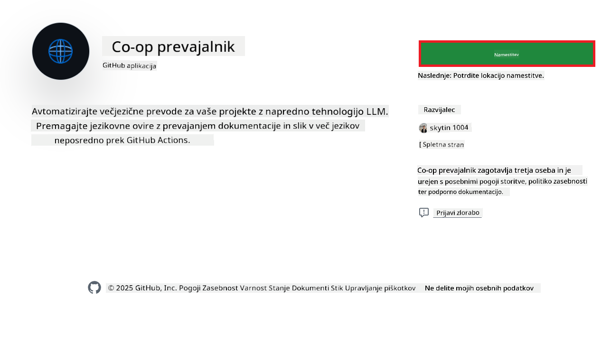

<!--
CO_OP_TRANSLATOR_METADATA:
{
  "original_hash": "c437820027c197f25fb2cbee95bae28c",
  "translation_date": "2025-06-12T19:19:03+00:00",
  "source_file": "getting_started/github-actions-guide/github-actions-guide-org.md",
  "language_code": "sl"
}
-->
# Uporaba Co-op Translator GitHub akcije (vodnik za organizacije)

**Ciljna publika:** Ta vodnik je namenjen **notranjim uporabnikom Microsofta** ali **ekipam, ki imajo dostop do potrebnih poverilnic za vnaprej pripravljeno Co-op Translator GitHub aplikacijo** ali lahko ustvarijo svojo lastno prilagojeno GitHub aplikacijo.

Samodejno prevedite dokumentacijo svojega repozitorija z uporabo Co-op Translator GitHub akcije. Ta vodnik vas vodi skozi postopek nastavitve akcije, ki samodejno ustvari pull requeste z posodobljenimi prevodi, kadarkoli se spremenijo izvorne Markdown datoteke ali slike.

> [!IMPORTANT]
> 
> **Izbira pravega vodnika:**
>
> Ta vodnik opisuje nastavitev z uporabo **GitHub App ID in zasebnega ključa**. Običajno potrebujete to metodo "vodnik za organizacije", če: **`GITHUB_TOKEN` dovoljenja so omejena:** Nastavitve vaše organizacije ali repozitorija omejujejo privzeta dovoljenja, dodeljena standardnemu `GITHUB_TOKEN`. 만 posebej, če `GITHUB_TOKEN` nima potrebnih `write` dovoljenj (kot so `contents: write` ali `pull-requests: write`), bo potek dela v [Javnem vodniku za nastavitev](./github-actions-guide-public.md) spodletel zaradi neustreznih dovoljenj. Uporaba namensko ustvarjene GitHub aplikacije z izrecno dodeljenimi dovoljenji zaobide to omejitev.
>
> **Če zgornje ne velja za vas:**
>
> Če ima standardni `GITHUB_TOKEN` dovolj dovoljenj v vašem repozitoriju (tj. niste omejeni z organizacijskimi nastavitvami), uporabite **[Javni vodnik za nastavitev z GITHUB_TOKEN](./github-actions-guide-public.md)**. Javni vodnik ne zahteva pridobivanja ali upravljanja App ID-jev ali zasebnih ključev in temelji zgolj na standardnem `GITHUB_TOKEN` in dovoljenjih repozitorija.

## Predpogoji

Pred konfiguracijo GitHub akcije poskrbite, da imate pripravljene potrebne poverilnice za AI storitve.

**1. Obvezno: Poverilnice za AI jezikovni model**  
Potrebujete poverilnice za vsaj en podprt jezikovni model:

- **Azure OpenAI**: zahteva Endpoint, API ključ, imena modelov/deploymentov, verzijo API-ja.  
- **OpenAI**: zahteva API ključ, (neobvezno: ID organizacije, osnovni URL, ID modela).  
- Podrobnosti najdete v [Podprtih modelih in storitvah](../../../../README.md).  
- Vodnik za nastavitev: [Nastavitev Azure OpenAI](../set-up-resources/set-up-azure-openai.md).

**2. Neobvezno: Poverilnice za računalniški vid (za prevajanje slik)**

- Potrebno le, če 쬰lite prevajati besedilo v slikah.  
- **Azure Computer Vision**: zahteva Endpoint in naročniški ključ.  
- Če niso zagotovljene, akcija privzeto deluje v [samo Markdown načinu](../markdown-only-mode.md).  
- Vodnik za nastavitev: [Nastavitev Azure Computer Vision](../set-up-resources/set-up-azure-computer-vision.md).

## Nastavitev in konfiguracija

Sledite tem korakom za konfiguracijo Co-op Translator GitHub akcije v vašem repozitoriju:

### Korak 1: Namestite in konfigurirajte GitHub App avtentikacijo

Potek dela uporablja GitHub App avtentikacijo za varno interakcijo z vašim repozitorijem (npr. ustvarjanje pull requestov) v vašem imenu. Izberite eno od mo쬹osti:

#### **Mo쬹ost A: Namestite vnaprej pripravljeno Co-op Translator GitHub aplikacijo (za notranjo uporabo v Microsoftu)**

1. Obiščite stran [Co-op Translator GitHub App](https://github.com/apps/co-op-translator).

1. Izberite **Install** in izberite račun ali organizacijo, kjer se nahaja vaš ciljni repozitorij.

    

1. Izberite **Only select repositories** in izberite vaš ciljni repozitorij (npr. `PhiCookBook`). Kliknite **Install**. Morda boste morali potrditi avtentikacijo.

    

1. **Pridobite poverilnice aplikacije (zahteva notranji postopek):** Da bo potek dela lahko avtenticiral kot aplikacija, potrebujete dve informaciji, ki vam jih zagotovi ekipa Co-op Translator:  
  - **App ID:** edinstvena identifikacijska številka Co-op Translator aplikacije. App ID je: `1164076`.  
  - **Zasebni ključ:** pridobite **celotno vsebino** datoteke zasebnega ključa `.pem` od vzdr쬰valca. **Obravnavajte ta ključ kot geslo in ga varno shranite.**

1. Nadaljujte s korakom 2.

#### **Mo쬹ost B: Uporabite svojo lastno prilagojeno GitHub aplikacijo**

- Če 쬰lite, lahko ustvarite in konfigurirate svojo GitHub aplikacijo. Poskrbite, da ima pravice za branje in pisanje vsebine ter pull requestov. Potrebovali boste njen App ID in generiran zasebni ključ.

### Korak 2: Konfigurirajte skrivnosti repozitorija

Dodati morate poverilnice GitHub aplikacije in poverilnice AI storitev kot šifrirane skrivnosti v nastavitvah repozitorija.

1. Obiščite ciljni GitHub repozitorij (npr. `PhiCookBook`).

1. Pojdite na **Settings** > **Secrets and variables** > **Actions**.

1. Pod **Repository secrets** kliknite **New repository secret** za vsako spodaj navedeno skrivnost.

   

**Zahtevane skrivnosti (za GitHub App avtentikacijo):**

| Ime skrivnosti       | Opis                                            | Vir vrednosti                                   |
| :------------------- | :---------------------------------------------- | :---------------------------------------------- |
| `GH_APP_ID`          | App ID GitHub aplikacije (iz koraka 1).         | Nastavitve GitHub aplikacije                     |
| `GH_APP_PRIVATE_KEY` | **Celotna vsebina** prenesene datoteke `.pem`. | Datoteka `.pem` (iz koraka 1)        |

**Skrivnosti AI storitev (dodajte VSE, ki veljajo glede na vaše predpogoje):**

| Ime skrivnosti                    | Opis                                         | Vir vrednosti                     |
| :-------------------------------- | :-------------------------------------------- | :------------------------------- |
| `AZURE_SUBSCRIPTION_KEY`           | Ključ za Azure AI storitev (računalniški vid) | Azure AI Foundry                 |
| `AZURE_AI_SERVICE_ENDPOINT`          | Endpoint za Azure AI storitev (računalniški vid) | Azure AI Foundry                 |
| `AZURE_OPENAI_API_KEY`             | Ključ za Azure OpenAI storitev                | Azure AI Foundry                 |
| `AZURE_OPENAI_ENDPOINT`            | Endpoint za Azure OpenAI storitev             | Azure AI Foundry                 |
| `AZURE_OPENAI_MODEL_NAME`          | Ime vašega Azure OpenAI modela                 | Azure AI Foundry                 |
| `AZURE_OPENAI_CHAT_DEPLOYMENT_NAME`  | Ime vašega Azure OpenAI deploymenta             | Azure AI Foundry                 |
| `AZURE_OPENAI_API_VERSION`         | Verzija API-ja za Azure OpenAI                  | Azure AI Foundry                 |
| `OPENAI_API_KEY`                   | API ključ za OpenAI                            | OpenAI Platform                 |
| `OPENAI_ORG_ID`                    | ID organizacije OpenAI                         | OpenAI Platform                 |
| `OPENAI_CHAT_MODEL_ID`               | Specifični OpenAI model ID                      | OpenAI Platform                 |
| `OPENAI_BASE_URL`                  | Prilagojeni OpenAI osnovni URL                  | OpenAI Platform                 |


### Korak 3: Ustvarite datoteko poteka dela

Nazadnje ustvarite YAML datoteko, ki definira avtomatiziran potek dela.

1. V korenski mapi vašega repozitorija ustvarite imenik `.github/workflows/`, če še ne obstaja.

1. V `.github/workflows/` ustvarite datoteko z imenom `co-op-translator.yml`.

1. Prilepite naslednjo vsebino v co-op-translator.yml.

```
name: Co-op Translator

on:
  push:
    branches:
      - main

jobs:
  co-op-translator:
    runs-on: ubuntu-latest

    permissions:
      contents: write
      pull-requests: write

    steps:
      - name: Checkout repository
        uses: actions/checkout@v4
        with:
          fetch-depth: 0

      - name: Set up Python
        uses: actions/setup-python@v4
        with:
          python-version: '3.10'

      - name: Install Co-op Translator
        run: |
          python -m pip install --upgrade pip
          pip install co-op-translator

      - name: Run Co-op Translator
        env:
          PYTHONIOENCODING: utf-8
          # Azure AI Service Credentials
          AZURE_SUBSCRIPTION_KEY: ${{ secrets.AZURE_SUBSCRIPTION_KEY }}
          AZURE_AI_SERVICE_ENDPOINT: ${{ secrets.AZURE_AI_SERVICE_ENDPOINT }}

          # Azure OpenAI Credentials
          AZURE_OPENAI_API_KEY: ${{ secrets.AZURE_OPENAI_API_KEY }}
          AZURE_OPENAI_ENDPOINT: ${{ secrets.AZURE_OPENAI_ENDPOINT }}
          AZURE_OPENAI_MODEL_NAME: ${{ secrets.AZURE_OPENAI_MODEL_NAME }}
          AZURE_OPENAI_CHAT_DEPLOYMENT_NAME: ${{ secrets.AZURE_OPENAI_CHAT_DEPLOYMENT_NAME }}
          AZURE_OPENAI_API_VERSION: ${{ secrets.AZURE_OPENAI_API_VERSION }}

          # OpenAI Credentials
          OPENAI_API_KEY: ${{ secrets.OPENAI_API_KEY }}
          OPENAI_ORG_ID: ${{ secrets.OPENAI_ORG_ID }}
          OPENAI_CHAT_MODEL_ID: ${{ secrets.OPENAI_CHAT_MODEL_ID }}
          OPENAI_BASE_URL: ${{ secrets.OPENAI_BASE_URL }}
        run: |
          # =====================================================================
          # IMPORTANT: Set your target languages here (REQUIRED CONFIGURATION)
          # =====================================================================
          # Example: Translate to Spanish, French, German. Add -y to auto-confirm.
          translate -l "es fr de" -y  # <--- MODIFY THIS LINE with your desired languages

      - name: Authenticate GitHub App
        id: generate_token
        uses: tibdex/github-app-token@v1
        with:
          app_id: ${{ secrets.GH_APP_ID }}
          private_key: ${{ secrets.GH_APP_PRIVATE_KEY }}

      - name: Create Pull Request with translations
        uses: peter-evans/create-pull-request@v5
        with:
          token: ${{ steps.generate_token.outputs.token }}
          commit-message: "🌐 Update translations via Co-op Translator"
          title: "🌐 Update translations via Co-op Translator"
          body: |
            This PR updates translations for recent changes to the main branch.

            ### 📋 Changes included
            - Translated contents are available in the `translations/` directory
            - Translated images are available in the `translated_images/` directory

            ---
            🌐 Automatically generated by the [Co-op Translator](https://github.com/Azure/co-op-translator) GitHub Action.
          branch: update-translations
          base: main
          labels: translation, automated-pr
          delete-branch: true
          add-paths: |
            translations/
            translated_images/

```

4.  **Prilagodite potek dela:**  
  - **[!IMPORTANT] Ciljni jeziki:** V ukazu `Run Co-op Translator` step, you **MUST review and modify the list of language codes** within the `translate -l "..." -y` command to match your project's requirements. The example list (`ar de es...`) needs to be replaced or adjusted.
  - **Trigger (`on:`):** The current trigger runs on every push to `main`. For large repositories, consider adding a `paths:` filter (see commented example in the YAML) to run the workflow only when relevant files (e.g., source documentation) change, saving runner minutes.
  - **PR Details:** Customize the `commit-message`, `title`, `body`, `branch` name, and `labels` in the `Create Pull Request` step if needed.

## Credential Management and Renewal

- **Security:** Always store sensitive credentials (API keys, private keys) as GitHub Actions secrets. Never expose them in your workflow file or repository code.
- **[!IMPORTANT] Key Renewal (Internal Microsoft Users):** Be aware that Azure OpenAI key used within Microsoft might have a mandatory renewal policy (e.g., every 5 months). Ensure you update the corresponding GitHub secrets (`AZURE_OPENAI_...` ključi) **pred iztekom roka** poskrbite, da so veljavni, da preprečite napake v poteku dela.

## Zagon poteka dela

Ko je datoteka `co-op-translator.yml` zdru쬰na v vašo glavno vejo (ali vejo, določeno v `on:` trigger), the workflow will automatically run whenever changes are pushed to that branch (and match the `paths` filtru, če je konfigurirano),

če so prevodi ustvarjeni ali posodobljeni, bo akcija samodejno ustvarila Pull Request z vsemi spremembami, pripravljen za vašo pregled in zdru쬴tev.

**Omejitev odgovornosti**:  
Ta dokument je bil preveden z uporabo storitve za prevajanje z umetno inteligenco [Co-op Translator](https://github.com/Azure/co-op-translator). Čeprav si prizadevamo za natančnost, vas opozarjamo, da avtomatizirani prevodi lahko vsebujejo napake ali netočnosti. Izvirni dokument v izvirnem jeziku velja za avtoritativni vir. Za kritične informacije priporočamo strokovni človeški prevod. Ne odgovarjamo za morebitna nesporazume ali napačne interpretacije, ki izhajajo iz uporabe tega prevoda.