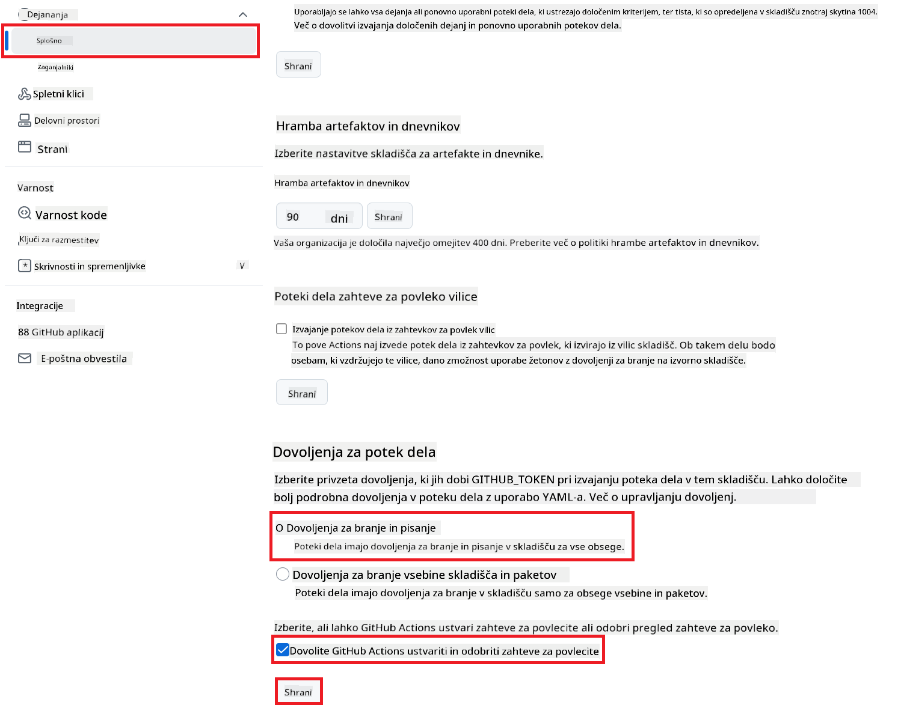

<!--
CO_OP_TRANSLATOR_METADATA:
{
  "original_hash": "a52587a512e667f70d92db853d3c61d5",
  "translation_date": "2025-06-12T19:36:13+00:00",
  "source_file": "getting_started/github-actions-guide/github-actions-guide-public.md",
  "language_code": "sl"
}
-->
# Uporaba Co-op Translator GitHub Action (Javna Nastavitev)

**Ciljna skupina:** Ta vodič je namenjen uporabnikom v večini javnih ali zasebnih repozitorijev, kjer so zadostna standardna dovoljenja GitHub Actions. Uporablja vgrajeni `GITHUB_TOKEN`.

Samodejno prevedite dokumentacijo vašega repozitorija brez napora z uporabo Co-op Translator GitHub Action. Ta vodič vas vodi skozi nastavitve akcije, ki samodejno ustvari pull requeste z osveženimi prevodi, kadar se spremenijo vaši izvorni Markdown dokumenti ali slike.

> [!IMPORTANT]
>
> **Izbira pravega vodiča:**
>
> Ta vodič opisuje **enostavnejšo nastavitev s standardnim `GITHUB_TOKEN`**. To je priporočena metoda za večino uporabnikov, saj ni potrebno upravljati občutljivih zasebnih ključev GitHub App.
>

## Predpogoji

Pred konfiguracijo GitHub Action poskrbite, da imate pripravljene potrebne poverilnice za AI storitve.

**1. Obvezno: Poverilnice za AI jezikovni model**  
Potrebujete poverilnice za vsaj en podprt jezikovni model:

- **Azure OpenAI**: zahteva Endpoint, API ključ, imena modelov/implementacij, različico API-ja.  
- **OpenAI**: zahteva API ključ, (neobvezno: Org ID, osnovni URL, ID modela).  
- Podrobnosti si oglejte v [Supported Models and Services](../../../../README.md).

**2. Neobvezno: Poverilnice za AI Vision (za prevajanje slik)**

- Potrebno le, če želite prevajati besedilo v slikah.  
- **Azure AI Vision**: zahteva Endpoint in naročniški ključ.  
- Če jih ne zagotovite, akcija samodejno preklopi v [Markdown-only mode](../markdown-only-mode.md).

## Nastavitev in konfiguracija

Sledite tem korakom, da konfigurirate Co-op Translator GitHub Action v vašem repozitoriju z uporabo standardnega `GITHUB_TOKEN`.

### Korak 1: Razumevanje avtentikacije (Uporaba `GITHUB_TOKEN`)

Ta potek dela uporablja vgrajeni `GITHUB_TOKEN`, ki ga zagotavlja GitHub Actions. Ta žeton samodejno podeli dovoljenja za interakcijo z vašim repozitorijem glede na nastavitve, določene v **Koraku 3**.

### Korak 2: Konfiguracija skrivnosti repozitorija

Potrebno je le, da v nastavitvah repozitorija dodate **AI poverilnice** kot šifrirane skrivnosti.

1.  Odprite ciljnega GitHub repozitorij.  
2.  Pojdite na **Settings** > **Secrets and variables** > **Actions**.  
3.  Pod **Repository secrets** kliknite **New repository secret** za vsako potrebno AI skrivnost, navedeno spodaj.

     *(Slika prikazuje, kje dodati skrivnosti)*

**Obvezne AI skrivnosti (Dodajte VSE, ki veljajo glede na vaše predpogoje):**

| Ime skrivnosti                     | Opis                                    | Vir vrednosti                   |
| :--------------------------------- | :------------------------------------- | :----------------------------- |
| `AZURE_SUBSCRIPTION_KEY`            | Ključ za Azure AI Service (Računalniški vid) | Vaša Azure AI Foundry           |
| `AZURE_AI_SERVICE_ENDPOINT`         | Endpoint za Azure AI Service (Računalniški vid) | Vaša Azure AI Foundry           |
| `AZURE_OPENAI_API_KEY`              | Ključ za Azure OpenAI storitev            | Vaša Azure AI Foundry           |
| `AZURE_OPENAI_ENDPOINT`             | Endpoint za Azure OpenAI storitev          | Vaša Azure AI Foundry           |
| `AZURE_OPENAI_MODEL_NAME`           | Ime vašega Azure OpenAI modela             | Vaša Azure AI Foundry           |
| `AZURE_OPENAI_CHAT_DEPLOYMENT_NAME` | Ime vaše Azure OpenAI implementacije          | Vaša Azure AI Foundry           |
| `AZURE_OPENAI_API_VERSION`          | Različica API-ja za Azure OpenAI            | Vaša Azure AI Foundry           |
| `OPENAI_API_KEY`                    | API ključ za OpenAI                        | Vaša OpenAI platforma           |
| `OPENAI_ORG_ID`                     | OpenAI ID organizacije (neobvezno)         | Vaša OpenAI platforma           |
| `OPENAI_CHAT_MODEL_ID`              | Specifični ID OpenAI modela (neobvezno)       | Vaša OpenAI platforma           |
| `OPENAI_BASE_URL`                   | Prilagojen osnovni URL OpenAI API-ja (neobvezno) | Vaša OpenAI platforma           |

### Korak 3: Nastavitev dovoljenj poteka dela

GitHub Action potrebuje dovoljenja, ki jih podeli `GITHUB_TOKEN` za dostop do kode in ustvarjanje pull requestov.

1.  V repozitoriju pojdite na **Settings** > **Actions** > **General**.  
2.  Pomaknite se do razdelka **Workflow permissions**.  
3.  Izberite **Read and write permissions**. To omogoči, da ima `GITHUB_TOKEN` potrebna dovoljenja `contents: write` in `pull-requests: write` za ta potek dela.  
4.  Preverite, da je potrjeno polje **Allow GitHub Actions to create and approve pull requests**.  
5.  Kliknite **Save**.



### Korak 4: Ustvarite datoteko poteka dela

Nazadnje ustvarite YAML datoteko, ki definira avtomatiziran potek dela z uporabo `GITHUB_TOKEN`.

1.  V korenski mapi vašega repozitorija ustvarite mapo `.github/workflows/`, če še ne obstaja.  
2.  V mapi `.github/workflows/` ustvarite datoteko z imenom `co-op-translator.yml`.  
3.  Vstavite naslednjo vsebino v datoteko `co-op-translator.yml`.

```yaml
name: Co-op Translator

on:
  push:
    branches:
      - main

jobs:
  co-op-translator:
    runs-on: ubuntu-latest

    permissions:
      contents: write
      pull-requests: write

    steps:
      - name: Checkout repository
        uses: actions/checkout@v4
        with:
          fetch-depth: 0

      - name: Set up Python
        uses: actions/setup-python@v4
        with:
          python-version: '3.10'

      - name: Install Co-op Translator
        run: |
          python -m pip install --upgrade pip
          pip install co-op-translator

      - name: Run Co-op Translator
        env:
          PYTHONIOENCODING: utf-8
          # === AI Service Credentials ===
          AZURE_SUBSCRIPTION_KEY: ${{ secrets.AZURE_SUBSCRIPTION_KEY }}
          AZURE_AI_SERVICE_ENDPOINT: ${{ secrets.AZURE_AI_SERVICE_ENDPOINT }}
          AZURE_OPENAI_API_KEY: ${{ secrets.AZURE_OPENAI_API_KEY }}
          AZURE_OPENAI_ENDPOINT: ${{ secrets.AZURE_OPENAI_ENDPOINT }}
          AZURE_OPENAI_MODEL_NAME: ${{ secrets.AZURE_OPENAI_MODEL_NAME }}
          AZURE_OPENAI_CHAT_DEPLOYMENT_NAME: ${{ secrets.AZURE_OPENAI_CHAT_DEPLOYMENT_NAME }}
          AZURE_OPENAI_API_VERSION: ${{ secrets.AZURE_OPENAI_API_VERSION }}
          OPENAI_API_KEY: ${{ secrets.OPENAI_API_KEY }}
          OPENAI_ORG_ID: ${{ secrets.OPENAI_ORG_ID }}
          OPENAI_CHAT_MODEL_ID: ${{ secrets.OPENAI_CHAT_MODEL_ID }}
          OPENAI_BASE_URL: ${{ secrets.OPENAI_BASE_URL }}
        run: |
          # =====================================================================
          # IMPORTANT: Set your target languages here (REQUIRED CONFIGURATION)
          # =====================================================================
          # Example: Translate to Spanish, French, German. Add -y to auto-confirm.
          translate -l "es fr de" -y  # <--- MODIFY THIS LINE with your desired languages

      - name: Create Pull Request with translations
        uses: peter-evans/create-pull-request@v5
        with:
          token: ${{ secrets.GITHUB_TOKEN }}
          commit-message: "🌐 Update translations via Co-op Translator"
          title: "🌐 Update translations via Co-op Translator"
          body: |
            This PR updates translations for recent changes to the main branch.

            ### 📋 Changes included
            - Translated contents are available in the `translations/` directory
            - Translated images are available in the `translated_images/` directory

            ---
            🌐 Automatically generated by the [Co-op Translator](https://github.com/Azure/co-op-translator) GitHub Action.
          branch: update-translations
          base: main
          labels: translation, automated-pr
          delete-branch: true
          add-paths: |
            translations/
            translated_images/
```  
4.  **Prilagodite potek dela:**  
  - **[!IMPORTANT] Ciljni jeziki:** V koraku `Run Co-op Translator` step, you **MUST review and modify the list of language codes** within the `translate -l "..." -y` command to match your project's requirements. The example list (`ar de es...`) needs to be replaced or adjusted.
  - **Trigger (`on:`):** The current trigger runs on every push to `main`. For large repositories, consider adding a `paths:` filter (see commented example in the YAML) to run the workflow only when relevant files (e.g., source documentation) change, saving runner minutes.
  - **PR Details:** Customize the `commit-message`, `title`, `body`, `branch` name, and `labels` in the `Create Pull Request` po potrebi.

**Omejitev odgovornosti**:  
Ta dokument je bil preveden z uporabo storitve za avtomatski prevod AI [Co-op Translator](https://github.com/Azure/co-op-translator). Čeprav si prizadevamo za natančnost, vas opozarjamo, da lahko avtomatski prevodi vsebujejo napake ali netočnosti. Izvirni dokument v njegovem izvirnem jeziku velja za avtoritativni vir. Za pomembne informacije priporočamo strokovni človeški prevod. Za kakršnekoli nesporazume ali napačne razlage, ki izhajajo iz uporabe tega prevoda, ne odgovarjamo.