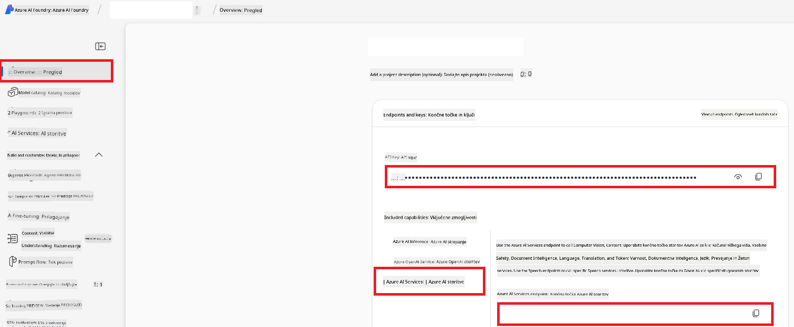

<!--
CO_OP_TRANSLATOR_METADATA:
{
  "original_hash": "b58d7c3cb4210697a073d20eb3064945",
  "translation_date": "2025-06-12T11:59:36+00:00",
  "source_file": "getting_started/set-up-azure-ai.md",
  "language_code": "sl"
}
-->
# Set Up Azure AI for Co-op Translator (Azure OpneAI & Azure AI Vision)

Ta vodič vas vodi skozi nastavitev Azure OpenAI za prevajanje jezikov in Azure Computer Vision za analizo vsebine slik (ki jo lahko nato uporabite za prevajanje na osnovi slik) znotraj Azure AI Foundry.

**Predpogoji:**
- Azure račun z aktivno naročnino.
- Zadostna dovoljenja za ustvarjanje virov in namestitev v vaši Azure naročnini.

## Ustvarite Azure AI projekt

Začeli boste z ustvarjanjem Azure AI projekta, ki deluje kot osrednje mesto za upravljanje vaših AI virov.

1. Obiščite [https://ai.azure.com](https://ai.azure.com) in se prijavite z vašim Azure računom.

1. Izberite **+Create** za ustvarjanje novega projekta.

1. Izvedite naslednje korake:
   - Vnesite **Project name** (npr. `CoopTranslator-Project`).
   - Izberite **AI hub** (npr. `CoopTranslator-Hub`) (ustvarite novega, če je potrebno).

1. Kliknite "**Review and Create**" za nastavitev projekta. Preusmerjeni boste na pregledno stran vašega projekta.

## Nastavite Azure OpenAI za prevajanje jezikov

Znotraj vašega projekta boste namestili Azure OpenAI model, ki bo služil kot osnova za prevajanje besedil.

### Odprite vaš projekt

Če še niste, odprite vaš novo ustvarjeni projekt (npr. `CoopTranslator-Project`) v Azure AI Foundry.

### Namestite OpenAI model

1. V levem meniju projekta, pod "My assets", izberite "**Models + endpoints**".

1. Izberite **+ Deploy model**.

1. Izberite **Deploy Base Model**.

1. Prikazal se bo seznam razpoložljivih modelov. Filtrirajte ali poiščite primeren GPT model. Priporočamo `gpt-4o`.

1. Izberite želeni model in kliknite **Confirm**.

1. Izberite **Deploy**.

### Konfiguracija Azure OpenAI

Ko je model nameščen, lahko na strani "**Models + endpoints**" izberete namestitev, da najdete **REST endpoint URL**, **Key**, **Deployment name**, **Model name** in **API version**. Te podatke boste potrebovali za integracijo prevajalskega modela v vašo aplikacijo.

> [!NOTE]
> API različice lahko izbirate na strani [API version deprecation](https://learn.microsoft.com/azure/ai-services/openai/api-version-deprecation) glede na vaše potrebe. Upoštevajte, da se **API version** razlikuje od **Model version**, ki je prikazana na strani **Models + endpoints** v Azure AI Foundry.

## Nastavite Azure Computer Vision za prevajanje slik

Za omogočanje prevajanja besedila v slikah morate pridobiti Azure AI Service API ključ in Endpoint.

1. Odprite vaš Azure AI projekt (npr. `CoopTranslator-Project`). Prepričajte se, da ste na pregledni strani projekta.

### Konfiguracija Azure AI Service

Poiščite API ključ in Endpoint v zavihku Azure AI Service.

1. Odprite vaš Azure AI projekt (npr. `CoopTranslator-Project`). Prepričajte se, da ste na pregledni strani projekta.

1. Poiščite **API Key** in **Endpoint** v zavihku Azure AI Service.

    

Ta povezava omogoča, da so zmogljivosti povezanega vira Azure AI Services (vključno z analizo slik) na voljo vašemu AI Foundry projektu. To povezavo lahko nato uporabite v vaših beležnicah ali aplikacijah za izvleček besedila iz slik, ki ga lahko nato pošljete Azure OpenAI modelu za prevajanje.

## Konsolidacija vaših poverilnic

Do sedaj bi morali zbrati naslednje:

**Za Azure OpenAI (prevajanje besedila):**
- Azure OpenAI Endpoint
- Azure OpenAI API Key
- Azure OpenAI Model Name (npr. `gpt-4o`)
- Azure OpenAI Deployment Name (npr. `cooptranslator-gpt4o`)
- Azure OpenAI API Version

**Za Azure AI Services (izvleček besedila iz slik preko Vision):**
- Azure AI Service Endpoint
- Azure AI Service API Key

### Primer: konfiguracija okoljskih spremenljivk (predogled)

Kasneje, ko boste gradili svojo aplikacijo, jo boste verjetno konfigurirali z uporabo teh zbranih poverilnic. Na primer, lahko jih nastavite kot okoljske spremenljivke tako:

```bash
# Azure AI Service Credentials (Required for image translation)
AZURE_AI_SERVICE_API_KEY="your_azure_ai_service_api_key" # e.g., 21xasd...
AZURE_AI_SERVICE_ENDPOINT="https://your_azure_ai_service_endpoint.cognitiveservices.azure.com/"

# Azure OpenAI Credentials (Required for text translation)
AZURE_OPENAI_API_KEY="your_azure_openai_api_key" # e.g., 21xasd...
AZURE_OPENAI_ENDPOINT="https://your_azure_openai_endpoint.openai.azure.com/"
AZURE_OPENAI_MODEL_NAME="your_model_name" # e.g., gpt-4o
AZURE_OPENAI_CHAT_DEPLOYMENT_NAME="your_deployment_name" # e.g., cooptranslator-gpt4o
AZURE_OPENAI_API_VERSION="your_api_version" # e.g., 2024-12-01-preview
```

---

### Dodatno branje

- [How to Create a project in Azure AI Foundry](https://learn.microsoft.com/azure/ai-foundry/how-to/create-projects?tabs=ai-studio)
- [How to Create Azure AI resources](https://learn.microsoft.com/azure/ai-foundry/how-to/create-azure-ai-resource?tabs=portal)
- [How to Deploy OpenAI models in Azure AI Foundry](https://learn.microsoft.com/en-us/azure/ai-foundry/how-to/deploy-models-openai)

**Opozorilo**:  
Ta dokument je bil preveden z uporabo AI prevajalske storitve [Co-op Translator](https://github.com/Azure/co-op-translator). Čeprav si prizadevamo za natančnost, vas prosimo, da upoštevate, da avtomatizirani prevodi lahko vsebujejo napake ali netočnosti. Izvirni dokument v njegovem izvirnem jeziku velja za avtoritativni vir. Za kritične informacije priporočamo strokovni človeški prevod. Nismo odgovorni za morebitna nesporazume ali napačne interpretacije, ki izhajajo iz uporabe tega prevoda.