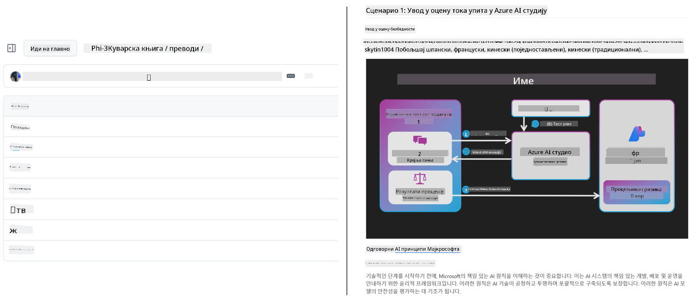
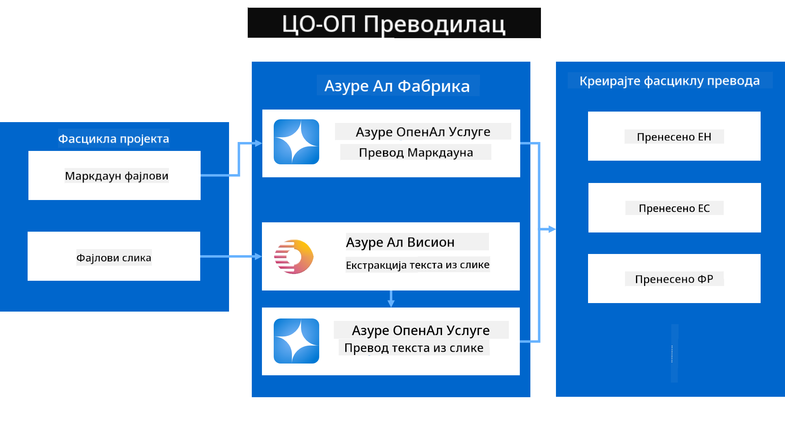
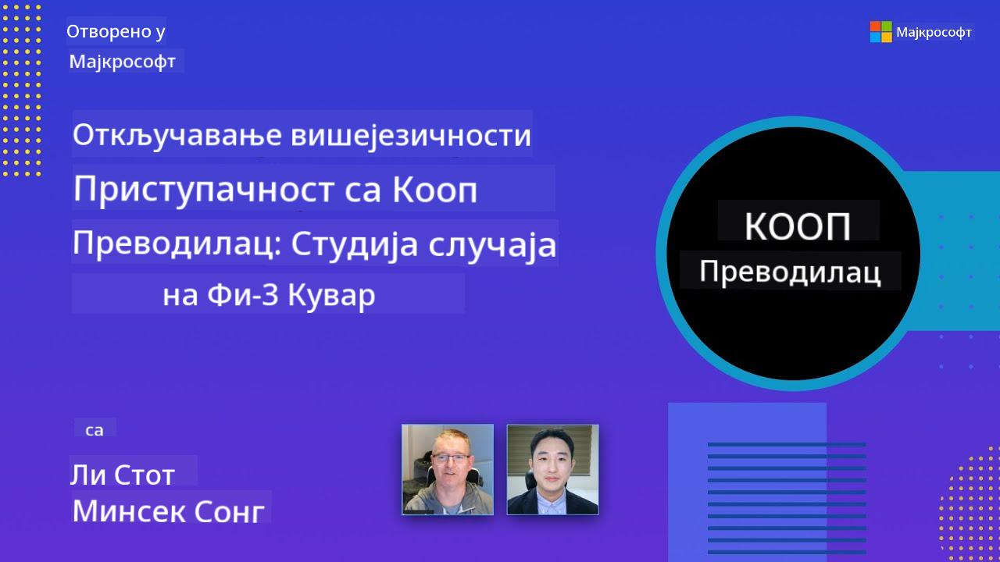

<!--
CO_OP_TRANSLATOR_METADATA:
{
  "original_hash": "044724537b57868117aadae8e7728c7c",
  "translation_date": "2025-06-12T10:54:47+00:00",
  "source_file": "README.md",
  "language_code": "sr"
}
-->


# Co-op Translator: Automatski prevod obrazovne dokumentacije bez napora

_Lako automatizujte prevod vaše dokumentacije na više jezika kako biste dopreli do globalne publike._

[](https://pypi.org/project/co-op-translator/)
[](https://github.com/azure/co-op-translator/blob/main/LICENSE)
[](https://pepy.tech/project/co-op-translator)
[](https://pepy.tech/project/co-op-translator)
[](https://github.com/psf/black)

[](https://GitHub.com/azure/co-op-translator/graphs/contributors/)
[](https://GitHub.com/azure/co-op-translator/issues/)
[](https://GitHub.com/azure/co-op-translator/pulls/)
[](http://makeapullrequest.com)

### Podrška za jezike koju pokreće Co-op Translator

> [!NOTE]
> Ovo su trenutni prevodi sadržaja ovog repozitorijuma. Za kompletnu listu jezika koje podržava Co-op Translator, pogledajte sekciju [Language Support](../..).

[](https://GitHub.com/azure/co-op-translator/watchers/)
[](https://GitHub.com/azure/co-op-translator/network/)
[](https://GitHub.com/azure/co-op-translator/stargazers/)

[](https://discord.com/invite/ByRwuEEgH4)

[](https://codespaces.new/azure/co-op-translator)
[](https://vscode.dev/redirect?url=vscode://ms-vscode-remote.remote-containers/cloneInVolume?url=https://github.com/azure/co-op-translator)

## Pregled: Pojednostavite Prevođenje Vašeg Edukativnog Sadržaja

Jezičke barijere značajno otežavaju pristup vrednim edukativnim materijalima i tehničkom znanju za učenike i programere širom sveta. To ograničava učešće i usporava tempo globalnih inovacija i učenja.

**Co-op Translator** je nastao iz potrebe da se reši neefikasan ručni proces prevođenja velikih obrazovnih serijala Microsofta (kao što su vodiči "For Beginners"). Razvio se u jednostavan i moćan alat dizajniran da ukloni ove prepreke za sve. Omogućavajući visokokvalitetne automatske prevode putem CLI i GitHub Actions, Co-op Translator osnažuje edukatore, studente, istraživače i programere širom sveta da dele i pristupaju znanju bez jezičkih ograničenja.

Pogledajte kako Co-op Translator organizuje prevedeni edukativni sadržaj:



Markdown fajlovi i tekst sa slika se automatski prevode i uredno raspoređuju u foldere specifične za jezik.

**Omogućite globalni pristup vašem edukativnom sadržaju već danas uz Co-op Translator!**

## Podrška Globalnom Pristupu Microsoftovim Obrazovnim Resursima

Co-op Translator pomaže da se premosti jezička barijera za ključne Microsoftove obrazovne inicijative, automatizujući proces prevođenja repozitorijuma koji služe globalnoj zajednici programera. Primeri koji trenutno koriste Co-op Translator uključuju:

[](https://github.com/microsoft/Generative-AI-for-beginners)
[](https://github.com/microsoft/ML-For-Beginners)
[](https://github.com/microsoft/AI-For-Beginners)
[](https://github.com/microsoft/ai-agents-for-beginners)
[](https://github.com/microsoft/PhiCookBook)
[](https://github.com/microsoft/Generative-AI-for-beginners-dotnet)

## Ključne Karakteristike

- **Automatski prevodi**: Lako prevedite tekst na više jezika.
- **Integracija sa GitHub Actions**: Automatizujte prevode kao deo vašeg CI/CD procesa.
- **Očuvanje Markdown sintakse**: Sačuvajte ispravan Markdown format tokom prevođenja.
- **Prevođenje teksta na slikama**: Izvlači i prevodi tekst unutar slika.
- **Napredna LLM tehnologija**: Koristi najsavremenije jezičke modele za kvalitetne prevode.
- **Jednostavna integracija**: Lako se uklapa u postojeći projekat.
- **Pojednostavljenje lokalizacije**: Ubrzava proces lokalizacije vašeg projekta za međunarodna tržišta.

## Kako Radi



Co-op Translator uzima Markdown fajlove i slike iz vašeg projekt foldera i obrađuje ih na sledeći način:

1. **Ekstrakcija teksta**: Izvlači tekst iz Markdown fajlova i, ako je podešeno (npr. sa Azure AI Vision), tekst ugrađen u slike.
1. **AI Prevod**: Šalje izvučeni tekst na podešeni LLM (Azure OpenAI, OpenAI itd.) na prevođenje.
1. **Čuvanje rezultata**: Sačuva prevedene Markdown fajlove i slike (sa prevedenim tekstom) u foldere specifične za jezik, uz očuvanje originalnog formata.

## Početak Rada

Brzo započnite sa CLI ili podesite potpunu automatizaciju sa GitHub Actions. Izaberite pristup koji vam najviše odgovara:

1. **Command Line (CLI)** – za jednokratne prevode ili ručnu kontrolu
2. **GitHub Actions** – za automatske prevode pri svakom push-u

> [!NOTE]
> Iako ovaj tutorijal naglašava Azure resurse, možete koristiti bilo koji podržani jezički model.

### Podrška za Jezike

Co-op Translator podržava širok spektar jezika kako biste dosegli globalnu publiku. Evo šta treba da znate:

#### Brzi Pregled

| Jezik | Kod | Jezik | Kod | Jezik | Kod |
|-------|-----|-------|-----|-------|-----|
| Arabic | ar | Bengali | bn | Bulgarian | bg |
| Burmese (Myanmar) | my | Chinese (Simplified) | zh | Chinese (Traditional, HK) | hk |
| Chinese (Traditional, Macau) | mo | Chinese (Traditional, TW) | tw | Croatian | hr |
| Czech | cs | Danish | da | Dutch | nl |
| Finnish | fi | French | fr | German | de |
| Greek | el | Hebrew | he | Hindi | hi |
| Hungarian | hu | Indonesian | id | Italian | it |
| Japanese | ja | Korean | ko | Malay | ms |
| Marathi | mr | Nepali | ne | Norwegian | no |
| Persian (Farsi) | fa | Polish | pl | Portuguese (Brazil) | br |
| Portuguese (Portugal) | pt | Punjabi (Gurmukhi) | pa | Romanian | ro |
| Russian | ru | Serbian (Cyrillic) | sr | Slovak | sk |
| Slovenian | sl | Spanish | es | Swahili | sw |
| Swedish | sv | Tagalog (Filipino) | tl | Thai | th |
| Turkish | tr | Ukrainian | uk | Urdu | ur |
| Vietnamese | vi | — | — | — | — |

#### Korišćenje Jezičkih Kodova

Kada koristite Co-op Translator, potrebno je da navedete jezike pomoću njihovih kodova. Na primer:

```bash
# Translate to French, Spanish, and German
translate -l "fr es de"

# Translate to Chinese (Simplified) and Japanese
translate -l "zh ja"
```

> [!NOTE]
> Za detaljne tehničke informacije o podršci jezika, uključujući:
>
> - Specifikacije fontova za svaki jezik
> - Poznate probleme
> - Kako dodati nove jezike
>
> pogledajte našu [Supported Languages Documentation](./getting_started/supported-languages.md).

### Podržani Modeli i Servisi

| Tip                  | Naziv                           |
|----------------------|--------------------------------|
| Language Model        |   |
| AI Vision             |  |

> [!NOTE]
> Ako AI vision servis nije dostupan, co-op translator će preći u [Markdown-only mode](./getting_started/markdown-only-mode.md).

### Početno Podešavanje

Pre nego što počnete, potrebno je da podesite sledeće resurse:

1. Language Model Resource (Obavezno):
   - Azure OpenAI (Preporučeno) – obezbeđuje kvalitetne prevode sa enterprise pouzdanošću
   - OpenAI – alternativa ako nemate pristup Azure-u
   - Za detaljne informacije o podržanim modelima, pogledajte [Supported Models and Services](../..)

1. AI Vision Resource (Opcionalno):
   - Azure AI Vision – omogućava prevođenje teksta unutar slika
   - Ako nije podešen, prevodilac će automatski koristiti [Markdown-only mode](./getting_started/markdown-only-mode.md)
   - Preporučuje se za projekte sa slikama koje sadrže tekst koji treba prevesti

1. Koraci za konfiguraciju:
   - Pratite naš [Azure AI setup guide](./getting_started/set-up-azure-ai.md) za detaljna uputstva
   - Kreirajte `.env` fajl sa vašim API ključevima i endpoint-ovima (pogledajte sekciju [Quick Start](../..))
   - Osigurajte da imate potrebna dopuštenja i kvote za odabrane servise

### Priprema Projekta Pre Prevođenja

Pre nego što započnete prevod, sledite ove korake da pripremite projekat:

1. Pripremite README:
   - Dodajte tabelu prevoda u README.md da povežete prevedene verzije
   - Primer formata:

     ```markdown

     ### 🌐 Multi-Language Support
     
     [French](../fr/README.md) | [Spanish](../es/README.md) | [German](../de/README.md) | [Russian](../ru/README.md) | [Arabic](../ar/README.md) | [Persian (Farsi)](../fa/README.md) | [Urdu](../ur/README.md) | [Chinese (Simplified)](../zh/README.md) | [Chinese (Traditional, Macau)](../mo/README.md) | [Chinese (Traditional, Hong Kong)](../hk/README.md) | [Chinese (Traditional, Taiwan)](../tw/README.md) | [Japanese](../ja/README.md) | [Korean](../ko/README.md) | [Hindi](../hi/README.md) | [Bengali](../bn/README.md) | [Marathi](../mr/README.md) | [Nepali](../ne/README.md) | [Punjabi (Gurmukhi)](../pa/README.md) | [Portuguese (Portugal)](../pt/README.md) | [Portuguese (Brazil)](../br/README.md) | [Italian](../it/README.md) | [Polish](../pl/README.md) | [Turkish](../tr/README.md) | [Greek](../el/README.md) | [Thai](../th/README.md) | [Swedish](../sv/README.md) | [Danish](../da/README.md) | [Norwegian](../no/README.md) | [Finnish](../fi/README.md) | [Dutch](../nl/README.md) | [Hebrew](../he/README.md) | [Vietnamese](../vi/README.md) | [Indonesian](../id/README.md) | [Malay](../ms/README.md) | [Tagalog (Filipino)](../tl/README.md) | [Swahili](../sw/README.md) | [Hungarian](../hu/README.md) | [Czech](../cs/README.md) | [Slovak](../sk/README.md) | [Romanian](../ro/README.md) | [Bulgarian](../bg/README.md) | [Serbian (Cyrillic)](./README.md) | [Croatian](../hr/README.md) | [Slovenian](../sl/README.md) | [Ukrainian](../uk/README.md) | [Burmese (Myanmar)](../my/README.md) 
    
     ```

1. Očistite postojeće prevode (ako je potrebno):
   - Uklonite postojeće foldere sa prevodima (npr. `translations/`)
   - Obrišite stare fajlove prevoda da počnete iz početka
   - Ovo sprečava konflikte sa novim procesom prevođenja

### Brzi Početak: Command Line

Za brz početak korišćenjem komandne linije:

1. Kreirajte virtuelno okruženje:

    ```bash
    python -m venv .venv
    ```

1. Aktivirajte virtuelno okruženje:

    - Na Windows-u:

    ```bash
    .venv\scripts\activate
    ```

    - Na Linux/macOS-u:

    ```bash
    source .venv/bin/activate
    ```

1. Instalirajte paket:

    ```bash
    pip install co-op-translator
    ```

1. Konfigurišite kredencijale:

    - Kreirajte `.env` file in your project's root directory.
    - Copy the contents from the [.env.template](../../.env.template) file into your new `.env` file.
    - Fill in the required API keys and endpoint information in your `.env` file.

1. Run Translation:
    - Navigate to your project's root directory in your terminal.
    - Execute the translate command, specifying target languages with the `-l` flag:

    ```bash
    translate -l "ko ja fr"
    ```

_(Nastavak nije prikazan zbog ograničenja, ali uputstva su prevedena do ovog dela.)_

### GitHub Actions Integracija

Za automatsku integraciju sa GitHub Actions, koristite sledeće vodiče u zavisnosti od vašeg repozitorijuma:

- [GitHub Actions Guide (Public Repositories & Standard Secrets)](./getting_started/github-actions-guide/github-actions-guide-public.md) – za većinu javnih ili ličnih repozitorijuma koji koriste standardne tajne repozitorijuma.
- [GitHub Actions Guide (Microsoft Organization Repos & Org-Level Setups)](./getting_started/github-actions-guide/github-actions-guide-org.md) – za rad unutar Microsoft GitHub organizacije ili ako koristite tajne ili izvršioce na nivou organizacije.

### Otklanjanje Problema i Saveti

- [Troubleshooting Guide](./getting_started/troubleshooting.md)

### Dodatni Resursi

- [Command Reference](./getting_started/command-reference.md): Detaljni vodič za sve dostupne komande i opcije.
- [Supported Languages](./getting_started/supported-languages.md): Lista podržanih jezika i uputstva za dodavanje novih.
- [Markdown-Only Mode](./getting_started/markdown-only-mode.md): Kako prevoditi samo tekst, bez prevođenja slika.

## Video Prezentacije

Saznajte više o Co-op Translator-u kroz naše prezentacije _(kliknite na sliku ispod da gledate na YouTube-u)_:

- **Open at Microsoft**: Kratki 18-minutni uvod i brz vodič kako koristiti Co-op Translator.
[](https://www.youtube.com/watch?v=jX_swfH_KNU)

## Podržite nas i podstaknite globalno učenje

Pridružite nam se u revoluciji načina na koji se obrazovni sadržaji dele širom sveta! Dajte [Co-op Translator](https://github.com/azure/co-op-translator) ⭐ na GitHub-u i podržite našu misiju uklanjanja jezičkih barijera u učenju i tehnologiji. Vaše interesovanje i doprinosi imaju veliki značaj! Kod i predlozi za nove funkcije su uvek dobrodošli.

## Doprinos

Ovaj projekat prihvata doprinose i sugestije. Zainteresovani ste da doprinesete Azure Co-op Translator-u? Pogledajte naš [CONTRIBUTING.md](./CONTRIBUTING.md) za smernice o tome kako možete pomoći da Co-op Translator postane dostupniji.

## Saradnici

[](https://github.com/Azure/co-op-translator/graphs/contributors)

## Kodeks ponašanja

Ovaj projekat je usvojio [Microsoft Open Source Code of Conduct](https://opensource.microsoft.com/codeofconduct/).
Za više informacija pogledajte [Code of Conduct FAQ](https://opensource.microsoft.com/codeofconduct/faq/) ili
kontaktirajte [opencode@microsoft.com](mailto:opencode@microsoft.com) za dodatna pitanja ili komentare.

## Odgovorna AI

Microsoft je posvećen tome da pomogne korisnicima da koriste naše AI proizvode na odgovoran način, deleći svoja saznanja i gradeći poverenje kroz alate kao što su Transparency Notes i Impact Assessments. Mnogi od ovih resursa dostupni su na [https://aka.ms/RAI](https://aka.ms/RAI).
Microsoftov pristup odgovornoj AI zasnovan je na našim principima AI: pravičnost, pouzdanost i bezbednost, privatnost i sigurnost, inkluzivnost, transparentnost i odgovornost.

Veliki modeli za prirodni jezik, slike i govor – poput onih korišćenih u ovom primeru – mogu se ponašati na načine koji nisu pravični, pouzdani ili mogu biti uvredljivi, što može dovesti do štete. Molimo vas da pogledate [Azure OpenAI service Transparency note](https://learn.microsoft.com/legal/cognitive-services/openai/transparency-note?tabs=text) da biste se informisali o rizicima i ograničenjima.

Preporučeni pristup za ublažavanje ovih rizika je uključivanje sistema bezbednosti u vašu arhitekturu koji može otkriti i sprečiti štetno ponašanje. [Azure AI Content Safety](https://learn.microsoft.com/azure/ai-services/content-safety/overview) pruža nezavisni sloj zaštite, sposoban da detektuje štetni sadržaj koji generišu korisnici ili AI u aplikacijama i uslugama. Azure AI Content Safety uključuje API-je za tekst i slike koji omogućavaju otkrivanje štetnog materijala. Takođe imamo interaktivni Content Safety Studio koji vam omogućava da pregledate, istražite i isprobate primer koda za detekciju štetnog sadržaja u različitim modalitetima. Sledeća [quickstart dokumentacija](https://learn.microsoft.com/azure/ai-services/content-safety/quickstart-text?tabs=visual-studio%2Clinux&pivots=programming-language-rest) vodi vas kroz pravljenje zahteva servisu.

Još jedan aspekt koji treba uzeti u obzir je ukupna performansa aplikacije. Kod multimodalnih i multimodelskih aplikacija, performanse podrazumevaju da sistem radi onako kako vi i vaši korisnici očekujete, uključujući i to da ne generiše štetne rezultate. Važno je proceniti performanse vaše aplikacije koristeći [generation quality and risk and safety metrics](https://learn.microsoft.com/azure/ai-studio/concepts/evaluation-metrics-built-in).

Možete evaluirati vašu AI aplikaciju u razvojnom okruženju koristeći [prompt flow SDK](https://microsoft.github.io/promptflow/index.html). Sa test skupom podataka ili ciljem, generacije vaše generativne AI aplikacije se kvantitativno mere pomoću ugrađenih evaluatora ili vaših prilagođenih evaluatora. Da biste započeli sa prompt flow sdk za evaluaciju sistema, pratite [quickstart vodič](https://learn.microsoft.com/azure/ai-studio/how-to/develop/flow-evaluate-sdk). Nakon što izvršite evaluaciju, možete [vizualizovati rezultate u Azure AI Studio](https://learn.microsoft.com/azure/ai-studio/how-to/evaluate-flow-results).

## Zaštitni znakovi

Ovaj projekat može sadržati zaštitne znakove ili logoe za projekte, proizvode ili usluge. Ovlašćena upotreba Microsoft zaštitnih znakova ili logotipa podložna je i mora slediti
[Microsoft-ovim smernicama za zaštitne znakove i brend](https://www.microsoft.com/en-us/legal/intellectualproperty/trademarks/usage/general).
Upotreba Microsoft zaštitnih znakova ili logotipa u modifikovanim verzijama ovog projekta ne sme izazvati zabunu niti sugerisati Microsoft-ovu sponzorstvo.
Svaka upotreba zaštitnih znakova ili logotipa trećih strana podložna je politikama tih trećih strana.

**Одрицање од одговорности**:  
Овај документ је преведен коришћењем AI сервиса за превођење [Co-op Translator](https://github.com/Azure/co-op-translator). Иако тежимо прецизности, имајте у виду да аутоматски преводи могу садржати грешке или нетачности. Изворни документ на оригиналном језику треба сматрати ауторитетним извором. За критичне информације препоручује се професионални превод од стране људског преводиоца. Нисмо одговорни за било какве неспоразуме или погрешне тумачења настала коришћењем овог превода.