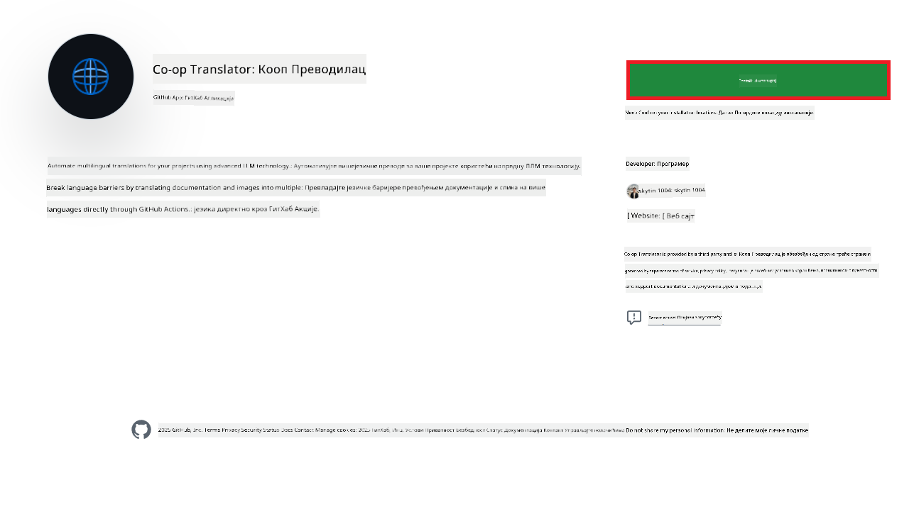
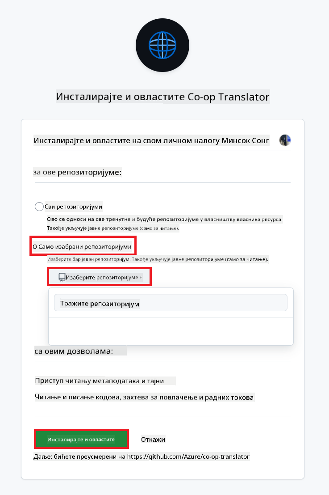
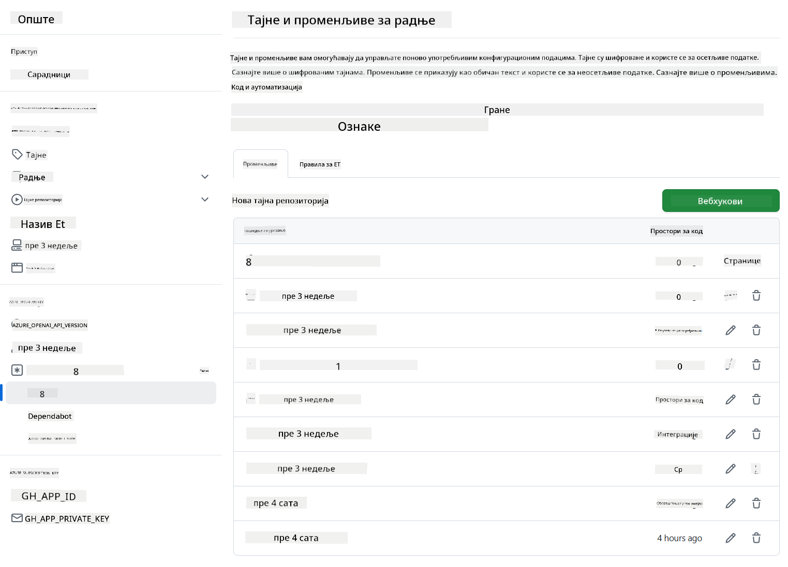

<!--
CO_OP_TRANSLATOR_METADATA:
{
  "original_hash": "c437820027c197f25fb2cbee95bae28c",
  "translation_date": "2025-06-12T19:18:06+00:00",
  "source_file": "getting_started/github-actions-guide/github-actions-guide-org.md",
  "language_code": "sr"
}
-->
# Коришћење Co-op Translator GitHub акције (Водич за организацију)

**Циљна публика:** Овај водич је намењен **унутрашњим корисницима Microsoft-а** или **тимовима који имају приступ потребним акредитивима за унапред изграђену Co-op Translator GitHub апликацију** или могу да креирају своју прилагођену GitHub апликацију.

Аутоматизујте превођење документације вашег репозиторијума без напора користећи Co-op Translator GitHub акцију. Овај водич вас води кроз подешавање акције која аутоматски креира pull request-ове са ажурираним преводима кад год се промене изворне Markdown датотеке или слике.

> [!IMPORTANT]
> 
> **Избор правог водича:**
>
> Овај водич описује подешавање коришћењем **GitHub App ID-а и приватног кључа**. Обично вам је овај „Водич за организацију“ потребан ако: **`GITHUB_TOKEN` дозволе су ограничене:** Подешавања ваше организације или репозиторијума ограничавају подразумеване дозволе додељене стандардном `GITHUB_TOKEN`. Конкретно, ако `GITHUB_TOKEN` нема потребне `write` дозволе (као што су `contents: write` или `pull-requests: write`), workflow у [Јавном водичу за подешавање](./github-actions-guide-public.md) неће успети због недостатка дозвола. Коришћење посебне GitHub апликације са експлицитно додељеним дозволама заобилази ово ограничење.
>
> **Ако вам горе наведено не важи:**
>
> Ако стандардни `GITHUB_TOKEN` има довољне дозволе у вашем репозиторијуму (тј. нисте блокирани организационим ограничењима), користите **[Јавни водич за подешавање користећи GITHUB_TOKEN](./github-actions-guide-public.md)**. Јавни водич не захтева добијање или управљање App ID-јевима или приватним кључевима и ослања се искључиво на стандардни `GITHUB_TOKEN` и дозволе репозиторијума.

## Предуслови

Пре него што конфигуришете GitHub акцију, уверите се да имате потребне акредитиве за AI сервисе.

**1. Обавезно: Акредитиви за AI језички модел**  
Потребни су вам акредитиви за бар један подржани језички модел:

- **Azure OpenAI**: Потребни Endpoint, API кључ, називи модела/деплојмента, верзија API-ја.  
- **OpenAI**: Потребан API кључ, (опционо: Org ID, Base URL, Model ID).  
- Погледајте [Подржани модели и сервиси](../../../../README.md) за детаље.  
- Водич за подешавање: [Подешавање Azure OpenAI](../set-up-resources/set-up-azure-openai.md).

**2. Опционо: Акредитиви за Computer Vision (за превод слика)**

- Потребно само ако желите да преводите текст у сликама.  
- **Azure Computer Vision**: Потребни Endpoint и Subscription Key.  
- Ако се не обезбеде, акција ће подразумевано радити у [режиму само за Markdown](../markdown-only-mode.md).  
- Водич за подешавање: [Подешавање Azure Computer Vision](../set-up-resources/set-up-azure-computer-vision.md).

## Подешавање и конфигурација

Пратите ове кораке да бисте конфигурисали Co-op Translator GitHub акцију у вашем репозиторијуму:

### Корак 1: Инсталирајте и конфигуришите GitHub App аутентификацију

Workflow користи GitHub App аутентификацију да безбедно комуницира са вашим репозиторијумом (нпр. да креира pull request-ове) у ваше име. Изаберите једну од опција:

#### **Опција А: Инсталирајте унапред направљену Co-op Translator GitHub апликацију (за унутрашњу употребу у Microsoft-у)**

1. Идите на страницу [Co-op Translator GitHub апликације](https://github.com/apps/co-op-translator).

1. Изаберите **Install** и изаберите налог или организацију у којој се налази ваш циљни репозиторијум.

    

1. Изаберите **Only select repositories** и изаберите ваш циљни репозиторијум (нпр. `PhiCookBook`). Кликните **Install**. Можда ће вас тражити да се аутентификујете.

    

1. **Набавите акредитиве апликације (потребан интерни процес):** Да би workflow могао да се аутентификује као апликација, потребне су вам две информације које обезбеђује тим Co-op Translator-а:
  - **App ID:** Јединствени идентификатор Co-op Translator апликације. App ID је: `1164076`.
  - **Приватни кључ:** Морате добити **целокупан садржај** `.pem` приватног кључа од одговорне контакт особе. **Третирајте овај кључ као лозинку и чувате га безбедно.**

1. Наставите на Корак 2.

#### **Опција Б: Користите своју прилагођену GitHub апликацију**

- Ако желите, можете креирати и конфигурисати своју GitHub апликацију. Обезбедите јој приступ за читање и писање садржаја и pull request-ова. Биће вам потребан њен App ID и генерисани приватни кључ.

### Корак 2: Конфигуришите тајне податке у репозиторијуму

Потребно је да додате акредитиве GitHub апликације и акредитиве AI сервиса као шифроване тајне у подешавањима репозиторијума.

1. Идите у ваш циљни GitHub репозиторијум (нпр. `PhiCookBook`).

1. Отидите на **Settings** > **Secrets and variables** > **Actions**.

1. Под **Repository secrets**, кликните на **New repository secret** за сваку од тајни наведених у наставку.

   

**Обавезне тајне (за GitHub App аутентификацију):**

| Назив тајне          | Опис                                      | Извор вредности                                     |
| :------------------- | :---------------------------------------- | :------------------------------------------------- |
| `GH_APP_ID`          | App ID GitHub апликације (са Корака 1).      | Подешавања GitHub апликације                        |
| `GH_APP_PRIVATE_KEY` | **Целокупан садржај** преузете `.pem` датотеке. | `.pem` датотека (са Корака 1)           |

**Тајне за AI сервисе (додајте СВЕ које су вам потребне према предусловима):**

| Назив тајне                         | Опис                                    | Извор вредности                   |
| :---------------------------------- | :-------------------------------------- | :------------------------------- |
| `AZURE_SUBSCRIPTION_KEY`            | Кључ за Azure AI сервис (Computer Vision) | Azure AI Foundry                  |
| `AZURE_AI_SERVICE_ENDPOINT`         | Endpoint за Azure AI сервис (Computer Vision) | Azure AI Foundry                  |
| `AZURE_OPENAI_API_KEY`              | Кључ за Azure OpenAI сервис              | Azure AI Foundry                  |
| `AZURE_OPENAI_ENDPOINT`             | Endpoint за Azure OpenAI сервис           | Azure AI Foundry                  |
| `AZURE_OPENAI_MODEL_NAME`           | Назив вашег Azure OpenAI модела          | Azure AI Foundry                  |
| `AZURE_OPENAI_CHAT_DEPLOYMENT_NAME` | Назив вашег Azure OpenAI деплојмента       | Azure AI Foundry                  |
| `AZURE_OPENAI_API_VERSION`          | Верзија API-ja за Azure OpenAI            | Azure AI Foundry                  |
| `OPENAI_API_KEY`                    | API кључ за OpenAI                       | OpenAI Platform                  |
| `OPENAI_ORG_ID`                     | OpenAI организациони ID                  | OpenAI Platform                  |
| `OPENAI_CHAT_MODEL_ID`              | Конкретан OpenAI модел ID                 | OpenAI Platform                  |
| `OPENAI_BASE_URL`                   | Прилагођени OpenAI API Base URL           | OpenAI Platform                  |



### Корак 3: Креирајте YAML датотеку за workflow

На крају, креирајте YAML датотеку која дефинише аутоматизовани workflow.

1. У коренском директоријуму вашег репозиторијума, направите директоријум `.github/workflows/` ако већ не постоји.

1. Унутар `.github/workflows/` направите датотеку под именом `co-op-translator.yml`.

1. Залепите следећи садржај у co-op-translator.yml.

```
name: Co-op Translator

on:
  push:
    branches:
      - main

jobs:
  co-op-translator:
    runs-on: ubuntu-latest

    permissions:
      contents: write
      pull-requests: write

    steps:
      - name: Checkout repository
        uses: actions/checkout@v4
        with:
          fetch-depth: 0

      - name: Set up Python
        uses: actions/setup-python@v4
        with:
          python-version: '3.10'

      - name: Install Co-op Translator
        run: |
          python -m pip install --upgrade pip
          pip install co-op-translator

      - name: Run Co-op Translator
        env:
          PYTHONIOENCODING: utf-8
          # Azure AI Service Credentials
          AZURE_SUBSCRIPTION_KEY: ${{ secrets.AZURE_SUBSCRIPTION_KEY }}
          AZURE_AI_SERVICE_ENDPOINT: ${{ secrets.AZURE_AI_SERVICE_ENDPOINT }}

          # Azure OpenAI Credentials
          AZURE_OPENAI_API_KEY: ${{ secrets.AZURE_OPENAI_API_KEY }}
          AZURE_OPENAI_ENDPOINT: ${{ secrets.AZURE_OPENAI_ENDPOINT }}
          AZURE_OPENAI_MODEL_NAME: ${{ secrets.AZURE_OPENAI_MODEL_NAME }}
          AZURE_OPENAI_CHAT_DEPLOYMENT_NAME: ${{ secrets.AZURE_OPENAI_CHAT_DEPLOYMENT_NAME }}
          AZURE_OPENAI_API_VERSION: ${{ secrets.AZURE_OPENAI_API_VERSION }}

          # OpenAI Credentials
          OPENAI_API_KEY: ${{ secrets.OPENAI_API_KEY }}
          OPENAI_ORG_ID: ${{ secrets.OPENAI_ORG_ID }}
          OPENAI_CHAT_MODEL_ID: ${{ secrets.OPENAI_CHAT_MODEL_ID }}
          OPENAI_BASE_URL: ${{ secrets.OPENAI_BASE_URL }}
        run: |
          # =====================================================================
          # IMPORTANT: Set your target languages here (REQUIRED CONFIGURATION)
          # =====================================================================
          # Example: Translate to Spanish, French, German. Add -y to auto-confirm.
          translate -l "es fr de" -y  # <--- MODIFY THIS LINE with your desired languages

      - name: Authenticate GitHub App
        id: generate_token
        uses: tibdex/github-app-token@v1
        with:
          app_id: ${{ secrets.GH_APP_ID }}
          private_key: ${{ secrets.GH_APP_PRIVATE_KEY }}

      - name: Create Pull Request with translations
        uses: peter-evans/create-pull-request@v5
        with:
          token: ${{ steps.generate_token.outputs.token }}
          commit-message: "🌐 Update translations via Co-op Translator"
          title: "🌐 Update translations via Co-op Translator"
          body: |
            This PR updates translations for recent changes to the main branch.

            ### 📋 Changes included
            - Translated contents are available in the `translations/` directory
            - Translated images are available in the `translated_images/` directory

            ---
            🌐 Automatically generated by the [Co-op Translator](https://github.com/Azure/co-op-translator) GitHub Action.
          branch: update-translations
          base: main
          labels: translation, automated-pr
          delete-branch: true
          add-paths: |
            translations/
            translated_images/

```

4.  **Прилагодите workflow:**  
  - **[!IMPORTANT] Циљни језици:** У команди `Run Co-op Translator` step, you **MUST review and modify the list of language codes** within the `translate -l "..." -y` command to match your project's requirements. The example list (`ar de es...`) needs to be replaced or adjusted.
  - **Trigger (`on:`):** The current trigger runs on every push to `main`. For large repositories, consider adding a `paths:` filter (see commented example in the YAML) to run the workflow only when relevant files (e.g., source documentation) change, saving runner minutes.
  - **PR Details:** Customize the `commit-message`, `title`, `body`, `branch` name, and `labels` in the `Create Pull Request` step if needed.

## Credential Management and Renewal

- **Security:** Always store sensitive credentials (API keys, private keys) as GitHub Actions secrets. Never expose them in your workflow file or repository code.
- **[!IMPORTANT] Key Renewal (Internal Microsoft Users):** Be aware that Azure OpenAI key used within Microsoft might have a mandatory renewal policy (e.g., every 5 months). Ensure you update the corresponding GitHub secrets (`AZURE_OPENAI_...` наведите језике **пре него што акредитиви истекну** како бисте избегли грешке у workflow-у.

## Покретање workflow-а

Када се `co-op-translator.yml` датотека споји у ваш main branch (или грана назначена у `on:` trigger), the workflow will automatically run whenever changes are pushed to that branch (and match the `paths` филтру, ако је конфигурисана).

Ако се преводи генеришу или ажурирају, акција ће аутоматски креирати Pull Request са изменама, спреман за ваш преглед и спајање.

**Одрицање од одговорности**:  
Овај документ је преведен коришћењем AI преводилачке услуге [Co-op Translator](https://github.com/Azure/co-op-translator). Иако тежимо прецизности, молимо имајте у виду да аутоматизовани преводи могу садржати грешке или нетачности. Оригинални документ на његовом изворном језику треба сматрати ауторитетним извором. За критичне информације препоручује се професионални људски превод. Нисмо одговорни за било каква неспоразума или погрешна тумачења настала коришћењем овог превода.