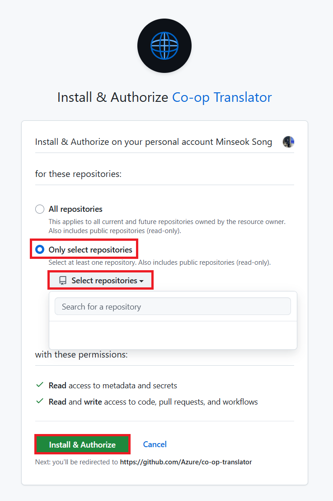

<!--
CO_OP_TRANSLATOR_METADATA:
{
  "original_hash": "9fac847815936ef6e6c8bfde6d191571",
  "translation_date": "2025-10-15T04:04:28+00:00",
  "source_file": "getting_started/github-actions-guide/github-actions-guide-org.md",
  "language_code": "sr"
}
-->
# Коришћење Co-op Translator GitHub Action (Водич за организације)

**Циљна публика:** Овај водич је намењен **Microsoft интерним корисницима** или **тимовима који имају приступ неопходним креденцијалима за унапред направљену Co-op Translator GitHub апликацију** или могу да направе сопствену прилагођену GitHub апликацију.

Аутоматизујте превођење документације вашег репозиторијума без напора уз Co-op Translator GitHub Action. Овај водич вас води кроз подешавање акције која аутоматски креира pull request-ове са ажурираним преводима кад год се изворни Markdown фајлови или слике промене.

> [!IMPORTANT]
> 
> **Избор правог водича:**
>
> Овај водич описује подешавање уз помоћ **GitHub App ID и приватног кључа**. Овај "Водич за организације" вам је потребан ако: **`GITHUB_TOKEN` дозволе су ограничене:** Ваша организација или подешавања репозиторијума ограничавају подразумеване дозволе које стандардни `GITHUB_TOKEN` добија. Конкретно, ако `GITHUB_TOKEN` нема неопходне `write` дозволе (као што су `contents: write` или `pull-requests: write`), workflow из [Јавног водича за подешавање](./github-actions-guide-public.md) неће радити због недовољних дозвола. Коришћење посебне GitHub апликације са експлицитно додељеним дозволама заобилази ово ограничење.
>
> **Ако се горе наведено не односи на вас:**
>
> Ако стандардни `GITHUB_TOKEN` има довољно дозвола у вашем репозиторијуму (тј. немате организациона ограничења), користите **[Јавни водич за подешавање уз GITHUB_TOKEN](./github-actions-guide-public.md)**. Јавни водич не захтева добијање или управљање App ID-јем или приватним кључем и ослања се само на стандардни `GITHUB_TOKEN` и дозволе репозиторијума.

## Предуслови

Пре него што подесите GitHub Action, уверите се да имате спремне креденцијале за AI сервис.

**1. Обавезно: Креденцијали за AI језички модел**
Потребни су вам креденцијали за бар један подржани језички модел:

- **Azure OpenAI**: Потребан је Endpoint, API Key, назив модела/деплојмента, верзија API-ја.
- **OpenAI**: Потребан је API Key, (опционо: Org ID, Base URL, Model ID).
- Погледајте [Подржани модели и сервиси](../../../../README.md) за детаље.
- Водич за подешавање: [Подешавање Azure OpenAI](../set-up-resources/set-up-azure-openai.md).

**2. Опционо: Креденцијали за Computer Vision (за превођење текста у сликама)**

- Потребно само ако желите да преводите текст унутар слика.
- **Azure Computer Vision**: Потребан је Endpoint и Subscription Key.
- Ако није обезбеђено, акција ради у [Markdown-only режиму](../markdown-only-mode.md).
- Водич за подешавање: [Подешавање Azure Computer Vision](../set-up-resources/set-up-azure-computer-vision.md).

## Подешавање и конфигурација

Пратите ове кораке да подесите Co-op Translator GitHub Action у вашем репозиторијуму:

### Корак 1: Инсталирајте и конфигуришите GitHub App аутентификацију

Workflow користи GitHub App аутентификацију да би безбедно комуницирао са вашим репозиторијумом (нпр. креирао pull request-ове) у ваше име. Изаберите једну опцију:

#### **Опција А: Инсталирајте унапред направљену Co-op Translator GitHub апликацију (за Microsoft интерну употребу)**

1. Идите на страницу [Co-op Translator GitHub App](https://github.com/apps/co-op-translator).

1. Изаберите **Install** и изаберите налог или организацију где се налази ваш циљни репозиторијум.

    

1. Изаберите **Only select repositories** и означите ваш циљни репозиторијум (нпр. `PhiCookBook`). Кликните на **Install**. Можда ће бити потребна аутентификација.

    

1. **Добијање креденцијала апликације (потребан интерни процес):** Да би workflow могао да се аутентификује као апликација, потребна су вам два податка које обезбеђује Co-op Translator тим:
  - **App ID:** Јединствени идентификатор за Co-op Translator апликацију. App ID је: `1164076`.
  - **Private Key:** Морате добити **цео садржај** `.pem` приватног кључа од одговорне особе. **Третирајте овај кључ као лозинку и чувајте га безбедно.**

1. Наставите на Корак 2.

#### **Опција Б: Користите сопствену прилагођену GitHub апликацију**

- Ако желите, можете направити и конфигурисати сопствену GitHub апликацију. Уверите се да има Read & write приступ за Contents и Pull requests. Биће вам потребан њен App ID и генерисан приватни кључ.

### Корак 2: Конфигуришите тајне репозиторијума

Потребно је да додате креденцијале GitHub апликације и креденцијале за AI сервис као шифроване тајне у подешавањима вашег репозиторијума.

1. Идите на ваш циљни GitHub репозиторијум (нпр. `PhiCookBook`).

1. Идите на **Settings** > **Secrets and variables** > **Actions**.

1. Под **Repository secrets**, кликните на **New repository secret** за сваку тајну са листе испод.

   

**Обавезне тајне (за GitHub App аутентификацију):**

| Име тајне           | Опис                                            | Извор вредности                                 |
| :------------------- | :----------------------------------------------- | :----------------------------------------------- |
| `GH_APP_ID`          | App ID GitHub апликације (из Корака 1).          | Подешавања GitHub апликације                     |
| `GH_APP_PRIVATE_KEY` | **Цео садржај** преузетог `.pem` фајла.          | `.pem` фајл (из Корака 1)                        |

**Тајне за AI сервис (Додајте СВЕ које важе на основу ваших предуслова):**

| Име тајне                          | Опис                                    | Извор вредности                  |
| :---------------------------------- | :---------------------------------------- | :------------------------------- |
| `AZURE_AI_SERVICE_API_KEY`            | Кључ за Azure AI Service (Computer Vision)  | Azure AI Foundry                    |
| `AZURE_AI_SERVICE_ENDPOINT`         | Endpoint за Azure AI Service (Computer Vision) | Azure AI Foundry                     |
| `AZURE_OPENAI_API_KEY`              | Кључ за Azure OpenAI сервис              | Azure AI Foundry                     |
| `AZURE_OPENAI_ENDPOINT`             | Endpoint за Azure OpenAI сервис          | Azure AI Foundry                     |
| `AZURE_OPENAI_MODEL_NAME`           | Назив вашег Azure OpenAI модела          | Azure AI Foundry                     |
| `AZURE_OPENAI_CHAT_DEPLOYMENT_NAME` | Назив вашег Azure OpenAI деплојмента     | Azure AI Foundry                     |
| `AZURE_OPENAI_API_VERSION`          | Верзија API-ја за Azure OpenAI           | Azure AI Foundry                     |
| `OPENAI_API_KEY`                    | API кључ за OpenAI                       | OpenAI Platform                  |
| `OPENAI_ORG_ID`                     | OpenAI Organization ID                   | OpenAI Platform                  |
| `OPENAI_CHAT_MODEL_ID`              | ИД специфичног OpenAI модела             | OpenAI Platform                    |
| `OPENAI_BASE_URL`                   | Прилагођени OpenAI API Base URL          | OpenAI Platform                    |


### Корак 3: Креирајте workflow фајл

На крају, креирајте YAML фајл који дефинише аутоматизовани workflow.

1. У корену вашег репозиторијума, направите директоријум `.github/workflows/` ако не постоји.

1. Унутар `.github/workflows/`, направите фајл са именом `co-op-translator.yml`.

1. Убаците следећи садржај у co-op-translator.yml.

```
name: Co-op Translator

on:
  push:
    branches:
      - main

jobs:
  co-op-translator:
    runs-on: ubuntu-latest

    permissions:
      contents: write
      pull-requests: write

    steps:
      - name: Checkout repository
        uses: actions/checkout@v4
        with:
          fetch-depth: 0

      - name: Set up Python
        uses: actions/setup-python@v4
        with:
          python-version: '3.10'

      - name: Install Co-op Translator
        run: |
          python -m pip install --upgrade pip
          pip install co-op-translator

      - name: Run Co-op Translator
        env:
          PYTHONIOENCODING: utf-8
          # Azure AI Service Credentials
          AZURE_AI_SERVICE_API_KEY: ${{ secrets.AZURE_AI_SERVICE_API_KEY }}
          AZURE_AI_SERVICE_ENDPOINT: ${{ secrets.AZURE_AI_SERVICE_ENDPOINT }}

          # Azure OpenAI Credentials
          AZURE_OPENAI_API_KEY: ${{ secrets.AZURE_OPENAI_API_KEY }}
          AZURE_OPENAI_ENDPOINT: ${{ secrets.AZURE_OPENAI_ENDPOINT }}
          AZURE_OPENAI_MODEL_NAME: ${{ secrets.AZURE_OPENAI_MODEL_NAME }}
          AZURE_OPENAI_CHAT_DEPLOYMENT_NAME: ${{ secrets.AZURE_OPENAI_CHAT_DEPLOYMENT_NAME }}
          AZURE_OPENAI_API_VERSION: ${{ secrets.AZURE_OPENAI_API_VERSION }}

          # OpenAI Credentials
          OPENAI_API_KEY: ${{ secrets.OPENAI_API_KEY }}
          OPENAI_ORG_ID: ${{ secrets.OPENAI_ORG_ID }}
          OPENAI_CHAT_MODEL_ID: ${{ secrets.OPENAI_CHAT_MODEL_ID }}
          OPENAI_BASE_URL: ${{ secrets.OPENAI_BASE_URL }}
        run: |
          # =====================================================================
          # IMPORTANT: Set your target languages here (REQUIRED CONFIGURATION)
          # =====================================================================
          # Example: Translate to Spanish, French, German. Add -y to auto-confirm.
          translate -l "es fr de" -y  # <--- MODIFY THIS LINE with your desired languages

      - name: Authenticate GitHub App
        id: generate_token
        uses: tibdex/github-app-token@v1
        with:
          app_id: ${{ secrets.GH_APP_ID }}
          private_key: ${{ secrets.GH_APP_PRIVATE_KEY }}

      - name: Create Pull Request with translations
        uses: peter-evans/create-pull-request@v5
        with:
          token: ${{ steps.generate_token.outputs.token }}
          commit-message: "🌐 Update translations via Co-op Translator"
          title: "🌐 Update translations via Co-op Translator"
          body: |
            This PR updates translations for recent changes to the main branch.

            ### 📋 Changes included
            - Translated contents are available in the `translations/` directory
            - Translated images are available in the `translated_images/` directory

            ---
            🌐 Automatically generated by the [Co-op Translator](https://github.com/Azure/co-op-translator) GitHub Action.
          branch: update-translations
          base: main
          labels: translation, automated-pr
          delete-branch: true
          add-paths: |
            translations/
            translated_images/

```

4.  **Прилагодите workflow:**
  - **[!IMPORTANT] Циљни језици:** У кораку `Run Co-op Translator` **МОРАЈТЕ да прегледате и измените листу језичких кодова** унутар команде `translate -l "..." -y` да одговара потребама вашег пројекта. Пример листа (`ar de es...`) треба да се замени или прилагоди.
  - **Окидач (`on:`):** Тренутни окидач ради на сваком push-у на `main`. За велике репозиторијуме, размислите о додавању `paths:` филтера (погледајте коментарисани пример у YAML-у) да workflow ради само када се релевантни фајлови (нпр. изворна документација) промене, чиме штедите време runner-а.
  - **Детаљи PR-а:** Прилагодите `commit-message`, `title`, `body`, име `branch`-а и `labels` у кораку `Create Pull Request` ако је потребно.

## Управљање креденцијалима и обнова

- **Безбедност:** Увек чувајте осетљиве креденцијале (API кључеве, приватне кључеве) као GitHub Actions тајне. Никада их не излажите у workflow фајлу или коду репозиторијума.
- **[!IMPORTANT] Обнова кључа (Microsoft интерни корисници):** Имајте у виду да Azure OpenAI кључ који се користи унутар Microsoft-а може имати обавезну политику обнове (нпр. сваких 5 месеци). Уверите се да ажурирате одговарајуће GitHub тајне (`AZURE_OPENAI_...` кључеве) **пре истека** да бисте избегли прекиде у workflow-у.

## Покретање workflow-а

> [!WARNING]  
> **Време извршавања GitHub-hosted runner-а:**  
> GitHub-hosted runner-и као што је `ubuntu-latest` имају **максимално време извршавања од 6 сати**.  
> За велике репозиторијуме са документацијом, ако процес превођења пређе 6 сати, workflow ће бити аутоматски прекинут.  
> Да бисте то избегли, размислите о:  
> - Коришћењу **self-hosted runner-а** (без временског ограничења)  
> - Смањењу броја циљних језика по покретању

Када се фајл `co-op-translator.yml` споји у ваш main branch (или грану наведну у `on:` окидачу), workflow ће се аутоматски покренути кад год се промене пошаљу на ту грану (и одговарају `paths` филтеру, ако је конфигурисан).

Ако се преводи генеришу или ажурирају, акција ће аутоматски креирати Pull Request са променама, спремним за ваш преглед и спајање.

---

**Одрицање од одговорности**:  
Овај документ је преведен коришћењем AI услуге за превођење [Co-op Translator](https://github.com/Azure/co-op-translator). Иако настојимо да обезбедимо тачност, имајте у виду да аутоматски преводи могу садржати грешке или нетачности. Оригинални документ на изворном језику треба сматрати меродавним извором. За критичне информације препоручује се професионални људски превод. Не сносимо одговорност за било каква погрешна тумачења или неспоразуме који могу настати коришћењем овог превода.