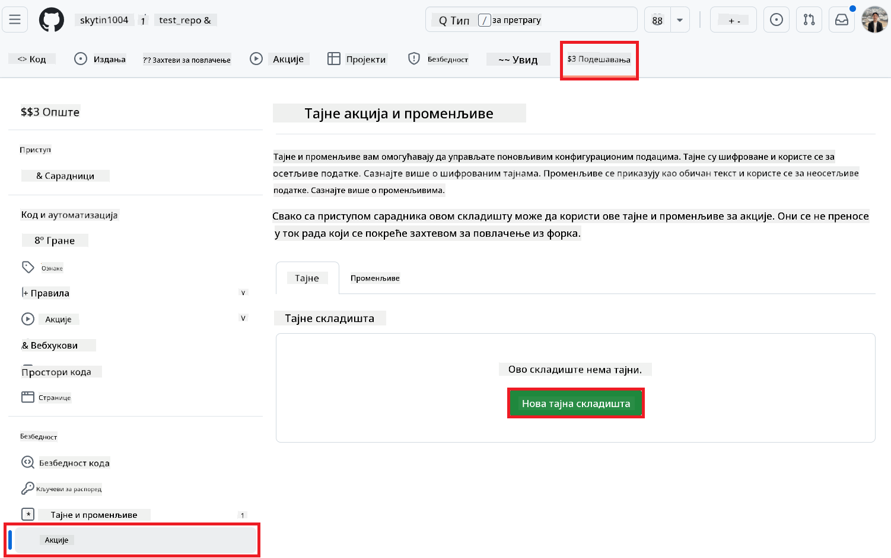
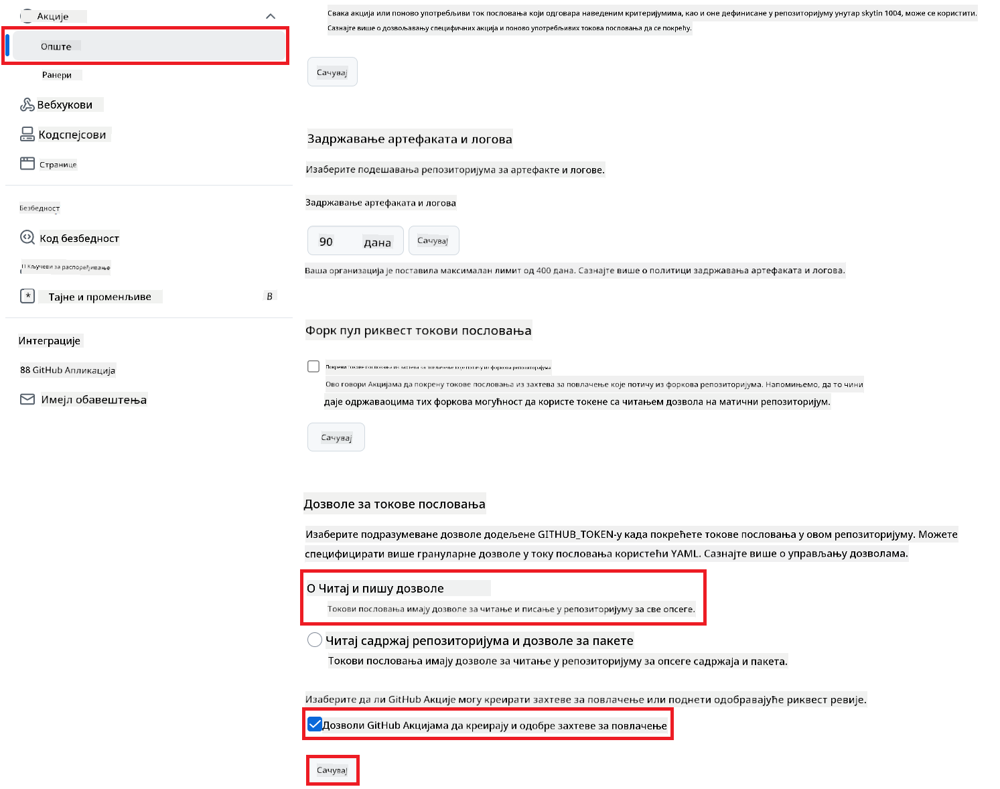

<!--
CO_OP_TRANSLATOR_METADATA:
{
  "original_hash": "a52587a512e667f70d92db853d3c61d5",
  "translation_date": "2025-06-12T19:35:29+00:00",
  "source_file": "getting_started/github-actions-guide/github-actions-guide-public.md",
  "language_code": "sr"
}
-->
# Коришћење Co-op Translator GitHub Action (Јавна конфигурација)

**Циљна публика:** Овај водич је намењен корисницима у већини јавних или приватних репозиторијума где су стандардне дозволе GitHub Actions довољне. Користи уграђени `GITHUB_TOKEN`.

Аутоматизујте превођење документације у вашем репозиторијуму без напора помоћу Co-op Translator GitHub Action. Овај водич вас води кроз подешавање акције која аутоматски креира pull request-ове са ажурираним преводима кад год се промене ваши изворни Markdown фајлови или слике.

> [!IMPORTANT]
>
> **Избор правог водича:**
>
> Овај водич описује **једноставнију конфигурацију користећи стандардни `GITHUB_TOKEN`**. Ово је препоручени метод за већину корисника јер не захтева управљање осетљивим приватним кључевима GitHub апликације.
>

## Предуслови

Пре него што конфигуришете GitHub Action, уверите се да имате потребне акредитиве за AI сервис.

**1. Обавезно: Акредитиви за AI језички модел**  
Потребни су вам акредитиви за бар један од подржаних језичких модела:

- **Azure OpenAI**: Захтева Endpoint, API Key, имена модела/деплојмента, верзију API-ја.  
- **OpenAI**: Захтева API Key, (опционо: Org ID, Base URL, Model ID).  
- Погледајте [Supported Models and Services](../../../../README.md) за детаље.

**2. Опционо: Акредитиви за AI Vision (за превод слика)**

- Потребно само ако желите да преводите текст у сликама.  
- **Azure AI Vision**: Захтева Endpoint и Subscription Key.  
- Ако се не обезбеде, акција ће подразумевано радити у [Markdown-only режиму](../markdown-only-mode.md).

## Подешавање и конфигурација

Пратите ове кораке да конфигуришете Co-op Translator GitHub Action у вашем репозиторијуму користећи стандардни `GITHUB_TOKEN`.

### Корак 1: Разумевање аутентификације (користећи `GITHUB_TOKEN`)

Овај workflow користи уграђени `GITHUB_TOKEN` који пружа GitHub Actions. Овај токен аутоматски додељује дозволе workflow-у за интеракцију са вашим репозиторијумом у складу са подешавањима из **Корака 3**.

### Корак 2: Конфигуришите тајне вредности у репозиторијуму

Потребно је само да додате ваше **акредитиве AI сервиса** као шифроване тајне вредности у подешавањима репозиторијума.

1. Отворите ваш GitHub репозиторијум.  
2. Идите на **Settings** > **Secrets and variables** > **Actions**.  
3. Под **Repository secrets**, кликните **New repository secret** за сваку потребну AI тајну вредност наведену у наставку.

     *(Пример слике: Где додати тајне вредности)*

**Обавезне AI тајне вредности (додајте СВЕ које се односе на ваше предуслове):**

| Назив тајне вредности             | Опис                                      | Извор вредности                  |
| :-------------------------------- | :---------------------------------------- | :------------------------------- |
| `AZURE_SUBSCRIPTION_KEY`            | Кључ за Azure AI сервис (Computer Vision)  | Ваш Azure AI Foundry             |
| `AZURE_AI_SERVICE_ENDPOINT`         | Endpoint за Azure AI сервис (Computer Vision) | Ваш Azure AI Foundry             |
| `AZURE_OPENAI_API_KEY`              | Кључ за Azure OpenAI сервис                | Ваш Azure AI Foundry             |
| `AZURE_OPENAI_ENDPOINT`             | Endpoint за Azure OpenAI сервис             | Ваш Azure AI Foundry             |
| `AZURE_OPENAI_MODEL_NAME`           | Назив вашег Azure OpenAI модела             | Ваш Azure AI Foundry             |
| `AZURE_OPENAI_CHAT_DEPLOYMENT_NAME` | Назив вашег Azure OpenAI деплојмента          | Ваш Azure AI Foundry             |
| `AZURE_OPENAI_API_VERSION`          | Верзија API-ја за Azure OpenAI              | Ваш Azure AI Foundry             |
| `OPENAI_API_KEY`                    | API кључ за OpenAI                         | Ваша OpenAI платформа            |
| `OPENAI_ORG_ID`                     | OpenAI Organization ID (опционо)            | Ваша OpenAI платформа            |
| `OPENAI_CHAT_MODEL_ID`              | Конкретан OpenAI модел ID (опционо)          | Ваша OpenAI платформа            |
| `OPENAI_BASE_URL`                   | Прилагођени OpenAI API Base URL (опционо)    | Ваша OpenAI платформа            |

### Корак 3: Конфигуришите дозволе workflow-а

GitHub Action захтева дозволе додељене преко `GITHUB_TOKEN` да би преузимао код и креирао pull request-ове.

1. У вашем репозиторијуму идите на **Settings** > **Actions** > **General**.  
2. Померите се до секције **Workflow permissions**.  
3. Изаберите **Read and write permissions**. Ово даје `GITHUB_TOKEN` потребне `contents: write` и `pull-requests: write` дозволе за овај workflow.  
4. Проверите да је означено поље **Allow GitHub Actions to create and approve pull requests**.  
5. Кликните **Save**.



### Корак 4: Креирајте YAML фајл за workflow

На крају, направите YAML фајл који дефинише аутоматизовани workflow користећи `GITHUB_TOKEN`.

1. У коренском директоријуму вашег репозиторијума направите `.github/workflows/` директоријум ако већ не постоји.  
2. Унутар `.github/workflows/` направите фајл са именом `co-op-translator.yml`.  
3. Налепите следећи садржај у `co-op-translator.yml`.

```yaml
name: Co-op Translator

on:
  push:
    branches:
      - main

jobs:
  co-op-translator:
    runs-on: ubuntu-latest

    permissions:
      contents: write
      pull-requests: write

    steps:
      - name: Checkout repository
        uses: actions/checkout@v4
        with:
          fetch-depth: 0

      - name: Set up Python
        uses: actions/setup-python@v4
        with:
          python-version: '3.10'

      - name: Install Co-op Translator
        run: |
          python -m pip install --upgrade pip
          pip install co-op-translator

      - name: Run Co-op Translator
        env:
          PYTHONIOENCODING: utf-8
          # === AI Service Credentials ===
          AZURE_SUBSCRIPTION_KEY: ${{ secrets.AZURE_SUBSCRIPTION_KEY }}
          AZURE_AI_SERVICE_ENDPOINT: ${{ secrets.AZURE_AI_SERVICE_ENDPOINT }}
          AZURE_OPENAI_API_KEY: ${{ secrets.AZURE_OPENAI_API_KEY }}
          AZURE_OPENAI_ENDPOINT: ${{ secrets.AZURE_OPENAI_ENDPOINT }}
          AZURE_OPENAI_MODEL_NAME: ${{ secrets.AZURE_OPENAI_MODEL_NAME }}
          AZURE_OPENAI_CHAT_DEPLOYMENT_NAME: ${{ secrets.AZURE_OPENAI_CHAT_DEPLOYMENT_NAME }}
          AZURE_OPENAI_API_VERSION: ${{ secrets.AZURE_OPENAI_API_VERSION }}
          OPENAI_API_KEY: ${{ secrets.OPENAI_API_KEY }}
          OPENAI_ORG_ID: ${{ secrets.OPENAI_ORG_ID }}
          OPENAI_CHAT_MODEL_ID: ${{ secrets.OPENAI_CHAT_MODEL_ID }}
          OPENAI_BASE_URL: ${{ secrets.OPENAI_BASE_URL }}
        run: |
          # =====================================================================
          # IMPORTANT: Set your target languages here (REQUIRED CONFIGURATION)
          # =====================================================================
          # Example: Translate to Spanish, French, German. Add -y to auto-confirm.
          translate -l "es fr de" -y  # <--- MODIFY THIS LINE with your desired languages

      - name: Create Pull Request with translations
        uses: peter-evans/create-pull-request@v5
        with:
          token: ${{ secrets.GITHUB_TOKEN }}
          commit-message: "🌐 Update translations via Co-op Translator"
          title: "🌐 Update translations via Co-op Translator"
          body: |
            This PR updates translations for recent changes to the main branch.

            ### 📋 Changes included
            - Translated contents are available in the `translations/` directory
            - Translated images are available in the `translated_images/` directory

            ---
            🌐 Automatically generated by the [Co-op Translator](https://github.com/Azure/co-op-translator) GitHub Action.
          branch: update-translations
          base: main
          labels: translation, automated-pr
          delete-branch: true
          add-paths: |
            translations/
            translated_images/
```  
4. **Прилагодите workflow:**  
  - **[!IMPORTANT] Циљни језици:** У кораку `Run Co-op Translator` step, you **MUST review and modify the list of language codes** within the `translate -l "..." -y` command to match your project's requirements. The example list (`ar de es...`) needs to be replaced or adjusted.
  - **Trigger (`on:`):** The current trigger runs on every push to `main`. For large repositories, consider adding a `paths:` filter (see commented example in the YAML) to run the workflow only when relevant files (e.g., source documentation) change, saving runner minutes.
  - **PR Details:** Customize the `commit-message`, `title`, `body`, `branch` name, and `labels` in the `Create Pull Request` промените по потреби.

**Одрицање одговорности**:  
Овај документ је преведен коришћењем AI услуге за превођење [Co-op Translator](https://github.com/Azure/co-op-translator). Иако се трудимо да превод буде прецизан, имајте у виду да аутоматизовани преводи могу садржати грешке или нетачности. Оригинални документ на његовом изворном језику треба сматрати ауторитетним извором. За критичне информације препоручује се професионални превод од стране стручног лекара. Нисмо одговорни за било каква неспоразума или погрешне тумачења настала коришћењем овог превода.