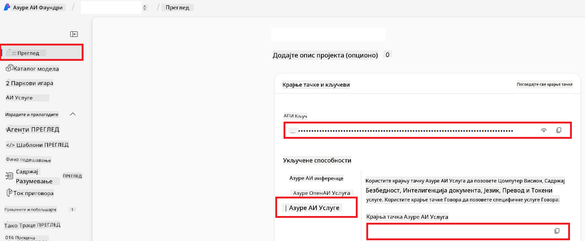

<!--
CO_OP_TRANSLATOR_METADATA:
{
  "original_hash": "b58d7c3cb4210697a073d20eb3064945",
  "translation_date": "2025-06-12T11:58:55+00:00",
  "source_file": "getting_started/set-up-azure-ai.md",
  "language_code": "sr"
}
-->
# Podesite Azure AI za Co-op Translator (Azure OpenAI i Azure AI Vision)

Ovaj vodič vas vodi kroz podešavanje Azure OpenAI za prevod jezika i Azure Computer Vision za analizu sadržaja slika (koja se potom može koristiti za prevod zasnovan na slikama) unutar Azure AI Foundry.

**Zahtevi:**
- Azure nalog sa aktivnom pretplatom.
- Dovoljne dozvole za kreiranje resursa i implementacija u vašoj Azure pretplati.

## Kreirajte Azure AI projekat

Počinjete kreiranjem Azure AI projekta, koji služi kao centralno mesto za upravljanje vašim AI resursima.

1. Idite na [https://ai.azure.com](https://ai.azure.com) i prijavite se sa vašim Azure nalogom.

1. Izaberite **+Create** za kreiranje novog projekta.

1. Uradite sledeće:
   - Unesite **Naziv projekta** (npr. `CoopTranslator-Project`).
   - Izaberite **AI hub** (npr. `CoopTranslator-Hub`) (kreirajte novi ako je potrebno).

1. Kliknite "**Review and Create**" da podesite projekat. Bićete preusmereni na preglednu stranicu vašeg projekta.

## Podesite Azure OpenAI za prevod jezika

U okviru vašeg projekta, implementiraćete Azure OpenAI model koji će služiti kao backend za prevod teksta.

### Otvorite vaš projekat

Ako već niste, otvorite vaš novo kreirani projekat (npr. `CoopTranslator-Project`) u Azure AI Foundry.

### Implementirajte OpenAI model

1. U levom meniju vašeg projekta, pod "My assets", izaberite "**Models + endpoints**".

1. Izaberite **+ Deploy model**.

1. Izaberite **Deploy Base Model**.

1. Prikazaće vam se lista dostupnih modela. Filtrirajte ili pretražite odgovarajući GPT model. Preporučujemo `gpt-4o`.

1. Izaberite željeni model i kliknite **Confirm**.

1. Izaberite **Deploy**.

### Konfiguracija Azure OpenAI

Nakon implementacije, možete izabrati implementaciju sa stranice "**Models + endpoints**" da pronađete njen **REST endpoint URL**, **Key**, **Deployment name**, **Model name** i **API version**. Ovo će vam biti potrebno za integraciju modela za prevod u vašu aplikaciju.

> [!NOTE]
> Verzije API-ja možete birati sa stranice [API version deprecation](https://learn.microsoft.com/azure/ai-services/openai/api-version-deprecation) u skladu sa vašim potrebama. Imajte na umu da je **API version** različit od **Model version** prikazanog na stranici **Models + endpoints** u Azure AI Foundry.

## Podesite Azure Computer Vision za prevod slika

Da biste omogućili prevod teksta unutar slika, potrebno je da pronađete Azure AI Service API Key i Endpoint.

1. Idite na vaš Azure AI projekat (npr. `CoopTranslator-Project`). Uverite se da ste na preglednoj stranici projekta.

### Konfiguracija Azure AI servisa

Pronađite API Key i Endpoint u okviru Azure AI servisa.

1. Idite na vaš Azure AI projekat (npr. `CoopTranslator-Project`). Uverite se da ste na preglednoj stranici projekta.

1. Pronađite **API Key** i **Endpoint** u tabu Azure AI Service.

    

Ova veza omogućava da mogućnosti povezane Azure AI Services resursa (uključujući analizu slika) budu dostupne vašem AI Foundry projektu. Zatim ovu vezu možete koristiti u svojim notebukovima ili aplikacijama za izvlačenje teksta iz slika, koji se potom može poslati Azure OpenAI modelu na prevod.

## Konsolidacija vaših akreditiva

Do sada biste trebali imati sledeće podatke:

**Za Azure OpenAI (prevod teksta):**
- Azure OpenAI Endpoint
- Azure OpenAI API Key
- Azure OpenAI Model Name (npr. `gpt-4o`)
- Azure OpenAI Deployment Name (npr. `cooptranslator-gpt4o`)
- Azure OpenAI API Version

**Za Azure AI Services (izvlačenje teksta iz slika putem Vision):**
- Azure AI Service Endpoint
- Azure AI Service API Key

### Primer: Konfiguracija promenljivih okruženja (Preview)

Kasnije, prilikom izgradnje vaše aplikacije, verovatno ćete je konfigurisati koristeći ove prikupljene akreditive. Na primer, možete ih postaviti kao promenljive okruženja ovako:

```bash
# Azure AI Service Credentials (Required for image translation)
AZURE_AI_SERVICE_API_KEY="your_azure_ai_service_api_key" # e.g., 21xasd...
AZURE_AI_SERVICE_ENDPOINT="https://your_azure_ai_service_endpoint.cognitiveservices.azure.com/"

# Azure OpenAI Credentials (Required for text translation)
AZURE_OPENAI_API_KEY="your_azure_openai_api_key" # e.g., 21xasd...
AZURE_OPENAI_ENDPOINT="https://your_azure_openai_endpoint.openai.azure.com/"
AZURE_OPENAI_MODEL_NAME="your_model_name" # e.g., gpt-4o
AZURE_OPENAI_CHAT_DEPLOYMENT_NAME="your_deployment_name" # e.g., cooptranslator-gpt4o
AZURE_OPENAI_API_VERSION="your_api_version" # e.g., 2024-12-01-preview
```

---

### Dodatno čitanje

- [Kako kreirati projekat u Azure AI Foundry](https://learn.microsoft.com/azure/ai-foundry/how-to/create-projects?tabs=ai-studio)
- [Kako kreirati Azure AI resurse](https://learn.microsoft.com/azure/ai-foundry/how-to/create-azure-ai-resource?tabs=portal)
- [Kako implementirati OpenAI modele u Azure AI Foundry](https://learn.microsoft.com/en-us/azure/ai-foundry/how-to/deploy-models-openai)

**Одрицање од одговорности**:  
Овај документ је преведен помоћу AI сервиса за превођење [Co-op Translator](https://github.com/Azure/co-op-translator). Иако се трудимо да превод буде тачан, молимо вас да имате у виду да аутоматски преводи могу садржати грешке или нетачности. Изворни документ на оригиналном језику треба сматрати коначним и ауторитетним извором. За критичне информације препоручује се професионални људски превод. Нисмо одговорни за било каква неспоразума или погрешна тумачења која могу настати коришћењем овог превода.