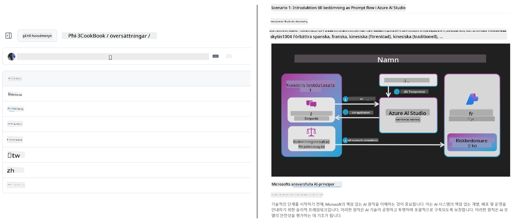
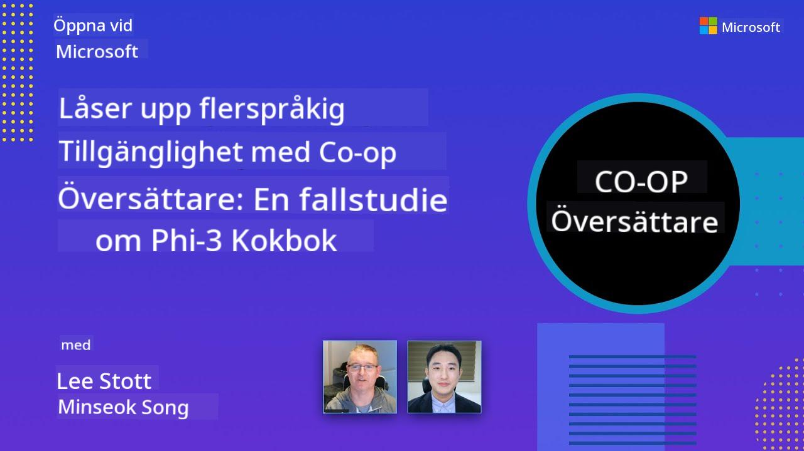

<!--
CO_OP_TRANSLATOR_METADATA:
{
  "original_hash": "044724537b57868117aadae8e7728c7c",
  "translation_date": "2025-06-12T10:30:54+00:00",
  "source_file": "README.md",
  "language_code": "sv"
}
-->


# Co-op Translator: Automatisera översättningen av utbildningsdokumentation enkelt

_Lätt automatisera översättningen av din dokumentation till flera språk för att nå en global publik._

[](https://pypi.org/project/co-op-translator/)
[](https://github.com/azure/co-op-translator/blob/main/LICENSE)
[](https://pepy.tech/project/co-op-translator)
[](https://pepy.tech/project/co-op-translator)
[](https://github.com/psf/black)

[](https://GitHub.com/azure/co-op-translator/graphs/contributors/)
[](https://GitHub.com/azure/co-op-translator/issues/)
[](https://GitHub.com/azure/co-op-translator/pulls/)
[](http://makeapullrequest.com)

### Språkstöd drivet av Co-op Translator
[Franska](../fr/README.md) | [Spanska](../es/README.md) | [Tyska](../de/README.md) | [Ryska](../ru/README.md) | [Arabiska](../ar/README.md) | [Persiska (Farsi)](../fa/README.md) | [Urdu](../ur/README.md) | [Kinesiska (Förenklad)](../zh/README.md) | [Kinesiska (Traditionell, Macau)](../mo/README.md) | [Kinesiska (Traditionell, Hongkong)](../hk/README.md) | [Kinesiska (Traditionell, Taiwan)](../tw/README.md) | [Japanska](../ja/README.md) | [Koreanska](../ko/README.md) | [Hindi](../hi/README.md) | [Bengali](../bn/README.md) | [Marathi](../mr/README.md) | [Nepali](../ne/README.md) | [Punjabi (Gurmukhi)](../pa/README.md) | [Portugisiska (Portugal)](../pt/README.md) | [Portugisiska (Brasilien)](../br/README.md) | [Italienska](../it/README.md) | [Polska](../pl/README.md) | [Turkiska](../tr/README.md) | [Grekiska](../el/README.md) | [Thailändska](../th/README.md) | [Svenska](./README.md) | [Danska](../da/README.md) | [Norska](../no/README.md) | [Finska](../fi/README.md) | [Nederländska](../nl/README.md) | [Hebreiska](../he/README.md) | [Vietnamesiska](../vi/README.md) | [Indonesiska](../id/README.md) | [Malajiska](../ms/README.md) | [Tagalog (Filippinska)](../tl/README.md) | [Swahili](../sw/README.md) | [Ungerska](../hu/README.md) | [Tjeckiska](../cs/README.md) | [Slovakiska](../sk/README.md) | [Rumänska](../ro/README.md) | [Bulgariska](../bg/README.md) | [Serbiska (kyrilliska)](../sr/README.md) | [Kroatiska](../hr/README.md) | [Slovenska](../sl/README.md) | [Ukrainska](../uk/README.md) | [Burmese (Myanmar)](../my/README.md)
> [!NOTE]
> Detta är de aktuella översättningarna av detta repositories innehåll. För en komplett lista över språk som stöds av Co-op Translator, se avsnittet [Language Support](../..).

[](https://GitHub.com/azure/co-op-translator/watchers/)
[](https://GitHub.com/azure/co-op-translator/network/)
[](https://GitHub.com/azure/co-op-translator/stargazers/)

[](https://discord.com/invite/ByRwuEEgH4)

[](https://codespaces.new/azure/co-op-translator)
[](https://vscode.dev/redirect?url=vscode://ms-vscode-remote.remote-containers/cloneInVolume?url=https://github.com/azure/co-op-translator)

## Översikt: Effektivisera översättningen av ditt utbildningsmaterial

Språkbarriärer hindrar i hög grad tillgången till värdefulla utbildningsresurser och teknisk kunskap för elever och utvecklare världen över. Detta begränsar deltagande och bromsar takten för global innovation och lärande.

**Co-op Translator** föddes ur behovet att förbättra den ineffektiva manuella översättningsprocessen för Microsofts egna stora utbildningsserier (som "For Beginners"-guiderna). Verktyget har utvecklats till ett lättanvänt och kraftfullt verktyg designat för att bryta ner dessa barriärer för alla. Genom att erbjuda högkvalitativa automatiserade översättningar via CLI och GitHub Actions ger Co-op Translator lärare, studenter, forskare och utvecklare världen över möjlighet att dela och ta del av kunskap utan språkbegränsningar.

Se hur Co-op Translator organiserar översatt utbildningsmaterial:



Markdown-filer och bildtexter översätts automatiskt och organiseras snyggt i språksspecifika mappar.

**Ge global tillgång till ditt utbildningsmaterial med Co-op Translator idag!**

## Stöd för global tillgång till Microsofts utbildningsresurser

Co-op Translator hjälper till att överbrygga språkbarriärer för viktiga Microsoft-utbildningsinitiativ genom att automatisera översättningsprocessen för repositories som betjänar en global utvecklargemenskap. Exempel som för närvarande använder Co-op Translator inkluderar:

[](https://github.com/microsoft/Generative-AI-for-beginners)
[](https://github.com/microsoft/ML-For-Beginners)
[](https://github.com/microsoft/AI-For-Beginners)
[](https://github.com/microsoft/ai-agents-for-beginners)
[](https://github.com/microsoft/PhiCookBook)
[](https://github.com/microsoft/Generative-AI-for-beginners-dotnet)

## Viktiga funktioner

- **Automatiserade översättningar**: Översätt text till flera språk utan ansträngning.
- **GitHub Actions-integration**: Automatisera översättningar som en del av din CI/CD-pipeline.
- **Bevarande av Markdown**: Behåll korrekt Markdown-syntax under översättningen.
- **Översättning av bildtext**: Extrahera och översätt text i bilder.
- **Avancerad LLM-teknik**: Använd toppmoderna språkmodeller för högkvalitativa översättningar.
- **Enkel integration**: Integrera sömlöst med din befintliga projektuppsättning.
- **Förenkla lokalisering**: Effektivisera processen att anpassa ditt projekt för internationella marknader.

## Så fungerar det


Co-op Translator tar Markdown-filer och bilder från din projektmapp och bearbetar dem enligt följande:

1. **Textutvinning**: Extraherar text från Markdown-filer och, om konfigurerat (t.ex. med Azure AI Vision), text inbäddad i bilder.
1. **AI-översättning**: Skickar den extraherade texten till den konfigurerade LLM:n (Azure OpenAI, OpenAI, etc.) för översättning.
1. **Sparande av resultat**: Sparar de översatta Markdown-filerna och bilderna (med översatt text) i språksspecifika mappar och behåller originalformateringen.

## Kom igång

Kom igång snabbt med CLI eller konfigurera full automatisering med GitHub Actions. Välj det tillvägagångssätt som passar din arbetsprocess bäst:

1. **Kommandorad (CLI)** - För engångsöversättningar eller manuell kontroll
2. **GitHub Actions** - För automatiserade översättningar vid varje push

> [!NOTE]
> Även om denna handledning fokuserar på Azure-resurser kan du använda vilken som helst av de stödda språkmodellerna.

### Språkstöd

Co-op Translator stödjer ett brett utbud av språk för att hjälpa dig nå en global publik. Här är vad du behöver veta:

#### Snabbreferens

| Språk | Kod | Språk | Kod | Språk | Kod |
|----------|------|----------|------|----------|------|
| Arabic | ar | Bengali | bn | Bulgarian | bg |
| Burmese (Myanmar) | my | Chinese (Simplified) | zh | Chinese (Traditional, HK) | hk |
| Chinese (Traditional, Macau) | mo | Chinese (Traditional, TW) | tw | Croatian | hr |
| Czech | cs | Danish | da | Dutch | nl |
| Finnish | fi | French | fr | German | de |
| Greek | el | Hebrew | he | Hindi | hi |
| Hungarian | hu | Indonesian | id | Italian | it |
| Japanese | ja | Korean | ko | Malay | ms |
| Marathi | mr | Nepali | ne | Norwegian | no |
| Persian (Farsi) | fa | Polish | pl | Portuguese (Brazil) | br |
| Portuguese (Portugal) | pt | Punjabi (Gurmukhi) | pa | Romanian | ro |
| Russian | ru | Serbian (Cyrillic) | sr | Slovak | sk |
| Slovenian | sl | Spanish | es | Swahili | sw |
| Swedish | sv | Tagalog (Filipino) | tl | Thai | th |
| Turkish | tr | Ukrainian | uk | Urdu | ur |
| Vietnamese | vi | — | — | — | — |

#### Använda språk-koder

När du använder Co-op Translator måste du specificera språk med deras koder. Till exempel:

```bash
# Translate to French, Spanish, and German
translate -l "fr es de"

# Translate to Chinese (Simplified) and Japanese
translate -l "zh ja"
```

> [!NOTE]
> För detaljerad teknisk information om språkstöd, inklusive:
>
> - Teckensnittsspecifikationer för varje språk
> - Kända problem
> - Hur man lägger till nya språk
>
> Se vår [Supported Languages Documentation](./getting_started/supported-languages.md).

### Stödda modeller och tjänster

| Typ                  | Namn                           |
|-----------------------|--------------------------------|
| Language Model        |   |
| AI Vision       |  |

> [!NOTE]
> Om en AI vision-tjänst inte är tillgänglig, växlar co-op translator till [Markdown-only mode](./getting_started/markdown-only-mode.md).

### Initial setup

Innan du börjar behöver du konfigurera följande resurser:

1. Language Model Resource (obligatoriskt):
   - Azure OpenAI (rekommenderat) – Ger högkvalitativa översättningar med företagsklassad tillförlitlighet
   - OpenAI – Alternativ om du inte har tillgång till Azure
   - För detaljerad information om stödda modeller, se [Supported Models and Services](../..)

1. AI Vision Resource (valfritt):
   - Azure AI Vision – Möjliggör översättning av text i bilder
   - Om inte konfigurerat används automatiskt [Markdown-only mode](./getting_started/markdown-only-mode.md)
   - Rekommenderas för projekt med bilder som innehåller text som behöver översättas

1. Konfigurationssteg:
   - Följ vår [Azure AI setup guide](./getting_started/set-up-azure-ai.md) för detaljerade instruktioner
   - Skapa en `.env`-fil med dina API-nycklar och endpoints (se avsnittet [Quick Start](../..))
   - Säkerställ att du har nödvändiga behörigheter och kvoter för dina valda tjänster

### Projektinställning före översättning

Innan du startar översättningsprocessen, följ dessa steg för att förbereda ditt projekt:

1. Förbered din README:
   - Lägg till en översättningstabell i din README.md för att länka till översatta versioner
   - Exempel på format:

     ```markdown

     ### 🌐 Multi-Language Support
     
     [French](../fr/README.md) | [Spanish](../es/README.md) | [German](../de/README.md) | [Russian](../ru/README.md) | [Arabic](../ar/README.md) | [Persian (Farsi)](../fa/README.md) | [Urdu](../ur/README.md) | [Chinese (Simplified)](../zh/README.md) | [Chinese (Traditional, Macau)](../mo/README.md) | [Chinese (Traditional, Hong Kong)](../hk/README.md) | [Chinese (Traditional, Taiwan)](../tw/README.md) | [Japanese](../ja/README.md) | [Korean](../ko/README.md) | [Hindi](../hi/README.md) | [Bengali](../bn/README.md) | [Marathi](../mr/README.md) | [Nepali](../ne/README.md) | [Punjabi (Gurmukhi)](../pa/README.md) | [Portuguese (Portugal)](../pt/README.md) | [Portuguese (Brazil)](../br/README.md) | [Italian](../it/README.md) | [Polish](../pl/README.md) | [Turkish](../tr/README.md) | [Greek](../el/README.md) | [Thai](../th/README.md) | [Swedish](./README.md) | [Danish](../da/README.md) | [Norwegian](../no/README.md) | [Finnish](../fi/README.md) | [Dutch](../nl/README.md) | [Hebrew](../he/README.md) | [Vietnamese](../vi/README.md) | [Indonesian](../id/README.md) | [Malay](../ms/README.md) | [Tagalog (Filipino)](../tl/README.md) | [Swahili](../sw/README.md) | [Hungarian](../hu/README.md) | [Czech](../cs/README.md) | [Slovak](../sk/README.md) | [Romanian](../ro/README.md) | [Bulgarian](../bg/README.md) | [Serbian (Cyrillic)](../sr/README.md) | [Croatian](../hr/README.md) | [Slovenian](../sl/README.md) | [Ukrainian](../uk/README.md) | [Burmese (Myanmar)](../my/README.md) 
    
     ```

1. Rensa befintliga översättningar (om det behövs):
   - Ta bort eventuella befintliga översättningsmappar (t.ex. `translations/`)
   - Radera gamla översättningsfiler för att börja om från början
   - Detta säkerställer att inga konflikter uppstår med den nya översättningsprocessen

### Snabbstart: Kommandorad

För en snabb start via kommandoraden:

1. Skapa en virtuell miljö:

    ```bash
    python -m venv .venv
    ```

1. Aktivera den virtuella miljön:

    - På Windows:

    ```bash
    .venv\scripts\activate
    ```

    - På Linux/macOS:

    ```bash
    source .venv/bin/activate
    ```

1. Installera paketet:

    ```bash
    pip install co-op-translator
    ```

1. Konfigurera autentisering:

    - Skapa en `.env` file in your project's root directory.
    - Copy the contents from the [.env.template](../../.env.template) file into your new `.env` file.
    - Fill in the required API keys and endpoint information in your `.env` file.

1. Run Translation:
    - Navigate to your project's root directory in your terminal.
    - Execute the translate command, specifying target languages with the `-l`-flagga:

    ```bash
    translate -l "ko ja fr"
    ```

    _(Ersätt `"ko ja fr"` with your desired space-separated language codes)_

### Detailed Usage Guides

Choose the approach that best fits your workflow:

#### 1. Using the Command Line (CLI)

- Best for: One-time translations, manual control, or integration into custom scripts.
- Requires: Local installation of Python and the `co-op-translator` package.
- Guide: [Command Line Guide](./getting_started/command-line-guide/command-line-guide.md)

#### 2. Using GitHub Actions (Automation)

- Best for: Automatically translating content whenever changes are pushed to your repository. Keeps translations consistently up-to-date.
- Requires: Setting up a workflow file (`.github/workflows`) i ditt repository. Ingen lokal installation krävs.
- Guider:
  - [GitHub Actions Guide (Public Repositories & Standard Secrets)](./getting_started/github-actions-guide/github-actions-guide-public.md) – Använd denna för de flesta offentliga eller personliga repositories som använder standard repository-sekreter.
  - [GitHub Actions Guide (Microsoft Organization Repos & Org-Level Setups)](./getting_started/github-actions-guide/github-actions-guide-org.md) – Använd denna guide om du arbetar inom Microsofts GitHub-organisation eller behöver använda organisationsnivå-sekreter eller runners.

### Felsökning och tips

- [Felsökningsguide](./getting_started/troubleshooting.md)

### Ytterligare resurser

- [Kommandoreferens](./getting_started/command-reference.md): Detaljerad guide till alla tillgängliga kommandon och alternativ.
- [Supported Languages](./getting_started/supported-languages.md): Kontrollera listan över stödda språk och instruktioner för att lägga till nya.
- [Markdown-Only Mode](./getting_started/markdown-only-mode.md): Hur man översätter endast text, utan bildöversättning.

## Videopresentationer

Lär dig mer om Co-op Translator genom våra presentationer _(klicka på bilden nedan för att se på YouTube.)_:

- **Open at Microsoft**: En kort 18-minuters introduktion och snabbguide om hur du använder Co-op Translator.
[](https://www.youtube.com/watch?v=jX_swfH_KNU)

## Stöd oss och främja globalt lärande

Var med och revolutionera hur utbildningsinnehåll delas globalt! Ge [Co-op Translator](https://github.com/azure/co-op-translator) en ⭐ på GitHub och stöd vårt uppdrag att bryta språkbarriärer inom lärande och teknik. Ditt intresse och dina bidrag gör stor skillnad! Kodbidrag och förslag på funktioner är alltid välkomna.

## Bidra

Detta projekt välkomnar bidrag och förslag. Intresserad av att bidra till Azure Co-op Translator? Se vår [CONTRIBUTING.md](./CONTRIBUTING.md) för riktlinjer om hur du kan hjälpa till att göra Co-op Translator mer tillgängligt.

## Bidragsgivare

[](https://github.com/Azure/co-op-translator/graphs/contributors)

## Uppförandekod

Detta projekt har antagit [Microsoft Open Source Code of Conduct](https://opensource.microsoft.com/codeofconduct/).
För mer information, se [Code of Conduct FAQ](https://opensource.microsoft.com/codeofconduct/faq/) eller
kontakta [opencode@microsoft.com](mailto:opencode@microsoft.com) vid ytterligare frågor eller kommentarer.

## Ansvarsfull AI

Microsoft är engagerat i att hjälpa våra kunder att använda våra AI-produkter ansvarsfullt, dela våra erfarenheter och bygga förtroendebaserade partnerskap genom verktyg som Transparency Notes och Impact Assessments. Många av dessa resurser finns på [https://aka.ms/RAI](https://aka.ms/RAI).
Microsofts syn på ansvarsfull AI grundar sig i våra AI-principer om rättvisa, pålitlighet och säkerhet, integritet och säkerhet, inkludering, transparens och ansvar.

Storskaliga modeller för naturligt språk, bild och tal – som de som används i detta exempel – kan potentiellt uppträda på sätt som är orättvisa, opålitliga eller stötande, vilket i sin tur kan orsaka skada. Vänligen konsultera [Azure OpenAI service Transparency note](https://learn.microsoft.com/legal/cognitive-services/openai/transparency-note?tabs=text) för information om risker och begränsningar.

Det rekommenderade sättet att minska dessa risker är att inkludera ett säkerhetssystem i din arkitektur som kan upptäcka och förhindra skadligt beteende. [Azure AI Content Safety](https://learn.microsoft.com/azure/ai-services/content-safety/overview) erbjuder ett oberoende skyddslager som kan upptäcka skadligt användar- och AI-genererat innehåll i applikationer och tjänster. Azure AI Content Safety inkluderar text- och bild-API:er som låter dig upptäcka skadligt material. Vi har också en interaktiv Content Safety Studio där du kan se, utforska och prova exempel på kod för att upptäcka skadligt innehåll i olika modaliteter. Följande [snabbstartsdokumentation](https://learn.microsoft.com/azure/ai-services/content-safety/quickstart-text?tabs=visual-studio%2Clinux&pivots=programming-language-rest) guidar dig genom hur du gör förfrågningar till tjänsten.

En annan aspekt att ta hänsyn till är den övergripande applikationsprestandan. Med multimodala och multimodellsapplikationer menar vi prestanda att systemet fungerar som du och dina användare förväntar sig, inklusive att inte generera skadliga resultat. Det är viktigt att bedöma prestandan för din totala applikation med hjälp av [genereringskvalitet samt risk- och säkerhetsmått](https://learn.microsoft.com/azure/ai-studio/concepts/evaluation-metrics-built-in).

Du kan utvärdera din AI-applikation i din utvecklingsmiljö med hjälp av [prompt flow SDK](https://microsoft.github.io/promptflow/index.html). Med antingen en testdatamängd eller ett mål mäts dina generativa AI-genereringar kvantitativt med inbyggda eller egna evaluatorer efter eget val. För att komma igång med prompt flow sdk för att utvärdera ditt system kan du följa [snabbstartsguiden](https://learn.microsoft.com/azure/ai-studio/how-to/develop/flow-evaluate-sdk). När du har genomfört en utvärderingskörning kan du [visualisera resultaten i Azure AI Studio](https://learn.microsoft.com/azure/ai-studio/how-to/evaluate-flow-results).

## Varumärken

Detta projekt kan innehålla varumärken eller logotyper för projekt, produkter eller tjänster. Auktoriserad användning av Microsofts
varumärken eller logotyper är föremål för och måste följa
[Microsoft's Trademark & Brand Guidelines](https://www.microsoft.com/en-us/legal/intellectualproperty/trademarks/usage/general).
Användning av Microsofts varumärken eller logotyper i modifierade versioner av detta projekt får inte orsaka förvirring eller antyda Microsofts sponsring.
All användning av tredjeparts varumärken eller logotyper är föremål för dessa tredje parters riktlinjer.

**Ansvarsfriskrivning**:  
Detta dokument har översatts med hjälp av AI-översättningstjänsten [Co-op Translator](https://github.com/Azure/co-op-translator). Även om vi strävar efter noggrannhet, vänligen observera att automatiska översättningar kan innehålla fel eller brister. Det ursprungliga dokumentet på dess modersmål bör betraktas som den auktoritativa källan. För viktig information rekommenderas professionell mänsklig översättning. Vi ansvarar inte för några missförstånd eller feltolkningar som uppstår vid användning av denna översättning.