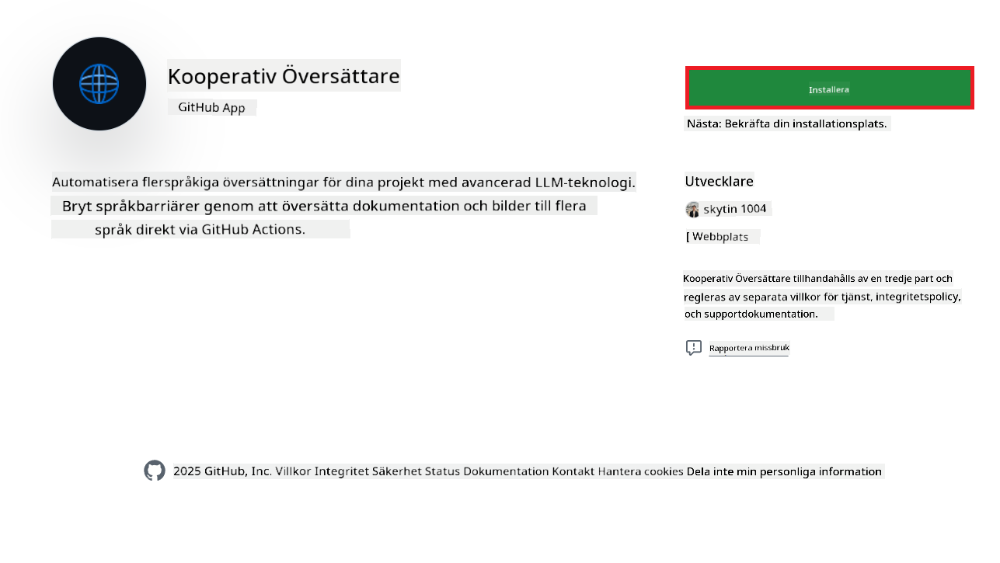
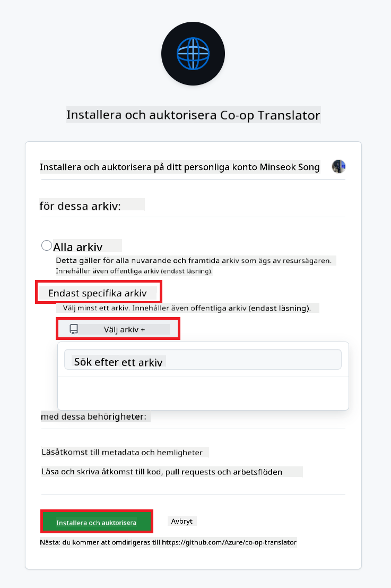
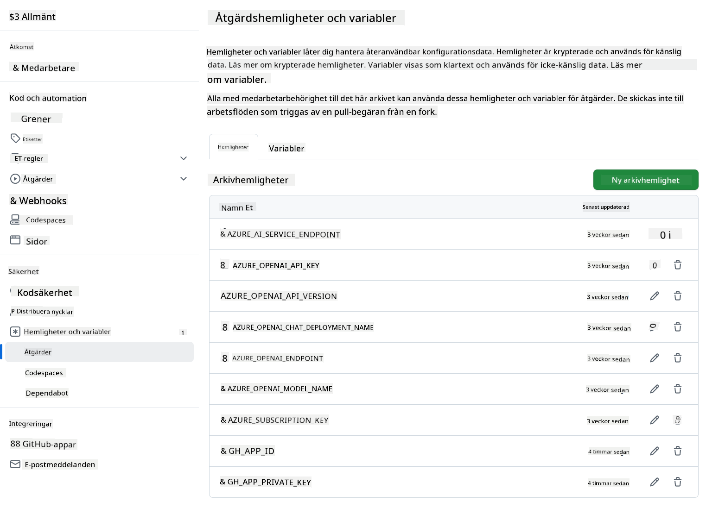

<!--
CO_OP_TRANSLATOR_METADATA:
{
  "original_hash": "c437820027c197f25fb2cbee95bae28c",
  "translation_date": "2025-06-12T19:11:03+00:00",
  "source_file": "getting_started/github-actions-guide/github-actions-guide-org.md",
  "language_code": "sv"
}
-->
# Använda Co-op Translator GitHub Action (Organisationsguide)

**Målgrupp:** Denna guide är avsedd för **Microsoft-interna användare** eller **team som har tillgång till nödvändiga behörigheter för den förbyggda Co-op Translator GitHub-appen** eller som kan skapa sin egen anpassade GitHub-app.

Automatisera översättningen av dokumentationen i ditt repository enkelt med Co-op Translator GitHub Action. Denna guide visar hur du ställer in action för att automatiskt skapa pull requests med uppdaterade översättningar när dina käll-Markdown-filer eller bilder ändras.

> [!IMPORTANT]
> 
> **Välja rätt guide:**
>
> Denna guide beskriver installation med **GitHub App ID och en privat nyckel**. Du behöver vanligtvis denna "Organisationsguide"-metod om: **`GITHUB_TOKEN` behörigheter är begränsade:** Din organisation eller repositorys inställningar begränsar de standardbehörigheter som tilldelas den vanliga `GITHUB_TOKEN`. Specifikt, om `GITHUB_TOKEN` inte tillåts nödvändiga `write` behörigheter (som `contents: write` eller `pull-requests: write`), kommer arbetsflödet i [Public Setup Guide](./github-actions-guide-public.md) att misslyckas på grund av otillräckliga behörigheter. Genom att använda en dedikerad GitHub App med uttryckligen tilldelade behörigheter kringgår du denna begränsning.
>
> **Om ovanstående inte gäller dig:**
>
> Om standard-`GITHUB_TOKEN` har tillräckliga behörigheter i ditt repository (dvs. du inte är blockerad av organisationsbegränsningar), använd istället **[Public Setup Guide using GITHUB_TOKEN](./github-actions-guide-public.md)**. Den publika guiden kräver inte att du skaffar eller hanterar App IDs eller privata nycklar utan bygger enbart på standard-`GITHUB_TOKEN` och repository-behörigheter.

## Förutsättningar

Innan du konfigurerar GitHub Action, säkerställ att du har nödvändiga AI-tjänstuppgifter redo.

**1. Obligatoriskt: AI Language Model-uppgifter**  
Du behöver uppgifter för minst en av de stödjda språkmodellerna:

- **Azure OpenAI**: Kräver Endpoint, API-nyckel, Modell-/Deploymentsnamn, API-version.  
- **OpenAI**: Kräver API-nyckel, (valfritt: Org ID, Bas-URL, Modell-ID).  
- Se [Supported Models and Services](../../../../README.md) för detaljer.  
- Installationsguide: [Set up Azure OpenAI](../set-up-resources/set-up-azure-openai.md).

**2. Valfritt: Computer Vision-uppgifter (för bildöversättning)**

- Krävs endast om du behöver översätta text i bilder.  
- **Azure Computer Vision**: Kräver Endpoint och prenumerationsnyckel.  
- Om inte angivet går action i [Markdown-only mode](../markdown-only-mode.md).  
- Installationsguide: [Set up Azure Computer Vision](../set-up-resources/set-up-azure-computer-vision.md).

## Installation och konfiguration

Följ dessa steg för att konfigurera Co-op Translator GitHub Action i ditt repository:

### Steg 1: Installera och konfigurera GitHub App-autentisering

Arbetsflödet använder GitHub App-autentisering för att säkert interagera med ditt repository (t.ex. skapa pull requests) åt dig. Välj ett alternativ:

#### **Alternativ A: Installera den förbyggda Co-op Translator GitHub App (för Microsoft-intern användning)**

1. Gå till sidan för [Co-op Translator GitHub App](https://github.com/apps/co-op-translator).

1. Välj **Installera** och välj det konto eller den organisation där ditt målrepository finns.

    

1. Välj **Endast valda repositories** och välj ditt målrepository (t.ex. `PhiCookBook`). Klicka på **Installera**. Du kan bli ombedd att autentisera.

    

1. **Hämta appuppgifter (intern process krävs):** För att låta arbetsflödet autentisera som appen behöver du två uppgifter från Co-op Translator-teamet:  
  - **App ID:** Det unika ID:t för Co-op Translator-appen. App ID är: `1164076`.  
  - **Privat nyckel:** Du måste få **hela innehållet** i `.pem`-filen med den privata nyckeln från ansvarig kontakt. **Behandla denna nyckel som ett lösenord och håll den säker.**

1. Fortsätt till Steg 2.

#### **Alternativ B: Använd din egen anpassade GitHub App**

- Om du vill kan du skapa och konfigurera din egen GitHub App. Säkerställ att den har läs- och skrivbehörighet för Contents och Pull requests. Du behöver dess App ID och en genererad privat nyckel.

### Steg 2: Konfigurera repository-secrets

Du behöver lägga till GitHub App-uppgifterna och dina AI-tjänstuppgifter som krypterade secrets i repositoryinställningarna.

1. Gå till ditt målrepository (t.ex. `PhiCookBook`).

1. Navigera till **Settings** > **Secrets and variables** > **Actions**.

1. Under **Repository secrets**, klicka på **New repository secret** för varje secret som listas nedan.

   

**Obligatoriska secrets (för GitHub App-autentisering):**

| Secret Name          | Beskrivning                                      | Värdekälla                                     |
| :------------------- | :----------------------------------------------- | :----------------------------------------------- |
| `GH_APP_ID`          | App ID för GitHub App (från Steg 1).      | GitHub App-inställningar                              |
| `GH_APP_PRIVATE_KEY` | **Hela innehållet** i nedladdade `.pem`-filen. | `.pem`-filen (från Steg 1)                      |

**AI-tjänstsecrets (lägg till ALLA som gäller utifrån dina förutsättningar):**

| Secret Name                         | Beskrivning                               | Värdekälla                     |
| :---------------------------------- | :---------------------------------------- | :------------------------------- |
| `AZURE_SUBSCRIPTION_KEY`            | Nyckel för Azure AI-tjänst (Computer Vision)  | Azure AI Foundry                    |
| `AZURE_AI_SERVICE_ENDPOINT`         | Endpoint för Azure AI-tjänst (Computer Vision) | Azure AI Foundry                     |
| `AZURE_OPENAI_API_KEY`              | Nyckel för Azure OpenAI-tjänst              | Azure AI Foundry                     |
| `AZURE_OPENAI_ENDPOINT`             | Endpoint för Azure OpenAI-tjänst         | Azure AI Foundry                     |
| `AZURE_OPENAI_MODEL_NAME`           | Ditt Azure OpenAI Modellnamn              | Azure AI Foundry                     |
| `AZURE_OPENAI_CHAT_DEPLOYMENT_NAME` | Ditt Azure OpenAI Deploymentsnamn         | Azure AI Foundry                     |
| `AZURE_OPENAI_API_VERSION`          | API-version för Azure OpenAI              | Azure AI Foundry                     |
| `OPENAI_API_KEY`                    | API-nyckel för OpenAI                        | OpenAI Platform                  |
| `OPENAI_ORG_ID`                     | OpenAI Organisations-ID                    | OpenAI Platform                  |
| `OPENAI_CHAT_MODEL_ID`              | Specifikt OpenAI modell-ID                  | OpenAI Platform                    |
| `OPENAI_BASE_URL`                   | Anpassad OpenAI API-bas-URL                | OpenAI Platform                    |



### Steg 3: Skapa arbetsflödesfilen

Slutligen skapar du YAML-filen som definierar det automatiserade arbetsflödet.

1. Skapa katalogen `.github/workflows/` i rotkatalogen av ditt repository om den inte redan finns.

1. Skapa i `.github/workflows/` en fil med namnet `co-op-translator.yml`.

1. Klistra in följande innehåll i co-op-translator.yml.

```
name: Co-op Translator

on:
  push:
    branches:
      - main

jobs:
  co-op-translator:
    runs-on: ubuntu-latest

    permissions:
      contents: write
      pull-requests: write

    steps:
      - name: Checkout repository
        uses: actions/checkout@v4
        with:
          fetch-depth: 0

      - name: Set up Python
        uses: actions/setup-python@v4
        with:
          python-version: '3.10'

      - name: Install Co-op Translator
        run: |
          python -m pip install --upgrade pip
          pip install co-op-translator

      - name: Run Co-op Translator
        env:
          PYTHONIOENCODING: utf-8
          # Azure AI Service Credentials
          AZURE_SUBSCRIPTION_KEY: ${{ secrets.AZURE_SUBSCRIPTION_KEY }}
          AZURE_AI_SERVICE_ENDPOINT: ${{ secrets.AZURE_AI_SERVICE_ENDPOINT }}

          # Azure OpenAI Credentials
          AZURE_OPENAI_API_KEY: ${{ secrets.AZURE_OPENAI_API_KEY }}
          AZURE_OPENAI_ENDPOINT: ${{ secrets.AZURE_OPENAI_ENDPOINT }}
          AZURE_OPENAI_MODEL_NAME: ${{ secrets.AZURE_OPENAI_MODEL_NAME }}
          AZURE_OPENAI_CHAT_DEPLOYMENT_NAME: ${{ secrets.AZURE_OPENAI_CHAT_DEPLOYMENT_NAME }}
          AZURE_OPENAI_API_VERSION: ${{ secrets.AZURE_OPENAI_API_VERSION }}

          # OpenAI Credentials
          OPENAI_API_KEY: ${{ secrets.OPENAI_API_KEY }}
          OPENAI_ORG_ID: ${{ secrets.OPENAI_ORG_ID }}
          OPENAI_CHAT_MODEL_ID: ${{ secrets.OPENAI_CHAT_MODEL_ID }}
          OPENAI_BASE_URL: ${{ secrets.OPENAI_BASE_URL }}
        run: |
          # =====================================================================
          # IMPORTANT: Set your target languages here (REQUIRED CONFIGURATION)
          # =====================================================================
          # Example: Translate to Spanish, French, German. Add -y to auto-confirm.
          translate -l "es fr de" -y  # <--- MODIFY THIS LINE with your desired languages

      - name: Authenticate GitHub App
        id: generate_token
        uses: tibdex/github-app-token@v1
        with:
          app_id: ${{ secrets.GH_APP_ID }}
          private_key: ${{ secrets.GH_APP_PRIVATE_KEY }}

      - name: Create Pull Request with translations
        uses: peter-evans/create-pull-request@v5
        with:
          token: ${{ steps.generate_token.outputs.token }}
          commit-message: "🌐 Update translations via Co-op Translator"
          title: "🌐 Update translations via Co-op Translator"
          body: |
            This PR updates translations for recent changes to the main branch.

            ### 📋 Changes included
            - Translated contents are available in the `translations/` directory
            - Translated images are available in the `translated_images/` directory

            ---
            🌐 Automatically generated by the [Co-op Translator](https://github.com/Azure/co-op-translator) GitHub Action.
          branch: update-translations
          base: main
          labels: translation, automated-pr
          delete-branch: true
          add-paths: |
            translations/
            translated_images/

```

4.  **Anpassa arbetsflödet:**  
  - **[!IMPORTANT] Mål språk:** I `Run Co-op Translator` step, you **MUST review and modify the list of language codes** within the `translate -l "..." -y` command to match your project's requirements. The example list (`ar de es...`) needs to be replaced or adjusted.
  - **Trigger (`on:`):** The current trigger runs on every push to `main`. For large repositories, consider adding a `paths:` filter (see commented example in the YAML) to run the workflow only when relevant files (e.g., source documentation) change, saving runner minutes.
  - **PR Details:** Customize the `commit-message`, `title`, `body`, `branch` name, and `labels` in the `Create Pull Request` step if needed.

## Credential Management and Renewal

- **Security:** Always store sensitive credentials (API keys, private keys) as GitHub Actions secrets. Never expose them in your workflow file or repository code.
- **[!IMPORTANT] Key Renewal (Internal Microsoft Users):** Be aware that Azure OpenAI key used within Microsoft might have a mandatory renewal policy (e.g., every 5 months). Ensure you update the corresponding GitHub secrets (`AZURE_OPENAI_...`-nycklarna) **innan de går ut** för att undvika att arbetsflödet misslyckas.

## Köra arbetsflödet

När `co-op-translator.yml`-filen har mergats in i din main-branch (eller den branch som anges i `on:` trigger), the workflow will automatically run whenever changes are pushed to that branch (and match the `paths`-filtret, om konfigurerat).

Om översättningar genereras eller uppdateras kommer action automatiskt skapa en Pull Request med ändringarna, redo för din granskning och sammanslagning.

**Ansvarsfriskrivning**:  
Detta dokument har översatts med hjälp av AI-översättningstjänsten [Co-op Translator](https://github.com/Azure/co-op-translator). Även om vi strävar efter noggrannhet, vänligen notera att automatiska översättningar kan innehålla fel eller brister. Det ursprungliga dokumentet på dess modersmål ska betraktas som den auktoritativa källan. För kritisk information rekommenderas professionell mänsklig översättning. Vi ansvarar inte för eventuella missförstånd eller feltolkningar som uppstår till följd av användningen av denna översättning.