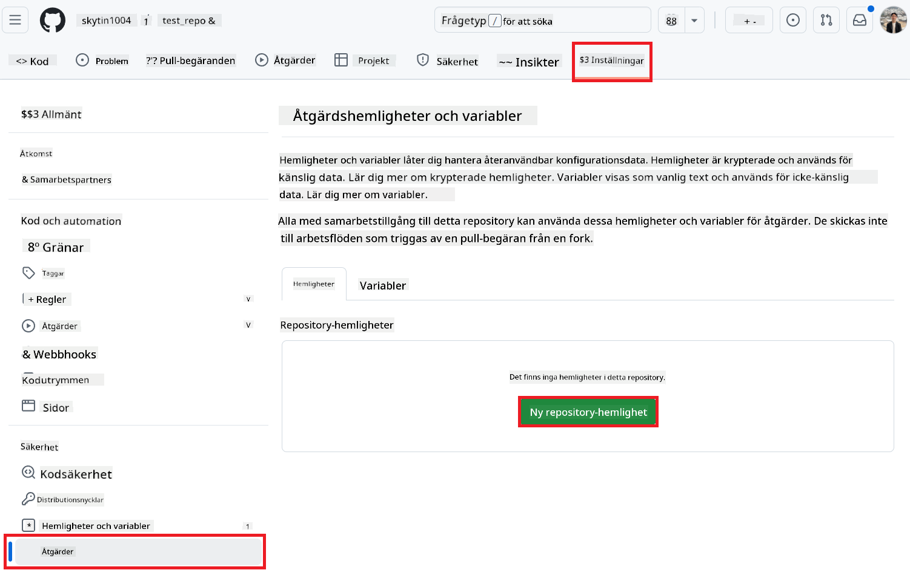
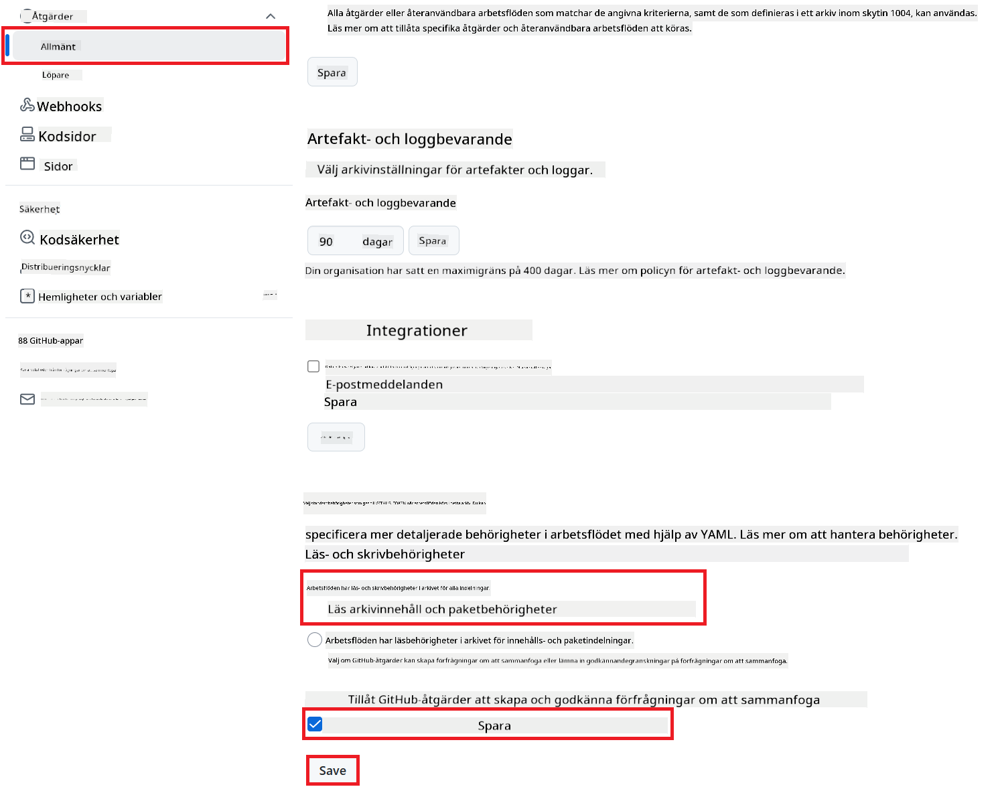

<!--
CO_OP_TRANSLATOR_METADATA:
{
  "original_hash": "a52587a512e667f70d92db853d3c61d5",
  "translation_date": "2025-06-12T19:29:39+00:00",
  "source_file": "getting_started/github-actions-guide/github-actions-guide-public.md",
  "language_code": "sv"
}
-->
# Använda Co-op Translator GitHub Action (Offentlig installation)

**Målgrupp:** Den här guiden är avsedd för användare i de flesta offentliga eller privata repositories där standardbehörigheter för GitHub Actions räcker. Den använder den inbyggda `GITHUB_TOKEN`.

Automatisera översättningen av ditt repositories dokumentation enkelt med Co-op Translator GitHub Action. Den här guiden visar hur du ställer in action för att automatiskt skapa pull requests med uppdaterade översättningar när dina käll-Markdownfiler eller bilder ändras.

> [!IMPORTANT]
>
> **Välja rätt guide:**
>
> Den här guiden beskriver **den enklare installationen med standard `GITHUB_TOKEN`**. Detta är den rekommenderade metoden för de flesta användare eftersom den inte kräver hantering av känsliga GitHub App Private Keys.
>

## Förutsättningar

Innan du konfigurerar GitHub Action, se till att du har de nödvändiga AI-tjänstuppgifterna redo.

**1. Obligatoriskt: AI-språkmodelluppgifter**  
Du behöver uppgifter för minst en av de stödjade språkmodellerna:

- **Azure OpenAI**: Kräver Endpoint, API-nyckel, Modell-/Deploynamn, API-version.  
- **OpenAI**: Kräver API-nyckel, (valfritt: Org ID, Bas-URL, Modell-ID).  
- Se [Supported Models and Services](../../../../README.md) för detaljer.

**2. Valfritt: AI Vision-uppgifter (för bildöversättning)**

- Krävs endast om du behöver översätta text i bilder.  
- **Azure AI Vision**: Kräver Endpoint och prenumerationsnyckel.  
- Om detta inte anges används [Markdown-only mode](../markdown-only-mode.md) som standard.

## Installation och konfiguration

Följ dessa steg för att konfigurera Co-op Translator GitHub Action i ditt repository med standard `GITHUB_TOKEN`.

### Steg 1: Förstå autentisering (med `GITHUB_TOKEN`)

Det här arbetsflödet använder den inbyggda `GITHUB_TOKEN` som tillhandahålls av GitHub Actions. Denna token ger automatiskt arbetsflödet behörigheter att interagera med ditt repository baserat på inställningarna i **Steg 3**.

### Steg 2: Konfigurera repository-sekreter

Du behöver bara lägga till dina **AI-tjänstuppgifter** som krypterade secrets i ditt repositorys inställningar.

1.  Gå till ditt mål-GitHub repository.  
2.  Navigera till **Settings** > **Secrets and variables** > **Actions**.  
3.  Under **Repository secrets**, klicka på **New repository secret** för varje nödvändig AI-tjänstsecret som listas nedan.

     *(Bildreferens: Visar var du lägger till secrets)*

**Obligatoriska AI-tjänstsecrets (lägg till ALLA som gäller utifrån dina förutsättningar):**

| Secret Name                         | Beskrivning                               | Värdekälla                      |
| :---------------------------------- | :---------------------------------------- | :------------------------------ |
| `AZURE_SUBSCRIPTION_KEY`            | Nyckel för Azure AI-tjänst (Computer Vision)  | Din Azure AI Foundry             |
| `AZURE_AI_SERVICE_ENDPOINT`         | Endpoint för Azure AI-tjänst (Computer Vision) | Din Azure AI Foundry             |
| `AZURE_OPENAI_API_KEY`              | Nyckel för Azure OpenAI-tjänst              | Din Azure AI Foundry             |
| `AZURE_OPENAI_ENDPOINT`             | Endpoint för Azure OpenAI-tjänst         | Din Azure AI Foundry             |
| `AZURE_OPENAI_MODEL_NAME`           | Ditt Azure OpenAI Modellnamn              | Din Azure AI Foundry             |
| `AZURE_OPENAI_CHAT_DEPLOYMENT_NAME` | Ditt Azure OpenAI Deploy-namn         | Din Azure AI Foundry             |
| `AZURE_OPENAI_API_VERSION`          | API-version för Azure OpenAI              | Din Azure AI Foundry             |
| `OPENAI_API_KEY`                    | API-nyckel för OpenAI                        | Din OpenAI-plattform            |
| `OPENAI_ORG_ID`                     | OpenAI Organisations-ID (valfritt)         | Din OpenAI-plattform            |
| `OPENAI_CHAT_MODEL_ID`              | Specifikt OpenAI modell-ID (valfritt)       | Din OpenAI-plattform            |
| `OPENAI_BASE_URL`                   | Anpassad OpenAI API-bas-URL (valfritt)     | Din OpenAI-plattform            |

### Steg 3: Konfigurera arbetsflödets behörigheter

GitHub Action behöver behörigheter via `GITHUB_TOKEN` för att checka ut kod och skapa pull requests.

1.  Gå till **Settings** > **Actions** > **General** i ditt repository.  
2.  Scrolla ner till avsnittet **Workflow permissions**.  
3.  Välj **Read and write permissions**. Detta ger `GITHUB_TOKEN` de nödvändiga `contents: write` och `pull-requests: write` behörigheterna för detta arbetsflöde.  
4.  Se till att rutan för **Allow GitHub Actions to create and approve pull requests** är **markerad**.  
5.  Klicka på **Save**.



### Steg 4: Skapa arbetsflödesfilen

Skapa slutligen YAML-filen som definierar det automatiserade arbetsflödet med `GITHUB_TOKEN`.

1.  Skapa katalogen `.github/workflows/` i rotmappen av ditt repository om den inte redan finns.  
2.  Skapa en fil med namnet `co-op-translator.yml` i `.github/workflows/`.  
3.  Klistra in följande innehåll i `co-op-translator.yml`.

```yaml
name: Co-op Translator

on:
  push:
    branches:
      - main

jobs:
  co-op-translator:
    runs-on: ubuntu-latest

    permissions:
      contents: write
      pull-requests: write

    steps:
      - name: Checkout repository
        uses: actions/checkout@v4
        with:
          fetch-depth: 0

      - name: Set up Python
        uses: actions/setup-python@v4
        with:
          python-version: '3.10'

      - name: Install Co-op Translator
        run: |
          python -m pip install --upgrade pip
          pip install co-op-translator

      - name: Run Co-op Translator
        env:
          PYTHONIOENCODING: utf-8
          # === AI Service Credentials ===
          AZURE_SUBSCRIPTION_KEY: ${{ secrets.AZURE_SUBSCRIPTION_KEY }}
          AZURE_AI_SERVICE_ENDPOINT: ${{ secrets.AZURE_AI_SERVICE_ENDPOINT }}
          AZURE_OPENAI_API_KEY: ${{ secrets.AZURE_OPENAI_API_KEY }}
          AZURE_OPENAI_ENDPOINT: ${{ secrets.AZURE_OPENAI_ENDPOINT }}
          AZURE_OPENAI_MODEL_NAME: ${{ secrets.AZURE_OPENAI_MODEL_NAME }}
          AZURE_OPENAI_CHAT_DEPLOYMENT_NAME: ${{ secrets.AZURE_OPENAI_CHAT_DEPLOYMENT_NAME }}
          AZURE_OPENAI_API_VERSION: ${{ secrets.AZURE_OPENAI_API_VERSION }}
          OPENAI_API_KEY: ${{ secrets.OPENAI_API_KEY }}
          OPENAI_ORG_ID: ${{ secrets.OPENAI_ORG_ID }}
          OPENAI_CHAT_MODEL_ID: ${{ secrets.OPENAI_CHAT_MODEL_ID }}
          OPENAI_BASE_URL: ${{ secrets.OPENAI_BASE_URL }}
        run: |
          # =====================================================================
          # IMPORTANT: Set your target languages here (REQUIRED CONFIGURATION)
          # =====================================================================
          # Example: Translate to Spanish, French, German. Add -y to auto-confirm.
          translate -l "es fr de" -y  # <--- MODIFY THIS LINE with your desired languages

      - name: Create Pull Request with translations
        uses: peter-evans/create-pull-request@v5
        with:
          token: ${{ secrets.GITHUB_TOKEN }}
          commit-message: "🌐 Update translations via Co-op Translator"
          title: "🌐 Update translations via Co-op Translator"
          body: |
            This PR updates translations for recent changes to the main branch.

            ### 📋 Changes included
            - Translated contents are available in the `translations/` directory
            - Translated images are available in the `translated_images/` directory

            ---
            🌐 Automatically generated by the [Co-op Translator](https://github.com/Azure/co-op-translator) GitHub Action.
          branch: update-translations
          base: main
          labels: translation, automated-pr
          delete-branch: true
          add-paths: |
            translations/
            translated_images/
```  
4.  **Anpassa arbetsflödet:**  
  - **[!IMPORTANT] Mål språk:** I steget `Run Co-op Translator` step, you **MUST review and modify the list of language codes** within the `translate -l "..." -y` command to match your project's requirements. The example list (`ar de es...`) needs to be replaced or adjusted.
  - **Trigger (`on:`):** The current trigger runs on every push to `main`. For large repositories, consider adding a `paths:` filter (see commented example in the YAML) to run the workflow only when relevant files (e.g., source documentation) change, saving runner minutes.
  - **PR Details:** Customize the `commit-message`, `title`, `body`, `branch` name, and `labels` in the `Create Pull Request` om det behövs.

**Ansvarsfriskrivning**:  
Detta dokument har översatts med hjälp av AI-översättningstjänsten [Co-op Translator](https://github.com/Azure/co-op-translator). Även om vi strävar efter noggrannhet, vänligen var medveten om att automatiska översättningar kan innehålla fel eller brister. Det ursprungliga dokumentet på dess modersmål bör betraktas som den auktoritativa källan. För kritisk information rekommenderas professionell mänsklig översättning. Vi ansvarar inte för några missförstånd eller feltolkningar som uppstår vid användning av denna översättning.