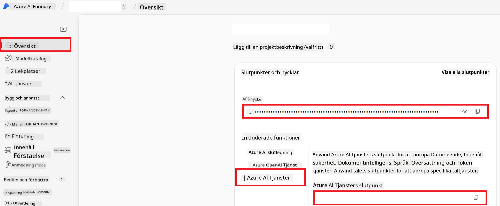

<!--
CO_OP_TRANSLATOR_METADATA:
{
  "original_hash": "b58d7c3cb4210697a073d20eb3064945",
  "translation_date": "2025-06-12T11:53:39+00:00",
  "source_file": "getting_started/set-up-azure-ai.md",
  "language_code": "sv"
}
-->
# Ställ in Azure AI för Co-op Translator (Azure OpenAI & Azure AI Vision)

Denna guide visar hur du ställer in Azure OpenAI för språköversättning och Azure Computer Vision för bildinnehållsanalys (som sedan kan användas för bildbaserad översättning) inom Azure AI Foundry.

**Förutsättningar:**
- Ett Azure-konto med en aktiv prenumeration.
- Tillräckliga behörigheter för att skapa resurser och distributioner i din Azure-prenumeration.

## Skapa ett Azure AI-projekt

Du börjar med att skapa ett Azure AI-projekt, som fungerar som en central plats för att hantera dina AI-resurser.

1. Gå till [https://ai.azure.com](https://ai.azure.com) och logga in med ditt Azure-konto.

1. Välj **+Create** för att skapa ett nytt projekt.

1. Utför följande uppgifter:
   - Ange ett **Projektnamn** (t.ex. `CoopTranslator-Project`).
   - Välj **AI hub** (t.ex. `CoopTranslator-Hub`) (Skapa en ny om det behövs).

1. Klicka på "**Review and Create**" för att skapa ditt projekt. Du kommer att tas till projektets översiktssida.

## Ställ in Azure OpenAI för språköversättning

Inom ditt projekt kommer du att distribuera en Azure OpenAI-modell som fungerar som backend för textöversättning.

### Navigera till ditt projekt

Om du inte redan är där, öppna ditt nyskapade projekt (t.ex. `CoopTranslator-Project`) i Azure AI Foundry.

### Distribuera en OpenAI-modell

1. Från projektets vänstermeny, under "My assets", välj "**Models + endpoints**".

1. Välj **+ Deploy model**.

1. Välj **Deploy Base Model**.

1. Du får en lista över tillgängliga modeller. Filtrera eller sök efter en lämplig GPT-modell. Vi rekommenderar `gpt-4o`.

1. Välj önskad modell och klicka på **Confirm**.

1. Välj **Deploy**.

### Azure OpenAI-konfiguration

När modellen är distribuerad kan du från sidan "**Models + endpoints**" välja distributionen för att hitta dess **REST endpoint URL**, **Key**, **Deployment name**, **Model name** och **API version**. Dessa behövs för att integrera översättningsmodellen i din applikation.

> [!NOTE]
> Du kan välja API-versioner från sidan [API version deprecation](https://learn.microsoft.com/azure/ai-services/openai/api-version-deprecation) baserat på dina behov. Observera att **API version** skiljer sig från **Model version** som visas på sidan **Models + endpoints** i Azure AI Foundry.

## Ställ in Azure Computer Vision för bildöversättning

För att möjliggöra översättning av text i bilder behöver du hitta Azure AI Service API Key och Endpoint.

1. Navigera till ditt Azure AI-projekt (t.ex. `CoopTranslator-Project`). Se till att du är på projektets översiktssida.

### Azure AI Service-konfiguration

Hitta API Key och Endpoint från Azure AI Service.

1. Navigera till ditt Azure AI-projekt (t.ex. `CoopTranslator-Project`). Se till att du är på projektets översiktssida.

1. Hitta **API Key** och **Endpoint** under fliken Azure AI Service.

    

Denna anslutning gör kapaciteterna i den kopplade Azure AI Services-resursen (inklusive bildanalys) tillgängliga för ditt AI Foundry-projekt. Du kan sedan använda denna anslutning i dina notebooks eller applikationer för att extrahera text från bilder, som sedan kan skickas till Azure OpenAI-modellen för översättning.

## Sammanställ dina uppgifter

Vid det här laget bör du ha samlat följande:

**För Azure OpenAI (Textöversättning):**
- Azure OpenAI Endpoint
- Azure OpenAI API Key
- Azure OpenAI Model Name (t.ex. `gpt-4o`)
- Azure OpenAI Deployment Name (t.ex. `cooptranslator-gpt4o`)
- Azure OpenAI API Version

**För Azure AI Services (Textutdrag från bilder via Vision):**
- Azure AI Service Endpoint
- Azure AI Service API Key

### Exempel: Konfiguration av miljövariabler (Förhandsgranskning)

Senare, när du bygger din applikation, kommer du troligen att konfigurera den med dessa insamlade uppgifter. Till exempel kan du ställa in dem som miljövariabler på följande sätt:

```bash
# Azure AI Service Credentials (Required for image translation)
AZURE_AI_SERVICE_API_KEY="your_azure_ai_service_api_key" # e.g., 21xasd...
AZURE_AI_SERVICE_ENDPOINT="https://your_azure_ai_service_endpoint.cognitiveservices.azure.com/"

# Azure OpenAI Credentials (Required for text translation)
AZURE_OPENAI_API_KEY="your_azure_openai_api_key" # e.g., 21xasd...
AZURE_OPENAI_ENDPOINT="https://your_azure_openai_endpoint.openai.azure.com/"
AZURE_OPENAI_MODEL_NAME="your_model_name" # e.g., gpt-4o
AZURE_OPENAI_CHAT_DEPLOYMENT_NAME="your_deployment_name" # e.g., cooptranslator-gpt4o
AZURE_OPENAI_API_VERSION="your_api_version" # e.g., 2024-12-01-preview
```

---

### Vidare läsning

- [How to Create a project in Azure AI Foundry](https://learn.microsoft.com/azure/ai-foundry/how-to/create-projects?tabs=ai-studio)
- [How to Create Azure AI resources](https://learn.microsoft.com/azure/ai-foundry/how-to/create-azure-ai-resource?tabs=portal)
- [How to Deploy OpenAI models in Azure AI Foundry](https://learn.microsoft.com/en-us/azure/ai-foundry/how-to/deploy-models-openai)

**Ansvarsfriskrivning**:  
Detta dokument har översatts med hjälp av AI-översättningstjänsten [Co-op Translator](https://github.com/Azure/co-op-translator). Även om vi strävar efter noggrannhet, vänligen observera att automatiska översättningar kan innehålla fel eller brister. Det ursprungliga dokumentet på dess modersmål bör betraktas som den auktoritativa källan. För kritisk information rekommenderas professionell mänsklig översättning. Vi ansvarar inte för några missförstånd eller feltolkningar som uppstår från användningen av denna översättning.