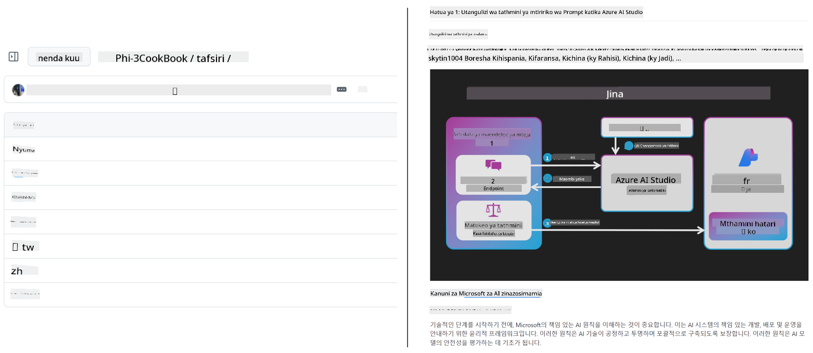
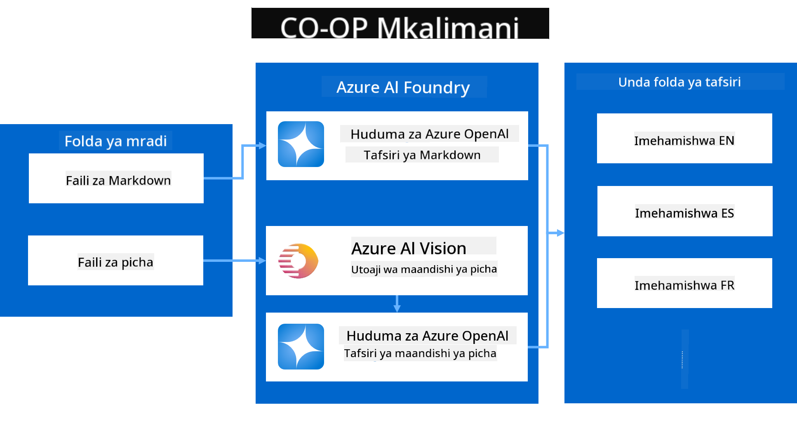
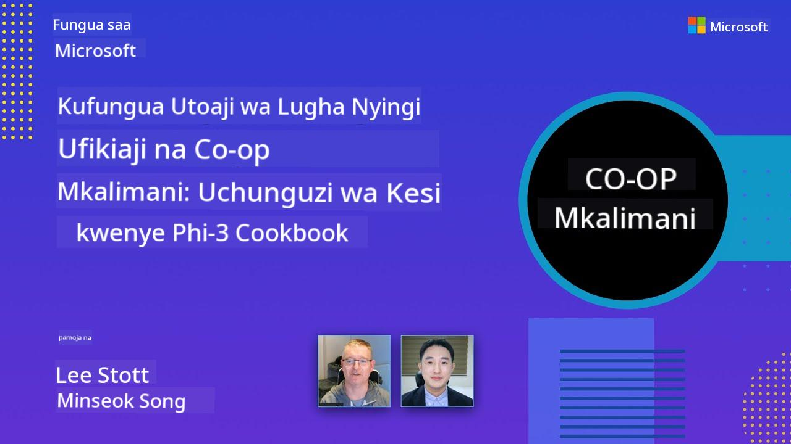

<!--
CO_OP_TRANSLATOR_METADATA:
{
  "original_hash": "044724537b57868117aadae8e7728c7c",
  "translation_date": "2025-06-12T10:45:22+00:00",
  "source_file": "README.md",
  "language_code": "sw"
}
-->


# Mfasiri wa Co-op: Fanya Tafsiri ya Nyaraka za Elimu Kwa Urahisi

_Tumia kiotomatiki kutafsiri nyaraka zako katika lugha nyingi ili kufikia hadhira ya kimataifa._

[](https://pypi.org/project/co-op-translator/)
[](https://github.com/azure/co-op-translator/blob/main/LICENSE)
[](https://pepy.tech/project/co-op-translator)
[](https://pepy.tech/project/co-op-translator)
[](https://github.com/psf/black)

[](https://GitHub.com/azure/co-op-translator/graphs/contributors/)
[](https://GitHub.com/azure/co-op-translator/issues/)
[](https://GitHub.com/azure/co-op-translator/pulls/)
[](http://makeapullrequest.com)

### Usaidizi wa Lugha Unaotolewa na Co-op Translator
[Franska](../fr/README.md) | [Spanska](../es/README.md) | [Tyska](../de/README.md) | [Ryska](../ru/README.md) | [Arabiska](../ar/README.md) | [Persiska (Farsi)](../fa/README.md) | [Urdu](../ur/README.md) | [Kinesiska (Förenklad)](../zh/README.md) | [Kinesiska (Traditionell, Macau)](../mo/README.md) | [Kinesiska (Traditionell, Hong Kong)](../hk/README.md) | [Kinesiska (Traditionell, Taiwan)](../tw/README.md) | [Japanska](../ja/README.md) | [Koreanska](../ko/README.md) | [Hindi](../hi/README.md) | [Bengali](../bn/README.md) | [Marathi](../mr/README.md) | [Nepali](../ne/README.md) | [Punjabi (Gurmukhi)](../pa/README.md) | [Portugisiska (Portugal)](../pt/README.md) | [Portugisiska (Brasilien)](../br/README.md) | [Italienska](../it/README.md) | [Polska](../pl/README.md) | [Turkiska](../tr/README.md) | [Grekiska](../el/README.md) | [Thailändska](../th/README.md) | [Svenska](../sv/README.md) | [Danska](../da/README.md) | [Norska](../no/README.md) | [Finska](../fi/README.md) | [Holländska](../nl/README.md) | [Hebreiska](../he/README.md) | [Vietnamesiska](../vi/README.md) | [Indonesiska](../id/README.md) | [Malajiska](../ms/README.md) | [Tagalog (Filippinska)](../tl/README.md) | [Swahili](./README.md) | [Ungerska](../hu/README.md) | [Tjeckiska](../cs/README.md) | [Slovakiska](../sk/README.md) | [Rumänska](../ro/README.md) | [Bulgariska](../bg/README.md) | [Serbiska (Kyrilliska)](../sr/README.md) | [Kroatiska](../hr/README.md) | [Slovenska](../sl/README.md) | [Ukrainska](../uk/README.md) | [Burmese (Myanmar)](../my/README.md)
> [!NOTE]
> Hizi ni tafsiri za sasa za maudhui ya hifadhidata hii. Kwa orodha kamili ya lugha zinazoungwa mkono na Co-op Translator, tafadhali angalia sehemu ya [Language Support](../..).

[](https://GitHub.com/azure/co-op-translator/watchers/)
[](https://GitHub.com/azure/co-op-translator/network/)
[](https://GitHub.com/azure/co-op-translator/stargazers/)

[](https://discord.com/invite/ByRwuEEgH4)

[](https://codespaces.new/azure/co-op-translator)
[](https://vscode.dev/redirect?url=vscode://ms-vscode-remote.remote-containers/cloneInVolume?url=https://github.com/azure/co-op-translator)

## Muhtasari: Rahisisha Tafsiri ya Maudhui Yako ya Elimu

Vizingiti vya lugha vinaathiri sana upatikanaji wa rasilimali muhimu za elimu na maarifa ya kiufundi kwa wanafunzi na waendelezaji duniani kote. Hii hupunguza ushiriki na kupunguza kasi ya ubunifu na kujifunza duniani.

**Co-op Translator** ilizaliwa kutokana na hitaji la kuboresha mchakato usiofaa wa tafsiri ya mikono kwa mfululizo mkubwa wa elimu wa Microsoft (kama vile mwongozo wa "Kwa Waanzilishi"). Sasa ni chombo rahisi kutumia, chenye nguvu, kilichoundwa kuvunja vizingiti hivi kwa kila mtu. Kwa kutoa tafsiri za ubora wa juu kwa njia ya CLI na GitHub Actions, Co-op Translator huwapa walimu, wanafunzi, watafiti, na waendelezaji duniani kote uwezo wa kushiriki na kupata maarifa bila vizuizi vya lugha.

Tazama jinsi Co-op Translator inavyopanga maudhui ya elimu yaliyotafsiriwa:



Faili za Markdown na maandishi ya picha hutafsiriwa moja kwa moja na kuandaliwa kwa mpangilio mzuri kwenye folda za lugha maalum.

**Fungua upatikanaji wa kimataifa kwa maudhui yako ya elimu kwa kutumia Co-op Translator leo!**

## Kusaidia Upatikanaji wa Kimataifa kwa Rasilimali za Kujifunza za Microsoft

Co-op Translator husaidia kuziba pengo la lugha kwa miradi muhimu ya elimu ya Microsoft, kwa kuendesha mchakato wa tafsiri kwa hifadhidata zinazohudumia jumuiya ya waendelezaji duniani. Mifano inayotumia Co-op Translator kwa sasa ni:

[](https://github.com/microsoft/Generative-AI-for-beginners)
[](https://github.com/microsoft/ML-For-Beginners)
[](https://github.com/microsoft/AI-For-Beginners)
[](https://github.com/microsoft/ai-agents-for-beginners)
[](https://github.com/microsoft/PhiCookBook)
[](https://github.com/microsoft/Generative-AI-for-beginners-dotnet)

## Sifa Muhimu

- **Tafsiri Zinazoendeshwa Kiotomatiki**: Tafsiri maandishi kwa lugha nyingi kwa urahisi.
- **Muunganisho na GitHub Actions**: Endesha tafsiri kiotomatiki kama sehemu ya mchakato wako wa CI/CD.
- **Uhifadhi wa Markdown**: Hifadhi muundo sahihi wa Markdown wakati wa kutafsiri.
- **Tafsiri ya Maandishi ya Picha**: Chukua na kutafsiri maandishi yaliyomo ndani ya picha.
- **Teknolojia ya LLM ya Juu**: Tumia mifano ya lugha ya kisasa kwa tafsiri bora.
- **Muunganisho Rahisi**: Unganisha kwa urahisi na usanidi wako wa mradi uliopo.
- **Rahisisha Uwekaji Lugha**: Rahisisha mchakato wa kuweka mradi wako katika lugha mbalimbali za kimataifa.

## Jinsi Inavyofanya Kazi



Co-op Translator huchukua faili za Markdown na picha kutoka kwenye folda ya mradi wako na kuziendesha kama ifuatavyo:

1. **Uchukuaji wa Maandishi**: Huchukua maandishi kutoka kwa faili za Markdown na, ikiwa imewekwa (mfano, kwa Azure AI Vision), maandishi yaliyomo ndani ya picha.
1. **Tafsiri kwa AI**: Huutuma maandishi yaliyochukuliwa kwa LLM iliyowekwa (Azure OpenAI, OpenAI, nk) kwa ajili ya tafsiri.
1. **Hifadhi Matokeo**: Huhifadhi faili za Markdown zilizotafsiriwa na picha (zilizo na maandishi yaliyotafsiriwa) kwenye folda za lugha maalum, huku ikihifadhi muundo wa awali.

## Anza Haraka

Anza haraka kwa kutumia CLI au weka kiotomatiki kamili na GitHub Actions. Chagua njia inayofaa zaidi kwa mtiririko wako wa kazi:

1. **Command Line (CLI)** - Kwa tafsiri za mara moja au udhibiti wa mikono
2. **GitHub Actions** - Kwa tafsiri zinazoendeshwa kiotomatiki kila unapobeba mabadiliko

> [!NOTE]
> Ingawa mafunzo haya yanazingatia rasilimali za Azure, unaweza kutumia mfano wowote wa lugha unaoungwa mkono.

### Msaada wa Lugha

Co-op Translator inaunga mkono lugha nyingi ili kukusaidia kufikia hadhira ya kimataifa. Hapa ni mambo unayopaswa kujua:

#### Marejeleo ya Haraka

| Lugha | Msimbo | Lugha | Msimbo | Lugha | Msimbo |
|----------|------|----------|------|----------|------|
| Kiarabu | ar | Kibenwali | bn | Kibulgaria | bg |
| Kiburma (Myanmar) | my | Kichina (Rahisi) | zh | Kichina (Asili, HK) | hk |
| Kichina (Asili, Macau) | mo | Kichina (Asili, TW) | tw | Kikroeshia | hr |
| Kicheki | cs | Kidenmaki | da | Kiholanzi | nl |
| Kifini | fi | Kifaransa | fr | Kijerumani | de |
| Kigiriki | el | Kiebrania | he | Kihindi | hi |
| Kihungari | hu | Kiindonesia | id | Kiitaliano | it |
| Kijapani | ja | Kikorea | ko | Kimelayu | ms |
| Kimarathi | mr | Kinepali | ne | Kinorwe | no |
| Kiajemi (Farsi) | fa | Kipolishi | pl | Kireno (Brazil) | br |
| Kireno (Ureno) | pt | Kipunjabi (Gurmukhi) | pa | Kiromania | ro |
| Kirusi | ru | Kiserbia (Cyrillic) | sr | Kislovakia | sk |
| Kislovenia | sl | Kihispania | es | Kiswahili | sw |
| Kiswidi | sv | Kitagalog (Kifilipino) | tl | Kithai | th |
| Kituruki | tr | Kiukraini | uk | Kiurdu | ur |
| Kivietinamu | vi | — | — | — | — |

#### Kutumia Msimbo wa Lugha

Unapotumia Co-op Translator, utahitaji kubainisha lugha kwa kutumia misimbo yao. Kwa mfano:

```bash
# Translate to French, Spanish, and German
translate -l "fr es de"

# Translate to Chinese (Simplified) and Japanese
translate -l "zh ja"
```

> [!NOTE]
> Kwa maelezo ya kina ya kiufundi kuhusu msaada wa lugha, ikijumuisha:
>
> - Maelezo ya fonti kwa kila lugha
> - Matatizo yanayojulikana
> - Jinsi ya kuongeza lugha mpya
>
> Angalia [Supported Languages Documentation](./getting_started/supported-languages.md).

### Mifano na Huduma Zinazoungwa Mkono

| Aina                  | Jina                           |
|-----------------------|--------------------------------|
| Mfano wa Lugha        |   |
| AI Vision             |  |

> [!NOTE]
> Ikiwa huduma ya AI vision haipatikani, co-op translator itabadilisha hadi [Markdown-only mode](./getting_started/markdown-only-mode.md).

### Usanidi wa Awali

Kabla hujaanza, utahitaji kuanzisha rasilimali zifuatazo:

1. Rasilimali ya Mfano wa Lugha (Inahitajika):
   - Azure OpenAI (Inapendekezwa) - Hutoa tafsiri bora zenye uhakika wa kiwango cha biashara
   - OpenAI - Chaguo mbadala ikiwa huna ufikiaji wa Azure
   - Kwa maelezo ya kina kuhusu mifano inayoungwa mkono, angalia [Supported Models and Services](../..)

1. Rasilimali ya AI Vision (Hiari):
   - Azure AI Vision - Inaruhusu tafsiri ya maandishi yaliyomo ndani ya picha
   - Ikiwa haijasanidiwa, tafsiri itatumia moja kwa moja [Markdown-only mode](./getting_started/markdown-only-mode.md)
   - Inapendekezwa kwa miradi yenye picha zilizo na maandishi yanayohitaji kutafsiriwa

1. Hatua za Usanidi:
   - Fuata [Azure AI setup guide](./getting_started/set-up-azure-ai.md) kwa maelekezo ya kina
   - Unda faili `.env` yenye API keys na endpoints zako (tazama sehemu ya [Quick Start](../..))
   - Hakikisha una ruhusa na vikwazo vinavyohitajika kwa huduma ulizochagua

### Usanidi wa Mradi Kabla ya Tafsiri

Kabla ya kuanza mchakato wa tafsiri, fuata hatua hizi kuandaa mradi wako:

1. Andaa README Yako:
   - Ongeza jedwali la tafsiri kwenye README.md yako kuunganisha matoleo yaliyotafsiriwa
   - Mfano wa muundo:

     ```markdown

     ### 🌐 Multi-Language Support
     
     [French](../fr/README.md) | [Spanish](../es/README.md) | [German](../de/README.md) | [Russian](../ru/README.md) | [Arabic](../ar/README.md) | [Persian (Farsi)](../fa/README.md) | [Urdu](../ur/README.md) | [Chinese (Simplified)](../zh/README.md) | [Chinese (Traditional, Macau)](../mo/README.md) | [Chinese (Traditional, Hong Kong)](../hk/README.md) | [Chinese (Traditional, Taiwan)](../tw/README.md) | [Japanese](../ja/README.md) | [Korean](../ko/README.md) | [Hindi](../hi/README.md) | [Bengali](../bn/README.md) | [Marathi](../mr/README.md) | [Nepali](../ne/README.md) | [Punjabi (Gurmukhi)](../pa/README.md) | [Portuguese (Portugal)](../pt/README.md) | [Portuguese (Brazil)](../br/README.md) | [Italian](../it/README.md) | [Polish](../pl/README.md) | [Turkish](../tr/README.md) | [Greek](../el/README.md) | [Thai](../th/README.md) | [Swedish](../sv/README.md) | [Danish](../da/README.md) | [Norwegian](../no/README.md) | [Finnish](../fi/README.md) | [Dutch](../nl/README.md) | [Hebrew](../he/README.md) | [Vietnamese](../vi/README.md) | [Indonesian](../id/README.md) | [Malay](../ms/README.md) | [Tagalog (Filipino)](../tl/README.md) | [Swahili](./README.md) | [Hungarian](../hu/README.md) | [Czech](../cs/README.md) | [Slovak](../sk/README.md) | [Romanian](../ro/README.md) | [Bulgarian](../bg/README.md) | [Serbian (Cyrillic)](../sr/README.md) | [Croatian](../hr/README.md) | [Slovenian](../sl/README.md) | [Ukrainian](../uk/README.md) | [Burmese (Myanmar)](../my/README.md) 
    
     ```

1. Ondoa Tafsiri Zilizopo (ikiwa inahitajika):
   - Futa folda zozote za tafsiri zilizopo (mfano, `translations/`)
   - Futa faili zozote za tafsiri za zamani ili kuanza upya
   - Hii inahakikisha hakuna migongano na mchakato mpya wa tafsiri

### Anza Haraka: Command Line

Kwa kuanza haraka kwa kutumia mstari wa amri:

1. Unda mazingira ya virtual:

    ```bash
    python -m venv .venv
    ```

1. Washa mazingira ya virtual:

    - Kwa Windows:

    ```bash
    .venv\scripts\activate
    ```

    - Kwa Linux/macOS:

    ```bash
    source .venv/bin/activate
    ```

1. Sakinisha kifurushi:

    ```bash
    pip install co-op-translator
    ```

1. Sanidi Vibali:

    - Unda faili `.env` file in your project's root directory.
    - Copy the contents from the [.env.template](../../.env.template) file into your new `.env` file.
    - Fill in the required API keys and endpoint information in your `.env` file.

1. Run Translation:
    - Navigate to your project's root directory in your terminal.
    - Execute the translate command, specifying target languages with the `-l` alama:

    ```bash
    translate -l "ko ja fr"
    ```

    _(Badilisha `"ko ja fr"` with your desired space-separated language codes)_

### Detailed Usage Guides

Choose the approach that best fits your workflow:

#### 1. Using the Command Line (CLI)

- Best for: One-time translations, manual control, or integration into custom scripts.
- Requires: Local installation of Python and the `co-op-translator` package.
- Guide: [Command Line Guide](./getting_started/command-line-guide/command-line-guide.md)

#### 2. Using GitHub Actions (Automation)

- Best for: Automatically translating content whenever changes are pushed to your repository. Keeps translations consistently up-to-date.
- Requires: Setting up a workflow file (`.github/workflows`) katika hifadhidata yako. Hakuna usakinishaji wa ndani unahitajika.
- Miongozo:
  - [GitHub Actions Guide (Public Repositories & Standard Secrets)](./getting_started/github-actions-guide/github-actions-guide-public.md) - Tumia hii kwa hifadhidata nyingi za umma au binafsi zinazotegemea siri za kawaida za hifadhidata.
  - [GitHub Actions Guide (Microsoft Organization Repos & Org-Level Setups)](./getting_started/github-actions-guide/github-actions-guide-org.md) - Tumia mwongozo huu ikiwa unafanya kazi ndani ya shirika la GitHub la Microsoft au unahitaji kutumia siri au runners za ngazi ya shirika.

### Usuluhishi na Vidokezo

- [Troubleshooting Guide](./getting_started/troubleshooting.md)

### Rasilimali Zaidi

- [Command Reference](./getting_started/command-reference.md): Mwongozo wa kina wa amri na chaguzi zote zinazopatikana.
- [Supported Languages](./getting_started/supported-languages.md): Angalia orodha ya lugha zinazoungwa mkono na maelekezo ya kuongeza lugha mpya.
- [Markdown-Only Mode](./getting_started/markdown-only-mode.md): Jinsi ya kutafsiri maandishi tu, bila tafsiri ya picha.

## Maonyesho ya Video

Jifunze zaidi kuhusu Co-op Translator kupitia maonyesho yetu _(Bonyeza picha hapa chini kuangalia YouTube.)_:

- **Open at Microsoft**: Utangulizi mfupi wa dakika 18 na mwongozo wa haraka wa jinsi ya kutumia Co-op Translator.
[](https://www.youtube.com/watch?v=jX_swfH_KNU)

## Tusaidie na Kuendeleza Kujifunza Duniani

Jiunge nasi katika mapinduzi ya jinsi maudhui ya elimu yanavyoshirikiwa duniani kote! Toa ⭐ kwa [Co-op Translator](https://github.com/azure/co-op-translator) kwenye GitHub na saidia dhamira yetu ya kuvunja vizuizi vya lugha katika kujifunza na teknolojia. Mchango wako na ushiriki wako unaleta athari kubwa! Michango ya msimbo na mapendekezo ya vipengele ni karibu daima.

## Kuchangia

Mradi huu unakaribisha michango na mapendekezo. Unavutiwa kuchangia Azure Co-op Translator? Tafadhali angalia [CONTRIBUTING.md](./CONTRIBUTING.md) kwa miongozo ya jinsi unavyoweza kusaidia kufanya Co-op Translator ipatikane kwa urahisi zaidi.

## Wachangiaji

[](https://github.com/Azure/co-op-translator/graphs/contributors)

## Kanuni za Maadili

Mradi huu umekubali [Microsoft Open Source Code of Conduct](https://opensource.microsoft.com/codeofconduct/).
Kwa taarifa zaidi tazama [Code of Conduct FAQ](https://opensource.microsoft.com/codeofconduct/faq/) au wasiliana na [opencode@microsoft.com](mailto:opencode@microsoft.com) kwa maswali au maoni zaidi.

## AI Inayowajibika

Microsoft imejizatiti kusaidia wateja wetu kutumia bidhaa zetu za AI kwa uwajibikaji, kushiriki mafunzo yetu, na kujenga ushirikiano unaotegemea imani kupitia zana kama Transparency Notes na Impact Assessments. Rasilimali nyingi za aina hii zinaweza kupatikana kwenye [https://aka.ms/RAI](https://aka.ms/RAI).
Mbinu ya Microsoft kuhusu AI inayowajibika inatokana na kanuni zetu za AI za haki, kuaminika na usalama, faragha na usalama, ujumuishaji, uwazi, na uwajibikaji.

Mifano mikubwa ya lugha asilia, picha, na sauti - kama ile inayotumika katika mfano huu - inaweza kuonyesha tabia zisizo za haki, zisizo za kuaminika, au za kuudhi, na kusababisha madhara. Tafadhali rejea [Azure OpenAI service Transparency note](https://learn.microsoft.com/legal/cognitive-services/openai/transparency-note?tabs=text) ili ujue kuhusu hatari na vikwazo.

Njia inayopendekezwa kupunguza hatari hizi ni kujumuisha mfumo wa usalama katika usanifu wako unaoweza kugundua na kuzuia tabia hatari. [Azure AI Content Safety](https://learn.microsoft.com/azure/ai-services/content-safety/overview) hutoa safu huru ya ulinzi, inayoweza kugundua maudhui hatari yaliyotengenezwa na watumiaji na AI katika programu na huduma. Azure AI Content Safety ina API za maandishi na picha zinazokuwezesha kugundua nyenzo hatari. Pia tuna Studio ya Content Safety inayoshirikisha ambayo inakuwezesha kuona, kuchunguza, na kujaribu mifano ya msimbo wa kugundua maudhui hatari katika aina tofauti. Hati ya [quickstart documentation](https://learn.microsoft.com/azure/ai-services/content-safety/quickstart-text?tabs=visual-studio%2Clinux&pivots=programming-language-rest) inakuongoza jinsi ya kutuma maombi kwa huduma hii.

Jambo jingine la kuzingatia ni utendaji wa jumla wa programu. Kwa programu zenye modal na mifano mingi, tunazingatia utendaji kama mfumo unavyofanya kazi kama unavyotarajia wewe na watumiaji wako, ikijumuisha kutozalisha matokeo hatari. Ni muhimu kutathmini utendaji wa programu yako kwa kutumia [generation quality and risk and safety metrics](https://learn.microsoft.com/azure/ai-studio/concepts/evaluation-metrics-built-in).

Unaweza kutathmini programu yako ya AI katika mazingira ya maendeleo kwa kutumia [prompt flow SDK](https://microsoft.github.io/promptflow/index.html). Kwa dataset ya majaribio au lengo, matokeo ya programu yako ya AI yanapimwa kwa kiasi kwa kutumia wachambuzi waliopo au wachambuzi maalum wa chaguo lako. Ili kuanza na prompt flow sdk kutathmini mfumo wako, unaweza kufuata [quickstart guide](https://learn.microsoft.com/azure/ai-studio/how-to/develop/flow-evaluate-sdk). Mara utakapotekeleza mtihani wa tathmini, unaweza [kuona matokeo katika Azure AI Studio](https://learn.microsoft.com/azure/ai-studio/how-to/evaluate-flow-results).

## Alama za Biashara

Mradi huu unaweza kuwa na alama za biashara au nembo za miradi, bidhaa, au huduma. Matumizi ya alama za biashara au nembo za Microsoft yanayoruhusiwa yanategemea na lazima yafuatilie
[Microsoft's Trademark & Brand Guidelines](https://www.microsoft.com/en-us/legal/intellectualproperty/trademarks/usage/general).
Matumizi ya alama za biashara au nembo za Microsoft katika matoleo yaliyorekebishwa ya mradi huu hayapaswi kusababisha mkanganyiko au kuonyesha udhamini wa Microsoft.
Matumizi yoyote ya alama za biashara au nembo za watu wengine yanategemea sera za wale wa tatu.

**Kikomo cha lawama**:  
Hati hii imetafsiriwa kwa kutumia huduma ya tafsiri ya AI [Co-op Translator](https://github.com/Azure/co-op-translator). Ingawa tunajitahidi kuwa sahihi, tafadhali fahamu kuwa tafsiri za kiotomatiki zinaweza kuwa na makosa au upungufu wa usahihi. Hati ya asili katika lugha yake ya asili inapaswa kuchukuliwa kama chanzo cha mamlaka. Kwa taarifa muhimu, tafsiri ya kitaalamu na ya binadamu inapendekezwa. Hatubebeki lawama kwa kutoelewana au tafsiri potofu zitokanazo na matumizi ya tafsiri hii.