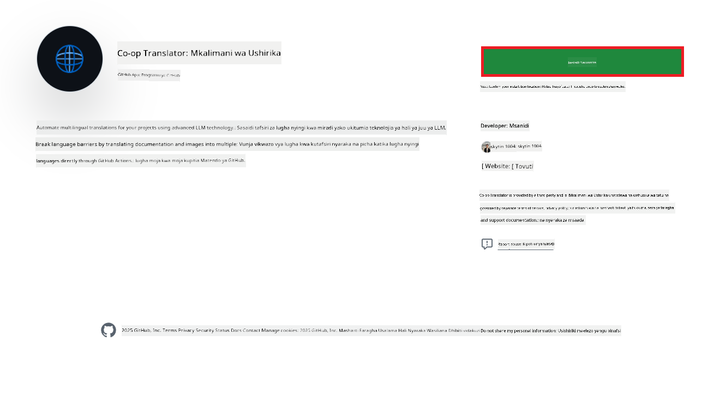
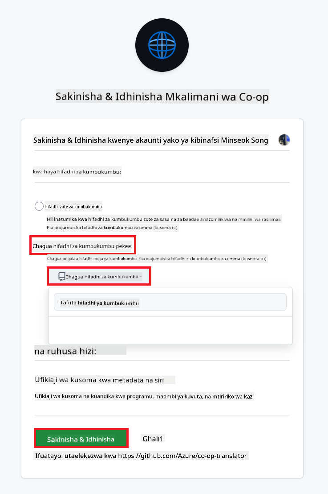
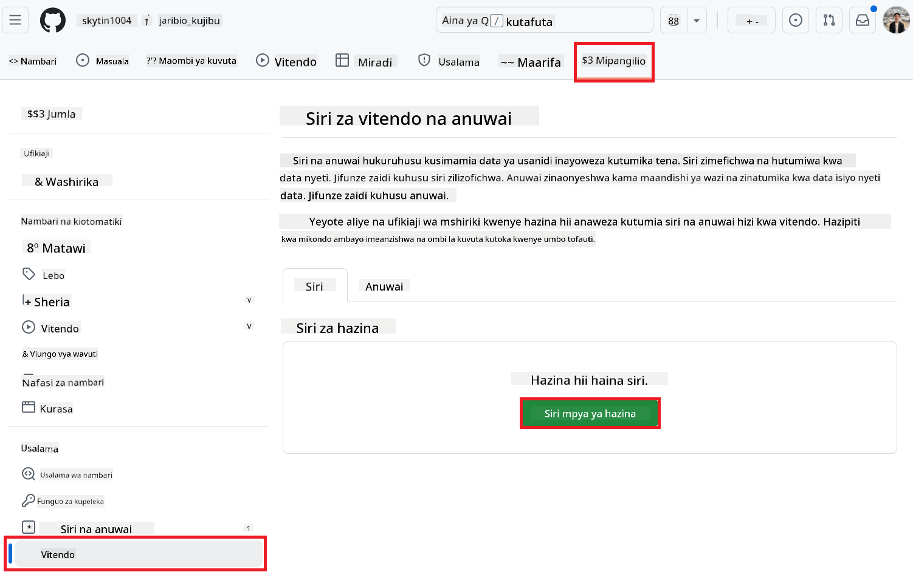
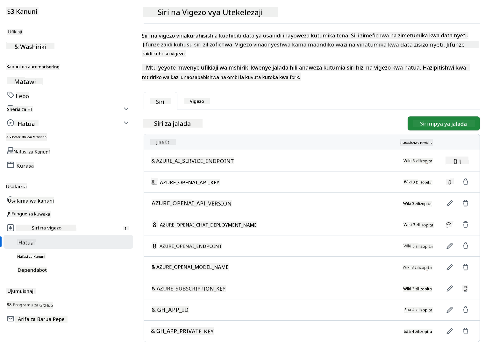

<!--
CO_OP_TRANSLATOR_METADATA:
{
  "original_hash": "c437820027c197f25fb2cbee95bae28c",
  "translation_date": "2025-06-12T19:15:22+00:00",
  "source_file": "getting_started/github-actions-guide/github-actions-guide-org.md",
  "language_code": "sw"
}
-->
# Kutumia Co-op Translator GitHub Action (Mwongozo wa Shirika)

**Watazamaji Wanaolengwa:** Mwongozo huu umeandaliwa kwa ajili ya **watumiaji wa ndani wa Microsoft** au **ma timu zilizo na ruhusa zinazohitajika kwa ajili ya Co-op Translator GitHub App iliyojengwa tayari** au wanaoweza kuunda GitHub App zao za kibinafsi.

Punguza kazi za kutafsiri nyaraka za ghala lako kwa urahisi kwa kutumia Co-op Translator GitHub Action. Mwongozo huu unakuongoza jinsi ya kusanidi action hii ili kuunda ombi la pull request moja kwa moja lenye tafsiri zilizosasishwa kila wakati faili zako za chanzo za Markdown au picha zinapobadilika.

> [!IMPORTANT]
> 
> **Kuchagua Mwongozo Sahihi:**
>
> Mwongozo huu unaelezea usanidi ukitumia **GitHub App ID na Private Key**. Kwa kawaida unahitaji njia hii ya "Mwongozo wa Shirika" ikiwa: **`GITHUB_TOKEN` Ruhusa Zimezuiliwa:** Mipangilio ya shirika lako au ghala inazuia ruhusa za kawaida zinazotolewa kwa `GITHUB_TOKEN`. Hasa, kama `GITHUB_TOKEN` hauruhusiwi ruhusa muhimu za `write` (kama `contents: write` au `pull-requests: write`), mchakato katika [Mwongozo wa Usanidi wa Umma](./github-actions-guide-public.md) utafaulu kwa sababu ya ukosefu wa ruhusa. Kutumia GitHub App maalum yenye ruhusa zilizo wazi kunazuia tatizo hili.
>
> **Kama hali hapo juu haikuendani na wewe:**
>
> Ikiwa `GITHUB_TOKEN` ya kawaida ina ruhusa za kutosha kwenye ghala lako (yaani, huzuiawi na vizuizi vya shirika), tafadhali tumia **[Mwongozo wa Umma wa Usanidi ukitumia GITHUB_TOKEN](./github-actions-guide-public.md)**. Mwongozo wa umma hauhitaji kupata au kusimamia App IDs au Private Keys na unategemea tu ruhusa za kawaida za `GITHUB_TOKEN` na za ghala.

## Mahitaji ya Awali

Kabla ya kusanidi GitHub Action, hakikisha una nyaraka za huduma za AI zinazohitajika tayari.

**1. Inahitajika: Nyaraka za Mfano wa Lugha wa AI**  
Unahitaji nyaraka za angalau Mfano mmoja wa Lugha unaounga mkono:

- **Azure OpenAI**: Inahitaji Endpoint, API Key, Majina ya Mfano/Ambapo umeweka, Toleo la API.  
- **OpenAI**: Inahitaji API Key, (Hiari: Org ID, Base URL, Model ID).  
- Angalia [Mifano na Huduma Zinazoungwa Mkono](../../../../README.md) kwa maelezo zaidi.  
- Mwongozo wa Usanidi: [Sanidi Azure OpenAI](../set-up-resources/set-up-azure-openai.md).

**2. Hiari: Nyaraka za Computer Vision (kwa Tafsiri ya Picha)**

- Zinahitajika tu ikiwa unahitaji kutafsiri maandishi ndani ya picha.  
- **Azure Computer Vision**: Inahitaji Endpoint na Subscription Key.  
- Ikiwa hazijatolewa, action itatumia [hali ya Markdown tu](../markdown-only-mode.md).  
- Mwongozo wa Usanidi: [Sanidi Azure Computer Vision](../set-up-resources/set-up-azure-computer-vision.md).

## Usanidi na Mpangilio

Fuata hatua hizi kusanidi Co-op Translator GitHub Action kwenye ghala lako:

### Hatua ya 1: Sakinisha na Sanidi Uthibitishaji wa GitHub App

Mchakato hutumia uthibitishaji wa GitHub App kuwasiliana kwa usalama na ghala lako (kwa mfano, kuunda ombi la pull request) kwa niaba yako. Chagua mojawapo ya chaguzi:

#### **Chaguo A: Sakinisha Co-op Translator GitHub App Iliyojengwa Tayari (kwa Matumizi ya Ndani ya Microsoft)**

1. Tembelea ukurasa wa [Co-op Translator GitHub App](https://github.com/apps/co-op-translator).

1. Chagua **Install** na chagua akaunti au shirika ambalo ghala lako lengwa liko.

    

1. Chagua **Only select repositories** kisha chagua ghala lako lengwa (mfano, `PhiCookBook`). Bonyeza **Install**. Huenda ukaombwa kuthibitisha.

    

1. **Pata Nyaraka za App (Mchakato wa Ndani Unahitajika):** Ili kuruhusu mchakato kuthibitisha kama app, unahitaji taarifa mbili zinazotolewa na timu ya Co-op Translator:  
  - **App ID:** Kitambulisho cha kipekee cha Co-op Translator app. App ID ni: `1164076`.  
  - **Private Key:** Lazima upate **maudhui yote** ya faili la private key `.pem` kutoka kwa msimamizi. **Hifadhi ufunguo huu kama nywila na uhakikishe usalama wake.**

1. Endelea na Hatua ya 2.

#### **Chaguo B: Tumia GitHub App Yako ya Kibinafsi**

- Ikiwa unataka, unaweza kuunda na kusanidi GitHub App yako mwenyewe. Hakikisha ina ruhusa za Kusoma na Kuandika kwenye Maudhui na Pull Requests. Utahitaji App ID na Private Key iliyotengenezwa.

### Hatua ya 2: Sanidi Siri za Ghali

Unahitaji kuongeza nyaraka za GitHub App na nyaraka zako za huduma za AI kama siri zilizofichwa kwenye mipangilio ya ghala lako.

1. Nenda kwenye ghala lako lengwa la GitHub (mfano, `PhiCookBook`).

1. Nenda **Settings** > **Secrets and variables** > **Actions**.

1. Chini ya **Repository secrets**, bonyeza **New repository secret** kwa kila siri iliyoorodheshwa hapa chini.

   

**Siri Zinazohitajika (kwa Uthibitishaji wa GitHub App):**

| Jina la Siri          | Maelezo                                      | Chanzo cha Thamani                               |
| :------------------- | :------------------------------------------- | :----------------------------------------------- |
| `GH_APP_ID`          | App ID ya GitHub App (kutoka Hatua ya 1).    | Mipangilio ya GitHub App                         |
| `GH_APP_PRIVATE_KEY` | **Maudhui yote** ya faili la `.pem` lililopakuliwa. | Faili la `.pem` (kutoka Hatua ya 1) |

**Siri za Huduma za AI (Ongeza ZOTE zinazotumika kulingana na Mahitaji yako):**

| Jina la Siri                         | Maelezo                               | Chanzo cha Thamani               |
| :---------------------------------- | :----------------------------------- | :------------------------------- |
| `AZURE_SUBSCRIPTION_KEY`            | Key kwa Azure AI Service (Computer Vision)  | Azure AI Foundry                |
| `AZURE_AI_SERVICE_ENDPOINT`         | Endpoint kwa Azure AI Service (Computer Vision) | Azure AI Foundry                |
| `AZURE_OPENAI_API_KEY`              | Key kwa huduma ya Azure OpenAI              | Azure AI Foundry                |
| `AZURE_OPENAI_ENDPOINT`             | Endpoint kwa huduma ya Azure OpenAI         | Azure AI Foundry                |
| `AZURE_OPENAI_MODEL_NAME`           | Jina la Mfano wako wa Azure OpenAI          | Azure AI Foundry                |
| `AZURE_OPENAI_CHAT_DEPLOYMENT_NAME` | Jina la Utekelezaji wako wa Azure OpenAI         | Azure AI Foundry                |
| `AZURE_OPENAI_API_VERSION`          | Toleo la API kwa Azure OpenAI              | Azure AI Foundry                |
| `OPENAI_API_KEY`                    | API Key kwa OpenAI                        | OpenAI Platform                |
| `OPENAI_ORG_ID`                     | OpenAI Organization ID                    | OpenAI Platform                |
| `OPENAI_CHAT_MODEL_ID`              | ID maalum ya mfano wa OpenAI                  | OpenAI Platform                |
| `OPENAI_BASE_URL`                   | Custom OpenAI API Base URL                | OpenAI Platform                |



### Hatua ya 3: Unda Faili la Mchakato wa Kazi

Mwishowe, unda faili la YAML linaloelezea mchakato wa kazi otomatiki.

1. Katika saraka kuu ya ghala lako, unda saraka `.github/workflows/` ikiwa haipo.

1. Ndani ya `.github/workflows/`, unda faili lenye jina `co-op-translator.yml`.

1. Bandika maudhui yafuatayo kwenye co-op-translator.yml.

```
name: Co-op Translator

on:
  push:
    branches:
      - main

jobs:
  co-op-translator:
    runs-on: ubuntu-latest

    permissions:
      contents: write
      pull-requests: write

    steps:
      - name: Checkout repository
        uses: actions/checkout@v4
        with:
          fetch-depth: 0

      - name: Set up Python
        uses: actions/setup-python@v4
        with:
          python-version: '3.10'

      - name: Install Co-op Translator
        run: |
          python -m pip install --upgrade pip
          pip install co-op-translator

      - name: Run Co-op Translator
        env:
          PYTHONIOENCODING: utf-8
          # Azure AI Service Credentials
          AZURE_SUBSCRIPTION_KEY: ${{ secrets.AZURE_SUBSCRIPTION_KEY }}
          AZURE_AI_SERVICE_ENDPOINT: ${{ secrets.AZURE_AI_SERVICE_ENDPOINT }}

          # Azure OpenAI Credentials
          AZURE_OPENAI_API_KEY: ${{ secrets.AZURE_OPENAI_API_KEY }}
          AZURE_OPENAI_ENDPOINT: ${{ secrets.AZURE_OPENAI_ENDPOINT }}
          AZURE_OPENAI_MODEL_NAME: ${{ secrets.AZURE_OPENAI_MODEL_NAME }}
          AZURE_OPENAI_CHAT_DEPLOYMENT_NAME: ${{ secrets.AZURE_OPENAI_CHAT_DEPLOYMENT_NAME }}
          AZURE_OPENAI_API_VERSION: ${{ secrets.AZURE_OPENAI_API_VERSION }}

          # OpenAI Credentials
          OPENAI_API_KEY: ${{ secrets.OPENAI_API_KEY }}
          OPENAI_ORG_ID: ${{ secrets.OPENAI_ORG_ID }}
          OPENAI_CHAT_MODEL_ID: ${{ secrets.OPENAI_CHAT_MODEL_ID }}
          OPENAI_BASE_URL: ${{ secrets.OPENAI_BASE_URL }}
        run: |
          # =====================================================================
          # IMPORTANT: Set your target languages here (REQUIRED CONFIGURATION)
          # =====================================================================
          # Example: Translate to Spanish, French, German. Add -y to auto-confirm.
          translate -l "es fr de" -y  # <--- MODIFY THIS LINE with your desired languages

      - name: Authenticate GitHub App
        id: generate_token
        uses: tibdex/github-app-token@v1
        with:
          app_id: ${{ secrets.GH_APP_ID }}
          private_key: ${{ secrets.GH_APP_PRIVATE_KEY }}

      - name: Create Pull Request with translations
        uses: peter-evans/create-pull-request@v5
        with:
          token: ${{ steps.generate_token.outputs.token }}
          commit-message: "🌐 Update translations via Co-op Translator"
          title: "🌐 Update translations via Co-op Translator"
          body: |
            This PR updates translations for recent changes to the main branch.

            ### 📋 Changes included
            - Translated contents are available in the `translations/` directory
            - Translated images are available in the `translated_images/` directory

            ---
            🌐 Automatically generated by the [Co-op Translator](https://github.com/Azure/co-op-translator) GitHub Action.
          branch: update-translations
          base: main
          labels: translation, automated-pr
          delete-branch: true
          add-paths: |
            translations/
            translated_images/

```

4.  **Binafsisha Mchakato wa Kazi:**  
  - **[!IMPORTANT] Lugha Zinazolengwa:** Katika `Run Co-op Translator` step, you **MUST review and modify the list of language codes** within the `translate -l "..." -y` command to match your project's requirements. The example list (`ar de es...`) needs to be replaced or adjusted.
  - **Trigger (`on:`):** The current trigger runs on every push to `main`. For large repositories, consider adding a `paths:` filter (see commented example in the YAML) to run the workflow only when relevant files (e.g., source documentation) change, saving runner minutes.
  - **PR Details:** Customize the `commit-message`, `title`, `body`, `branch` name, and `labels` in the `Create Pull Request` step if needed.

## Credential Management and Renewal

- **Security:** Always store sensitive credentials (API keys, private keys) as GitHub Actions secrets. Never expose them in your workflow file or repository code.
- **[!IMPORTANT] Key Renewal (Internal Microsoft Users):** Be aware that Azure OpenAI key used within Microsoft might have a mandatory renewal policy (e.g., every 5 months). Ensure you update the corresponding GitHub secrets (`AZURE_OPENAI_...` funguo) **kabla hazijamalizika** ili kuzuia kushindwa kwa mchakato.

## Kuendesha Mchakato wa Kazi

Mara faili `co-op-translator.yml` itakapojumuishwa kwenye tawi lako kuu (au tawi lililotajwa kwenye kichujio cha `on:` trigger), the workflow will automatically run whenever changes are pushed to that branch (and match the `paths`, ikiwa imesanidiwa).

Ikiwa tafsiri zimeundwa au kusasishwa, action itaunda Pull Request moja kwa moja yenye mabadiliko hayo, tayari kwa uhakiki na kuunganishwa kwako.

**Tangazo la Kukanusha**:  
Hati hii imetafsiriwa kwa kutumia huduma ya tafsiri ya AI [Co-op Translator](https://github.com/Azure/co-op-translator). Ingawa tunajitahidi kuhakikisha usahihi, tafadhali fahamu kwamba tafsiri za kiotomatiki zinaweza kuwa na makosa au upungufu wa usahihi. Hati ya awali katika lugha yake ya asili inapaswa kuchukuliwa kama chanzo cha mamlaka. Kwa taarifa muhimu, tafsiri ya kitaalamu inayofanywa na binadamu inashauriwa. Hatubeba dhamana kwa kutoelewana au tafsiri potofu zinazotokana na matumizi ya tafsiri hii.