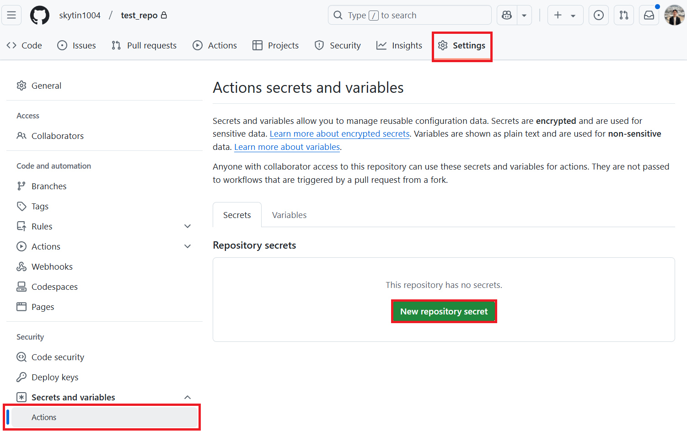

<!--
CO_OP_TRANSLATOR_METADATA:
{
  "original_hash": "9fac847815936ef6e6c8bfde6d191571",
  "translation_date": "2025-10-15T03:46:40+00:00",
  "source_file": "getting_started/github-actions-guide/github-actions-guide-org.md",
  "language_code": "sw"
}
-->
# Kutumia Co-op Translator GitHub Action (Mwongozo wa Shirika)

**Walengwa:** Mwongozo huu umeandaliwa kwa ajili ya **watumiaji wa ndani wa Microsoft** au **timu zilizo na ufikiaji wa hati muhimu za Co-op Translator GitHub App iliyojengwa tayari** au wanaoweza kuunda GitHub App yao wenyewe.

Fanya mchakato wa kutafsiri nyaraka za repo yako kuwa rahisi kwa kutumia Co-op Translator GitHub Action. Mwongozo huu utakuelekeza jinsi ya kuweka action hii ili iunde pull request moja kwa moja kila mara faili zako za chanzo za Markdown au picha zinapobadilika.

> [!IMPORTANT]
> 
> **Kuchagua Mwongozo Sahihi:**
>
> Mwongozo huu unaelezea jinsi ya kuweka kwa kutumia **GitHub App ID na Private Key**. Kawaida unahitaji njia hii ya "Mwongozo wa Shirika" ikiwa: **`GITHUB_TOKEN` Ruhusa Zimezuiliwa:** Mipangilio ya shirika au repo yako inazuia ruhusa za chaguo-msingi zinazotolewa kwa `GITHUB_TOKEN` ya kawaida. Hasa, kama `GITHUB_TOKEN` hairuhusiwi ruhusa za `write` zinazohitajika (kama `contents: write` au `pull-requests: write`), workflow kwenye [Mwongozo wa Umma](./github-actions-guide-public.md) itashindwa kutokana na ukosefu wa ruhusa. Kutumia GitHub App maalum yenye ruhusa zilizotolewa wazi kunazunguka kizuizi hiki.
>
> **Ikiwa haya hayakuhusu wewe:**
>
> Kama `GITHUB_TOKEN` ya kawaida ina ruhusa za kutosha kwenye repo yako (yaani, hujazuiliwa na sera za shirika), tafadhali tumia **[Mwongozo wa Umma unaotumia GITHUB_TOKEN](./github-actions-guide-public.md)**. Mwongozo wa umma hauhitaji kupata au kusimamia App ID au Private Key na unategemea tu `GITHUB_TOKEN` ya kawaida na ruhusa za repo.

## Mahitaji ya Awali

Kabla ya kuweka GitHub Action, hakikisha una hati muhimu za huduma ya AI.

**1. Inahitajika: Hati za AI Language Model**
Unahitaji hati za angalau Modeli moja inayoungwa mkono:

- **Azure OpenAI**: Inahitaji Endpoint, API Key, Majina ya Model/Deployment, API Version.
- **OpenAI**: Inahitaji API Key, (Hiari: Org ID, Base URL, Model ID).
- Tazama [Modeli na Huduma Zinazoungwa mkono](../../../../README.md) kwa maelezo zaidi.
- Mwongozo wa Kuweka: [Weka Azure OpenAI](../set-up-resources/set-up-azure-openai.md).

**2. Hiari: Hati za Computer Vision (kwa Tafsiri ya Picha)**

- Inahitajika tu kama unahitaji kutafsiri maandishi ndani ya picha.
- **Azure Computer Vision**: Inahitaji Endpoint na Subscription Key.
- Kama hazijatolewa, action itatumia [Markdown-only mode](../markdown-only-mode.md) kwa chaguo-msingi.
- Mwongozo wa Kuweka: [Weka Azure Computer Vision](../set-up-resources/set-up-azure-computer-vision.md).

## Uwekaji na Usanidi

Fuata hatua hizi ili kusanidi Co-op Translator GitHub Action kwenye repo yako:

### Hatua ya 1: Sakinisha na Sanidi GitHub App Authentication

Workflow inatumia GitHub App authentication ili kuwasiliana na repo yako kwa usalama (mfano, kuunda pull request) kwa niaba yako. Chagua moja kati ya hizi:

#### **Chaguo A: Sakinisha Co-op Translator GitHub App iliyojengwa tayari (kwa Matumizi ya Ndani ya Microsoft)**

1. Tembelea ukurasa wa [Co-op Translator GitHub App](https://github.com/apps/co-op-translator).

1. Chagua **Install** na chagua akaunti au shirika ambako repo yako inalenga ipo.

    

1. Chagua **Only select repositories** na chagua repo yako unayotaka (mfano, `PhiCookBook`). Bonyeza **Install**. Unaweza kuombwa kuthibitisha.

    

1. **Pata Hati za App (Inahitaji Utaratibu wa Ndani):** Ili kuruhusu workflow kuthibitisha kama app, unahitaji vitu viwili kutoka kwa timu ya Co-op Translator:
  - **App ID:** Kitambulisho cha kipekee cha Co-op Translator app. App ID ni: `1164076`.
  - **Private Key:** Lazima upate **maudhui yote** ya faili ya `.pem` private key kutoka kwa mhusika wa matengenezo. **Ihifadhi key hii kama nenosiri na uiweke salama.**

1. Endelea na Hatua ya 2.

#### **Chaguo B: Tumia GitHub App Yako Mwenyewe**

- Kama unapendelea, unaweza kuunda na kusanidi GitHub App yako mwenyewe. Hakikisha ina Read & write access kwa Contents na Pull requests. Utahitaji App ID yake na Private Key iliyotengenezwa.

### Hatua ya 2: Sanidi Repository Secrets

Unahitaji kuongeza hati za GitHub App na hati za huduma ya AI kama secrets zilizofichwa kwenye mipangilio ya repo yako.

1. Tembelea repo yako unayotaka GitHub (mfano, `PhiCookBook`).

1. Nenda kwenye **Settings** > **Secrets and variables** > **Actions**.

1. Chini ya **Repository secrets**, bonyeza **New repository secret** kwa kila secret iliyo kwenye orodha hapa chini.

   

**Secrets Zinazohitajika (kwa GitHub App Authentication):**

| Jina la Secret        | Maelezo                                         | Chanzo cha Thamani                          |
| :------------------- | :----------------------------------------------- | :------------------------------------------ |
| `GH_APP_ID`          | App ID ya GitHub App (kutoka Hatua ya 1).        | GitHub App Settings                         |
| `GH_APP_PRIVATE_KEY` | **Maudhui yote** ya faili ya `.pem` iliyopakuliwa. | Faili ya `.pem` (kutoka Hatua ya 1)         |

**Secrets za Huduma ya AI (Ongeza ZOTE zinazohusika kulingana na Mahitaji yako):**

| Jina la Secret                      | Maelezo                                 | Chanzo cha Thamani                |
| :---------------------------------- | :-------------------------------------- | :------------------------------- |
| `AZURE_AI_SERVICE_API_KEY`            | Key ya Azure AI Service (Computer Vision)  | Azure AI Foundry                    |
| `AZURE_AI_SERVICE_ENDPOINT`         | Endpoint ya Azure AI Service (Computer Vision) | Azure AI Foundry                     |
| `AZURE_OPENAI_API_KEY`              | Key ya huduma ya Azure OpenAI           | Azure AI Foundry                     |
| `AZURE_OPENAI_ENDPOINT`             | Endpoint ya huduma ya Azure OpenAI      | Azure AI Foundry                     |
| `AZURE_OPENAI_MODEL_NAME`           | Jina la Modeli ya Azure OpenAI          | Azure AI Foundry                     |
| `AZURE_OPENAI_CHAT_DEPLOYMENT_NAME` | Jina la Deployment ya Azure OpenAI      | Azure AI Foundry                     |
| `AZURE_OPENAI_API_VERSION`          | API Version ya Azure OpenAI             | Azure AI Foundry                     |
| `OPENAI_API_KEY`                    | API Key ya OpenAI                       | OpenAI Platform                  |
| `OPENAI_ORG_ID`                     | OpenAI Organization ID                  | OpenAI Platform                  |
| `OPENAI_CHAT_MODEL_ID`              | Model ID maalum wa OpenAI               | OpenAI Platform                    |
| `OPENAI_BASE_URL`                   | Custom OpenAI API Base URL              | OpenAI Platform                    |


### Hatua ya 3: Tengeneza Faili ya Workflow

Hatimaye, tengeneza faili ya YAML inayofafanua workflow ya kiotomatiki.

1. Kwenye root directory ya repo yako, tengeneza `.github/workflows/` kama haipo.

1. Ndani ya `.github/workflows/`, tengeneza faili iitwayo `co-op-translator.yml`.

1. Bandika maudhui yafuatayo kwenye co-op-translator.yml.

```
name: Co-op Translator

on:
  push:
    branches:
      - main

jobs:
  co-op-translator:
    runs-on: ubuntu-latest

    permissions:
      contents: write
      pull-requests: write

    steps:
      - name: Checkout repository
        uses: actions/checkout@v4
        with:
          fetch-depth: 0

      - name: Set up Python
        uses: actions/setup-python@v4
        with:
          python-version: '3.10'

      - name: Install Co-op Translator
        run: |
          python -m pip install --upgrade pip
          pip install co-op-translator

      - name: Run Co-op Translator
        env:
          PYTHONIOENCODING: utf-8
          # Azure AI Service Credentials
          AZURE_AI_SERVICE_API_KEY: ${{ secrets.AZURE_AI_SERVICE_API_KEY }}
          AZURE_AI_SERVICE_ENDPOINT: ${{ secrets.AZURE_AI_SERVICE_ENDPOINT }}

          # Azure OpenAI Credentials
          AZURE_OPENAI_API_KEY: ${{ secrets.AZURE_OPENAI_API_KEY }}
          AZURE_OPENAI_ENDPOINT: ${{ secrets.AZURE_OPENAI_ENDPOINT }}
          AZURE_OPENAI_MODEL_NAME: ${{ secrets.AZURE_OPENAI_MODEL_NAME }}
          AZURE_OPENAI_CHAT_DEPLOYMENT_NAME: ${{ secrets.AZURE_OPENAI_CHAT_DEPLOYMENT_NAME }}
          AZURE_OPENAI_API_VERSION: ${{ secrets.AZURE_OPENAI_API_VERSION }}

          # OpenAI Credentials
          OPENAI_API_KEY: ${{ secrets.OPENAI_API_KEY }}
          OPENAI_ORG_ID: ${{ secrets.OPENAI_ORG_ID }}
          OPENAI_CHAT_MODEL_ID: ${{ secrets.OPENAI_CHAT_MODEL_ID }}
          OPENAI_BASE_URL: ${{ secrets.OPENAI_BASE_URL }}
        run: |
          # =====================================================================
          # IMPORTANT: Set your target languages here (REQUIRED CONFIGURATION)
          # =====================================================================
          # Example: Translate to Spanish, French, German. Add -y to auto-confirm.
          translate -l "es fr de" -y  # <--- MODIFY THIS LINE with your desired languages

      - name: Authenticate GitHub App
        id: generate_token
        uses: tibdex/github-app-token@v1
        with:
          app_id: ${{ secrets.GH_APP_ID }}
          private_key: ${{ secrets.GH_APP_PRIVATE_KEY }}

      - name: Create Pull Request with translations
        uses: peter-evans/create-pull-request@v5
        with:
          token: ${{ steps.generate_token.outputs.token }}
          commit-message: "🌐 Update translations via Co-op Translator"
          title: "🌐 Update translations via Co-op Translator"
          body: |
            This PR updates translations for recent changes to the main branch.

            ### 📋 Changes included
            - Translated contents are available in the `translations/` directory
            - Translated images are available in the `translated_images/` directory

            ---
            🌐 Automatically generated by the [Co-op Translator](https://github.com/Azure/co-op-translator) GitHub Action.
          branch: update-translations
          base: main
          labels: translation, automated-pr
          delete-branch: true
          add-paths: |
            translations/
            translated_images/

```

4.  **Badilisha Workflow:**
  - **[!IMPORTANT] Lugha Lengwa:** Kwenye hatua ya `Run Co-op Translator`, **LAZIMA upitie na kubadilisha orodha ya codes za lugha** ndani ya amri `translate -l "..." -y` ili ziendane na mahitaji ya mradi wako. Orodha ya mfano (`ar de es...`) inahitaji kubadilishwa au kurekebishwa.
  - **Trigger (`on:`):** Trigger ya sasa inaendesha kila push kwenye `main`. Kwa repo kubwa, fikiria kuongeza filter ya `paths:` (tazama mfano ulio-comment kwenye YAML) ili workflow iendeshe tu wakati faili husika (mfano, nyaraka za chanzo) zinabadilika, hivyo kuokoa muda wa runner.
  - **Maelezo ya PR:** Badilisha `commit-message`, `title`, `body`, jina la `branch`, na `labels` kwenye hatua ya `Create Pull Request` kama inahitajika.

## Usimamizi wa Hati na Upyaishaji

- **Usalama:** Weka hati nyeti (API keys, private keys) kama GitHub Actions secrets. Usiziweke wazi kwenye faili ya workflow au kwenye code ya repo.
- **[!IMPORTANT] Upyaishaji wa Key (Watumiaji wa Ndani wa Microsoft):** Fahamu kuwa key ya Azure OpenAI inayotumika ndani ya Microsoft inaweza kuwa na sera ya lazima ya upyaishaji (mfano, kila miezi 5). Hakikisha unafanya upya secrets za GitHub zinazohusika (`AZURE_OPENAI_...` keys) **kabla hazijaisha muda** ili kuepuka kushindwa kwa workflow.

## Kuendesha Workflow

> [!WARNING]  
> **Muda wa Juu wa GitHub-hosted Runner:**  
> Runners wa GitHub-hosted kama `ubuntu-latest` wana **muda wa juu wa utekelezaji wa masaa 6**.  
> Kwa repo kubwa za nyaraka, kama mchakato wa tafsiri utazidi masaa 6, workflow itakatizwa moja kwa moja.  
> Ili kuepuka hili, fikiria:  
> - Kutumia **self-hosted runner** (hakuna kikomo cha muda)  
> - Kupunguza idadi ya lugha lengwa kwa kila mzunguko

Mara faili ya `co-op-translator.yml` inapounganishwa kwenye main branch yako (au branch iliyobainishwa kwenye trigger ya `on:`), workflow itaendeshwa moja kwa moja kila mabadiliko yanaposukumwa kwenye branch hiyo (na yanalingana na filter ya `paths` kama imewekwa).

Kama tafsiri zimezalishwa au kusasishwa, action itaunda Pull Request moja kwa moja yenye mabadiliko hayo, tayari kwa ukaguzi na kuunganisha.

---

**Kanusho**:
Hati hii imetafsiriwa kwa kutumia huduma ya kutafsiri ya AI [Co-op Translator](https://github.com/Azure/co-op-translator). Ingawa tunajitahidi kuhakikisha usahihi, tafadhali fahamu kwamba tafsiri za kiotomatiki zinaweza kuwa na makosa au kutokuwa sahihi. Hati asili katika lugha yake ya asili inapaswa kuchukuliwa kama chanzo cha mamlaka. Kwa taarifa muhimu, inashauriwa kutumia huduma ya utafsiri wa binadamu wa kitaalamu. Hatutawajibika kwa kutoelewana au tafsiri zisizo sahihi zitakazotokana na matumizi ya tafsiri hii.