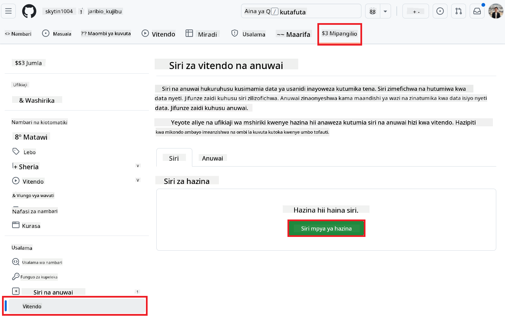

<!--
CO_OP_TRANSLATOR_METADATA:
{
  "original_hash": "a52587a512e667f70d92db853d3c61d5",
  "translation_date": "2025-06-12T19:33:09+00:00",
  "source_file": "getting_started/github-actions-guide/github-actions-guide-public.md",
  "language_code": "sw"
}
-->
# Kutumia Co-op Translator GitHub Action (Mipangilio ya Umma)

**Watazamaji Waliolengwa:** Mwongozo huu umetengenezwa kwa watumiaji katika hifadhidata nyingi za umma au binafsi ambapo ruhusa za kawaida za GitHub Actions zinatosha. Inatumia `GITHUB_TOKEN` iliyojengwa ndani.

Fanikisha tafsiri ya nyaraka za hifadhidata yako kwa urahisi kwa kutumia Co-op Translator GitHub Action. Mwongozo huu utakuelekeza jinsi ya kusanidi action hii ili kuunda maombi ya kuvuta (pull requests) yenye tafsiri zilizosasishwa kila wakati faili zako za chanzo za Markdown au picha zinapobadilika.

> [!IMPORTANT]
>
> **Kuchagua Mwongozo Sahihi:**
>
> Mwongozo huu unaelezea **usanidi rahisi zaidi ukitumia `GITHUB_TOKEN` ya kawaida**. Huu ndio njia inayopendekezwa kwa watumiaji wengi kwani haitaji kusimamia Funguo Binafsi za GitHub App zinazohitaji usiri.
>

## Mahitaji Kabla ya Kuanzisha

Kabla ya kusanidi GitHub Action, hakikisha una nyaraka muhimu za huduma za AI tayari.

**1. Inahitajika: Nyaraka za Mfano wa Lugha wa AI**  
Unahitaji nyaraka za angalau Mfano mmoja wa Lugha unaounga mkono:

- **Azure OpenAI**: Inahitaji Endpoint, API Key, Majina ya Modeli/Adeployimenti, Toleo la API.  
- **OpenAI**: Inahitaji API Key, (Hiari: Org ID, Base URL, Model ID).  
- Angalia [Supported Models and Services](../../../../README.md) kwa maelezo zaidi.

**2. Hiari: Nyaraka za AI Vision (kwa Tafsiri ya Picha)**

- Inahitajika tu ikiwa unahitaji kutafsiri maandishi yaliyomo kwenye picha.  
- **Azure AI Vision**: Inahitaji Endpoint na Subscription Key.  
- Ikiwa haitatolewa, action itatumia [Markdown-only mode](../markdown-only-mode.md) kama chaguo-msingi.

## Usanidi na Mpangilio

Fuata hatua hizi kusanidi Co-op Translator GitHub Action katika hifadhidata yako ukitumia `GITHUB_TOKEN` ya kawaida.

### Hatua ya 1: Elewa Uthibitishaji (Kutumia `GITHUB_TOKEN`)

Mtiririko huu wa kazi unatumia `GITHUB_TOKEN` iliyojengwa ndani inayotolewa na GitHub Actions. Tokeni hii hutoa ruhusa moja kwa moja kwa mtiririko huu wa kazi kuingiliana na hifadhidata yako kulingana na mipangilio iliyowekwa katika **Hatua ya 3**.

### Hatua ya 2: Sanidi Siri za Hifadhidata

Unahitaji tu kuongeza **nyaraka zako za huduma za AI** kama siri zilizofichwa katika mipangilio ya hifadhidata yako.

1.  Nenda kwenye hifadhidata yako ya GitHub inayolengwa.  
2.  Nenda **Settings** > **Secrets and variables** > **Actions**.  
3.  Chini ya **Repository secrets**, bonyeza **New repository secret** kwa kila siri ya huduma ya AI inayohitajika kama ilivyoorodheshwa hapa chini.

     *(Marejeleo ya Picha: Inaonyesha mahali pa kuongeza siri)*

**Siri Muhimu za Huduma za AI (Ongeza ZOTE zinazohusika kulingana na Mahitaji yako):**

| Jina la Siri                      | Maelezo                                | Chanzo cha Thamani               |
| :-------------------------------- | :------------------------------------- | :------------------------------ |
| `AZURE_SUBSCRIPTION_KEY`            | Funguo la Azure AI Service (Computer Vision)  | Azure AI Foundry yako             |
| `AZURE_AI_SERVICE_ENDPOINT`         | Endpoint ya Azure AI Service (Computer Vision) | Azure AI Foundry yako             |
| `AZURE_OPENAI_API_KEY`              | Funguo la huduma ya Azure OpenAI              | Azure AI Foundry yako             |
| `AZURE_OPENAI_ENDPOINT`             | Endpoint ya huduma ya Azure OpenAI         | Azure AI Foundry yako             |
| `AZURE_OPENAI_MODEL_NAME`           | Jina la Mfano wa Azure OpenAI              | Azure AI Foundry yako             |
| `AZURE_OPENAI_CHAT_DEPLOYMENT_NAME` | Jina la Adeployimenti ya Azure OpenAI         | Azure AI Foundry yako             |
| `AZURE_OPENAI_API_VERSION`          | Toleo la API la Azure OpenAI              | Azure AI Foundry yako             |
| `OPENAI_API_KEY`                    | API Key ya OpenAI                        | Jukwaa lako la OpenAI            |
| `OPENAI_ORG_ID`                     | OpenAI Organization ID (Hiari)         | Jukwaa lako la OpenAI            |
| `OPENAI_CHAT_MODEL_ID`              | ID maalum ya mfano wa OpenAI (Hiari)       | Jukwaa lako la OpenAI            |
| `OPENAI_BASE_URL`                   | URL ya Msingi wa API ya OpenAI (Hiari)     | Jukwaa lako la OpenAI            |

### Hatua ya 3: Sanidi Ruhusa za Mtiririko wa Kazi

GitHub Action inahitaji ruhusa zinazotolewa kupitia `GITHUB_TOKEN` ili kutolewa msimbo na kuunda maombi ya kuvuta.

1.  Katika hifadhidata yako, nenda **Settings** > **Actions** > **General**.  
2.  Pitia chini hadi sehemu ya **Workflow permissions**.  
3.  Chagua **Read and write permissions**. Hii inampa `GITHUB_TOKEN` ruhusa za `contents: write` na `pull-requests: write` zinazohitajika kwa mtiririko huu wa kazi.  
4.  Hakikisha kisanduku cha **Allow GitHub Actions to create and approve pull requests** kimechaguliwa.  
5.  Chagua **Save**.


### Hatua ya 4: Unda Faili la Mtiririko wa Kazi

Mwisho, unda faili la YAML linaloelezea mtiririko wa kazi wa kiotomatiki ukitumia `GITHUB_TOKEN`.

1.  Katika saraka kuu ya hifadhidata yako, unda saraka ya `.github/workflows/` ikiwa haipo.  
2.  Ndani ya `.github/workflows/`, unda faili liitwalo `co-op-translator.yml`.  
3.  Bandika maudhui yafuatayo ndani ya `co-op-translator.yml`.

```yaml
name: Co-op Translator

on:
  push:
    branches:
      - main

jobs:
  co-op-translator:
    runs-on: ubuntu-latest

    permissions:
      contents: write
      pull-requests: write

    steps:
      - name: Checkout repository
        uses: actions/checkout@v4
        with:
          fetch-depth: 0

      - name: Set up Python
        uses: actions/setup-python@v4
        with:
          python-version: '3.10'

      - name: Install Co-op Translator
        run: |
          python -m pip install --upgrade pip
          pip install co-op-translator

      - name: Run Co-op Translator
        env:
          PYTHONIOENCODING: utf-8
          # === AI Service Credentials ===
          AZURE_SUBSCRIPTION_KEY: ${{ secrets.AZURE_SUBSCRIPTION_KEY }}
          AZURE_AI_SERVICE_ENDPOINT: ${{ secrets.AZURE_AI_SERVICE_ENDPOINT }}
          AZURE_OPENAI_API_KEY: ${{ secrets.AZURE_OPENAI_API_KEY }}
          AZURE_OPENAI_ENDPOINT: ${{ secrets.AZURE_OPENAI_ENDPOINT }}
          AZURE_OPENAI_MODEL_NAME: ${{ secrets.AZURE_OPENAI_MODEL_NAME }}
          AZURE_OPENAI_CHAT_DEPLOYMENT_NAME: ${{ secrets.AZURE_OPENAI_CHAT_DEPLOYMENT_NAME }}
          AZURE_OPENAI_API_VERSION: ${{ secrets.AZURE_OPENAI_API_VERSION }}
          OPENAI_API_KEY: ${{ secrets.OPENAI_API_KEY }}
          OPENAI_ORG_ID: ${{ secrets.OPENAI_ORG_ID }}
          OPENAI_CHAT_MODEL_ID: ${{ secrets.OPENAI_CHAT_MODEL_ID }}
          OPENAI_BASE_URL: ${{ secrets.OPENAI_BASE_URL }}
        run: |
          # =====================================================================
          # IMPORTANT: Set your target languages here (REQUIRED CONFIGURATION)
          # =====================================================================
          # Example: Translate to Spanish, French, German. Add -y to auto-confirm.
          translate -l "es fr de" -y  # <--- MODIFY THIS LINE with your desired languages

      - name: Create Pull Request with translations
        uses: peter-evans/create-pull-request@v5
        with:
          token: ${{ secrets.GITHUB_TOKEN }}
          commit-message: "🌐 Update translations via Co-op Translator"
          title: "🌐 Update translations via Co-op Translator"
          body: |
            This PR updates translations for recent changes to the main branch.

            ### 📋 Changes included
            - Translated contents are available in the `translations/` directory
            - Translated images are available in the `translated_images/` directory

            ---
            🌐 Automatically generated by the [Co-op Translator](https://github.com/Azure/co-op-translator) GitHub Action.
          branch: update-translations
          base: main
          labels: translation, automated-pr
          delete-branch: true
          add-paths: |
            translations/
            translated_images/
```  
4.  **Binafsisha Mtiririko wa Kazi:**  
  - **[!IMPORTANT] Lugha Zilizolengwa:** Katika hatua ya `Run Co-op Translator` step, you **MUST review and modify the list of language codes** within the `translate -l "..." -y` command to match your project's requirements. The example list (`ar de es...`) needs to be replaced or adjusted.
  - **Trigger (`on:`):** The current trigger runs on every push to `main`. For large repositories, consider adding a `paths:` filter (see commented example in the YAML) to run the workflow only when relevant files (e.g., source documentation) change, saving runner minutes.
  - **PR Details:** Customize the `commit-message`, `title`, `body`, `branch` name, and `labels` in the `Create Pull Request` badilisha kama inahitajika.

**Kiarifu cha Msamaha**:  
Nyaraka hii imetafsiriwa kwa kutumia huduma ya tafsiri ya AI [Co-op Translator](https://github.com/Azure/co-op-translator). Ingawa tunajitahidi kwa usahihi, tafadhali fahamu kwamba tafsiri za moja kwa moja zinaweza kuwa na makosa au upungufu wa usahihi. Nyaraka asili katika lugha yake ya asili inapaswa kuzingatiwa kama chanzo cha mamlaka. Kwa taarifa muhimu, tafsiri ya kitaalamu inayofanywa na binadamu inapendekezwa. Hatubeba dhamana kwa kutoelewana au tafsiri potofu zinazotokana na matumizi ya tafsiri hii.