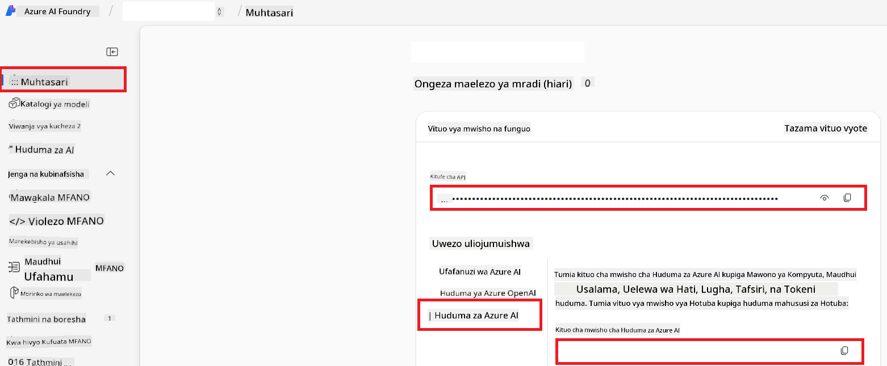

<!--
CO_OP_TRANSLATOR_METADATA:
{
  "original_hash": "b58d7c3cb4210697a073d20eb3064945",
  "translation_date": "2025-06-12T11:57:00+00:00",
  "source_file": "getting_started/set-up-azure-ai.md",
  "language_code": "sw"
}
-->
# Weka Azure AI kwa Mkufunzi wa Lugha wa Co-op (Azure OpenAI & Azure AI Vision)

Mwongozo huu utakusaidia kuanzisha Azure OpenAI kwa tafsiri ya lugha na Azure Computer Vision kwa uchambuzi wa maudhui ya picha (ambayo inaweza kutumika kwa tafsiri inayotegemea picha) ndani ya Azure AI Foundry.

**Mahitaji ya awali:**
- Akaunti ya Azure yenye usajili hai.
- Ruhusa za kutosha za kuunda rasilimali na uenezi katika usajili wako wa Azure.

## Unda Mradi wa Azure AI

Utaanza kwa kuunda Mradi wa Azure AI, ambao hutumika kama sehemu kuu ya kusimamia rasilimali zako za AI.

1. Nenda kwenye [https://ai.azure.com](https://ai.azure.com) na ingia kwa akaunti yako ya Azure.

1. Chagua **+Create** kuunda mradi mpya.

1. Fanya yafuatayo:
   - Weka **Jina la Mradi** (mfano, `CoopTranslator-Project`).
   - Chagua **AI hub**  (mfano, `CoopTranslator-Hub`) (Unda mpya ikiwa inahitajika).

1. Bonyeza "**Review and Create**" kuanzisha mradi wako. Utaelekezwa kwenye ukurasa wa muhtasari wa mradi wako.

## Weka Azure OpenAI kwa Tafsiri ya Lugha

Ndani ya mradi wako, utaeneza mfano wa Azure OpenAI utakaotumika kama seva ya tafsiri ya maandishi.

### Nenda kwenye Mradi Wako

Kama bado hauko hapo, fungua mradi uliouunda hivi karibuni (mfano, `CoopTranslator-Project`) katika Azure AI Foundry.

### Eneza Mfano wa OpenAI

1. Kutoka kwenye menyu ya mradi wako upande wa kushoto, chini ya "My assets", chagua "**Models + endpoints**".

1. Chagua **+ Deploy model**.

1. Chagua **Deploy Base Model**.

1. Utaonyeshwa orodha ya mifano inayopatikana. Tumia chujio au tafuta mfano mzuri wa GPT. Tunapendekeza `gpt-4o`.

1. Chagua mfano unaotaka kisha bonyeza **Confirm**.

1. Chagua **Deploy**.

### Usanidi wa Azure OpenAI

Baada ya kuenezwa, unaweza kuchagua uenezaji kutoka ukurasa wa "**Models + endpoints**" kupata **REST endpoint URL**, **Key**, **Deployment name**, **Model name** na **API version**. Hizi zitahitajika kuunganisha mfano wa tafsiri katika programu yako.

> [!NOTE]
> Unaweza kuchagua matoleo ya API kutoka ukurasa wa [API version deprecation](https://learn.microsoft.com/azure/ai-services/openai/api-version-deprecation) kulingana na mahitaji yako. Fahamu kuwa **API version** ni tofauti na **Model version** inayoonyeshwa kwenye ukurasa wa **Models + endpoints** katika Azure AI Foundry.

## Weka Azure Computer Vision kwa Tafsiri ya Picha

Ili kuwezesha tafsiri ya maandishi ndani ya picha, unahitaji kupata Azure AI Service API Key na Endpoint.

1. Nenda kwenye Mradi wako wa Azure AI (mfano, `CoopTranslator-Project`). Hakikisha uko kwenye ukurasa wa muhtasari wa mradi.

### Usanidi wa Azure AI Service

Pata API Key na Endpoint kutoka Azure AI Service.

1. Nenda kwenye Mradi wako wa Azure AI (mfano, `CoopTranslator-Project`). Hakikisha uko kwenye ukurasa wa muhtasari wa mradi.

1. Pata **API Key** na **Endpoint** kutoka kwenye kichupo cha Azure AI Service.

    

Muunganisho huu hufanya uwezo wa rasilimali ya Azure AI Services iliyounganishwa (ikiwa ni pamoja na uchambuzi wa picha) upatikane kwa mradi wako wa AI Foundry. Baadaye unaweza kutumia muunganisho huu katika daftari lako la kumbukumbu au programu ili kutoa maandishi kutoka kwenye picha, ambayo baadaye inaweza kutumwa kwa mfano wa Azure OpenAI kwa tafsiri.

## Kusanya Taarifa Zako za Kuingia

Hadi sasa, unapaswa kuwa umekusanya yafuatayo:

**Kwa Azure OpenAI (Tafsiri ya Maandishi):**
- Azure OpenAI Endpoint
- Azure OpenAI API Key
- Azure OpenAI Model Name (mfano, `gpt-4o`)
- Azure OpenAI Deployment Name (mfano, `cooptranslator-gpt4o`)
- Azure OpenAI API Version

**Kwa Azure AI Services (Uchukuaji wa Maandishi kutoka Picha kupitia Vision):**
- Azure AI Service Endpoint
- Azure AI Service API Key

### Mfano: Usanidi wa Mabadiliko ya Mazingira (Preview)

Baadaye, unapotengeneza programu yako, huenda ukaizindua kwa kutumia taarifa hizi ulizokusanya. Kwa mfano, unaweza kuziweka kama mabadiliko ya mazingira kama ifuatavyo:

```bash
# Azure AI Service Credentials (Required for image translation)
AZURE_AI_SERVICE_API_KEY="your_azure_ai_service_api_key" # e.g., 21xasd...
AZURE_AI_SERVICE_ENDPOINT="https://your_azure_ai_service_endpoint.cognitiveservices.azure.com/"

# Azure OpenAI Credentials (Required for text translation)
AZURE_OPENAI_API_KEY="your_azure_openai_api_key" # e.g., 21xasd...
AZURE_OPENAI_ENDPOINT="https://your_azure_openai_endpoint.openai.azure.com/"
AZURE_OPENAI_MODEL_NAME="your_model_name" # e.g., gpt-4o
AZURE_OPENAI_CHAT_DEPLOYMENT_NAME="your_deployment_name" # e.g., cooptranslator-gpt4o
AZURE_OPENAI_API_VERSION="your_api_version" # e.g., 2024-12-01-preview
```

---

### Kusoma Zaidi

- [How to Create a project in Azure AI Foundry](https://learn.microsoft.com/azure/ai-foundry/how-to/create-projects?tabs=ai-studio)
- [How to Create Azure AI resources](https://learn.microsoft.com/azure/ai-foundry/how-to/create-azure-ai-resource?tabs=portal)
- [How to Deploy OpenAI models in Azure AI Foundry](https://learn.microsoft.com/en-us/azure/ai-foundry/how-to/deploy-models-openai)

**Kiasi cha maelezo**:  
Hati hii imetafsiriwa kwa kutumia huduma ya tafsiri ya AI [Co-op Translator](https://github.com/Azure/co-op-translator). Ingawa tunajitahidi kuwa sahihi, tafadhali fahamu kwamba tafsiri za kiotomatiki zinaweza kuwa na makosa au upungufu wa usahihi. Hati ya asili katika lugha yake ya asili inapaswa kuzingatiwa kama chanzo cha mamlaka. Kwa taarifa muhimu, tafsiri ya kitaalamu inayofanywa na binadamu inapendekezwa. Hatuna dhamana kwa kutoelewana au tafsiri potofu zitokanazo na matumizi ya tafsiri hii.