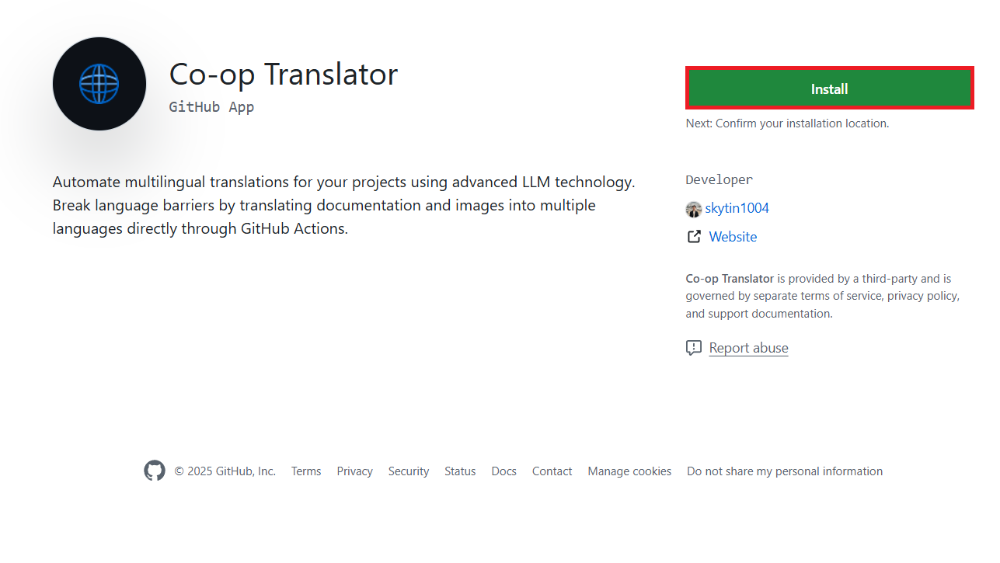

<!--
CO_OP_TRANSLATOR_METADATA:
{
  "original_hash": "9fac847815936ef6e6c8bfde6d191571",
  "translation_date": "2025-10-15T05:01:46+00:00",
  "source_file": "getting_started/github-actions-guide/github-actions-guide-org.md",
  "language_code": "ta"
}
-->
# Co-op Translator GitHub Action-ஐ பயன்படுத்துவது (அமைப்புக்கான வழிகாட்டி)

**இலக்கு பயனர்கள்:** இந்த வழிகாட்டி **Microsoft-இன் உள்நாட்டு பயனர்கள்** அல்லது **Co-op Translator GitHub App-இன் தேவையான சான்றுகளைப் பெறும் அணிகள்** அல்லது தங்களுக்கான தனிப்பயன் GitHub App-ஐ உருவாக்கக்கூடியவர்கள் ஆகியோருக்காக உருவாக்கப்பட்டுள்ளது.

உங்கள் repository-யின் ஆவணங்களை தானாக மொழிபெயர்க்க Co-op Translator GitHub Action-ஐ எளிதாக அமைக்கலாம். இந்த வழிகாட்டி, உங்கள் மூல Markdown கோப்புகள் அல்லது படங்கள் மாற்றப்படும் போதெல்லாம், புதுப்பிக்கப்பட்ட மொழிபெயர்ப்புகளுடன் Pull Request-களை தானாக உருவாக்கும் வகையில் action-ஐ அமைப்பது எப்படி என்பதை விளக்குகிறது.

> [!IMPORTANT]
> 
> **சரியான வழிகாட்டியை தேர்வு செய்வது:**
>
> இந்த வழிகாட்டி **GitHub App ID மற்றும் Private Key**-ஐ பயன்படுத்தி அமைப்பது பற்றி விவரிக்கிறது. பொதுவாக, இந்த "அமைப்புக்கான வழிகாட்டி" முறையை நீங்கள் பயன்படுத்த வேண்டும், **`GITHUB_TOKEN` அனுமதிகள் கட்டுப்படுத்தப்பட்டுள்ளன:** உங்கள் அமைப்பு அல்லது repository அமைப்புகள், இயல்பாக வழங்கப்படும் `GITHUB_TOKEN`-க்கு தேவையான அனுமதிகளை (உதாரணமாக `contents: write` அல்லது `pull-requests: write`) வழங்காமல் இருந்தால், [பொது அமைப்பு வழிகாட்டி](./github-actions-guide-public.md)-யில் உள்ள workflow தேவையான அனுமதிகள் இல்லாததால் தோல்வியடையும். தனிப்பட்ட GitHub App-ஐ பயன்படுத்துவதால் இந்த கட்டுப்பாடுகளை மீற முடியும்.
>
> **மேலே உள்ளவை உங்களுக்கு பொருந்தவில்லை என்றால்:**
>
> உங்கள் repository-யில் இயல்பான `GITHUB_TOKEN`-க்கு போதுமான அனுமதிகள் இருந்தால் (அமைப்பின் கட்டுப்பாடுகள் இல்லை), **[GITHUB_TOKEN-ஐ பயன்படுத்தும் பொது அமைப்பு வழிகாட்டி](./github-actions-guide-public.md)**-யை பயன்படுத்தவும். இந்த வழிகாட்டிக்கு App ID அல்லது Private Key-ஐ பெற வேண்டிய அவசியம் இல்லை; இயல்பான `GITHUB_TOKEN` மற்றும் repository அனுமதிகள் மட்டும் போதும்.

## முன்பதிவுகள்

GitHub Action-ஐ அமைக்கும் முன், தேவையான AI சேவை சான்றுகளை தயார் வைத்திருக்க வேண்டும்.

**1. அவசியம்: AI மொழி மாதிரி சான்றுகள்**
குறைந்தபட்சம் ஒரு ஆதரவு Language Model-க்கு சான்றுகள் வேண்டும்:

- **Azure OpenAI**: Endpoint, API Key, Model/Deployment Name-கள், API Version தேவை.
- **OpenAI**: API Key, (விருப்பம்: Org ID, Base URL, Model ID).
- மேலும் விவரங்களுக்கு [Supported Models and Services](../../../../README.md) பார்க்கவும்.
- அமைப்பு வழிகாட்டி: [Azure OpenAI அமைக்க](../set-up-resources/set-up-azure-openai.md).

**2. விருப்பம்: Computer Vision சான்றுகள் (பட மொழிபெயர்ப்பு)**

- படங்களில் உள்ள உரையை மொழிபெயர்க்க வேண்டுமெனில் மட்டும் தேவை.
- **Azure Computer Vision**: Endpoint மற்றும் Subscription Key தேவை.
- வழங்கப்படவில்லை என்றால், action [Markdown-only mode](../markdown-only-mode.md)-க்கு இயங்கும்.
- அமைப்பு வழிகாட்டி: [Azure Computer Vision அமைக்க](../set-up-resources/set-up-azure-computer-vision.md).

## அமைப்பு மற்றும் கட்டமைப்பு

உங்கள் repository-யில் Co-op Translator GitHub Action-ஐ அமைக்க கீழ்காணும் படிகளை பின்பற்றவும்:

### படி 1: GitHub App Authentication-ஐ நிறுவி அமைக்கவும்

இந்த workflow, GitHub App authentication-ஐ பயன்படுத்தி உங்கள் repository-யுடன் பாதுகாப்பாக (உதாரணம்: Pull Request-களை உருவாக்க) செயல்படுகிறது. கீழ்காணும் விருப்பங்களில் ஒன்றை தேர்வு செய்யவும்:

#### **விருப்பம் A: Co-op Translator GitHub App-ஐ நிறுவுதல் (Microsoft உள்நாட்டு பயன்பாட்டிற்கு)**

1. [Co-op Translator GitHub App](https://github.com/apps/co-op-translator) பக்கத்திற்கு செல்லவும்.

1. **Install**-ஐ தேர்வு செய்து, உங்கள் repository இருக்கும் account அல்லது organization-ஐ தேர்வு செய்யவும்.

    

1. **Only select repositories**-ஐ தேர்வு செய்து, உங்கள் repository-யை (உதா: `PhiCookBook`) தேர்வு செய்யவும். **Install**-ஐ கிளிக் செய்யவும். Authenticate செய்ய கேட்டுக்கொள்ளலாம்.

    

1. **App சான்றுகள் பெறுதல் (உள்நாட்டு செயல்முறை தேவை):** workflow-ஐ app-ஆக authenticate செய்ய, Co-op Translator குழுவிடமிருந்து இரண்டு தகவல்கள் தேவை:
  - **App ID:** Co-op Translator app-க்கு தனிப்பட்ட அடையாள எண். App ID: `1164076`.
  - **Private Key:** `.pem` private key file-இன் **முழு உள்ளடக்கத்தை** maintainer-இடமிருந்து பெற வேண்டும். **இந்த key-ஐ password போல பாதுகாப்பாக வைத்திருக்க வேண்டும்.**

1. படி 2-க்கு செல்லவும்.

#### **விருப்பம் B: உங்கள் சொந்த தனிப்பயன் GitHub App-ஐ பயன்படுத்தவும்**

- விரும்பினால், உங்கள் சொந்த GitHub App-ஐ உருவாக்கி அமைக்கலாம். Contents மற்றும் Pull requests-க்கு Read & write access இருக்க வேண்டும். அதன் App ID மற்றும் உருவாக்கப்பட்ட Private Key தேவை.

### படி 2: Repository Secrets-ஐ அமைக்கவும்

GitHub App சான்றுகள் மற்றும் AI சேவை சான்றுகளை உங்கள் repository-யில் encrypted secrets-ஆக சேர்க்க வேண்டும்.

1. உங்கள் repository-க்கு (உதா: `PhiCookBook`) செல்லவும்.

1. **Settings** > **Secrets and variables** > **Actions**-க்கு செல்லவும்.

1. **Repository secrets**-இல், கீழ்காணும் ஒவ்வொரு secret-க்கும் **New repository secret**-ஐ கிளிக் செய்யவும்.

   

**தேவையான Secrets (GitHub App Authentication-க்கு):**

| Secret Name          | Description                                      | Value Source                                     |
| :------------------- | :----------------------------------------------- | :----------------------------------------------- |
| `GH_APP_ID`          | GitHub App-இன் App ID (படி 1-இல் இருந்து).      | GitHub App Settings                              |
| `GH_APP_PRIVATE_KEY` | பதிவிறக்கப்பட்ட `.pem` file-இன் **முழு உள்ளடக்கம்**. | `.pem` file (படி 1-இல் இருந்து)                      |

**AI சேவை Secrets (உங்கள் முன்பதிவுகளுக்கு ஏற்ப அனைத்தையும் சேர்க்கவும்):**

| Secret Name                         | Description                               | Value Source                     |
| :---------------------------------- | :---------------------------------------- | :------------------------------- |
| `AZURE_AI_SERVICE_API_KEY`            | Azure AI Service-க்கு Key (Computer Vision)  | Azure AI Foundry                    |
| `AZURE_AI_SERVICE_ENDPOINT`         | Azure AI Service-க்கு Endpoint (Computer Vision) | Azure AI Foundry                     |
| `AZURE_OPENAI_API_KEY`              | Azure OpenAI சேவைக்கு Key              | Azure AI Foundry                     |
| `AZURE_OPENAI_ENDPOINT`             | Azure OpenAI சேவைக்கு Endpoint         | Azure AI Foundry                     |
| `AZURE_OPENAI_MODEL_NAME`           | Azure OpenAI Model Name                  | Azure AI Foundry                     |
| `AZURE_OPENAI_CHAT_DEPLOYMENT_NAME` | Azure OpenAI Deployment Name             | Azure AI Foundry                     |
| `AZURE_OPENAI_API_VERSION`          | Azure OpenAI-க்கு API Version            | Azure AI Foundry                     |
| `OPENAI_API_KEY`                    | OpenAI-க்கு API Key                      | OpenAI Platform                  |
| `OPENAI_ORG_ID`                     | OpenAI Organization ID                   | OpenAI Platform                  |
| `OPENAI_CHAT_MODEL_ID`              | OpenAI-யின் குறிப்பிட்ட model ID         | OpenAI Platform                    |
| `OPENAI_BASE_URL`                   | OpenAI API-க்கு தனிப்பட்ட Base URL        | OpenAI Platform                    |


### படி 3: Workflow File-ஐ உருவாக்கவும்

இப்போது, automated workflow-ஐ வரையறுக்கும் YAML file-ஐ உருவாக்க வேண்டும்.

1. உங்கள் repository-யின் root directory-யில் `.github/workflows/` என்ற directory இல்லையெனில் உருவாக்கவும்.

1. `.github/workflows/`-இல், `co-op-translator.yml` என்ற file-ஐ உருவாக்கவும்.

1. கீழ்காணும் உள்ளடக்கத்தை co-op-translator.yml-இல் paste செய்யவும்.

```
name: Co-op Translator

on:
  push:
    branches:
      - main

jobs:
  co-op-translator:
    runs-on: ubuntu-latest

    permissions:
      contents: write
      pull-requests: write

    steps:
      - name: Checkout repository
        uses: actions/checkout@v4
        with:
          fetch-depth: 0

      - name: Set up Python
        uses: actions/setup-python@v4
        with:
          python-version: '3.10'

      - name: Install Co-op Translator
        run: |
          python -m pip install --upgrade pip
          pip install co-op-translator

      - name: Run Co-op Translator
        env:
          PYTHONIOENCODING: utf-8
          # Azure AI Service Credentials
          AZURE_AI_SERVICE_API_KEY: ${{ secrets.AZURE_AI_SERVICE_API_KEY }}
          AZURE_AI_SERVICE_ENDPOINT: ${{ secrets.AZURE_AI_SERVICE_ENDPOINT }}

          # Azure OpenAI Credentials
          AZURE_OPENAI_API_KEY: ${{ secrets.AZURE_OPENAI_API_KEY }}
          AZURE_OPENAI_ENDPOINT: ${{ secrets.AZURE_OPENAI_ENDPOINT }}
          AZURE_OPENAI_MODEL_NAME: ${{ secrets.AZURE_OPENAI_MODEL_NAME }}
          AZURE_OPENAI_CHAT_DEPLOYMENT_NAME: ${{ secrets.AZURE_OPENAI_CHAT_DEPLOYMENT_NAME }}
          AZURE_OPENAI_API_VERSION: ${{ secrets.AZURE_OPENAI_API_VERSION }}

          # OpenAI Credentials
          OPENAI_API_KEY: ${{ secrets.OPENAI_API_KEY }}
          OPENAI_ORG_ID: ${{ secrets.OPENAI_ORG_ID }}
          OPENAI_CHAT_MODEL_ID: ${{ secrets.OPENAI_CHAT_MODEL_ID }}
          OPENAI_BASE_URL: ${{ secrets.OPENAI_BASE_URL }}
        run: |
          # =====================================================================
          # IMPORTANT: Set your target languages here (REQUIRED CONFIGURATION)
          # =====================================================================
          # Example: Translate to Spanish, French, German. Add -y to auto-confirm.
          translate -l "es fr de" -y  # <--- MODIFY THIS LINE with your desired languages

      - name: Authenticate GitHub App
        id: generate_token
        uses: tibdex/github-app-token@v1
        with:
          app_id: ${{ secrets.GH_APP_ID }}
          private_key: ${{ secrets.GH_APP_PRIVATE_KEY }}

      - name: Create Pull Request with translations
        uses: peter-evans/create-pull-request@v5
        with:
          token: ${{ steps.generate_token.outputs.token }}
          commit-message: "🌐 Update translations via Co-op Translator"
          title: "🌐 Update translations via Co-op Translator"
          body: |
            This PR updates translations for recent changes to the main branch.

            ### 📋 Changes included
            - Translated contents are available in the `translations/` directory
            - Translated images are available in the `translated_images/` directory

            ---
            🌐 Automatically generated by the [Co-op Translator](https://github.com/Azure/co-op-translator) GitHub Action.
          branch: update-translations
          base: main
          labels: translation, automated-pr
          delete-branch: true
          add-paths: |
            translations/
            translated_images/

```

4.  **Workflow-ஐ தனிப்பயனாக்கவும்:**
  - **[!IMPORTANT] இலக்கு மொழிகள்:** `Run Co-op Translator` படியில், `translate -l "..." -y` command-இல் உள்ள மொழி குறியீடுகளின் பட்டியலை உங்கள் திட்ட தேவைகளுக்கு ஏற்ப **மாற்ற/திருத்த வேண்டும்**. எடுத்துக்காட்டு பட்டியல் (`ar de es...`) உங்கள் தேவைக்கு ஏற்ப மாற்ற வேண்டும்.
  - **Trigger (`on:`):** தற்போதைய trigger, `main`-க்கு ஒவ்வொரு push-க்கும் இயங்கும். பெரிய repository-களுக்கு, workflow-ஐ தேவையான கோப்புகள் (உதா: source documentation) மாற்றப்படும் போது மட்டும் இயங்க paths filter-ஐ (YAML-இல் comment-ஆக உள்ளது) சேர்க்க பரிந்துரைக்கப்படுகிறது; இது runner minutes-ஐ சேமிக்கும்.
  - **PR விவரங்கள்:** `Create Pull Request` படியில், `commit-message`, `title`, `body`, `branch` பெயர் மற்றும் `labels`-ஐ தேவையானால் மாற்றவும்.

## சான்றுகள் மேலாண்மை மற்றும் புதுப்பிப்பு

- **பாதுகாப்பு:** முக்கியமான சான்றுகள் (API keys, private keys) எப்போதும் GitHub Actions secrets-ஆக சேமிக்க வேண்டும். Workflow file-இல் அல்லது repository code-இல் அவற்றை வெளிப்படுத்த வேண்டாம்.
- **[!IMPORTANT] Key புதுப்பிப்பு (Microsoft உள்நாட்டு பயனர்கள்):** Microsoft-இல் பயன்படுத்தப்படும் Azure OpenAI key-க்கு கட்டாய புதுப்பிப்பு கொள்கை (உதா: 5 மாதத்திற்கு ஒருமுறை) இருக்கலாம். Workflow தோல்வியடையாமல் இருக்க, GitHub secrets (`AZURE_OPENAI_...` keys)-ஐ **காலாவதியாகும் முன்** புதுப்பிக்க வேண்டும்.

## Workflow-ஐ இயக்குவது

> [!WARNING]  
> **GitHub-hosted Runner நேர வரம்பு:**  
> `ubuntu-latest` போன்ற GitHub-hosted runners-க்கு **அதிகபட்ச இயக்க நேர வரம்பு 6 மணி நேரம்**.  
> பெரிய documentation repository-களில், மொழிபெயர்ப்பு செயல்முறை 6 மணி நேரத்தை மீறினால், workflow தானாக நிறுத்தப்படும்.  
> இதைத் தவிர்க்க:  
> - **Self-hosted runner**-ஐ பயன்படுத்தவும் (நேர வரம்பு இல்லை)  
> - ஒவ்வொரு இயக்கத்திலும் இலக்கு மொழிகள் எண்ணிக்கையை குறைக்கவும்

`co-op-translator.yml` file-ஐ உங்கள் main branch-இல் (அல்லது `on:` trigger-இல் குறிப்பிடப்பட்ட branch) merge செய்தவுடன், அந்த branch-க்கு மாற்றங்கள் push செய்யப்படும் போதெல்லாம் (paths filter-ஐ அமைத்திருந்தால் அதற்கும் பொருந்தும்) workflow தானாக இயங்கும்.

மொழிபெயர்ப்புகள் உருவாக்கப்பட்டால் அல்லது புதுப்பிக்கப்பட்டால், action-ஐ மாற்றங்களுடன் Pull Request-ஐ தானாக உருவாக்கும்; நீங்கள் அதை பரிசீலித்து merge செய்யலாம்.

---

**பொறுப்புத் தவிர்ப்பு**:
இந்த ஆவணம் AI மொழிபெயர்ப்பு சேவையான [Co-op Translator](https://github.com/Azure/co-op-translator) மூலம் மொழிபெயர்க்கப்பட்டுள்ளது. நாம் துல்லியத்திற்காக முயற்சி செய்தாலும், தானியங்கி மொழிபெயர்ப்புகளில் பிழைகள் அல்லது தவறுகள் இருக்கலாம் என்பதை தயவுசெய்து கவனிக்கவும். மூல ஆவணம் அதன் சொந்த மொழியில் அதிகாரப்பூர்வ ஆதாரமாக கருதப்பட வேண்டும். முக்கியமான தகவல்களுக்கு, தொழில்முறை மனித மொழிபெயர்ப்பு பரிந்துரைக்கப்படுகிறது. இந்த மொழிபெயர்ப்பைப் பயன்படுத்துவதால் ஏற்படும் எந்தவொரு தவறான புரிதல் அல்லது தவறான விளக்கத்திற்கு நாங்கள் பொறுப்பல்ல.