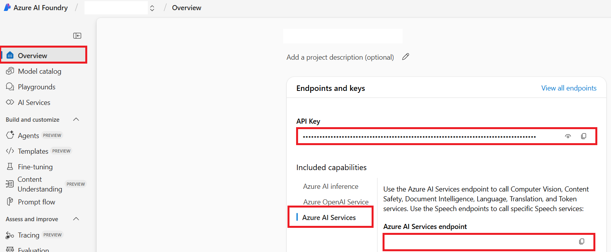

<!--
CO_OP_TRANSLATOR_METADATA:
{
  "original_hash": "b58d7c3cb4210697a073d20eb3064945",
  "translation_date": "2025-10-15T04:47:38+00:00",
  "source_file": "getting_started/set-up-azure-ai.md",
  "language_code": "ta"
}
-->
# Co-op Translator-க்கு Azure AI அமைப்பது (Azure OpenAI & Azure AI Vision)

இந்த வழிகாட்டி, மொழிபெயர்ப்பிற்காக Azure OpenAI-யை மற்றும் பட உள்ளடக்க பகுப்பாய்விற்காக Azure Computer Vision-ஐ (பட அடிப்படையிலான மொழிபெயர்ப்பு செய்ய பயன்படுத்தலாம்) Azure AI Foundry-யில் அமைப்பது எப்படி என்பதை விளக்குகிறது.

**தேவையானவை:**
- செயலில் இருக்கும் சந்தாவுடன் Azure கணக்கு.
- உங்கள் Azure சந்தாவில் வளங்கள் மற்றும் வெளியீடுகளை உருவாக்க தேவையான அனுமதிகள்.

## Azure AI Project உருவாக்கவும்

முதலில், Azure AI Project ஒன்றை உருவாக்க வேண்டும். இது உங்கள் AI வளங்களை நிர்வகிக்க ஒரு மையமாக செயல்படும்.

1. [https://ai.azure.com](https://ai.azure.com) என்ற முகவரிக்கு சென்று உங்கள் Azure கணக்கில் உள்நுழைக.

1. **+Create** என்பதை தேர்ந்தெடுத்து புதிய project ஒன்றை உருவாக்கவும்.

1. கீழ்காணும் பணிகளை செய்யவும்:
   - **Project name** (உதாரணம்: `CoopTranslator-Project`) என பெயர் இடவும்.
   - **AI hub** (உதாரணம்: `CoopTranslator-Hub`) தேர்ந்தெடுக்கவும் (தேவைப்பட்டால் புதிய Hub உருவாக்கவும்).

1. "**Review and Create**" என்பதைக் கிளிக் செய்து project-ஐ அமைக்கவும். உங்கள் project-இன் மேலோட்டப் பக்கம் காட்டப்படும்.

## மொழிபெயர்ப்பிற்காக Azure OpenAI அமைக்கவும்

உங்கள் project-இல், உரை மொழிபெயர்ப்பிற்குப் பின்னணி ஆக Azure OpenAI மாதிரியை வெளியிட வேண்டும்.

### உங்கள் Project-க்கு செல்லவும்

இன்னும் செல்லவில்லை என்றால், Azure AI Foundry-யில் நீங்கள் உருவாக்கிய project-ஐ (உதாரணம்: `CoopTranslator-Project`) திறக்கவும்.

### OpenAI மாதிரியை வெளியிடவும்

1. Project-இன் இடது பக்க பட்டியில் "My assets" கீழ் "**Models + endpoints**" என்பதை தேர்ந்தெடுக்கவும்.

1. **+ Deploy model** என்பதை தேர்ந்தெடுக்கவும்.

1. **Deploy Base Model** என்பதை தேர்ந்தெடுக்கவும்.

1. கிடைக்கும் மாதிரிகள் பட்டியல் காட்டப்படும். உங்களுக்கு ஏற்ற GPT மாதிரியை தேடவும் அல்லது வடிகட்டவும். `gpt-4o`-ஐ பரிந்துரைக்கிறோம்.

1. விரும்பிய மாதிரியை தேர்ந்தெடுத்து **Confirm** என்பதைக் கிளிக் செய்யவும்.

1. **Deploy** என்பதைக் கிளிக் செய்யவும்.

### Azure OpenAI அமைப்புகள்

வெளியீடு செய்யப்பட்டதும், "**Models + endpoints**" பக்கத்தில் deployment-ஐ தேர்ந்தெடுத்து அதன் **REST endpoint URL**, **Key**, **Deployment name**, **Model name** மற்றும் **API version** ஆகியவற்றைப் பெறலாம். இவை உங்கள் பயன்பாட்டில் மொழிபெயர்ப்பு மாதிரியை இணைக்க தேவையாகும்.

> [!NOTE]
> உங்கள் தேவைகளுக்கு ஏற்ப [API version deprecation](https://learn.microsoft.com/azure/ai-services/openai/api-version-deprecation) பக்கத்தில் இருந்து API version-ஐ தேர்ந்தெடுக்கலாம். **API version** என்பது Azure AI Foundry-யில் **Models + endpoints** பக்கத்தில் காட்டப்படும் **Model version**-இற்கு வேறுபட்டது என்பதை கவனிக்கவும்.

## பட மொழிபெயர்ப்பிற்காக Azure Computer Vision அமைக்கவும்

படங்களில் உள்ள உரையை மொழிபெயர்க்க, Azure AI Service API Key மற்றும் Endpoint-ஐ கண்டறிய வேண்டும்.

1. உங்கள் Azure AI Project-க்கு (உதாரணம்: `CoopTranslator-Project`) செல்லவும். Project overview பக்கத்தில் இருப்பதை உறுதி செய்யவும்.

### Azure AI Service அமைப்புகள்

Azure AI Service-இல் இருந்து API Key மற்றும் Endpoint-ஐ கண்டறியவும்.

1. உங்கள் Azure AI Project-க்கு (உதாரணம்: `CoopTranslator-Project`) செல்லவும். Project overview பக்கத்தில் இருப்பதை உறுதி செய்யவும்.

1. Azure AI Service tab-இல் இருந்து **API Key** மற்றும் **Endpoint**-ஐ கண்டறியவும்.

    

இந்த இணைப்பு, தொடர்புடைய Azure AI Services வளத்தின் (பட பகுப்பாய்வு உட்பட) திறன்களை உங்கள் AI Foundry project-க்கு கிடைக்கச் செய்கிறது. இதை உங்கள் notebooks அல்லது பயன்பாடுகளில் பயன்படுத்தி படங்களில் இருந்து உரையை எடுத்து, அதை Azure OpenAI மாதிரிக்கு மொழிபெயர்க்க அனுப்பலாம்.

## உங்கள் சான்றுகளை ஒருங்கிணைத்தல்

இப்போது, நீங்கள் கீழ்காணும் தகவல்களை சேகரித்திருக்க வேண்டும்:

**Azure OpenAI (உரை மொழிபெயர்ப்பு)க்கு:**
- Azure OpenAI Endpoint
- Azure OpenAI API Key
- Azure OpenAI Model Name (உதாரணம்: `gpt-4o`)
- Azure OpenAI Deployment Name (உதாரணம்: `cooptranslator-gpt4o`)
- Azure OpenAI API Version

**Azure AI Services (Vision மூலம் பட உரை எடுப்பு)க்கு:**
- Azure AI Service Endpoint
- Azure AI Service API Key

### உதாரணம்: சூழல் மாறி அமைப்பு (முன்னோட்டம்)

பின்னர், உங்கள் பயன்பாட்டை உருவாக்கும் போது, இந்த சேகரித்த சான்றுகளை பயன்படுத்தி அமைப்பீர்கள். உதாரணமாக, சூழல் மாறிகளாக அமைக்கலாம்:

```bash
# Azure AI Service Credentials (Required for image translation)
AZURE_AI_SERVICE_API_KEY="your_azure_ai_service_api_key" # e.g., 21xasd...
AZURE_AI_SERVICE_ENDPOINT="https://your_azure_ai_service_endpoint.cognitiveservices.azure.com/"

# Azure OpenAI Credentials (Required for text translation)
AZURE_OPENAI_API_KEY="your_azure_openai_api_key" # e.g., 21xasd...
AZURE_OPENAI_ENDPOINT="https://your_azure_openai_endpoint.openai.azure.com/"
AZURE_OPENAI_MODEL_NAME="your_model_name" # e.g., gpt-4o
AZURE_OPENAI_CHAT_DEPLOYMENT_NAME="your_deployment_name" # e.g., cooptranslator-gpt4o
AZURE_OPENAI_API_VERSION="your_api_version" # e.g., 2024-12-01-preview
```

---

### மேலும் படிக்க

- [Azure AI Foundry-யில் project உருவாக்குவது எப்படி](https://learn.microsoft.com/azure/ai-foundry/how-to/create-projects?tabs=ai-studio)
- [Azure AI வளங்களை உருவாக்குவது எப்படி](https://learn.microsoft.com/azure/ai-foundry/how-to/create-azure-ai-resource?tabs=portal)
- [Azure AI Foundry-யில் OpenAI மாதிரிகளை வெளியிடுவது எப்படி](https://learn.microsoft.com/en-us/azure/ai-foundry/how-to/deploy-models-openai)

---

**பொறுப்புத்துறப்பு**:
இந்த ஆவணம் AI மொழிபெயர்ப்பு சேவையான [Co-op Translator](https://github.com/Azure/co-op-translator) மூலம் மொழிபெயர்க்கப்பட்டுள்ளது. நாங்கள் துல்லியத்திற்காக முயற்சி செய்தாலும், தானாக மொழிபெயர்க்கப்பட்ட மொழிபெயர்ப்புகளில் பிழைகள் அல்லது தவறுகள் இருக்கலாம் என்பதை தயவுசெய்து கவனிக்கவும். மூல ஆவணம் அதன் சொந்த மொழியில் அதிகாரப்பூர்வ ஆதாரமாக கருதப்பட வேண்டும். முக்கியமான தகவல்களுக்கு, தொழில்முறை மனித மொழிபெயர்ப்பு பரிந்துரைக்கப்படுகிறது. இந்த மொழிபெயர்ப்பைப் பயன்படுத்துவதால் ஏற்படும் எந்தவொரு தவறான புரிதல் அல்லது தவறான விளக்கத்திற்கு நாங்கள் பொறுப்பல்ல.