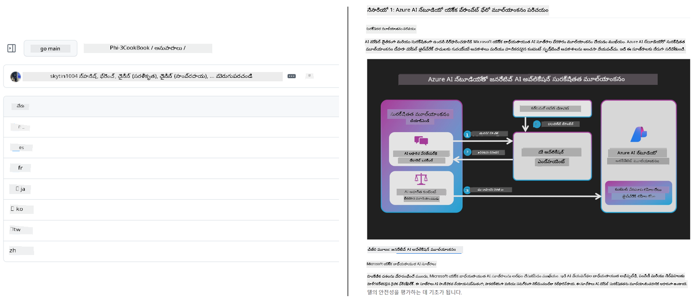
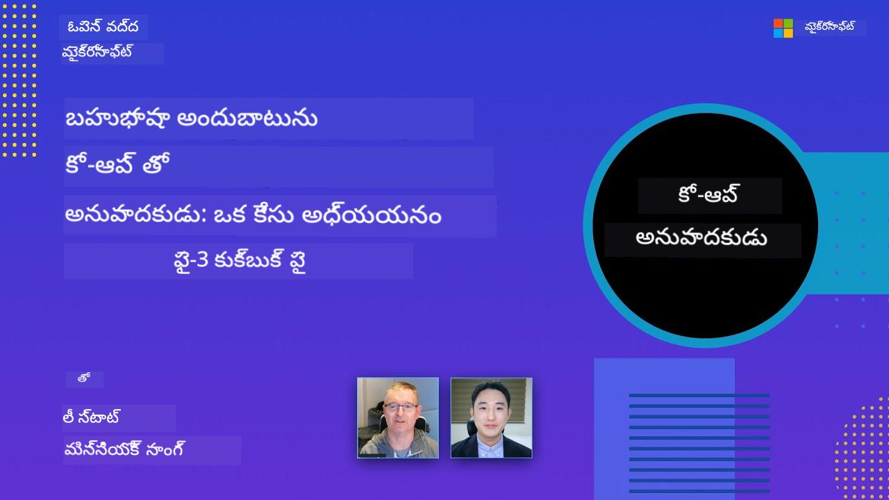

<!--
CO_OP_TRANSLATOR_METADATA:
{
  "original_hash": "dac6bc281667816537df51f724a0ff2c",
  "translation_date": "2025-11-30T13:10:45+00:00",
  "source_file": "README.md",
  "language_code": "te"
}
-->
# కో-ఆప్ అనువాదకుడు

_మీ విద్యా GitHub కంటెంట్‌ను బహుభాషలుగా సులభంగా అనువదించి, ప్రపంచవ్యాప్తంగా ప్రేక్షకులను చేరుకోండి._

[](https://pypi.org/project/co-op-translator/)
[](https://github.com/azure/co-op-translator/blob/main/LICENSE)
[](https://pepy.tech/project/co-op-translator)
[](https://pepy.tech/project/co-op-translator)
[](https://github.com/azure/co-op-translator/pkgs/container/co-op-translator)
[](https://github.com/psf/black)

[](https://GitHub.com/azure/co-op-translator/graphs/contributors/)
[](https://GitHub.com/azure/co-op-translator/issues/)
[](https://GitHub.com/azure/co-op-translator/pulls/)
[](http://makeapullrequest.com)

### 🌐 బహుభాషా మద్దతు

#### [Co-op Translator](https://github.com/Azure/Co-op-Translator) ద్వారా మద్దతు

<!-- CO-OP TRANSLATOR LANGUAGES TABLE START -->
[అరబిక్](../ar/README.md) | [బెంగాలీ](../bn/README.md) | [బల్గేరియన్](../bg/README.md) | [బర్మీస్ (మయన్మార్)](../my/README.md) | [చైనీస్ (సింప్లిఫైడ్)](../zh/README.md) | [చైనీస్ (ట్రాడిషనల్, హాంకాంగ్)](../hk/README.md) | [చైనీస్ (ట్రాడిషనల్, మకావు)](../mo/README.md) | [చైనీస్ (ట్రాడిషనల్, తైవాన్)](../tw/README.md) | [క్రొయేషియన్](../hr/README.md) | [చెక్](../cs/README.md) | [డానిష్](../da/README.md) | [డచ్](../nl/README.md) | [ఎస్టోనియన్](../et/README.md) | [ఫిన్నిష్](../fi/README.md) | [ఫ్రెంచ్](../fr/README.md) | [జర్మన్](../de/README.md) | [గ్రీకు](../el/README.md) | [హీబ్రూ](../he/README.md) | [హిందీ](../hi/README.md) | [హంగేరియన్](../hu/README.md) | [ఇండోనేషియన్](../id/README.md) | [ఇటాలియన్](../it/README.md) | [జపనీస్](../ja/README.md) | [కన్నడ](../kn/README.md) | [కొరియన్](../ko/README.md) | [లిథువేనియన్](../lt/README.md) | [మలయ్](../ms/README.md) | [మలయాళం](../ml/README.md) | [మరాఠీ](../mr/README.md) | [నేపాలీ](../ne/README.md) | [నైజీరియన్ పిడ్గిన్](../pcm/README.md) | [నార్వేజియన్](../no/README.md) | [పర్షియన్ (ఫార్సీ)](../fa/README.md) | [పోలిష్](../pl/README.md) | [పోర్చుగీస్ (బ్రెజిల్)](../br/README.md) | [పోర్చుగీస్ (పోర్చుగల్)](../pt/README.md) | [పంజాబీ (గుర్ముఖీ)](../pa/README.md) | [రోమానియన్](../ro/README.md) | [రష్యన్](../ru/README.md) | [సెర్బియన్ (సిరిలిక్)](../sr/README.md) | [స్లోవాక్](../sk/README.md) | [స్లోవేనియన్](../sl/README.md) | [స్పానిష్](../es/README.md) | [స్వాహిలి](../sw/README.md) | [స్వీడిష్](../sv/README.md) | [టాగాలాగ్ (ఫిలిపినో)](../tl/README.md) | [తమిళ్](../ta/README.md) | [తెలుగు](./README.md) | [థాయ్](../th/README.md) | [టర్కిష్](../tr/README.md) | [ఉక్రెయిన్](../uk/README.md) | [ఉర్దూ](../ur/README.md) | [వియత్నామీస్](../vi/README.md)
<!-- CO-OP TRANSLATOR LANGUAGES TABLE END -->

[](https://GitHub.com/azure/co-op-translator/watchers/)
[](https://GitHub.com/azure/co-op-translator/network/)
[](https://GitHub.com/azure/co-op-translator/stargazers/)

[](https://discord.gg/nTYy5BXMWG)

[](https://codespaces.new/azure/co-op-translator)

## అవలోకనం

**కో-ఆప్ అనువాదకుడు** మీ విద్యా GitHub కంటెంట్‌ను బహుభాషలుగా సులభంగా స్థానికీకరించడంలో సహాయపడుతుంది. మీరు మీ Markdown ఫైళ్లను, చిత్రాలను లేదా నోట్‌బుక్స్‌ను నవీకరిస్తే, అనువాదాలు ఆటోమేటిక్‌గా సమకాలీకరించబడతాయి, తద్వారా మీ కంటెంట్ ప్రపంచవ్యాప్తంగా విద్యార్థులకు సరిగ్గా మరియు తాజాగా ఉంటుంది.

అనువదించిన కంటెంట్ ఎలా ఏర్పాటు చేయబడిందో ఉదాహరణ:



## త్వరిత ప్రారంభం

```bash
# వర్చువల్ ఎన్విరాన్‌మెంట్ సృష్టించి యాక్టివేట్ చేయండి (సిఫార్సు చేయబడింది)
python -m venv .venv
# విండోస్
.venv\Scripts\activate
# మాక్OS/లినక్స్
source .venv/bin/activate
# ప్యాకేజీని ఇన్‌స్టాల్ చేయండి
pip install co-op-translator
# అనువదించండి
translate -l "ko ja fr" -md
```

డాకర్:

```bash
# GHCR నుండి పబ్లిక్ ఇమేజ్‌ను తీసుకోండి
docker pull ghcr.io/azure/co-op-translator:latest
# ప్రస్తుత ఫోల్డర్ మౌంట్ చేసి .env అందించి (Bash/Zsh) నడపండి
docker run --rm -it --env-file .env -v "${PWD}:/work" ghcr.io/azure/co-op-translator:latest -l "ko ja fr" -md
```

## కనిష్ట సెటప్

1. టెంప్లేట్ ఉపయోగించి `.env` ఫైల్ సృష్టించండి: [.env.template](../../.env.template)
2. ఒక LLM ప్రొవైడర్ (Azure OpenAI లేదా OpenAI) ను కాన్ఫిగర్ చేయండి
3. (ఐచ్ఛికం) చిత్రం అనువాదం కోసం (`-img`), Azure AI Vision ను కాన్ఫిగర్ చేయండి
4. (సిఫార్సు) గత అనువాదాలను క్లియర్ చేయండి, సంకర్షణలు నివారించడానికి (ఉదా: `translations/`)
5. (సిఫార్సు) README లో అనువాద విభాగం జోడించండి [README languages template](./getting_started/README_languages_template.md) ఉపయోగించి
6. చూడండి: [Azure AI సెటప్](./getting_started/set-up-azure-ai.md)

## ఉపయోగం

మద్దతు ఉన్న అన్ని రకాల కంటెంట్‌ను అనువదించండి:

```bash
translate -l "ko ja"
```

కేవలం Markdown:

```bash
translate -l "de" -md
```

Markdown + చిత్రాలు:

```bash
translate -l "pt" -md -img
```

కేవలం నోట్‌బుక్స్:

```bash
translate -l "zh" -nb
```

ఇంకా ఫ్లాగులు: [కమాండ్ రిఫరెన్స్](./getting_started/command-reference.md)

## లక్షణాలు

- Markdown, నోట్‌బుక్స్, చిత్రాల ఆటోమేటిక్ అనువాదం
- మూల మార్పులతో అనువాదాలను సమకాలీకరించటం
- స్థానికంగా (CLI) లేదా CI (GitHub Actions) లో పనిచేస్తుంది
- Azure OpenAI లేదా OpenAI ఉపయోగిస్తుంది; చిత్రాలకు ఐచ్ఛికంగా Azure AI Vision
- Markdown ఫార్మాటింగ్ మరియు నిర్మాణాన్ని కాపాడుతుంది

## డాక్యుమెంటేషన్

- [కమాండ్-లైన్ గైడ్](./getting_started/command-line-guide/command-line-guide.md)
- [GitHub Actions గైడ్ (పబ్లిక్ రిపోజిటరీలు & స్టాండర్డ్ సీక్రెట్స్)](./getting_started/github-actions-guide/github-actions-guide-public.md)
- [GitHub Actions గైడ్ (Microsoft ఆర్గనైజేషన్ రిపోజిటరీలు & ఆర్గ్-లెవెల్ సెటప్స్)](./getting_started/github-actions-guide/github-actions-guide-org.md)
- [README భాషల టెంప్లేట్](./getting_started/README_languages_template.md)
- [మద్దతు ఉన్న భాషలు](./getting_started/supported-languages.md)
- [కాంట్రిబ్యూటింగ్](./CONTRIBUTING.md)
- [ట్రబుల్‌షూటింగ్](./getting_started/troubleshooting.md)

### Microsoft-స్పెసిఫిక్ గైడ్
> [!NOTE]
> Microsoft “For Beginners” రిపోజిటరీల నిర్వహణదారులకు మాత్రమే.

- [“ఇతర కోర్సులు” జాబితా నవీకరణ (MS Beginners రిపోజిటరీల కోసం మాత్రమే)](./getting_started/update-other-courses.md)

## మాకు మద్దతు ఇవ్వండి మరియు ప్రపంచవ్యాప్తంగా విద్యను ప్రోత్సహించండి

విద్యా కంటెంట్‌ను ప్రపంచవ్యాప్తంగా ఎలా పంచుకోవాలో మేము మార్పు తీసుకురావడంలో మాతో చేరండి! [Co-op Translator](https://github.com/azure/co-op-translator) కు GitHub లో ⭐ ఇవ్వండి మరియు భాషా అడ్డంకులను తొలగించి నేర్చుకునే ప్రక్రియను సులభతరం చేయడంలో మాకు మద్దతు ఇవ్వండి. మీ ఆసక్తి మరియు కాంట్రిబ్యూషన్లు గొప్ప ప్రభావం చూపుతాయి! కోడ్ కాంట్రిబ్యూషన్లు మరియు ఫీచర్ సూచనలు ఎప్పుడూ స్వాగతం.

### Microsoft విద్యా కంటెంట్‌ను మీ భాషలో అన్వేషించండి

- [AZD for Beginners](https://github.com/microsoft/AZD-for-beginners)
- [Edge AI for Beginners](https://github.com/microsoft/edgeai-for-beginners)
- [Model Context Protocol (MCP) For Beginners](https://github.com/microsoft/mcp-for-beginners)
- [AI Agents for Beginners](https://github.com/microsoft/ai-agents-for-beginners)
- [.NET ఉపయోగించి Generative AI for Beginners](https://github.com/microsoft/Generative-AI-for-beginners-dotnet)
- [Generative AI for Beginners](https://github.com/microsoft/generative-ai-for-beginners)
- [Java ఉపయోగించి Generative AI for Beginners](https://github.com/microsoft/generative-ai-for-beginners-java)
- [ML for Beginners](https://aka.ms/ml-beginners)
- [Data Science for Beginners](https://aka.ms/datascience-beginners)
- [AI for Beginners](https://aka.ms/ai-beginners)
- [Cybersecurity for Beginners](https://github.com/microsoft/Security-101)
- [Web Dev for Beginners](https://aka.ms/webdev-beginners)
- [IoT for Beginners](https://aka.ms/iot-beginners)
- [PhiCookBook](https://github.com/microsoft/PhiCookBook)

## వీడియో ప్రదర్శనలు

👉 YouTube లో చూడటానికి క్రింద ఉన్న చిత్రాన్ని క్లిక్ చేయండి.

- **Open at Microsoft**: కో-ఆప్ అనువాదకుడిని ఎలా ఉపయోగించాలో 18 నిమిషాల సంక్షిప్త పరిచయం మరియు త్వరిత గైడ్.

  [](https://www.youtube.com/watch?v=jX_swfH_KNU)

## కాంట్రిబ్యూటింగ్

ఈ ప్రాజెక్ట్ కాంట్రిబ్యూషన్లు మరియు సూచనలను స్వాగతిస్తుంది. Azure కో-ఆప్ అనువాదకుడికి సహాయం చేయాలనుకుంటే, దయచేసి మా [CONTRIBUTING.md](./CONTRIBUTING.md) చూడండి, మీరు కో-ఆప్ అనువాదకుడిని మరింత అందుబాటులోకి తీసుకురావడంలో ఎలా సహాయపడవచ్చో తెలుసుకోండి.

## కాంట్రిబ్యూటర్లు

[](https://github.com/Azure/co-op-translator/graphs/contributors)

## ప్రవర్తనా నియమాలు

ఈ ప్రాజెక్ట్ [Microsoft Open Source Code of Conduct](https://opensource.microsoft.com/codeofconduct/) ను అనుసరిస్తుంది.
మరింత సమాచారం కోసం [Code of Conduct FAQ](https://opensource.microsoft.com/codeofconduct/faq/) చూడండి లేదా
ఏవైనా అదనపు ప్రశ్నలు లేదా వ్యాఖ్యల కోసం [opencode@microsoft.com](mailto:opencode@microsoft.com) ను సంప్రదించండి.

## బాధ్యతాయుత AI

Microsoft మా కస్టమర్లకు మా AI ఉత్పత్తులను బాధ్యతాయుతంగా ఉపయోగించడంలో సహాయం చేయడానికి, మా అనుభవాలను పంచుకోవడానికి, మరియు Transparency Notes మరియు Impact Assessments వంటి సాధనాల ద్వారా నమ్మకంపై ఆధారపడి భాగస్వామ్యాలను నిర్మించడానికి కట్టుబడి ఉంది. ఈ వనరులలో చాలా వాటిని [https://aka.ms/RAI](https://aka.ms/RAI) వద్ద పొందవచ్చు.
Microsoft బాధ్యతాయుత AI దృష్టికోణం న్యాయం, నమ్మకదారితనం మరియు భద్రత, గోప్యత మరియు భద్రత, సమగ్రత, పారదర్శకత, మరియు బాధ్యతాయుతత్వం అనే AI సూత్రాలపై ఆధారపడి ఉంటుంది.

ఈ నమూనాలో ఉపయోగించిన పెద్ద స్థాయి సహజ భాష, చిత్రం, మరియు స్పీచ్ మోడల్స్ - అవి అన్యాయంగా, నమ్మకంలేని లేదా అపవాదకరంగా ప్రవర్తించవచ్చు, తద్వారా హానికరమైన పరిణామాలు కలగవచ్చు. దయచేసి [Azure OpenAI service Transparency note](https://learn.microsoft.com/legal/cognitive-services/openai/transparency-note?tabs=text) ను చూడండి, ప్రమాదాలు మరియు పరిమితుల గురించి అవగాహన పొందడానికి.
ఈ ప్రమాదాలను తగ్గించడానికి సిఫార్సు చేయబడిన విధానం మీ ఆర్కిటెక్చర్‌లో హానికరమైన ప్రవర్తనను గుర్తించి నివారించగల సేఫ్టీ సిస్టమ్‌ను చేర్చడం. [Azure AI Content Safety](https://learn.microsoft.com/azure/ai-services/content-safety/overview) స్వతంత్ర రక్షణ పొరను అందిస్తుంది, ఇది అప్లికేషన్లు మరియు సేవలలో హానికరమైన యూజర్-సృష్టించిన మరియు AI-సృష్టించిన కంటెంట్‌ను గుర్తించగలదు. Azure AI Content Safety టెక్స్ట్ మరియు ఇమేజ్ APIలను కలిగి ఉంది, ఇవి హానికరమైన పదార్థాన్ని గుర్తించడానికి అనుమతిస్తాయి. మేము ఒక ఇంటరాక్టివ్ Content Safety Studio కూడా కలిగి ఉన్నాము, ఇది వివిధ మోడాలిటీలలో హానికరమైన కంటెంట్‌ను గుర్తించడానికి నమూనా కోడ్‌ను చూడటానికి, అన్వేషించడానికి మరియు ప్రయత్నించడానికి అనుమతిస్తుంది. క్రింది [క్విక్‌స్టార్ట్ డాక్యుమెంటేషన్](https://learn.microsoft.com/azure/ai-services/content-safety/quickstart-text?tabs=visual-studio%2Clinux&pivots=programming-language-rest) సేవకు అభ్యర్థనలు చేయడంలో మీకు మార్గనిర్దేశం చేస్తుంది.

మరొక అంశం మొత్తం అప్లికేషన్ పనితీరును పరిగణలోకి తీసుకోవడం. బహుముఖ మరియు బహుమోడల్ అప్లికేషన్లతో, పనితీరు అంటే మీరు మరియు మీ వినియోగదారులు ఆశించే విధంగా సిస్టమ్ పనిచేయడం, హానికరమైన అవుట్పుట్‌లను ఉత్పత్తి చేయకపోవడం అని భావిస్తాము. [సృష్టి నాణ్యత మరియు ప్రమాదం మరియు సేఫ్టీ మెట్రిక్స్](https://learn.microsoft.com/azure/ai-studio/concepts/evaluation-metrics-built-in) ఉపయోగించి మీ మొత్తం అప్లికేషన్ పనితీరును అంచనా వేయడం ముఖ్యం.

మీ AI అప్లికేషన్‌ను మీ అభివృద్ధి వాతావరణంలో [prompt flow SDK](https://microsoft.github.io/promptflow/index.html) ఉపయోగించి అంచనా వేయవచ్చు. పరీక్ష డేటాసెట్ లేదా లక్ష్యాన్ని ఇచ్చినప్పుడు, మీ జనరేటివ్ AI అప్లికేషన్ ఉత్పత్తులను అంతర్గత లేదా మీ ఇష్టమైన కస్టమ్ మూల్యాంకకులతో పరిమాణాత్మకంగా కొలుస్తారు. మీ సిస్టమ్‌ను అంచనా వేయడానికి prompt flow sdk తో ప్రారంభించడానికి, మీరు [క్విక్‌స్టార్ట్ గైడ్](https://learn.microsoft.com/azure/ai-studio/how-to/develop/flow-evaluate-sdk) ను అనుసరించవచ్చు. ఒకసారి మీరు అంచనా రన్‌ను అమలు చేసిన తర్వాత, మీరు [Azure AI Studioలో ఫలితాలను విజువలైజ్](https://learn.microsoft.com/azure/ai-studio/how-to/evaluate-flow-results) చేయవచ్చు.

## ట్రేడ్మార్కులు

ఈ ప్రాజెక్ట్‌లో ప్రాజెక్టులు, ఉత్పత్తులు లేదా సేవల కోసం ట్రేడ్మార్కులు లేదా లోగోలు ఉండవచ్చు. Microsoft ట్రేడ్మార్కులు లేదా లోగోల అధికారిక ఉపయోగం [Microsoft ట్రేడ్మార్క్ & బ్రాండ్ మార్గదర్శకాలు](https://www.microsoft.com/en-us/legal/intellectualproperty/trademarks/usage/general) ను అనుసరించాలి. ఈ ప్రాజెక్ట్ యొక్క సవరించిన సంస్కరణలలో Microsoft ట్రేడ్మార్కులు లేదా లోగోల ఉపయోగం గందరగోళం కలిగించకూడదు లేదా Microsoft స్పాన్సర్షిప్ సూచించకూడదు. మూడవ పక్ష ట్రేడ్మార్కులు లేదా లోగోల ఏదైనా ఉపయోగం ఆ మూడవ పక్ష విధానాలకు లోబడి ఉంటుంది.

## సహాయం పొందడం

మీరు ఇబ్బంది పడితే లేదా AI యాప్స్ నిర్మాణం గురించి ఏవైనా ప్రశ్నలు ఉంటే, చేరండి:

[](https://discord.gg/nTYy5BXMWG)

ఉత్పత్తి అభిప్రాయం లేదా నిర్మాణ సమయంలో లోపాలు ఉంటే సందర్శించండి:

[](https://aka.ms/foundry/forum)

---

<!-- CO-OP TRANSLATOR DISCLAIMER START -->
**అస్పష్టత**:  
ఈ పత్రాన్ని AI అనువాద సేవ [Co-op Translator](https://github.com/Azure/co-op-translator) ఉపయోగించి అనువదించబడింది. మేము ఖచ్చితత్వానికి ప్రయత్నించినప్పటికీ, ఆటోమేటెడ్ అనువాదాల్లో పొరపాట్లు లేదా తప్పిదాలు ఉండవచ్చు. మూల పత్రం దాని స్వదేశీ భాషలో అధికారిక మూలంగా పరిగణించాలి. ముఖ్యమైన సమాచారానికి, ప్రొఫెషనల్ మానవ అనువాదం సిఫార్సు చేయబడుతుంది. ఈ అనువాదం వాడకంలో ఏర్పడిన ఏవైనా అపార్థాలు లేదా తప్పుదారుల కోసం మేము బాధ్యత వహించము.
<!-- CO-OP TRANSLATOR DISCLAIMER END -->